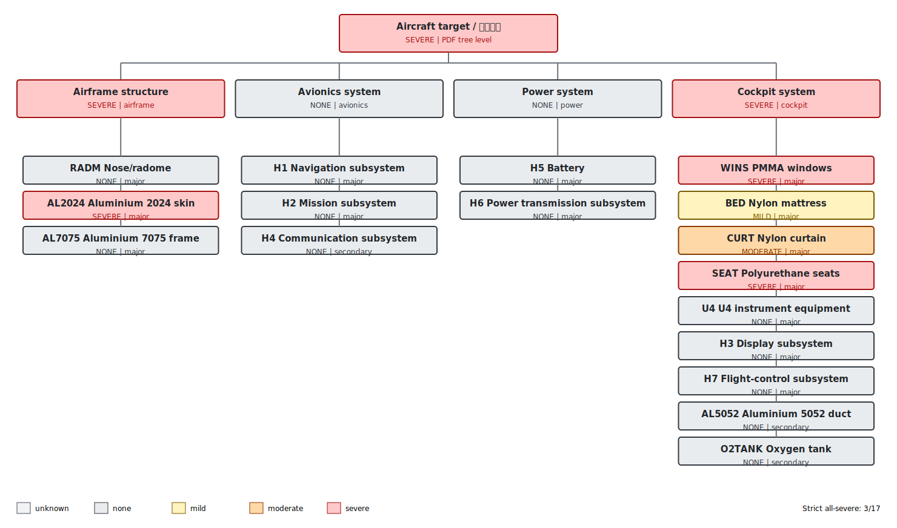

# Complete damage-tree assessment: Q0200_W0100_az270_el15_H1H7_v5_Qnorm_adapt_thickness_audit

- Simulation time: **226.50 s**
- Source directory: `cases_adaptive/Q0200_W0100_az270_el15_H1H7_v5_Qnorm_adapt_thickness_audit`
- Campaign classification: **adaptive sensitivity; compare separately**
- PDF aircraft-tree level: **SEVERE**
- Strict all-equipment severe result: **3/17** (`all_severe=false`)
- Maximum temperature: dynamic envelope of geometrically valid redundant wall-temperature probes.
- Important: the strict 17/17 metric is not the PDF aircraft-level rule.

## Damage tree

## System propagation

| System | Level | Trigger nodes | Applied rule |
|---|---:|---|---|
| Airframe structure (`airframe`) | severe | AL2024 | at least one major item is severe |
| Avionics system (`avionics`) | none | none | all mapped items are known and none is damaged |
| Power system (`power`) | none | none | all mapped items are known and none is damaged |
| Cockpit system (`cockpit`) | severe | WINS, SEAT | at least one major item is severe |

## Complete equipment assessment

| Group | Equipment | Role | Level | Peak C | Mild evidence | Moderate evidence | Severe evidence | Valid probes |
|---|---|---|---:|---:|---|---|---|---:|
| RADM | Nose/radome | airframe:major | none | 987.7 | 150 C; 225.0/300 s | 250 C; 13.5/180 s | 400 C; 4.5/180 s | 10 |
| WINS | PMMA windows | cockpit:major | severe | 1209.7 | 120 C; 225.0/60 s | 200 C; 225.0/45 s | 250 C; 225.0/8 s | 10 |
| BED | Nylon mattress | cockpit:major | mild | 454.2 | 200 C; 76.5/60 s | 250 C; 52.5/90 s | 500 C; 0.0/5 s | 8 |
| CURT | Nylon curtain | cockpit:major | moderate | 1041.1 | 200 C; 225.0/60 s | 250 C; 225.0/90 s | 500 C; 3.0/5 s | 10 |
| U4 | U4 instrument equipment | cockpit:major | none | 101.3 | 120 C; 0.0/300 s | 250 C; 0.0/180 s | 400 C; 0.0/5 s | 6 |
| SEAT | Polyurethane seats | cockpit:major | severe | 1687.2 | 200 C; 225.0/60 s | 300 C; 225.0/90 s | 500 C; 225.0/5 s | 10 |
| AL2024 | Aluminium 2024 skin | airframe:major | severe | 474.5 | 120 C; 225.0/600 s | 250 C; 223.5/300 s | 400 C; 180.0/60 s | 10 |
| AL5052 | Aluminium 5052 duct | cockpit:secondary | none | 235.6 | 120 C; 85.5/600 s | 250 C; 0.0/300 s | 400 C; 0.0/60 s | 10 |
| AL7075 | Aluminium 7075 frame | airframe:major | none | 229.0 | 120 C; 225.0/600 s | 200 C; 75.0/240 s | 400 C; 0.0/60 s | 10 |
| O2TANK | Oxygen tank | cockpit:secondary | none | 131.3 | 120 C; 192.0/600 s | 200 C; 0.0/240 s | 400 C; 0.0/60 s | 8 |
| H1 | Navigation subsystem | avionics:major | none | 252.1 | 120 C; 225.0/300 s | 250 C; 1.5/180 s | 400 C; 0.0/5 s | 6 |
| H2 | Mission subsystem | avionics:major | none | 283.7 | 120 C; 225.0/300 s | 250 C; 75.0/180 s | 400 C; 0.0/5 s | 8 |
| H3 | Display subsystem | cockpit:major | none | 322.0 | 120 C; 79.5/300 s | 250 C; 27.0/180 s | 400 C; 0.0/5 s | 14 |
| H4 | Communication subsystem | avionics:secondary | none | 125.9 | 120 C; 111.0/300 s | 250 C; 0.0/180 s | 400 C; 0.0/5 s | 10 |
| H5 | Battery | power:major | none | 52.2 | 100 C; 0.0/60 s | 150 C; 0.0/600 s | 200 C; 0.0/180 s | 6 |
| H6 | Power transmission subsystem | power:major | none | 217.7 | 120 C; 130.5/1200 s | 200 C; 24.0/600 s | 400 C; 0.0/180 s | 8 |
| H7 | Flight-control subsystem | cockpit:major | none | 421.6 | 120 C; 211.5/300 s | 250 C; 57.0/180 s | 400 C; 3.0/5 s | 3 |

## Assessment interpretation

- Non-severe or unknown groups: **RADM, BED, CURT, U4, AL5052, AL7075, O2TANK, H1, H2, H3, H4, H5, H6, H7**.
- Aircraft level is propagated from the highest system level: **severe**.
- H2 (mission) and H3 (display) are model-specific mappings; their generic electronics thresholds are not same-name PDF rows.
- H1-H4 probes currently measure aluminium enclosure surface temperature as a proxy for internal electronics temperature.

