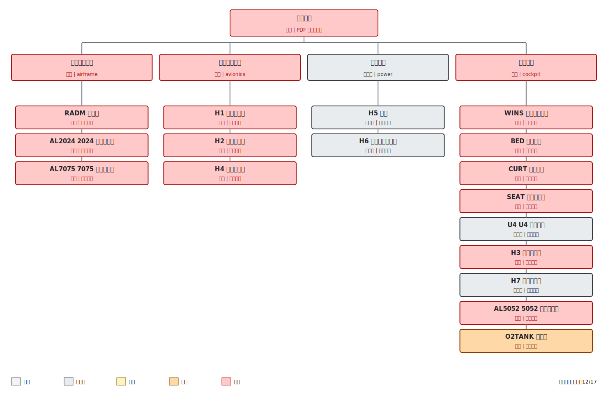

# 完整毁伤树评估：Q0400_W0100_az270_el15_H1H7_v5_Qnorm_adapt_HRRupper_thickness_audit

- 模拟时间：**1254.00 s**
- 来源目录：`cases_adaptive/Q0400_W0100_az270_el15_H1H7_v5_Qnorm_adapt_HRRupper_thickness_audit`
- 方案分类：**自适应敏感性方案（单独比较）**
- 评估状态：**实时快照（案例仍在运行）**
- PDF 毁伤树整机等级：**重度**
- 严格全设备重度毁伤结果：**17/17** （全部重度毁伤=是）
- 最高温度定义：几何位置有效的冗余壁面温度探针动态包络最大值。
- 注意：严格的 17/17 指标不等同于 PDF 毁伤树的整机等级判据。

## 案例配置

| 参数 | 数值 |
|---|---|
| 方案用途 | source_backed_upper_HRRPUA_with_audited_thickness |
| 来源案例 | Q0400_W0100_az270_el15_H1H7_v5_Qnorm |
| 修改因素 | HRRPUA_and_previously_audited_surface_thickness |
| 光冲量 Q（J/cm2） | 400 |
| 核爆当量（kt） | 100 |
| 方位角（度） | 270 |
| 俯仰角（度） | 15 |
| 目标模拟时长（s） | 1500 |
| MPI 进程数 | 32 |
| BURN_AWAY | 否 |
| 辐射份额 | 0.4 |
| 最大 CFL | 未记录 |
| 指定时间步长（s） | 未记录 |
| 核辐射脉冲积分（s） | 0.660398 |
| 入射面峰值辐照度（kW/m2） | 6056.95 |
| 最大局部外部热流（kW/m2） | 5883 |
| 最大局部积分光冲量（J/cm2） | 388.512 |
| 各材料 HRRPUA（kW/m2） | {"BED": 790.0, "CURT": 324.0, "H6": 259.0, "H7": 458.0, "RADM": 840.0, "SEAT": 860.0, "U4": 840.0, "WINS": 806.0} |
| FDS 中全部 HRRPUA（kW/m2） | [259.0, 324.0, 458.0, 790.0, 806.0, 840.0, 860.0] |
| 审查后的材料厚度（m） | {"BED": 0.00089, "CURT": 0.003, "RADM": 0.1, "U4": 0.006, "WINS": 0.025} |
| FDS 中全部材料层厚度（m） | [0.00089, 0.001, 0.0015, 0.002, 0.003, 0.005, 0.006, 0.025, 0.1, 0.15] |
| 几何是否修改 | 否 |
| 材料是否修改 | 否 |
| 燃烧参数是否修改 | 否 |
| 外部热流是否修改 | 否 |
| 点燃温度是否修改 | 否 |
| 毁伤阈值是否修改 | 否 |
| FDS 输入文件 | Q0400_W0100_az270_el15_H1H7_v5_Qnorm_adapt_HRRupper_thickness_audit.fds |

## 已知问题与结果有效性

- 该结果是 1254.0 s 的长时快照，缺少 FDS 正常结束标记；在达到 T_END 前，温度和毁伤等级仍可能变化。
- H1-H4 目前以铝合金外壳壁面温度代理内部电子器件温度。

## 毁伤树

## 系统级传播结果

| 系统 | 等级 | 触发节点 | 采用的传播规则 |
|---|---:|---|---|
| 机体结构系统（`airframe`） | 重度 | RADM, AL2024, AL7075 | 至少一个主要节点达到重度毁伤 |
| 航空电子系统（`avionics`） | 重度 | H1, H2 | 至少一个主要节点达到重度毁伤 |
| 电源系统（`power`） | 重度 | H5, H6 | 至少一个主要节点达到重度毁伤 |
| 座舱系统（`cockpit`） | 重度 | WINS, BED, CURT, SEAT, U4, H3, H7 | 至少一个主要节点达到重度毁伤 |

## 完整设备毁伤评估

| 设备组 | 设备名称 | 毁伤树角色 | 等级 | 峰值温度（C） | 轻度证据 | 中度证据 | 重度证据 | 重度毁伤结论 | 物理解释 | 正外部热流探针数 | 有效温度探针数 |
|---|---|---|---:|---:|---|---|---|---|---|---:|---:|
| RADM | 雷达罩 | 机体结构系统：主要节点 | 重度 | 1532.6 | 150 C; 1252.5/1200 s | 250 C; 1252.5/600 s | 400 C; 1252.5/180 s | 已达到：峰值 1532.6 C；连续高于 400 C 的时间为 1252.5/180 s | 直接外部热流和/或火灾加热同时提供了足够的温度和持续时间。 | 10 | 10 |
| WINS | 有机玻璃舷窗 | 座舱系统：主要节点 | 重度 | 1706.5 | 120 C; 1252.5/60 s | 200 C; 1252.5/45 s | 250 C; 1252.5/8 s | 已达到：峰值 1706.5 C；连续高于 250 C 的时间为 1252.5/8 s | 直接外部热流和/或火灾加热同时提供了足够的温度和持续时间。 | 10 | 10 |
| BED | 尼龙床垫 | 座舱系统：主要节点 | 重度 | 672.6 | 200 C; 1125.0/60 s | 250 C; 1075.5/90 s | 500 C; 16.5/5 s | 已达到：峰值 672.6 C；连续高于 500 C 的时间为 16.5/5 s | 直接外部热流和/或火灾加热同时提供了足够的温度和持续时间。 | 8 | 8 |
| CURT | 尼龙窗帘 | 座舱系统：主要节点 | 重度 | 1530.1 | 200 C; 1252.5/60 s | 250 C; 1252.5/90 s | 500 C; 753.0/5 s | 已达到：峰值 1530.1 C；连续高于 500 C 的时间为 753.0/5 s | 直接外部热流和/或火灾加热同时提供了足够的温度和持续时间。 | 10 | 10 |
| U4 | U4 仪器设备 | 座舱系统：主要节点 | 重度 | 683.9 | 120 C; 1123.5/300 s | 250 C; 981.0/180 s | 400 C; 852.0/5 s | 已达到：峰值 683.9 C；连续高于 400 C 的时间为 852.0/5 s | 舱内二次火灾加热同时提供了足够的温度和持续时间。 | 0 | 6 |
| SEAT | 聚氨酯座椅 | 座舱系统：主要节点 | 重度 | 2726.8 | 200 C; 1252.5/60 s | 300 C; 1252.5/90 s | 500 C; 1252.5/5 s | 已达到：峰值 2726.8 C；连续高于 500 C 的时间为 1252.5/5 s | 直接外部热流和/或火灾加热同时提供了足够的温度和持续时间。 | 4 | 10 |
| AL2024 | 2024 铝合金蒙皮 | 机体结构系统：主要节点 | 重度 | 860.3 | 120 C; 1252.5/1200 s | 250 C; 1252.5/600 s | 400 C; 1252.5/180 s | 已达到：峰值 860.3 C；连续高于 400 C 的时间为 1252.5/180 s | 直接外部热流和/或火灾加热同时提供了足够的温度和持续时间。 | 5 | 10 |
| AL5052 | 5052 铝合金风管 | 座舱系统：次要节点 | 重度 | 695.9 | 120 C; 1206.0/1200 s | 250 C; 1168.5/600 s | 400 C; 1138.5/180 s | 已达到：峰值 695.9 C；连续高于 400 C 的时间为 1138.5/180 s | 舱内二次火灾加热同时提供了足够的温度和持续时间。 | 0 | 10 |
| AL7075 | 7075 铝合金框架 | 机体结构系统：主要节点 | 重度 | 717.1 | 120 C; 1252.5/1200 s | 200 C; 1252.5/600 s | 400 C; 1119.0/180 s | 已达到：峰值 717.1 C；连续高于 400 C 的时间为 1119.0/180 s | 直接外部热流和/或火灾加热同时提供了足够的温度和持续时间。 | 3 | 10 |
| O2TANK | 氧气瓶 | 座舱系统：次要节点 | 重度 | 554.9 | 120 C; 1252.5/1200 s | 200 C; 1248.0/600 s | 400 C; 855.0/180 s | 已达到：峰值 554.9 C；连续高于 400 C 的时间为 855.0/180 s | 直接外部热流和/或火灾加热同时提供了足够的温度和持续时间。 | 6 | 8 |
| H1 | 导航子系统 | 航空电子系统：主要节点 | 重度 | 468.0 | 120 C; 1252.5/300 s | 250 C; 403.5/180 s | 400 C; 19.5/5 s | 已达到：峰值 468.0 C；连续高于 400 C 的时间为 19.5/5 s | 直接外部热流和/或火灾加热同时提供了足够的温度和持续时间。 | 5 | 6 |
| H2 | 任务子系统 | 航空电子系统：主要节点 | 重度 | 489.7 | 120 C; 1252.5/300 s | 250 C; 112.5/180 s | 400 C; 27.0/5 s | 已达到：峰值 489.7 C；连续高于 400 C 的时间为 27.0/5 s | 直接外部热流和/或火灾加热同时提供了足够的温度和持续时间。 | 8 | 8 |
| H3 | 显示子系统 | 座舱系统：主要节点 | 重度 | 708.6 | 120 C; 1162.5/300 s | 250 C; 1120.5/180 s | 400 C; 1059.0/5 s | 已达到：峰值 708.6 C；连续高于 400 C 的时间为 1059.0/5 s | 舱内二次火灾加热同时提供了足够的温度和持续时间。 | 0 | 14 |
| H4 | 通信子系统 | 航空电子系统：次要节点 | 重度 | 633.4 | 120 C; 1246.5/300 s | 250 C; 1144.5/180 s | 400 C; 1050.0/5 s | 已达到：峰值 633.4 C；连续高于 400 C 的时间为 1050.0/5 s | 直接外部热流和/或火灾加热同时提供了足够的温度和持续时间。 | 4 | 10 |
| H5 | 电池 | 电源系统：主要节点 | 重度 | 299.8 | 100 C; 975.0/60 s | 150 C; 858.0/600 s | 200 C; 751.5/180 s | 已达到：峰值 299.8 C；连续高于 200 C 的时间为 751.5/180 s | 直接外部热流和/或火灾加热同时提供了足够的温度和持续时间。 | 3 | 6 |
| H6 | 电力传输子系统 | 电源系统：主要节点 | 重度 | 474.2 | 120 C; 1231.5/1200 s | 200 C; 1044.0/600 s | 400 C; 795.0/180 s | 已达到：峰值 474.2 C；连续高于 400 C 的时间为 795.0/180 s | 舱内二次火灾加热同时提供了足够的温度和持续时间。 | 0 | 8 |
| H7 | 操纵子系统 | 座舱系统：主要节点 | 重度 | 444.0 | 120 C; 1249.5/300 s | 250 C; 1056.0/180 s | 400 C; 556.5/5 s | 已达到：峰值 444.0 C；连续高于 400 C 的时间为 556.5/5 s | 舱内二次火灾加热同时提供了足够的温度和持续时间。 | 0 | 3 |

## 评估结论与解释

- 未达到重度或证据未知的设备组：**无**。
- 重度毁伤未满足的原因统计：**0 项受峰值温度限制**，**0 项受持续时间限制**。
- 整机等级取各系统已知等级中的最高等级：**重度**。
- H2（任务子系统）和 H3（显示子系统）属于当前模型的专用映射，其通用电子设备阈值并非 PDF 中的同名条目。
- H1-H4 探针当前测量铝合金外壳表面温度，并将其作为内部电子器件温度的代理。

## 按毁伤树原则对本案例的详细解释

该案例当前属于实时快照（案例仍在运行），有效模拟时间为 1254.0 s。它可以反映已经形成的温度峰值和累计持续时间，但不能替代正常完成结果；所有临界设备仍需在完整结果中复核。
该案例标称入射面光冲量为 400 J/cm2，模型表面的最大局部积分光冲量为 388.512 J/cm2，约为标称值的 97.1%。因此设备实际受照还受到入射角、表面朝向与几何遮挡影响，不能把标称 Q 直接等同于每个设备表面接收的光冲量。
按照设备级温度与持续时间判据，当前达到重度毁伤的设备组共有 17 个：RADM, WINS, BED, CURT, U4, SEAT, AL2024, AL5052, AL7075, O2TANK, H1, H2, H3, H4, H5, H6, H7。这些设备不仅达到重度温度阈值，而且最长连续超阈时间也满足规定时长，因此其重度结论具有完整的温度和时间证据。
系统级传播结果为：机体结构系统为重度，触发节点为RADM、AL2024、AL7075；航空电子系统为重度，触发节点为H1、H2；电源系统为重度，触发节点为H5、H6；座舱系统为重度，触发节点为WINS、BED、CURT、SEAT、U4、H3、H7。系统等级由主要节点和次要节点按既定规则传播，不是按系统内所有设备温度求平均。
最终 PDF 毁伤树整机等级为重度，而严格全设备结果为 17/17。前者说明至少一个关键系统已达到相应任务毁伤等级；后者说明距离“所有材料和设备均重度毁伤”的研究目标仍有 0 个设备组未满足。两者必须同时保留，不能用整机重度替代 17/17。
因此，本案例是否能够作为全毁伤阈值的成功点，只取决于严格结果是否达到 17/17，并且案例是否正常完成。未达到 17/17 时，应根据上面的峰值受限、持续时间受限和遮挡分类确定下一步物理参数研究方向。
