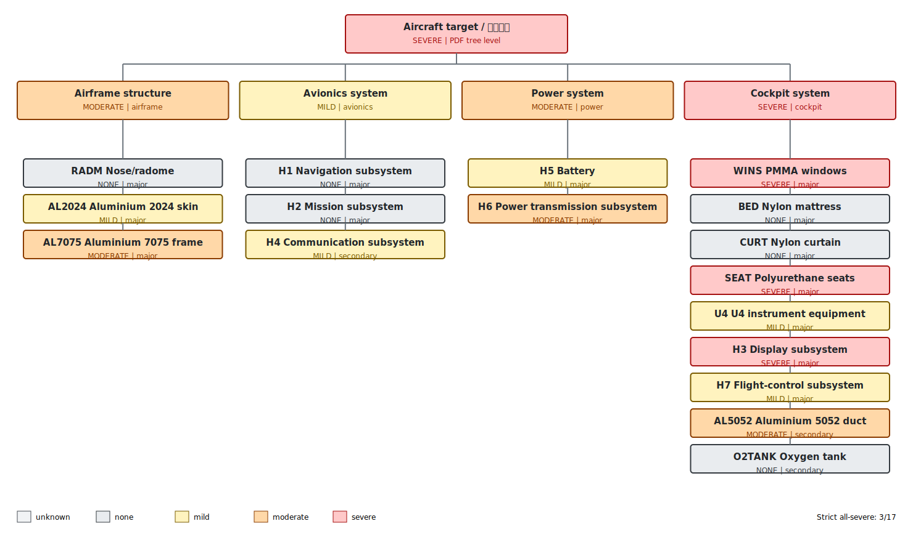

# Complete damage-tree assessment: Q0100_W0100_az270_el15_H1H7_v4_legacy_stable

- Simulation time: **994.50 s**
- Source directory: `cases_legacy_stable/Q0100_W0100_az270_el15_H1H7_v4_legacy_stable`
- Campaign classification: **retired legacy-flux provenance**
- PDF aircraft-tree level: **SEVERE**
- Strict all-equipment severe result: **3/17** (`all_severe=false`)
- Maximum temperature: dynamic envelope of geometrically valid redundant wall-temperature probes.
- Important: the strict 17/17 metric is not the PDF aircraft-level rule.

## Damage tree

## System propagation

| System | Level | Trigger nodes | Applied rule |
|---|---:|---|---|
| Airframe structure (`airframe`) | moderate | AL7075 | a major item is moderate or a secondary item is severe |
| Avionics system (`avionics`) | mild | H4 | at least one known item is mild and no higher rule is met |
| Power system (`power`) | moderate | H6 | a major item is moderate or a secondary item is severe |
| Cockpit system (`cockpit`) | severe | WINS, SEAT, H3 | at least one major item is severe |

## Complete equipment assessment

| Group | Equipment | Role | Level | Peak C | Mild evidence | Moderate evidence | Severe evidence | Valid probes |
|---|---|---|---:|---:|---|---|---|---:|
| RADM | Nose/radome | airframe:major | none | 193.9 | 150 C; 0.0/300 s | 250 C; 0.0/180 s | 400 C; 0.0/180 s | 10 |
| WINS | PMMA windows | cockpit:major | severe | 803.1 | 120 C; 993.0/60 s | 200 C; 937.5/45 s | 250 C; 931.5/8 s | 10 |
| BED | Nylon mattress | cockpit:major | none | 99.6 | 200 C; 0.0/60 s | 250 C; 0.0/90 s | 500 C; 0.0/5 s | 8 |
| CURT | Nylon curtain | cockpit:major | none | 217.4 | 200 C; 60.0/60 s | 250 C; 0.0/90 s | 500 C; 0.0/5 s | 10 |
| U4 | U4 instrument equipment | cockpit:major | mild | 183.5 | 120 C; 489.0/300 s | 250 C; 0.0/180 s | 400 C; 0.0/5 s | 6 |
| SEAT | Polyurethane seats | cockpit:major | severe | 2325.8 | 200 C; 993.0/60 s | 300 C; 993.0/90 s | 500 C; 993.0/5 s | 10 |
| AL2024 | Aluminium 2024 skin | airframe:major | mild | 228.2 | 120 C; 972.0/600 s | 250 C; 0.0/300 s | 400 C; 0.0/60 s | 10 |
| AL5052 | Aluminium 5052 duct | cockpit:secondary | moderate | 287.8 | 120 C; 754.5/600 s | 250 C; 573.0/300 s | 400 C; 0.0/60 s | 10 |
| AL7075 | Aluminium 7075 frame | airframe:major | moderate | 244.2 | 120 C; 772.5/600 s | 200 C; 345.0/240 s | 400 C; 0.0/60 s | 10 |
| O2TANK | Oxygen tank | cockpit:secondary | none | 198.6 | 120 C; 462.0/600 s | 200 C; 0.0/240 s | 400 C; 0.0/60 s | 10 |
| H1 | Navigation subsystem | avionics:major | none | 63.8 | 120 C; 0.0/300 s | 250 C; 0.0/180 s | 400 C; 0.0/5 s | 7 |
| H2 | Mission subsystem | avionics:major | none | 55.2 | 120 C; 0.0/300 s | 250 C; 0.0/180 s | 400 C; 0.0/5 s | 10 |
| H3 | Display subsystem | cockpit:major | severe | 506.8 | 120 C; 765.0/300 s | 250 C; 696.0/180 s | 400 C; 606.0/5 s | 14 |
| H4 | Communication subsystem | avionics:secondary | mild | 142.8 | 120 C; 306.0/300 s | 250 C; 0.0/180 s | 400 C; 0.0/5 s | 10 |
| H5 | Battery | power:major | mild | 153.3 | 100 C; 513.0/60 s | 150 C; 46.5/600 s | 200 C; 0.0/180 s | 6 |
| H6 | Power transmission subsystem | power:major | moderate | 298.4 | 120 C; 889.5/1200 s | 200 C; 634.5/600 s | 400 C; 0.0/180 s | 8 |
| H7 | Flight-control subsystem | cockpit:major | mild | 194.4 | 120 C; 957.0/300 s | 250 C; 0.0/180 s | 400 C; 0.0/5 s | 4 |

## Assessment interpretation

- Non-severe or unknown groups: **RADM, BED, CURT, U4, AL2024, AL5052, AL7075, O2TANK, H1, H2, H4, H5, H6, H7**.
- Aircraft level is propagated from the highest system level: **severe**.
- H2 (mission) and H3 (display) are model-specific mappings; their generic electronics thresholds are not same-name PDF rows.
- H1-H4 probes currently measure aluminium enclosure surface temperature as a proxy for internal electronics temperature.

