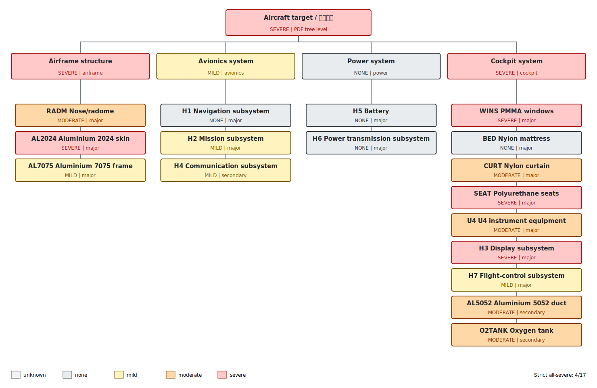

# 完整毁伤树评估：Q0300_W0100_az270_el15_H1H7_v5_Qnorm

- 模拟时间：**1500.00 s**
- 来源目录：`cases_qnorm/Q0300_W0100_az270_el15_H1H7_v5_Qnorm`
- 方案分类：**修正入射面归一化基线**
- 评估状态：**正常完成**
- PDF 毁伤树整机等级：**重度**
- 严格全设备重度毁伤结果：**4/17** （全部重度毁伤=否）
- 最高温度定义：几何位置有效的冗余壁面温度探针动态包络最大值。
- 注意：严格的 17/17 指标不等同于 PDF 毁伤树的整机等级判据。

## 案例配置

| 参数 | 数值 |
|---|---|
| 方案用途 | 修正入射面光冲量归一化 |
| 来源案例 | 未记录 |
| 修改因素 | 未记录 |
| 光冲量 Q（J/cm2） | 300 |
| 核爆当量（kt） | 100 |
| 方位角（度） | 270 |
| 俯仰角（度） | 15 |
| 目标模拟时长（s） | 1500 |
| MPI 进程数 | 32 |
| BURN_AWAY | 否 |
| 辐射份额 | 0.4 |
| 最大 CFL | 未记录 |
| 指定时间步长（s） | 未记录 |
| 核辐射脉冲积分（s） | 0.660398 |
| 入射面峰值辐照度（kW/m2） | 4542.71 |
| 最大局部外部热流（kW/m2） | 4412 |
| 最大局部积分光冲量（J/cm2） | 291.368 |
| 各材料 HRRPUA（kW/m2） | 未记录 |
| FDS 中全部 HRRPUA（kW/m2） | [75.0, 100.0, 180.0, 200.0, 250.0] |
| 审查后的材料厚度（m） | 未记录 |
| FDS 中全部材料层厚度（m） | [0.001, 0.0015, 0.002, 0.003, 0.005, 0.03, 0.075, 0.12, 0.15] |
| 几何是否修改 | 否 |
| 材料是否修改 | 否 |
| 燃烧参数是否修改 | 否 |
| 外部热流是否修改 | 否 |
| 点燃温度是否修改 | 否 |
| 毁伤阈值是否修改 | 否 |
| FDS 输入文件 | Q0300_W0100_az270_el15_H1H7_v5_Qnorm.fds |

## 已知问题与结果有效性

- H1-H4 目前以铝合金外壳壁面温度代理内部电子器件温度。

## 毁伤树

## 系统级传播结果

| 系统 | 等级 | 触发节点 | 采用的传播规则 |
|---|---:|---|---|
| 机体结构系统（`airframe`） | 重度 | AL2024 | 至少一个主要节点达到重度毁伤 |
| 航空电子系统（`avionics`） | 轻度 | H2, H4 | 至少一个已知节点达到轻度，且未触发更高等级 |
| 电源系统（`power`） | 未毁伤 | 无 | 所有已知节点均未达到毁伤标准 |
| 座舱系统（`cockpit`） | 重度 | WINS, SEAT, H3 | 至少一个主要节点达到重度毁伤 |

## 完整设备毁伤评估

| 设备组 | 设备名称 | 毁伤树角色 | 等级 | 峰值温度（C） | 轻度证据 | 中度证据 | 重度证据 | 重度毁伤结论 | 物理解释 | 正外部热流探针数 | 有效温度探针数 |
|---|---|---|---:|---:|---|---|---|---|---|---:|---:|
| RADM | 雷达罩 | 机体结构系统：主要节点 | 中度 | 1300.8 | 150 C; 1498.5/1200 s | 250 C; 894.0/600 s | 400 C; 7.5/180 s | 未达到：连续高于 400 C 的时间仅为 7.5/180 s | 瞬态光辐射或火灾使温度短暂超过重度阈值，但燃烧或热反馈未维持到规定时间。 | 10 | 10 |
| WINS | 有机玻璃舷窗 | 座舱系统：主要节点 | 重度 | 1504.1 | 120 C; 1498.5/60 s | 200 C; 1498.5/45 s | 250 C; 1498.5/8 s | 已达到：峰值 1504.1 C；连续高于 250 C 的时间为 1498.5/8 s | 直接外部热流和/或火灾加热同时提供了足够的温度和持续时间。 | 10 | 10 |
| BED | 尼龙床垫 | 座舱系统：主要节点 | 未毁伤 | 547.6 | 200 C; 45.0/60 s | 250 C; 19.5/90 s | 500 C; 0.0/5 s | 未达到：连续高于 500 C 的时间仅为 0.0/5 s | 瞬态光辐射或火灾使温度短暂超过重度阈值，但燃烧或热反馈未维持到规定时间。 | 8 | 8 |
| CURT | 尼龙窗帘 | 座舱系统：主要节点 | 中度 | 1330.1 | 200 C; 1237.5/60 s | 250 C; 1011.0/90 s | 500 C; 4.5/5 s | 未达到：连续高于 500 C 的时间仅为 4.5/5 s | 瞬态光辐射或火灾使温度短暂超过重度阈值，但燃烧或热反馈未维持到规定时间。 | 10 | 10 |
| U4 | U4 仪器设备 | 座舱系统：主要节点 | 中度 | 267.4 | 120 C; 1140.0/300 s | 250 C; 330.0/180 s | 400 C; 0.0/5 s | 未达到：峰值 267.4 C < 400 C | 监测表面未分配到正外部热流；几何遮挡后仅靠舱内二次火灾加热，温度低于重度毁伤阈值。 | 0 | 6 |
| SEAT | 聚氨酯座椅 | 座舱系统：主要节点 | 重度 | 2726.8 | 200 C; 1498.5/60 s | 300 C; 1498.5/90 s | 500 C; 1498.5/5 s | 已达到：峰值 2726.8 C；连续高于 500 C 的时间为 1498.5/5 s | 直接外部热流和/或火灾加热同时提供了足够的温度和持续时间。 | 4 | 10 |
| AL2024 | 2024 铝合金蒙皮 | 机体结构系统：主要节点 | 重度 | 550.9 | 120 C; 1498.5/1200 s | 250 C; 1498.5/600 s | 400 C; 1497.0/180 s | 已达到：峰值 550.9 C；连续高于 400 C 的时间为 1497.0/180 s | 直接外部热流和/或火灾加热同时提供了足够的温度和持续时间。 | 5 | 10 |
| AL5052 | 5052 铝合金风管 | 座舱系统：次要节点 | 中度 | 371.1 | 120 C; 1324.5/1200 s | 250 C; 1185.0/600 s | 400 C; 0.0/180 s | 未达到：峰值 371.1 C < 400 C | 监测表面未分配到正外部热流；几何遮挡后仅靠舱内二次火灾加热，温度低于重度毁伤阈值。 | 0 | 10 |
| AL7075 | 7075 铝合金框架 | 机体结构系统：主要节点 | 轻度 | 330.0 | 120 C; 1498.5/1200 s | 200 C; 160.5/600 s | 400 C; 0.0/180 s | 未达到：峰值 330.0 C < 400 C | 监测表面接收到正外部热流，但受脉冲能量、材料热惯性和散热影响，峰值仍低于重度毁伤阈值。 | 3 | 10 |
| O2TANK | 氧气瓶 | 座舱系统：次要节点 | 轻度 | 235.9 | 120 C; 1497.0/1200 s | 200 C; 489.0/600 s | 400 C; 0.0/180 s | 未达到：峰值 235.9 C < 400 C | 监测表面接收到正外部热流，但受脉冲能量、材料热惯性和散热影响，峰值仍低于重度毁伤阈值。 | 6 | 8 |
| H1 | 导航子系统 | 航空电子系统：主要节点 | 未毁伤 | 363.5 | 120 C; 295.5/300 s | 250 C; 79.5/180 s | 400 C; 0.0/5 s | 未达到：峰值 363.5 C < 400 C | 监测表面接收到正外部热流，但受脉冲能量、材料热惯性和散热影响，峰值仍低于重度毁伤阈值。 | 5 | 6 |
| H2 | 任务子系统 | 航空电子系统：主要节点 | 轻度 | 368.1 | 120 C; 408.0/300 s | 250 C; 121.5/180 s | 400 C; 0.0/5 s | 未达到：峰值 368.1 C < 400 C | 监测表面接收到正外部热流，但受脉冲能量、材料热惯性和散热影响，峰值仍低于重度毁伤阈值。 | 8 | 8 |
| H3 | 显示子系统 | 座舱系统：主要节点 | 重度 | 589.6 | 120 C; 1327.5/300 s | 250 C; 1267.5/180 s | 400 C; 1195.5/5 s | 已达到：峰值 589.6 C；连续高于 400 C 的时间为 1195.5/5 s | 舱内二次火灾加热同时提供了足够的温度和持续时间。 | 0 | 14 |
| H4 | 通信子系统 | 航空电子系统：次要节点 | 轻度 | 197.8 | 120 C; 1471.5/300 s | 250 C; 0.0/180 s | 400 C; 0.0/5 s | 未达到：峰值 197.8 C < 400 C | 监测表面接收到正外部热流，但受脉冲能量、材料热惯性和散热影响，峰值仍低于重度毁伤阈值。 | 4 | 10 |
| H5 | 电池 | 电源系统：主要节点 | 未毁伤 | 90.4 | 100 C; 0.0/60 s | 150 C; 0.0/600 s | 200 C; 0.0/180 s | 未达到：峰值 90.4 C < 200 C | 监测表面接收到正外部热流，但受脉冲能量、材料热惯性和散热影响，峰值仍低于重度毁伤阈值。 | 3 | 6 |
| H6 | 电力传输子系统 | 电源系统：主要节点 | 未毁伤 | 258.8 | 120 C; 936.0/1200 s | 200 C; 46.5/600 s | 400 C; 0.0/180 s | 未达到：峰值 258.8 C < 400 C | 监测表面未分配到正外部热流；几何遮挡后仅靠舱内二次火灾加热，温度低于重度毁伤阈值。 | 0 | 8 |
| H7 | 操纵子系统 | 座舱系统：主要节点 | 轻度 | 335.8 | 120 C; 1486.5/300 s | 250 C; 43.5/180 s | 400 C; 0.0/5 s | 未达到：峰值 335.8 C < 400 C | 监测表面未分配到正外部热流；几何遮挡后仅靠舱内二次火灾加热，温度低于重度毁伤阈值。 | 0 | 3 |

## 评估结论与解释

- 未达到重度或证据未知的设备组：**RADM, BED, CURT, U4, AL5052, AL7075, O2TANK, H1, H2, H4, H5, H6, H7**。
- 重度毁伤未满足的原因统计：**10 项受峰值温度限制**，**3 项受持续时间限制**。
- 整机等级取各系统已知等级中的最高等级：**重度**。
- H2（任务子系统）和 H3（显示子系统）属于当前模型的专用映射，其通用电子设备阈值并非 PDF 中的同名条目。
- H1-H4 探针当前测量铝合金外壳表面温度，并将其作为内部电子器件温度的代理。

## 按毁伤树原则对本案例的详细解释

该案例已正常运行到目标时长，且日志中存在 FDS 正常完成标记，因此可作为正式结果参与同参数族的阈值比较。
该案例标称入射面光冲量为 300 J/cm2，模型表面的最大局部积分光冲量为 291.368 J/cm2，约为标称值的 97.1%。因此设备实际受照还受到入射角、表面朝向与几何遮挡影响，不能把标称 Q 直接等同于每个设备表面接收的光冲量。
按照设备级温度与持续时间判据，当前达到重度毁伤的设备组共有 4 个：WINS, SEAT, AL2024, H3。这些设备不仅达到重度温度阈值，而且最长连续超阈时间也满足规定时长，因此其重度结论具有完整的温度和时间证据。
峰值温度受限设备包括：U4（峰值 267.4 C，阈值 400 C）、AL5052（峰值 371.1 C，阈值 400 C）、AL7075（峰值 330.0 C，阈值 400 C）、O2TANK（峰值 235.9 C，阈值 400 C）、H1（峰值 363.5 C，阈值 400 C）、H2（峰值 368.1 C，阈值 400 C）、H4（峰值 197.8 C，阈值 400 C）、H5（峰值 90.4 C，阈值 200 C）、H6（峰值 258.8 C，阈值 400 C）、H7（峰值 335.8 C，阈值 400 C）。这些对象尚未进入重度判据温度区间，继续延长模拟时间并不会自动补足峰值条件；需要结合直接受照、遮挡和二次火灾强度判断其原因。
持续时间受限设备包括：RADM（7.5/180 s，高于 400 C）、BED（0.0/5 s，高于 500 C）、CURT（4.5/5 s，高于 500 C）。这些对象已经出现足够高的瞬态峰值，但热解、燃烧或邻近火灾反馈没有把温度维持到标准要求，因此不能仅凭最高温度判为重度毁伤。
U4, AL5052, H6, H7 的有效监测面没有记录到正外部热流，它们主要依靠舱内二次火灾加热。若这些设备未达到重度，优先应检查 DDA 可见性、设备实际朝向、邻近可燃物燃烧持续性及探针是否覆盖热点，而不是直接降低材料强度或毁伤标准。
系统级传播结果为：机体结构系统为重度，触发节点为AL2024；航空电子系统为轻度，触发节点为H2、H4；电源系统为未毁伤，触发节点为无明确触发节点；座舱系统为重度，触发节点为WINS、SEAT、H3。系统等级由主要节点和次要节点按既定规则传播，不是按系统内所有设备温度求平均。
最终 PDF 毁伤树整机等级为重度，而严格全设备结果为 4/17。前者说明至少一个关键系统已达到相应任务毁伤等级；后者说明距离“所有材料和设备均重度毁伤”的研究目标仍有 13 个设备组未满足。两者必须同时保留，不能用整机重度替代 17/17。
因此，本案例是否能够作为全毁伤阈值的成功点，只取决于严格结果是否达到 17/17，并且案例是否正常完成。未达到 17/17 时，应根据上面的峰值受限、持续时间受限和遮挡分类确定下一步物理参数研究方向。
