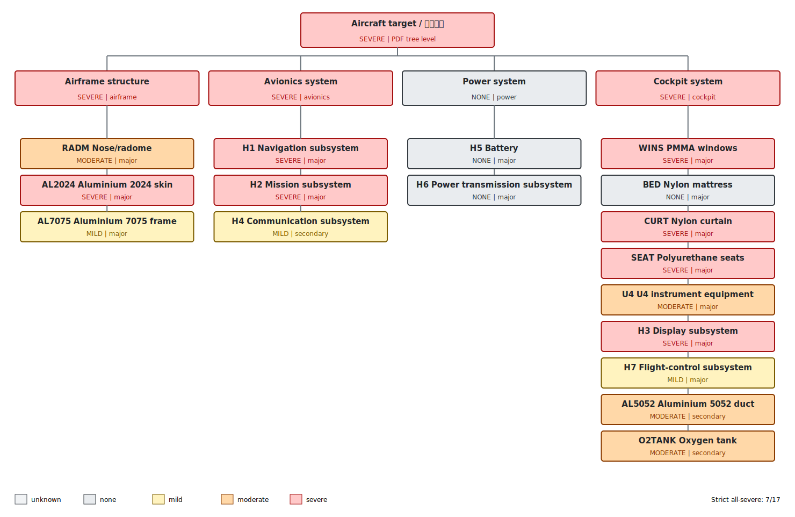

# Complete damage-tree assessment: Q0400_W0100_az270_el15_H1H7_v5_Qnorm_threshold

- Simulation time: **1452.00 s**
- Source directory: `cases_threshold/Q0400_W0100_az270_el15_H1H7_v5_Qnorm_threshold`
- Campaign classification: **threshold-search case**
- Evaluation status: **long_duration_snapshot_without_normal_stop**
- PDF aircraft-tree level: **SEVERE**
- Strict all-equipment severe result: **7/17** (`all_severe=false`)
- Maximum temperature: dynamic envelope of geometrically valid redundant wall-temperature probes.
- Important: the strict 17/17 metric is not the PDF aircraft-level rule.

## Case configuration

| Parameter | Value |
|---|---|
| `purpose` | automatic_fluence_threshold_search |
| `source_case` | Q0400_W0100_az270_el15_H1H7_v5_Qnorm |
| `changed_factor` | none recorded |
| `Q_J_cm2` | 400 |
| `yield_kt` | 100 |
| `azimuth_deg` | 270 |
| `elevation_deg` | 15 |
| `target_t_end_s` | 1500 |
| `mpi_processes` | 32 |
| `burn_away` | false |
| `radiative_fraction` | 0.4 |
| `cfl_max` | not recorded |
| `time_step_dt_s` | not recorded |
| `nuclear_ramp_integral_s` | 0.660398 |
| `plane_peak_irradiance_kw_m2` | 6056.95 |
| `max_local_external_flux_kw_m2` | 5883 |
| `max_local_fluence_J_cm2` | 388.512 |
| `hrrpua_group_values_kw_m2` | not recorded |
| `all_hrrpua_values_in_fds_kw_m2` | [75.0, 100.0, 180.0, 200.0, 250.0] |
| `audited_group_thickness_m` | not recorded |
| `all_layer_thicknesses_in_fds_m` | [0.001, 0.0015, 0.002, 0.003, 0.005, 0.03, 0.075, 0.12, 0.15] |
| `geometry_changed` | false |
| `materials_changed` | false |
| `combustion_changed` | false |
| `external_flux_changed` | false |
| `ignition_temperature_changed` | false |
| `damage_thresholds_changed` | false |
| `fds_input` | Q0400_W0100_az270_el15_H1H7_v5_Qnorm_threshold.fds |

## Known issues and validity

- Long-duration snapshot at 1452.0 s without a normal FDS completion marker; temperatures and levels can still change before T_END.
- H1-H4 use aluminium-enclosure wall temperature as a proxy for internal electronics temperature.

## Damage tree

## System propagation

| System | Level | Trigger nodes | Applied rule |
|---|---:|---|---|
| Airframe structure (`airframe`) | severe | AL2024 | at least one major item is severe |
| Avionics system (`avionics`) | severe | H1, H2 | at least one major item is severe |
| Power system (`power`) | none | none | all mapped items are known and none is damaged |
| Cockpit system (`cockpit`) | severe | WINS, CURT, SEAT, H3 | at least one major item is severe |

## Complete equipment assessment

| Group | Equipment | Role | Level | Peak C | Mild evidence | Moderate evidence | Severe evidence | Severe conclusion | Physical interpretation | Positive-flux probes | Valid probes |
|---|---|---|---:|---:|---|---|---|---|---|---:|---:|
| RADM | Nose/radome | airframe:major | moderate | 1530.2 | 150 C; 1450.5/300 s | 250 C; 904.5/180 s | 400 C; 9.0/180 s | Not reached: duration above 400 C is 9.0/180 s | A transient flash/fire peak crosses the severe temperature, but combustion or heat feedback is not sustained for the required duration. | 10 | 10 |
| WINS | PMMA windows | cockpit:major | severe | 1712.9 | 120 C; 1450.5/60 s | 200 C; 1450.5/45 s | 250 C; 1450.5/8 s | Reached: peak 1712.9 C; >= 250 C for 1450.5/8 s | The direct-flux and/or fire heating supplied both sufficient temperature and duration. | 10 | 10 |
| BED | Nylon mattress | cockpit:major | none | 691.4 | 200 C; 43.5/60 s | 250 C; 33.0/90 s | 500 C; 0.0/5 s | Not reached: duration above 500 C is 0.0/5 s | A transient flash/fire peak crosses the severe temperature, but combustion or heat feedback is not sustained for the required duration. | 8 | 8 |
| CURT | Nylon curtain | cockpit:major | severe | 1544.1 | 200 C; 1213.5/60 s | 250 C; 1027.5/90 s | 500 C; 6.0/5 s | Reached: peak 1544.1 C; >= 500 C for 6.0/5 s | The direct-flux and/or fire heating supplied both sufficient temperature and duration. | 10 | 10 |
| U4 | U4 instrument equipment | cockpit:major | moderate | 272.3 | 120 C; 1113.0/300 s | 250 C; 417.0/180 s | 400 C; 0.0/5 s | Not reached: peak 272.3 C < 400 C | No monitored face has positive assigned external flux; geometric shielding leaves secondary cabin-fire heating below severe threshold. | 0 | 6 |
| SEAT | Polyurethane seats | cockpit:major | severe | 2726.8 | 200 C; 1450.5/60 s | 300 C; 1450.5/90 s | 500 C; 1450.5/5 s | Reached: peak 2726.8 C; >= 500 C for 1450.5/5 s | The direct-flux and/or fire heating supplied both sufficient temperature and duration. | 4 | 10 |
| AL2024 | Aluminium 2024 skin | airframe:major | severe | 694.6 | 120 C; 1450.5/600 s | 250 C; 1450.5/300 s | 400 C; 1450.5/60 s | Reached: peak 694.6 C; >= 400 C for 1450.5/60 s | The direct-flux and/or fire heating supplied both sufficient temperature and duration. | 5 | 10 |
| AL5052 | Aluminium 5052 duct | cockpit:secondary | moderate | 390.2 | 120 C; 1290.0/600 s | 250 C; 1186.5/300 s | 400 C; 0.0/60 s | Not reached: peak 390.2 C < 400 C | No monitored face has positive assigned external flux; geometric shielding leaves secondary cabin-fire heating below severe threshold. | 0 | 10 |
| AL7075 | Aluminium 7075 frame | airframe:major | mild | 428.8 | 120 C; 1450.5/600 s | 200 C; 198.0/240 s | 400 C; 13.5/60 s | Not reached: duration above 400 C is 13.5/60 s | A transient flash/fire peak crosses the severe temperature, but combustion or heat feedback is not sustained for the required duration. | 3 | 10 |
| O2TANK | Oxygen tank | cockpit:secondary | moderate | 244.3 | 120 C; 1450.5/600 s | 200 C; 601.5/240 s | 400 C; 0.0/60 s | Not reached: peak 244.3 C < 400 C | Positive external flux reaches monitored faces, but pulse energy, thermal inertia and heat losses keep the peak below severe threshold. | 6 | 8 |
| H1 | Navigation subsystem | avionics:major | severe | 471.5 | 120 C; 361.5/300 s | 250 C; 106.5/180 s | 400 C; 24.0/5 s | Reached: peak 471.5 C; >= 400 C for 24.0/5 s | The direct-flux and/or fire heating supplied both sufficient temperature and duration. | 5 | 6 |
| H2 | Mission subsystem | avionics:major | severe | 477.2 | 120 C; 442.5/300 s | 250 C; 147.0/180 s | 400 C; 46.5/5 s | Reached: peak 477.2 C; >= 400 C for 46.5/5 s | The direct-flux and/or fire heating supplied both sufficient temperature and duration. | 8 | 8 |
| H3 | Display subsystem | cockpit:major | severe | 591.3 | 120 C; 1290.0/300 s | 250 C; 1228.5/180 s | 400 C; 1158.0/5 s | Reached: peak 591.3 C; >= 400 C for 1158.0/5 s | The secondary cabin-fire heating supplied both sufficient temperature and duration. | 0 | 14 |
| H4 | Communication subsystem | avionics:secondary | mild | 202.2 | 120 C; 1441.5/300 s | 250 C; 0.0/180 s | 400 C; 0.0/5 s | Not reached: peak 202.2 C < 400 C | Positive external flux reaches monitored faces, but pulse energy, thermal inertia and heat losses keep the peak below severe threshold. | 4 | 10 |
| H5 | Battery | power:major | none | 86.4 | 100 C; 0.0/60 s | 150 C; 0.0/600 s | 200 C; 0.0/180 s | Not reached: peak 86.4 C < 200 C | Positive external flux reaches monitored faces, but pulse energy, thermal inertia and heat losses keep the peak below severe threshold. | 3 | 6 |
| H6 | Power transmission subsystem | power:major | none | 263.2 | 120 C; 823.5/1200 s | 200 C; 52.5/600 s | 400 C; 0.0/180 s | Not reached: peak 263.2 C < 400 C | No monitored face has positive assigned external flux; geometric shielding leaves secondary cabin-fire heating below severe threshold. | 0 | 8 |
| H7 | Flight-control subsystem | cockpit:major | mild | 383.6 | 120 C; 1441.5/300 s | 250 C; 54.0/180 s | 400 C; 0.0/5 s | Not reached: peak 383.6 C < 400 C | No monitored face has positive assigned external flux; geometric shielding leaves secondary cabin-fire heating below severe threshold. | 0 | 3 |

## Assessment interpretation

- Non-severe or unknown groups: **RADM, BED, U4, AL5052, AL7075, O2TANK, H4, H5, H6, H7**.
- Severe-damage shortfalls: **7 peak-temperature limited**, **3 duration limited**.
- Aircraft level is propagated from the highest system level: **severe**.
- H2 (mission) and H3 (display) are model-specific mappings; their generic electronics thresholds are not same-name PDF rows.
- H1-H4 probes currently measure aluminium enclosure surface temperature as a proxy for internal electronics temperature.

