# 长时及正常完成案例毁伤树评估汇总

本报告在每次评估后自动重建，包含 FDS 正常完成案例，以及明确标注的模拟时间不小于 1000 s 的长时快照。

## 毁伤树评估原则

### 根据 PDF 重新绘制的毁伤树及其逻辑

本项目毁伤树的标准来源为用户提供的毁伤标准 PDF。为避免页面截图模糊、跨页和排版干扰，本文不嵌入 PDF 原图，而是依据第 6.2 节、第 6.3 节、表10、表11及表13至表15重新绘制。重绘图保留原标准中的飞机目标、四个系统、功能子系统和毁伤等级传播关系。

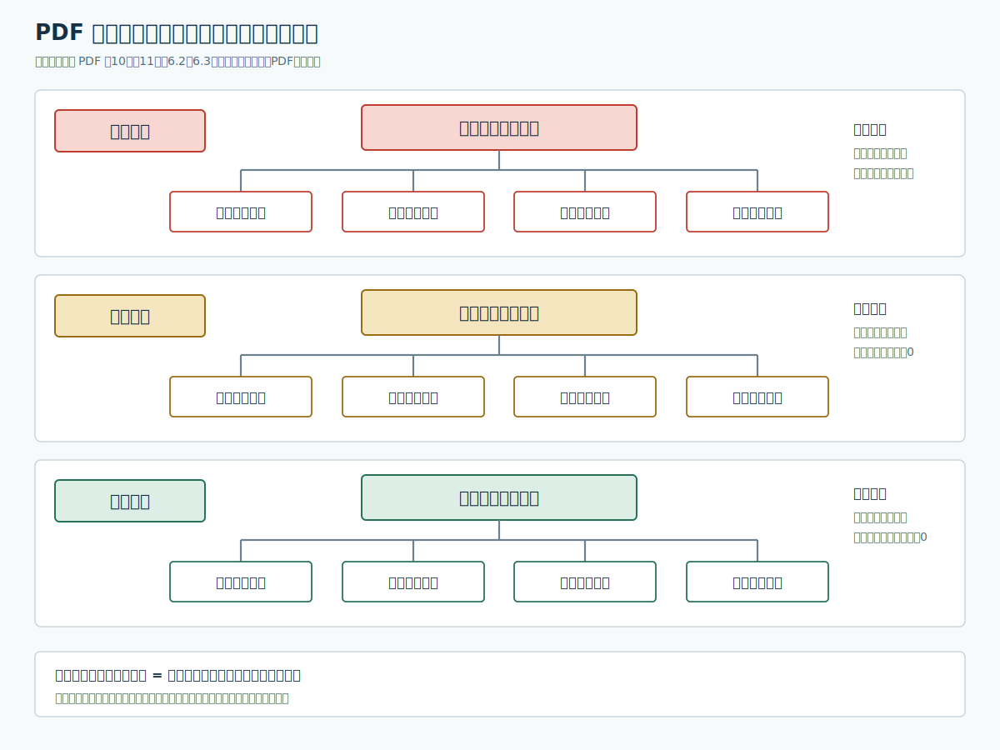

重度毁伤树的底事件关系较为明确，下面进一步展开飞机目标、四个系统及其主要功能节点。

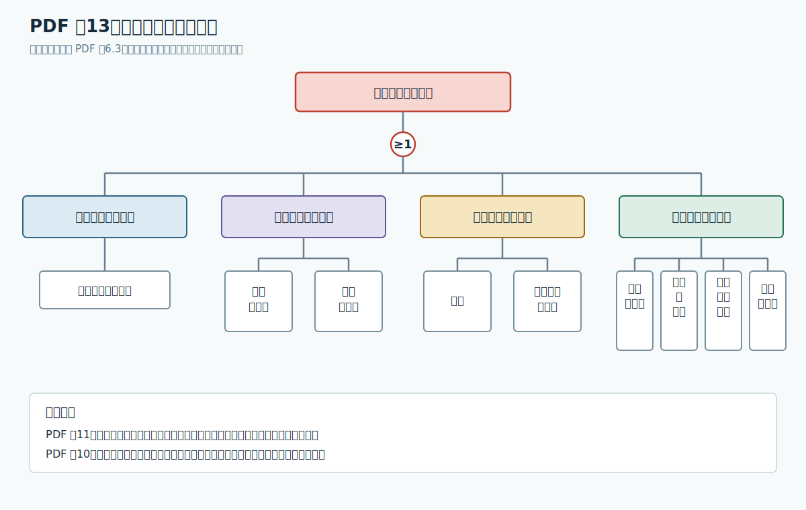

PDF 还分别给出了机体结构、航电、电力和座舱系统的下级条件。下图将四个系统的底事件、主要/次要属性和三级触发条件统一重绘。

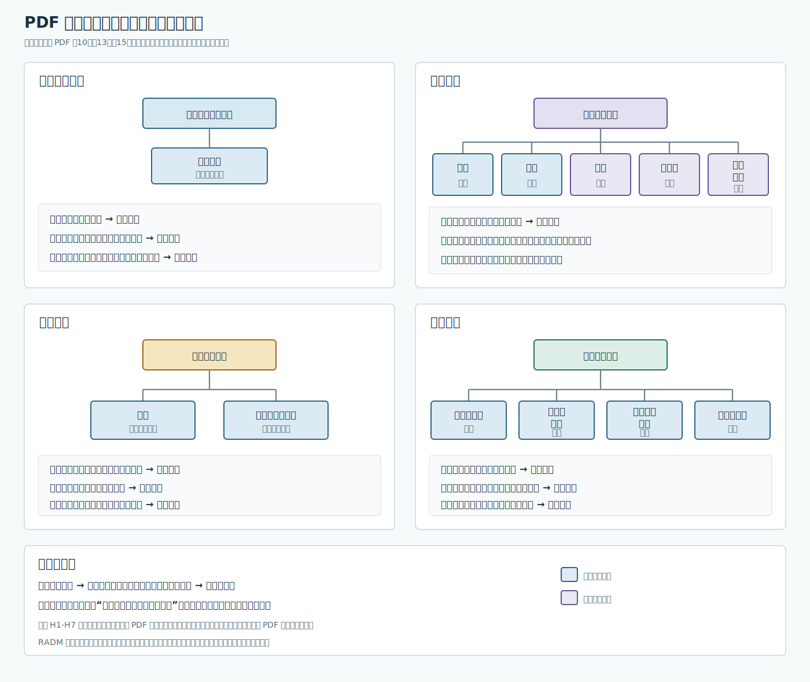

机体结构系统以机头结构为主要要害节点。机头结构达到重度时系统直接为重度；达到中度且不存在重度时系统为中度；仅达到轻度且不存在更高等级时系统为轻度。当前模型进一步使用 RADM、AL2024 和 AL7075 提供机头、蒙皮和框架的热响应证据。这里的 RADM 明确表示雷达罩物理结构，属于机体或机头结构，不是航电系统中的雷达电子子系统。

航电系统的逻辑最需要区分主要和次要节点。PDF 重度毁伤树中，雷达电子子系统和导航子系统是能够直接触发航电系统重度毁伤的主要节点。通信、光电子和电子对抗作为次要节点时，其重度毁伤可在没有主要节点重度的条件下触发系统中度，而不能直接触发系统重度。当前模型将 H1、H2 作为主要航电节点，将 H4 作为次要航电节点；其中 H2 是项目扩展映射。当前模型尚未设置独立的雷达电子子系统监测组，绝不能用 RADM 雷达罩的温度替代雷达电子设备毁伤。

电力系统的电池和电力传输子系统均属于主要要害节点。任一节点重度即可使电力系统重度；任一节点中度且不存在重度时，电力系统为中度；只有轻度且不存在更高等级时，电力系统为轻度。当前模型分别使用 H5 和 H6 对应这两个功能节点。

座舱系统由环控、窗户及玻璃、座舱内部设施和操纵子系统构成。PDF 图中这些节点均位于直接触发系统等级的主要功能分支。当前模型以 WINS 表征窗户及玻璃，以 BED、CURT、SEAT、U4、H3、AL5052 和 O2TANK 细化座舱内部设施，以 H7 对应操纵子系统。环控子系统目前缺少独立同名设备节点，相关结论不能由其他座舱材料自动替代。

#### 逻辑层级

毁伤树采用自上而下的事件层级。飞机目标毁伤是顶事件；机体结构、航电、电力和座舱系统毁伤是次顶事件或系统级中间事件；雷达、导航、电池、电力传输、环控、窗户及玻璃、座舱内部设施和操纵子系统等是功能单元或底事件。FDS 并不直接输出“整机毁伤”，而是先提供各材料和设备的温度证据，再由底事件逐层向上推导。

#### 飞机目标级逻辑

根据 PDF 表11，飞机目标等级由四个系统的最高毁伤等级决定。重度逻辑为：四个系统中至少一个达到重度，即可触发飞机目标重度毁伤。中度逻辑为：至少一个系统达到中度，同时重度系统数量为零。轻度逻辑为：至少一个系统达到轻度，同时中度和重度系统数量均为零。因此该逻辑不是对四个系统求平均，也不要求四个系统全部达到同一等级。

可将飞机目标级传播写成优先级关系：`重度 > 中度 > 轻度 > 未毁伤`。程序先检查是否存在重度系统；不存在时再检查中度；仍不存在时再检查轻度。缺少证据的系统保持未知，不能自动当作未毁伤。

#### 系统级主要节点与次要节点逻辑

根据 PDF 表10，系统重度毁伤的核心条件是至少一个主要要害部位达到重度。系统中度毁伤存在两条路径：第一，至少一个主要要害部位达到中度，且没有主要要害部位达到重度；第二，至少一个次要要害部位达到重度，且没有主要要害部位达到重度。系统轻度毁伤要求至少一个下级节点达到轻度，同时不存在中度或重度触发条件。

主要节点和次要节点的区分反映功能重要性。主要节点的重度毁伤可以直接导致系统核心功能完全失效；次要节点通常需要达到更高的物理毁伤程度，才会向上传播为系统中度。当前项目配置中的主要/次要属性必须来自功能结构和 PDF/DMECA 映射，不能为了提高整机等级而随意调整。

#### PDF 建树方法

PDF 第 6.2 节的建树方法可归纳为四步：第一，以功能为依据，将飞机目标划分为若干系统；第二，把系统毁伤作为次顶事件，把功能单元毁伤作为中间事件，并继续分解到子系统或要害部位底事件；第三，依据不同毁伤等级的 DMECA 影响确定主要和次要要害部位，再用逻辑门连接；第四，在建树前全面核对飞机结构组成、设备位置和功能依赖关系。

从物理意义上看，底事件回答“某个材料或设备是否因受热达到规定毁伤状态”，系统事件回答“这些底事件是否足以使系统核心功能降级或失效”，顶事件回答“系统失效是否使地面停放飞机的整体功能达到相应毁伤等级”。这三个问题必须分层回答，不能用某个局部最高温度直接替代整机毁伤结论。

当前新版模型在 PDF 原始树基础上增加了材料实体和 H1-H7 设备节点。二者的关系如下，属于项目映射而不是对 PDF 原图的逐字替换：

| PDF 原始系统或节点 | 当前监测模型中的映射 | 说明 |
|---|---|---|
| 机体结构、机头结构 | RADM、AL2024、AL7075 | RADM 是雷达罩结构；用雷达罩、蒙皮和框架表面热响应表征机体结构受热毁伤 |
| 航电子系统 | H1、H2、H4 | H1 导航和 H4 通信具有功能对应；H2 属于项目扩展；当前没有独立雷达电子子系统节点，RADM 不能代替它 |
| 电池、电力传输子系统 | H5、H6 | 与 PDF 电力系统底事件直接对应 |
| 窗户及玻璃 | WINS | 与 PDF 座舱系统底事件直接对应 |
| 座舱内部设施 | BED、CURT、SEAT、U4、H3、AL5052、O2TANK | 按新版几何中的床垫、窗帘、座椅、仪器和内部设备细化 |
| 操纵子系统 | H7 | 与 PDF 座舱系统操纵子系统对应 |

### 1. 评估对象与证据链

本项目采用“FDS 热响应输出、设备级温度与持续时间判据、系统级毁伤树传播、整机级结果”四级证据链。FDS 首先计算外部光辐射、材料受热、热解、点燃、火焰传播和舱内二次加热；随后从各材料或设备表面的壁面温度探针中提取温度历程。每个设备布置多个冗余探针，评估时在每个时刻选取所有几何有效探针的最高温度，形成动态包络。该处理用于捕捉设备不同受照面或燃烧过程中热点位置的变化，避免只用单个固定探针漏掉局部最高温度。

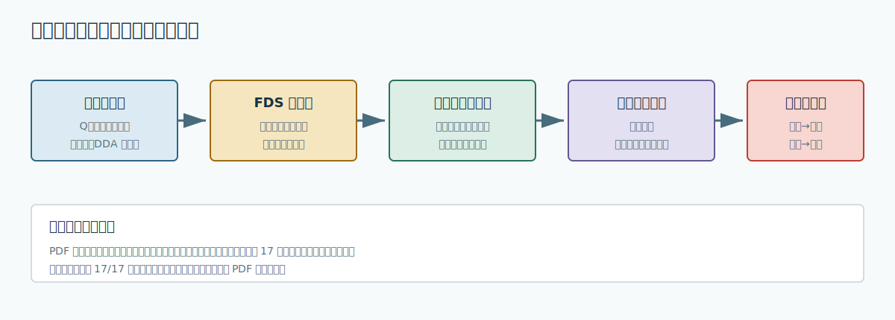

探针只有在几何位置有效且能够输出有限温度值时才参与评估。若某个表面烧蚀、被遮挡或个别探针失效，动态包络可以自动由其余有效探针继续提供证据。需要强调的是，动态包络表示被监测表面范围内的最高温度，并不等于整个实体内部每一点的真实最高温度；尤其 H1-H4 当前使用铝合金外壳壁面温度代理内部电子元件温度，因此其结论仍包含等效建模假设。

### 2. 设备级温度与持续时间判据

每个设备均设置轻度、中度和重度三档温度与持续时间组合判据。只有温度达到规定阈值，并且连续保持时间不短于规定时长，才认为该档毁伤成立。程序计算的是最长连续超阈时间，而不是把多个彼此分离的短时高温片段简单累加。这样可以避免瞬态光辐射峰值或短时火焰扫过被误判为持续性热毁伤。

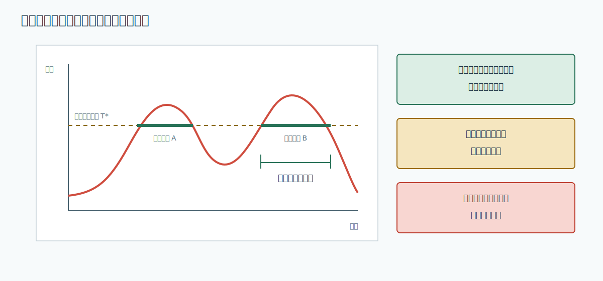

设备最终等级取其满足的最高等级。例如，一个设备可以满足轻度和中度判据，但若重度温度只短暂超过而持续时间不足，则最终仍为中度。若峰值温度从未达到重度阈值，报告将其归为“峰值温度受限”；若峰值达到阈值但保持时间不足，则归为“持续时间受限”。证据缺失时保留“未知”，不能按未毁伤处理。

### 3. 外部热流与火灾加热的解释原则

正外部热流探针数量用于判断设备是否存在直接受照表面。存在正外部热流并不保证设备达到毁伤，因为入射角、遮挡、材料吸收率、厚度、导热、热容、热解和散热共同决定最终温升。没有正外部热流探针的设备主要依赖舱内火灾、烟气辐射和邻近可燃物燃烧产生的二次加热，其温升通常更慢，并高度依赖火灾是否能够持续。

对于峰值很高但超阈时间很短的设备，物理上通常意味着核辐射脉冲或局部火焰产生了瞬态加热，但材料热解、燃烧反馈或邻近火源不足以维持温度。对于峰值始终偏低的设备，则需要区分直接受照强度不足、几何遮挡、材料热惯性过大、表层厚度设置、燃烧参数以及探针位置等原因，不能仅通过降低毁伤阈值来获得目标结果。

### 4. 设备到系统的毁伤树传播

设备节点按照主要节点和次要节点归入机体结构、航空电子、电源和座舱四个系统。系统级传播遵循以下原则：至少一个主要节点达到重度时，系统判为重度；主要节点达到中度，或次要节点达到重度且没有主要节点达到重度时，系统判为中度；至少一个已知节点达到轻度且没有更高等级时，系统判为轻度；全部已知节点均未达到毁伤条件时，系统判为未毁伤。

整机等级取四个系统已知等级中的最高等级。因此，只要一个关键系统传播为重度，PDF 毁伤树意义下的整机目标就可以判为重度。这一原则体现关键系统失效可能导致整机任务能力丧失，并不要求所有设备同时达到重度。

### 5. PDF 整机等级与严格全毁伤目标

本研究同时报告两种不能混用的结果。第一种是依据 PDF 毁伤树传播得到的整机等级；第二种是严格全设备重度毁伤指标，即 17 个设备组全部达到重度。一个案例可能因座舱或机体结构中的关键主要节点重度毁伤而得到“整机重度”，但严格结果仍只有 4/17 或 7/17。光冲量阈值搜索的目标是后者，因此必须以 17/17 作为成功条件，同时保留 PDF 整机等级用于工程任务能力解释。

### 6. 正常完成与长时快照

包含 `STOP: FDS completed successfully`、达到目标时长且不存在数值不稳定的案例属于正常完成结果。模拟时间达到 1000 s 但缺少正常结束标记的案例可以作为长时快照用于阶段分析，因为核辐射脉冲和主要火灾发展通常已经历较长时间；但其结果仍是临时证据，后续温度和持续时间可能变化。低于 1000 s 的快照不进入正式汇总，发生数值不稳定的结果必须单独标记，不能直接用于阈值结论。

### 7. 阈值搜索与可比性

比较不同光冲量案例时，必须保持核爆当量、入射角、几何、材料、厚度、燃烧参数、BURN_AWAY、探针和毁伤标准一致，只改变入射面归一化光冲量 Q。只有同一参数族中的案例才能建立失败与成功区间并进行二分搜索。修改厚度、HRRPUA、角度或材料参数的敏感性案例必须单独分类，不能与基线案例混合得出单一阈值。

## 案例结果汇总

| 案例 | 状态 | 方案分类 | Q（J/cm2） | 模拟时间（s） | PDF 整机等级 | 严格重度毁伤数 |
|---|---|---|---:|---:|---:|---:|
| Q0050_W0100_az270_el15_H1H7_v3_stable | 实时快照（案例仍在运行） | 已停用的数值诊断方案 | 50 | 1.5 | 未毁伤 | 0/17 |
| Q0050_W0100_az270_el15_H1H7_v4_legacy_stable | 实时快照（案例仍在运行） | 已停用的旧热流追溯方案 | 50 | 1125.0 | 重度 | 2/17 |
| Q0050_W0100_az270_el15_H1H7_v5_Qnorm | 正常完成 | 修正入射面归一化基线 | 50 | 1500.0 | 重度 | 4/17 |
| Q0050_W0100_az270_el15_H1H7_v5_Qnorm_adapt_HRRnominal_thickness_audit_v1 | 实时快照（案例仍在运行） | 自适应敏感性方案（单独比较） | 50 | 753.0 | 重度 | 4/17 |
| Q0100_W0100_az270_el15_H1H7_v3_stable | 实时快照（案例仍在运行） | 已停用的数值诊断方案 | 100 | 1.5 | 未毁伤 | 0/17 |
| Q0100_W0100_az270_el15_H1H7_v4_legacy_stable | 实时快照（案例仍在运行） | 已停用的旧热流追溯方案 | 100 | 1057.5 | 重度 | 3/17 |
| Q0100_W0100_az270_el15_H1H7_v5_Qnorm | 实时快照（案例仍在运行） | 修正入射面归一化探索基线 | 100 | 738.0 | 重度 | 4/17 |
| Q0100_W0100_az270_el15_H1H7_v5_Qnorm_adapt_HRRnominal_thickness_audit_v1 | 实时快照（案例仍在运行） | 自适应敏感性方案（单独比较） | 100 | 1222.5 | 重度 | 5/17 |
| Q0100_W0100_az270_el15_H1H7_v5_Qnorm_adapt_thickness_audit | 实时快照（案例仍在运行） | 自适应敏感性方案（单独比较） | 100 | 69.0 | 重度 | 2/17 |
| Q0200_W0100_az060_el75_H1H7_v5_Qnorm_adapt_HRRupper_thickness_audit_angle | 正常完成 | 自适应敏感性方案（单独比较） | 200 | 1500.0 | 重度 | 14/17 |
| Q0200_W0100_az270_el15_H1H7_v5_Qnorm | 实时快照（案例仍在运行） | 修正入射面归一化基线 | 200 | 1405.5 | 重度 | 4/17 |
| Q0200_W0100_az270_el15_H1H7_v5_Qnorm_adapt_HRRnominal_thickness_audit_v1 | 实时快照（案例仍在运行） | 自适应敏感性方案（单独比较） | 200 | 964.5 | 重度 | 5/17 |
| Q0200_W0100_az270_el15_H1H7_v5_Qnorm_adapt_HRRupper_thickness_audit | 正常完成 | 自适应敏感性方案（单独比较） | 200 | 1500.0 | 重度 | 14/17 |
| Q0200_W0100_az270_el15_H1H7_v5_Qnorm_adapt_thickness_audit | 实时快照（案例仍在运行） | 自适应敏感性方案（单独比较） | 200 | 279.0 | 重度 | 4/17 |
| Q0300_W0100_az270_el15_H1H7_v5_Qnorm | 正常完成 | 修正入射面归一化基线 | 300 | 1500.0 | 重度 | 4/17 |
| Q0400_W0100_az060_el75_H1H7_v5_Qnorm_adapt_HRRtable_seatSTLfill_thin4mm_v1 | 正常完成 | 自适应敏感性方案（单独比较） | 400 | 1500.0 | 重度 | 10/17 |
| Q0400_W0100_az270_el15_H1H7_v5_Qnorm_adapt_HRRmid_thickness_audit_BAtrue_v1 | 实时快照（案例仍在运行） | 自适应敏感性方案（单独比较） | 400 | 48.0 | 重度 | 6/17 |
| Q0400_W0100_az270_el15_H1H7_v5_Qnorm_adapt_HRRtable_seatSTLfill_BAtrue_v1 | 正常完成 | 自适应敏感性方案（单独比较） | 400 | 1500.0 | 重度 | 4/17 |
| Q0400_W0100_az270_el15_H1H7_v5_Qnorm_adapt_HRRtable_seatSTLfill_v1 | 正常完成 | 自适应敏感性方案（单独比较） | 400 | 1500.0 | 重度 | 5/17 |
| Q0400_W0100_az270_el15_H1H7_v5_Qnorm_adapt_HRRtable_thickness_audit_BAtrue_v2_volumetric | 正常完成 | 自适应敏感性方案（单独比较） | 400 | 1500.0 | 重度 | 13/17 |
| Q0400_W0100_az270_el15_H1H7_v5_Qnorm_adapt_HRRtable_thickness_audit_v1 | 正常完成 | 自适应敏感性方案（单独比较） | 400 | 1500.0 | 重度 | 13/17 |
| Q0400_W0100_az270_el15_H1H7_v5_Qnorm_adapt_HRRupper_thickness_audit | 正常完成 | 自适应敏感性方案（单独比较） | 400 | 1500.0 | 重度 | 17/17 |
| Q0400_W0100_az270_el15_H1H7_v5_Qnorm_adapt_combined_SEAT650_BED600_RF040_BAfalse_thin4mm_v1 | 实时快照（案例仍在运行） | 自适应敏感性方案（单独比较） | 400 | 477.0 | 重度 | 4/17 |
| Q0400_W0100_az270_el15_H1H7_v5_Qnorm_threshold | 实时快照（案例仍在运行） | 阈值搜索方案 | 400 | 1452.0 | 重度 | 7/17 |

---

## 完整毁伤树评估：Q0050_W0100_az270_el15_H1H7_v3_stable

- 模拟时间：**1.50 s**
- 来源目录：`cases_stable/Q0050_W0100_az270_el15_H1H7_v3_stable`
- 方案分类：**已停用的数值诊断方案**
- 评估状态：**实时快照（案例仍在运行）**
- PDF 毁伤树整机等级：**未毁伤**
- 严格全设备重度毁伤结果：**0/17** （全部重度毁伤=否）
- 最高温度定义：几何位置有效的冗余壁面温度探针动态包络最大值。
- 注意：严格的 17/17 指标不等同于 PDF 毁伤树的整机等级判据。

## 案例配置

| 参数 | 数值 |
|---|---|
| 方案用途 | 未说明 |
| 来源案例 | 未记录 |
| 修改因素 | 未记录 |
| 光冲量 Q（J/cm2） | 50 |
| 核爆当量（kt） | 100 |
| 方位角（度） | 270 |
| 俯仰角（度） | 15 |
| 目标模拟时长（s） | 1500 |
| MPI 进程数 | 32 |
| BURN_AWAY | 否 |
| 辐射份额 | 0.35 |
| 最大 CFL | 0.5 |
| 指定时间步长（s） | 0.002 |
| 核辐射脉冲积分（s） | 未记录 |
| 入射面峰值辐照度（kW/m2） | 未记录 |
| 最大局部外部热流（kW/m2） | 未记录 |
| 最大局部积分光冲量（J/cm2） | 未记录 |
| 各材料 HRRPUA（kW/m2） | 未记录 |
| FDS 中全部 HRRPUA（kW/m2） | [75.0, 100.0, 180.0, 200.0, 250.0] |
| 审查后的材料厚度（m） | 未记录 |
| FDS 中全部材料层厚度（m） | [0.001, 0.0015, 0.002, 0.003, 0.005, 0.03, 0.075, 0.12, 0.15] |
| 几何是否修改 | 否 |
| 材料是否修改 | 否 |
| 燃烧参数是否修改 | 否 |
| 外部热流是否修改 | 否 |
| 点燃温度是否修改 | 否 |
| 毁伤阈值是否修改 | 否 |
| FDS 输入文件 | Q0050_W0100_az270_el15_H1H7_v3_stable.fds |

## 已知问题与结果有效性

- 该结果是 1.5 s 的长时快照，缺少 FDS 正常结束标记；在达到 T_END 前，温度和毁伤等级仍可能变化。
- 这是已停用或仅用于追溯的配置，不纳入当前阈值区间。
- H1-H4 目前以铝合金外壳壁面温度代理内部电子器件温度。

## 毁伤树

## 系统级传播结果

| 系统 | 等级 | 触发节点 | 采用的传播规则 |
|---|---:|---|---|
| 机体结构系统（`airframe`） | 未毁伤 | 无 | 所有已知节点均未达到毁伤标准 |
| 航空电子系统（`avionics`） | 未毁伤 | 无 | 所有已知节点均未达到毁伤标准 |
| 电源系统（`power`） | 未毁伤 | 无 | 所有已知节点均未达到毁伤标准 |
| 座舱系统（`cockpit`） | 未毁伤 | 无 | 所有已知节点均未达到毁伤标准 |

## 完整设备毁伤评估

| 设备组 | 设备名称 | 毁伤树角色 | 等级 | 峰值温度（C） | 轻度证据 | 中度证据 | 重度证据 | 重度毁伤结论 | 物理解释 | 正外部热流探针数 | 有效温度探针数 |
|---|---|---|---:|---:|---|---|---|---|---|---:|---:|
| RADM | 雷达罩 | 机体结构系统：主要节点 | 未毁伤 | 111.2 | 150 C; 0.0/1200 s | 250 C; 0.0/600 s | 400 C; 0.0/180 s | 未达到：峰值 111.2 C < 400 C | 监测表面接收到正外部热流，但受脉冲能量、材料热惯性和散热影响，峰值仍低于重度毁伤阈值。 | 10 | 10 |
| WINS | 有机玻璃舷窗 | 座舱系统：主要节点 | 未毁伤 | 155.9 | 120 C; 0.0/60 s | 200 C; 0.0/45 s | 250 C; 0.0/8 s | 未达到：峰值 155.9 C < 250 C | 监测表面接收到正外部热流，但受脉冲能量、材料热惯性和散热影响，峰值仍低于重度毁伤阈值。 | 10 | 10 |
| BED | 尼龙床垫 | 座舱系统：主要节点 | 未毁伤 | 49.4 | 200 C; 0.0/60 s | 250 C; 0.0/90 s | 500 C; 0.0/5 s | 未达到：峰值 49.4 C < 500 C | 监测表面接收到正外部热流，但受脉冲能量、材料热惯性和散热影响，峰值仍低于重度毁伤阈值。 | 8 | 8 |
| CURT | 尼龙窗帘 | 座舱系统：主要节点 | 未毁伤 | 123.5 | 200 C; 0.0/60 s | 250 C; 0.0/90 s | 500 C; 0.0/5 s | 未达到：峰值 123.5 C < 500 C | 监测表面接收到正外部热流，但受脉冲能量、材料热惯性和散热影响，峰值仍低于重度毁伤阈值。 | 10 | 10 |
| U4 | U4 仪器设备 | 座舱系统：主要节点 | 未毁伤 | 20.0 | 120 C; 0.0/300 s | 250 C; 0.0/180 s | 400 C; 0.0/5 s | 未达到：峰值 20.0 C < 400 C | 监测表面未分配到正外部热流；几何遮挡后仅靠舱内二次火灾加热，温度低于重度毁伤阈值。 | 0 | 6 |
| SEAT | 聚氨酯座椅 | 座舱系统：主要节点 | 未毁伤 | 624.6 | 200 C; 0.0/60 s | 300 C; 0.0/90 s | 500 C; 0.0/5 s | 未达到：连续高于 500 C 的时间仅为 0.0/5 s | 瞬态光辐射或火灾使温度短暂超过重度阈值，但燃烧或热反馈未维持到规定时间。 | 4 | 10 |
| AL2024 | 2024 铝合金蒙皮 | 机体结构系统：主要节点 | 未毁伤 | 35.7 | 120 C; 0.0/1200 s | 250 C; 0.0/600 s | 400 C; 0.0/180 s | 未达到：峰值 35.7 C < 400 C | 监测表面接收到正外部热流，但受脉冲能量、材料热惯性和散热影响，峰值仍低于重度毁伤阈值。 | 5 | 10 |
| AL5052 | 5052 铝合金风管 | 座舱系统：次要节点 | 未毁伤 | 20.0 | 120 C; 0.0/1200 s | 250 C; 0.0/600 s | 400 C; 0.0/180 s | 未达到：峰值 20.0 C < 400 C | 监测表面未分配到正外部热流；几何遮挡后仅靠舱内二次火灾加热，温度低于重度毁伤阈值。 | 0 | 10 |
| AL7075 | 7075 铝合金框架 | 机体结构系统：主要节点 | 未毁伤 | 30.4 | 120 C; 0.0/1200 s | 200 C; 0.0/600 s | 400 C; 0.0/180 s | 未达到：峰值 30.4 C < 400 C | 监测表面接收到正外部热流，但受脉冲能量、材料热惯性和散热影响，峰值仍低于重度毁伤阈值。 | 3 | 10 |
| O2TANK | 氧气瓶 | 座舱系统：次要节点 | 未毁伤 | 25.2 | 120 C; 0.0/1200 s | 200 C; 0.0/600 s | 400 C; 0.0/180 s | 未达到：峰值 25.2 C < 400 C | 监测表面接收到正外部热流，但受脉冲能量、材料热惯性和散热影响，峰值仍低于重度毁伤阈值。 | 6 | 10 |
| H1 | 导航子系统 | 航空电子系统：主要节点 | 未毁伤 | 30.4 | 120 C; 0.0/300 s | 250 C; 0.0/180 s | 400 C; 0.0/5 s | 未达到：峰值 30.4 C < 400 C | 监测表面接收到正外部热流，但受脉冲能量、材料热惯性和散热影响，峰值仍低于重度毁伤阈值。 | 5 | 7 |
| H2 | 任务子系统 | 航空电子系统：主要节点 | 未毁伤 | 30.4 | 120 C; 0.0/300 s | 250 C; 0.0/180 s | 400 C; 0.0/5 s | 未达到：峰值 30.4 C < 400 C | 监测表面接收到正外部热流，但受脉冲能量、材料热惯性和散热影响，峰值仍低于重度毁伤阈值。 | 8 | 10 |
| H3 | 显示子系统 | 座舱系统：主要节点 | 未毁伤 | 20.1 | 120 C; 0.0/300 s | 250 C; 0.0/180 s | 400 C; 0.0/5 s | 未达到：峰值 20.1 C < 400 C | 监测表面未分配到正外部热流；几何遮挡后仅靠舱内二次火灾加热，温度低于重度毁伤阈值。 | 0 | 14 |
| H4 | 通信子系统 | 航空电子系统：次要节点 | 未毁伤 | 21.7 | 120 C; 0.0/300 s | 250 C; 0.0/180 s | 400 C; 0.0/5 s | 未达到：峰值 21.7 C < 400 C | 监测表面接收到正外部热流，但受脉冲能量、材料热惯性和散热影响，峰值仍低于重度毁伤阈值。 | 4 | 10 |
| H5 | 电池 | 电源系统：主要节点 | 未毁伤 | 23.7 | 100 C; 0.0/60 s | 150 C; 0.0/600 s | 200 C; 0.0/180 s | 未达到：峰值 23.7 C < 200 C | 监测表面接收到正外部热流，但受脉冲能量、材料热惯性和散热影响，峰值仍低于重度毁伤阈值。 | 3 | 6 |
| H6 | 电力传输子系统 | 电源系统：主要节点 | 未毁伤 | 20.0 | 120 C; 0.0/1200 s | 200 C; 0.0/600 s | 400 C; 0.0/180 s | 未达到：峰值 20.0 C < 400 C | 监测表面未分配到正外部热流；几何遮挡后仅靠舱内二次火灾加热，温度低于重度毁伤阈值。 | 0 | 8 |
| H7 | 操纵子系统 | 座舱系统：主要节点 | 未毁伤 | 22.6 | 120 C; 0.0/300 s | 250 C; 0.0/180 s | 400 C; 0.0/5 s | 未达到：峰值 22.6 C < 400 C | 监测表面未分配到正外部热流；几何遮挡后仅靠舱内二次火灾加热，温度低于重度毁伤阈值。 | 0 | 4 |

## 评估结论与解释

- 未达到重度或证据未知的设备组：**RADM, WINS, BED, CURT, U4, SEAT, AL2024, AL5052, AL7075, O2TANK, H1, H2, H3, H4, H5, H6, H7**。
- 重度毁伤未满足的原因统计：**16 项受峰值温度限制**，**1 项受持续时间限制**。
- 整机等级取各系统已知等级中的最高等级：**未毁伤**。
- H2（任务子系统）和 H3（显示子系统）属于当前模型的专用映射，其通用电子设备阈值并非 PDF 中的同名条目。
- H1-H4 探针当前测量铝合金外壳表面温度，并将其作为内部电子器件温度的代理。

## 按毁伤树原则对本案例的详细解释

该案例当前属于实时快照（案例仍在运行），有效模拟时间为 1.5 s。它可以反映已经形成的温度峰值和累计持续时间，但不能替代正常完成结果；所有临界设备仍需在完整结果中复核。
当前没有设备同时满足重度温度阈值与持续时间要求，因此严格重度毁伤数为 0。
峰值温度受限设备包括：RADM（峰值 111.2 C，阈值 400 C）、WINS（峰值 155.9 C，阈值 250 C）、BED（峰值 49.4 C，阈值 500 C）、CURT（峰值 123.5 C，阈值 500 C）、U4（峰值 20.0 C，阈值 400 C）、AL2024（峰值 35.7 C，阈值 400 C）、AL5052（峰值 20.0 C，阈值 400 C）、AL7075（峰值 30.4 C，阈值 400 C）、O2TANK（峰值 25.2 C，阈值 400 C）、H1（峰值 30.4 C，阈值 400 C）、H2（峰值 30.4 C，阈值 400 C）、H3（峰值 20.1 C，阈值 400 C）、H4（峰值 21.7 C，阈值 400 C）、H5（峰值 23.7 C，阈值 200 C）、H6（峰值 20.0 C，阈值 400 C）、H7（峰值 22.6 C，阈值 400 C）。这些对象尚未进入重度判据温度区间，继续延长模拟时间并不会自动补足峰值条件；需要结合直接受照、遮挡和二次火灾强度判断其原因。
持续时间受限设备包括：SEAT（0.0/5 s，高于 500 C）。这些对象已经出现足够高的瞬态峰值，但热解、燃烧或邻近火灾反馈没有把温度维持到标准要求，因此不能仅凭最高温度判为重度毁伤。
U4, AL5052, H3, H6, H7 的有效监测面没有记录到正外部热流，它们主要依靠舱内二次火灾加热。若这些设备未达到重度，优先应检查 DDA 可见性、设备实际朝向、邻近可燃物燃烧持续性及探针是否覆盖热点，而不是直接降低材料强度或毁伤标准。
系统级传播结果为：机体结构系统为未毁伤，触发节点为无明确触发节点；航空电子系统为未毁伤，触发节点为无明确触发节点；电源系统为未毁伤，触发节点为无明确触发节点；座舱系统为未毁伤，触发节点为无明确触发节点。系统等级由主要节点和次要节点按既定规则传播，不是按系统内所有设备温度求平均。
最终 PDF 毁伤树整机等级为未毁伤，而严格全设备结果为 0/17。前者说明至少一个关键系统已达到相应任务毁伤等级；后者说明距离“所有材料和设备均重度毁伤”的研究目标仍有 17 个设备组未满足。两者必须同时保留，不能用整机重度替代 17/17。
因此，本案例是否能够作为全毁伤阈值的成功点，只取决于严格结果是否达到 17/17，并且案例是否正常完成。未达到 17/17 时，应根据上面的峰值受限、持续时间受限和遮挡分类确定下一步物理参数研究方向。

---

## 完整毁伤树评估：Q0050_W0100_az270_el15_H1H7_v4_legacy_stable

- 模拟时间：**1125.00 s**
- 来源目录：`cases_legacy_stable/Q0050_W0100_az270_el15_H1H7_v4_legacy_stable`
- 方案分类：**已停用的旧热流追溯方案**
- 评估状态：**实时快照（案例仍在运行）**
- PDF 毁伤树整机等级：**重度**
- 严格全设备重度毁伤结果：**2/17** （全部重度毁伤=否）
- 最高温度定义：几何位置有效的冗余壁面温度探针动态包络最大值。
- 注意：严格的 17/17 指标不等同于 PDF 毁伤树的整机等级判据。

## 案例配置

| 参数 | 数值 |
|---|---|
| 方案用途 | 未说明 |
| 来源案例 | 未记录 |
| 修改因素 | 未记录 |
| 光冲量 Q（J/cm2） | 50 |
| 核爆当量（kt） | 100 |
| 方位角（度） | 270 |
| 俯仰角（度） | 15 |
| 目标模拟时长（s） | 1500 |
| MPI 进程数 | 32 |
| BURN_AWAY | 否 |
| 辐射份额 | 0.4 |
| 最大 CFL | 未记录 |
| 指定时间步长（s） | 未记录 |
| 核辐射脉冲积分（s） | 未记录 |
| 入射面峰值辐照度（kW/m2） | 未记录 |
| 最大局部外部热流（kW/m2） | 未记录 |
| 最大局部积分光冲量（J/cm2） | 未记录 |
| 各材料 HRRPUA（kW/m2） | 未记录 |
| FDS 中全部 HRRPUA（kW/m2） | [75.0, 100.0, 180.0, 200.0, 250.0] |
| 审查后的材料厚度（m） | 未记录 |
| FDS 中全部材料层厚度（m） | [0.001, 0.0015, 0.002, 0.003, 0.005, 0.03, 0.075, 0.12, 0.15] |
| 几何是否修改 | 否 |
| 材料是否修改 | 否 |
| 燃烧参数是否修改 | 否 |
| 外部热流是否修改 | 否 |
| 点燃温度是否修改 | 否 |
| 毁伤阈值是否修改 | 否 |
| FDS 输入文件 | Q0050_W0100_az270_el15_H1H7_v4_legacy_stable.fds |

## 已知问题与结果有效性

- 该结果是 1125.0 s 的长时快照，缺少 FDS 正常结束标记；在达到 T_END 前，温度和毁伤等级仍可能变化。
- 这是已停用或仅用于追溯的配置，不纳入当前阈值区间。
- H1-H4 目前以铝合金外壳壁面温度代理内部电子器件温度。

## 毁伤树

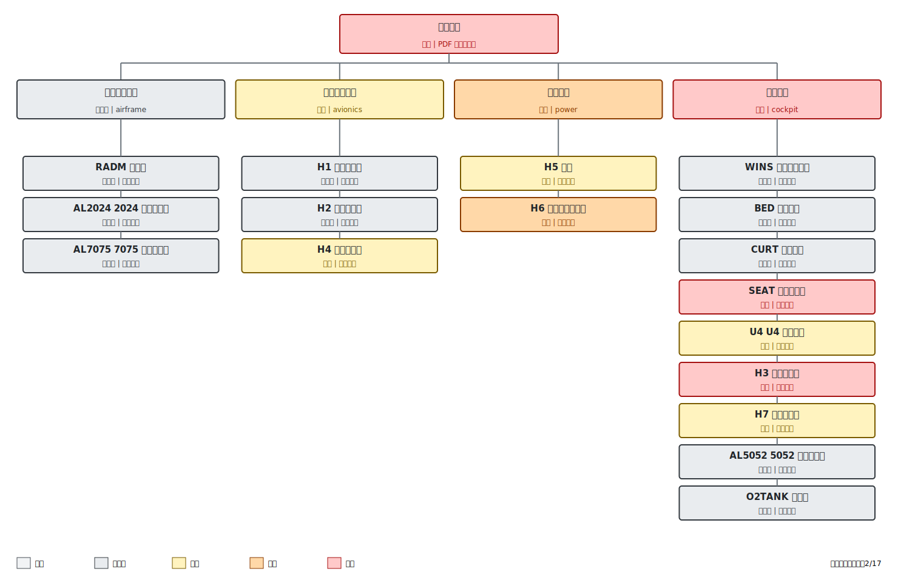

## 系统级传播结果

| 系统 | 等级 | 触发节点 | 采用的传播规则 |
|---|---:|---|---|
| 机体结构系统（`airframe`） | 未毁伤 | 无 | 所有已知节点均未达到毁伤标准 |
| 航空电子系统（`avionics`） | 轻度 | H4 | 至少一个已知节点达到轻度，且未触发更高等级 |
| 电源系统（`power`） | 中度 | H6 | 主要节点达到中度，或次要节点达到重度毁伤 |
| 座舱系统（`cockpit`） | 重度 | SEAT, H3 | 至少一个主要节点达到重度毁伤 |

## 完整设备毁伤评估

| 设备组 | 设备名称 | 毁伤树角色 | 等级 | 峰值温度（C） | 轻度证据 | 中度证据 | 重度证据 | 重度毁伤结论 | 物理解释 | 正外部热流探针数 | 有效温度探针数 |
|---|---|---|---:|---:|---|---|---|---|---|---:|---:|
| RADM | 雷达罩 | 机体结构系统：主要节点 | 未毁伤 | 107.7 | 150 C; 0.0/1200 s | 250 C; 0.0/600 s | 400 C; 0.0/180 s | 未达到：峰值 107.7 C < 400 C | 监测表面接收到正外部热流，但受脉冲能量、材料热惯性和散热影响，峰值仍低于重度毁伤阈值。 | 10 | 10 |
| WINS | 有机玻璃舷窗 | 座舱系统：主要节点 | 未毁伤 | 150.7 | 120 C; 0.0/60 s | 200 C; 0.0/45 s | 250 C; 0.0/8 s | 未达到：峰值 150.7 C < 250 C | 监测表面接收到正外部热流，但受脉冲能量、材料热惯性和散热影响，峰值仍低于重度毁伤阈值。 | 10 | 10 |
| BED | 尼龙床垫 | 座舱系统：主要节点 | 未毁伤 | 169.7 | 200 C; 0.0/60 s | 250 C; 0.0/90 s | 500 C; 0.0/5 s | 未达到：峰值 169.7 C < 500 C | 监测表面接收到正外部热流，但受脉冲能量、材料热惯性和散热影响，峰值仍低于重度毁伤阈值。 | 8 | 8 |
| CURT | 尼龙窗帘 | 座舱系统：主要节点 | 未毁伤 | 119.6 | 200 C; 0.0/60 s | 250 C; 0.0/90 s | 500 C; 0.0/5 s | 未达到：峰值 119.6 C < 500 C | 监测表面接收到正外部热流，但受脉冲能量、材料热惯性和散热影响，峰值仍低于重度毁伤阈值。 | 10 | 10 |
| U4 | U4 仪器设备 | 座舱系统：主要节点 | 轻度 | 212.5 | 120 C; 873.0/300 s | 250 C; 0.0/180 s | 400 C; 0.0/5 s | 未达到：峰值 212.5 C < 400 C | 监测表面未分配到正外部热流；几何遮挡后仅靠舱内二次火灾加热，温度低于重度毁伤阈值。 | 0 | 6 |
| SEAT | 聚氨酯座椅 | 座舱系统：主要节点 | 重度 | 2326.6 | 200 C; 1123.5/60 s | 300 C; 1123.5/90 s | 500 C; 1123.5/5 s | 已达到：峰值 2326.6 C；连续高于 500 C 的时间为 1123.5/5 s | 直接外部热流和/或火灾加热同时提供了足够的温度和持续时间。 | 4 | 10 |
| AL2024 | 2024 铝合金蒙皮 | 机体结构系统：主要节点 | 未毁伤 | 260.8 | 120 C; 1036.5/1200 s | 250 C; 33.0/600 s | 400 C; 0.0/180 s | 未达到：峰值 260.8 C < 400 C | 监测表面接收到正外部热流，但受脉冲能量、材料热惯性和散热影响，峰值仍低于重度毁伤阈值。 | 5 | 10 |
| AL5052 | 5052 铝合金风管 | 座舱系统：次要节点 | 未毁伤 | 274.2 | 120 C; 751.5/1200 s | 250 C; 522.0/600 s | 400 C; 0.0/180 s | 未达到：峰值 274.2 C < 400 C | 监测表面未分配到正外部热流；几何遮挡后仅靠舱内二次火灾加热，温度低于重度毁伤阈值。 | 0 | 10 |
| AL7075 | 7075 铝合金框架 | 机体结构系统：主要节点 | 未毁伤 | 259.3 | 120 C; 871.5/1200 s | 200 C; 528.0/600 s | 400 C; 0.0/180 s | 未达到：峰值 259.3 C < 400 C | 监测表面接收到正外部热流，但受脉冲能量、材料热惯性和散热影响，峰值仍低于重度毁伤阈值。 | 3 | 10 |
| O2TANK | 氧气瓶 | 座舱系统：次要节点 | 未毁伤 | 213.5 | 120 C; 693.0/1200 s | 200 C; 109.5/600 s | 400 C; 0.0/180 s | 未达到：峰值 213.5 C < 400 C | 监测表面接收到正外部热流，但受脉冲能量、材料热惯性和散热影响，峰值仍低于重度毁伤阈值。 | 6 | 10 |
| H1 | 导航子系统 | 航空电子系统：主要节点 | 未毁伤 | 71.3 | 120 C; 0.0/300 s | 250 C; 0.0/180 s | 400 C; 0.0/5 s | 未达到：峰值 71.3 C < 400 C | 监测表面接收到正外部热流，但受脉冲能量、材料热惯性和散热影响，峰值仍低于重度毁伤阈值。 | 5 | 7 |
| H2 | 任务子系统 | 航空电子系统：主要节点 | 未毁伤 | 37.7 | 120 C; 0.0/300 s | 250 C; 0.0/180 s | 400 C; 0.0/5 s | 未达到：峰值 37.7 C < 400 C | 监测表面接收到正外部热流，但受脉冲能量、材料热惯性和散热影响，峰值仍低于重度毁伤阈值。 | 8 | 10 |
| H3 | 显示子系统 | 座舱系统：主要节点 | 重度 | 482.6 | 120 C; 867.0/300 s | 250 C; 684.0/180 s | 400 C; 553.5/5 s | 已达到：峰值 482.6 C；连续高于 400 C 的时间为 553.5/5 s | 舱内二次火灾加热同时提供了足够的温度和持续时间。 | 0 | 14 |
| H4 | 通信子系统 | 航空电子系统：次要节点 | 轻度 | 143.1 | 120 C; 423.0/300 s | 250 C; 0.0/180 s | 400 C; 0.0/5 s | 未达到：峰值 143.1 C < 400 C | 监测表面接收到正外部热流，但受脉冲能量、材料热惯性和散热影响，峰值仍低于重度毁伤阈值。 | 4 | 10 |
| H5 | 电池 | 电源系统：主要节点 | 轻度 | 170.4 | 100 C; 609.0/60 s | 150 C; 240.0/600 s | 200 C; 0.0/180 s | 未达到：峰值 170.4 C < 200 C | 监测表面接收到正外部热流，但受脉冲能量、材料热惯性和散热影响，峰值仍低于重度毁伤阈值。 | 3 | 6 |
| H6 | 电力传输子系统 | 电源系统：主要节点 | 中度 | 324.1 | 120 C; 885.0/1200 s | 200 C; 742.5/600 s | 400 C; 0.0/180 s | 未达到：峰值 324.1 C < 400 C | 监测表面未分配到正外部热流；几何遮挡后仅靠舱内二次火灾加热，温度低于重度毁伤阈值。 | 0 | 8 |
| H7 | 操纵子系统 | 座舱系统：主要节点 | 轻度 | 185.3 | 120 C; 960.0/300 s | 250 C; 0.0/180 s | 400 C; 0.0/5 s | 未达到：峰值 185.3 C < 400 C | 监测表面未分配到正外部热流；几何遮挡后仅靠舱内二次火灾加热，温度低于重度毁伤阈值。 | 0 | 4 |

## 评估结论与解释

- 未达到重度或证据未知的设备组：**RADM, WINS, BED, CURT, U4, AL2024, AL5052, AL7075, O2TANK, H1, H2, H4, H5, H6, H7**。
- 重度毁伤未满足的原因统计：**15 项受峰值温度限制**，**0 项受持续时间限制**。
- 整机等级取各系统已知等级中的最高等级：**重度**。
- H2（任务子系统）和 H3（显示子系统）属于当前模型的专用映射，其通用电子设备阈值并非 PDF 中的同名条目。
- H1-H4 探针当前测量铝合金外壳表面温度，并将其作为内部电子器件温度的代理。

## 按毁伤树原则对本案例的详细解释

该案例当前属于实时快照（案例仍在运行），有效模拟时间为 1125.0 s。它可以反映已经形成的温度峰值和累计持续时间，但不能替代正常完成结果；所有临界设备仍需在完整结果中复核。
按照设备级温度与持续时间判据，当前达到重度毁伤的设备组共有 2 个：SEAT, H3。这些设备不仅达到重度温度阈值，而且最长连续超阈时间也满足规定时长，因此其重度结论具有完整的温度和时间证据。
峰值温度受限设备包括：RADM（峰值 107.7 C，阈值 400 C）、WINS（峰值 150.7 C，阈值 250 C）、BED（峰值 169.7 C，阈值 500 C）、CURT（峰值 119.6 C，阈值 500 C）、U4（峰值 212.5 C，阈值 400 C）、AL2024（峰值 260.8 C，阈值 400 C）、AL5052（峰值 274.2 C，阈值 400 C）、AL7075（峰值 259.3 C，阈值 400 C）、O2TANK（峰值 213.5 C，阈值 400 C）、H1（峰值 71.3 C，阈值 400 C）、H2（峰值 37.7 C，阈值 400 C）、H4（峰值 143.1 C，阈值 400 C）、H5（峰值 170.4 C，阈值 200 C）、H6（峰值 324.1 C，阈值 400 C）、H7（峰值 185.3 C，阈值 400 C）。这些对象尚未进入重度判据温度区间，继续延长模拟时间并不会自动补足峰值条件；需要结合直接受照、遮挡和二次火灾强度判断其原因。
U4, AL5052, H6, H7 的有效监测面没有记录到正外部热流，它们主要依靠舱内二次火灾加热。若这些设备未达到重度，优先应检查 DDA 可见性、设备实际朝向、邻近可燃物燃烧持续性及探针是否覆盖热点，而不是直接降低材料强度或毁伤标准。
系统级传播结果为：机体结构系统为未毁伤，触发节点为无明确触发节点；航空电子系统为轻度，触发节点为H4；电源系统为中度，触发节点为H6；座舱系统为重度，触发节点为SEAT、H3。系统等级由主要节点和次要节点按既定规则传播，不是按系统内所有设备温度求平均。
最终 PDF 毁伤树整机等级为重度，而严格全设备结果为 2/17。前者说明至少一个关键系统已达到相应任务毁伤等级；后者说明距离“所有材料和设备均重度毁伤”的研究目标仍有 15 个设备组未满足。两者必须同时保留，不能用整机重度替代 17/17。
因此，本案例是否能够作为全毁伤阈值的成功点，只取决于严格结果是否达到 17/17，并且案例是否正常完成。未达到 17/17 时，应根据上面的峰值受限、持续时间受限和遮挡分类确定下一步物理参数研究方向。

---

## 完整毁伤树评估：Q0050_W0100_az270_el15_H1H7_v5_Qnorm

- 模拟时间：**1500.00 s**
- 来源目录：`cases_qnorm/Q0050_W0100_az270_el15_H1H7_v5_Qnorm`
- 方案分类：**修正入射面归一化基线**
- 评估状态：**正常完成**
- PDF 毁伤树整机等级：**重度**
- 严格全设备重度毁伤结果：**4/17** （全部重度毁伤=否）
- 最高温度定义：几何位置有效的冗余壁面温度探针动态包络最大值。
- 注意：严格的 17/17 指标不等同于 PDF 毁伤树的整机等级判据。

## 案例配置

| 参数 | 数值 |
|---|---|
| 方案用途 | 修正入射面光冲量归一化 |
| 来源案例 | 未记录 |
| 修改因素 | 未记录 |
| 光冲量 Q（J/cm2） | 50 |
| 核爆当量（kt） | 100 |
| 方位角（度） | 270 |
| 俯仰角（度） | 15 |
| 目标模拟时长（s） | 1500 |
| MPI 进程数 | 32 |
| BURN_AWAY | 否 |
| 辐射份额 | 0.4 |
| 最大 CFL | 未记录 |
| 指定时间步长（s） | 未记录 |
| 核辐射脉冲积分（s） | 0.660398 |
| 入射面峰值辐照度（kW/m2） | 757.119 |
| 最大局部外部热流（kW/m2） | 735 |
| 最大局部积分光冲量（J/cm2） | 48.5393 |
| 各材料 HRRPUA（kW/m2） | 未记录 |
| FDS 中全部 HRRPUA（kW/m2） | [75.0, 100.0, 180.0, 200.0, 250.0] |
| 审查后的材料厚度（m） | 未记录 |
| FDS 中全部材料层厚度（m） | [0.001, 0.0015, 0.002, 0.003, 0.005, 0.03, 0.075, 0.12, 0.15] |
| 几何是否修改 | 否 |
| 材料是否修改 | 否 |
| 燃烧参数是否修改 | 否 |
| 外部热流是否修改 | 否 |
| 点燃温度是否修改 | 否 |
| 毁伤阈值是否修改 | 否 |
| FDS 输入文件 | Q0050_W0100_az270_el15_H1H7_v5_Qnorm.fds |

## 已知问题与结果有效性

- H1-H4 目前以铝合金外壳壁面温度代理内部电子器件温度。

## 毁伤树

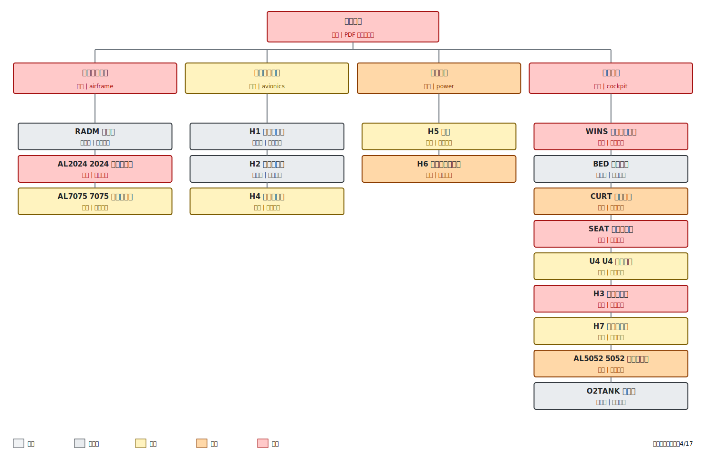

## 系统级传播结果

| 系统 | 等级 | 触发节点 | 采用的传播规则 |
|---|---:|---|---|
| 机体结构系统（`airframe`） | 重度 | AL2024 | 至少一个主要节点达到重度毁伤 |
| 航空电子系统（`avionics`） | 轻度 | H4 | 至少一个已知节点达到轻度，且未触发更高等级 |
| 电源系统（`power`） | 中度 | H6 | 主要节点达到中度，或次要节点达到重度毁伤 |
| 座舱系统（`cockpit`） | 重度 | WINS, SEAT, H3 | 至少一个主要节点达到重度毁伤 |

## 完整设备毁伤评估

| 设备组 | 设备名称 | 毁伤树角色 | 等级 | 峰值温度（C） | 轻度证据 | 中度证据 | 重度证据 | 重度毁伤结论 | 物理解释 | 正外部热流探针数 | 有效温度探针数 |
|---|---|---|---:|---:|---|---|---|---|---|---:|---:|
| RADM | 雷达罩 | 机体结构系统：主要节点 | 未毁伤 | 309.5 | 150 C; 4.5/1200 s | 250 C; 0.0/600 s | 400 C; 0.0/180 s | 未达到：峰值 309.5 C < 400 C | 监测表面接收到正外部热流，但受脉冲能量、材料热惯性和散热影响，峰值仍低于重度毁伤阈值。 | 10 | 10 |
| WINS | 有机玻璃舷窗 | 座舱系统：主要节点 | 重度 | 915.7 | 120 C; 1498.5/60 s | 200 C; 1498.5/45 s | 250 C; 1498.5/8 s | 已达到：峰值 915.7 C；连续高于 250 C 的时间为 1498.5/8 s | 直接外部热流和/或火灾加热同时提供了足够的温度和持续时间。 | 10 | 10 |
| BED | 尼龙床垫 | 座舱系统：主要节点 | 未毁伤 | 136.1 | 200 C; 0.0/60 s | 250 C; 0.0/90 s | 500 C; 0.0/5 s | 未达到：峰值 136.1 C < 500 C | 监测表面接收到正外部热流，但受脉冲能量、材料热惯性和散热影响，峰值仍低于重度毁伤阈值。 | 8 | 8 |
| CURT | 尼龙窗帘 | 座舱系统：主要节点 | 中度 | 350.2 | 200 C; 958.5/60 s | 250 C; 679.5/90 s | 500 C; 0.0/5 s | 未达到：峰值 350.2 C < 500 C | 监测表面接收到正外部热流，但受脉冲能量、材料热惯性和散热影响，峰值仍低于重度毁伤阈值。 | 10 | 10 |
| U4 | U4 仪器设备 | 座舱系统：主要节点 | 轻度 | 238.2 | 120 C; 1026.0/300 s | 250 C; 0.0/180 s | 400 C; 0.0/5 s | 未达到：峰值 238.2 C < 400 C | 监测表面未分配到正外部热流；几何遮挡后仅靠舱内二次火灾加热，温度低于重度毁伤阈值。 | 0 | 6 |
| SEAT | 聚氨酯座椅 | 座舱系统：主要节点 | 重度 | 2713.3 | 200 C; 1498.5/60 s | 300 C; 1498.5/90 s | 500 C; 1498.5/5 s | 已达到：峰值 2713.3 C；连续高于 500 C 的时间为 1498.5/5 s | 直接外部热流和/或火灾加热同时提供了足够的温度和持续时间。 | 4 | 10 |
| AL2024 | 2024 铝合金蒙皮 | 机体结构系统：主要节点 | 重度 | 490.5 | 120 C; 1492.5/1200 s | 250 C; 1416.0/600 s | 400 C; 1329.0/180 s | 已达到：峰值 490.5 C；连续高于 400 C 的时间为 1329.0/180 s | 直接外部热流和/或火灾加热同时提供了足够的温度和持续时间。 | 5 | 10 |
| AL5052 | 5052 铝合金风管 | 座舱系统：次要节点 | 中度 | 328.5 | 120 C; 1282.5/1200 s | 250 C; 1138.5/600 s | 400 C; 0.0/180 s | 未达到：峰值 328.5 C < 400 C | 监测表面未分配到正外部热流；几何遮挡后仅靠舱内二次火灾加热，温度低于重度毁伤阈值。 | 0 | 10 |
| AL7075 | 7075 铝合金框架 | 机体结构系统：主要节点 | 轻度 | 224.8 | 120 C; 1314.0/1200 s | 200 C; 450.0/600 s | 400 C; 0.0/180 s | 未达到：峰值 224.8 C < 400 C | 监测表面接收到正外部热流，但受脉冲能量、材料热惯性和散热影响，峰值仍低于重度毁伤阈值。 | 3 | 10 |
| O2TANK | 氧气瓶 | 座舱系统：次要节点 | 未毁伤 | 224.7 | 120 C; 963.0/1200 s | 200 C; 286.5/600 s | 400 C; 0.0/180 s | 未达到：峰值 224.7 C < 400 C | 监测表面接收到正外部热流，但受脉冲能量、材料热惯性和散热影响，峰值仍低于重度毁伤阈值。 | 6 | 8 |
| H1 | 导航子系统 | 航空电子系统：主要节点 | 未毁伤 | 78.9 | 120 C; 0.0/300 s | 250 C; 0.0/180 s | 400 C; 0.0/5 s | 未达到：峰值 78.9 C < 400 C | 监测表面接收到正外部热流，但受脉冲能量、材料热惯性和散热影响，峰值仍低于重度毁伤阈值。 | 5 | 6 |
| H2 | 任务子系统 | 航空电子系统：主要节点 | 未毁伤 | 79.0 | 120 C; 0.0/300 s | 250 C; 0.0/180 s | 400 C; 0.0/5 s | 未达到：峰值 79.0 C < 400 C | 监测表面接收到正外部热流，但受脉冲能量、材料热惯性和散热影响，峰值仍低于重度毁伤阈值。 | 8 | 8 |
| H3 | 显示子系统 | 座舱系统：主要节点 | 重度 | 549.3 | 120 C; 1284.0/300 s | 250 C; 1209.0/180 s | 400 C; 1111.5/5 s | 已达到：峰值 549.3 C；连续高于 400 C 的时间为 1111.5/5 s | 舱内二次火灾加热同时提供了足够的温度和持续时间。 | 0 | 14 |
| H4 | 通信子系统 | 航空电子系统：次要节点 | 轻度 | 173.4 | 120 C; 888.0/300 s | 250 C; 0.0/180 s | 400 C; 0.0/5 s | 未达到：峰值 173.4 C < 400 C | 监测表面接收到正外部热流，但受脉冲能量、材料热惯性和散热影响，峰值仍低于重度毁伤阈值。 | 4 | 10 |
| H5 | 电池 | 电源系统：主要节点 | 轻度 | 129.0 | 100 C; 708.0/60 s | 150 C; 0.0/600 s | 200 C; 0.0/180 s | 未达到：峰值 129.0 C < 200 C | 监测表面接收到正外部热流，但受脉冲能量、材料热惯性和散热影响，峰值仍低于重度毁伤阈值。 | 3 | 6 |
| H6 | 电力传输子系统 | 电源系统：主要节点 | 中度 | 248.8 | 120 C; 1405.5/1200 s | 200 C; 769.5/600 s | 400 C; 0.0/180 s | 未达到：峰值 248.8 C < 400 C | 监测表面未分配到正外部热流；几何遮挡后仅靠舱内二次火灾加热，温度低于重度毁伤阈值。 | 0 | 8 |
| H7 | 操纵子系统 | 座舱系统：主要节点 | 轻度 | 208.8 | 120 C; 1473.0/300 s | 250 C; 0.0/180 s | 400 C; 0.0/5 s | 未达到：峰值 208.8 C < 400 C | 监测表面未分配到正外部热流；几何遮挡后仅靠舱内二次火灾加热，温度低于重度毁伤阈值。 | 0 | 3 |

## 评估结论与解释

- 未达到重度或证据未知的设备组：**RADM, BED, CURT, U4, AL5052, AL7075, O2TANK, H1, H2, H4, H5, H6, H7**。
- 重度毁伤未满足的原因统计：**13 项受峰值温度限制**，**0 项受持续时间限制**。
- 整机等级取各系统已知等级中的最高等级：**重度**。
- H2（任务子系统）和 H3（显示子系统）属于当前模型的专用映射，其通用电子设备阈值并非 PDF 中的同名条目。
- H1-H4 探针当前测量铝合金外壳表面温度，并将其作为内部电子器件温度的代理。

## 按毁伤树原则对本案例的详细解释

该案例已正常运行到目标时长，且日志中存在 FDS 正常完成标记，因此可作为正式结果参与同参数族的阈值比较。
该案例标称入射面光冲量为 50 J/cm2，模型表面的最大局部积分光冲量为 48.539 J/cm2，约为标称值的 97.1%。因此设备实际受照还受到入射角、表面朝向与几何遮挡影响，不能把标称 Q 直接等同于每个设备表面接收的光冲量。
按照设备级温度与持续时间判据，当前达到重度毁伤的设备组共有 4 个：WINS, SEAT, AL2024, H3。这些设备不仅达到重度温度阈值，而且最长连续超阈时间也满足规定时长，因此其重度结论具有完整的温度和时间证据。
峰值温度受限设备包括：RADM（峰值 309.5 C，阈值 400 C）、BED（峰值 136.1 C，阈值 500 C）、CURT（峰值 350.2 C，阈值 500 C）、U4（峰值 238.2 C，阈值 400 C）、AL5052（峰值 328.5 C，阈值 400 C）、AL7075（峰值 224.8 C，阈值 400 C）、O2TANK（峰值 224.7 C，阈值 400 C）、H1（峰值 78.9 C，阈值 400 C）、H2（峰值 79.0 C，阈值 400 C）、H4（峰值 173.4 C，阈值 400 C）、H5（峰值 129.0 C，阈值 200 C）、H6（峰值 248.8 C，阈值 400 C）、H7（峰值 208.8 C，阈值 400 C）。这些对象尚未进入重度判据温度区间，继续延长模拟时间并不会自动补足峰值条件；需要结合直接受照、遮挡和二次火灾强度判断其原因。
U4, AL5052, H6, H7 的有效监测面没有记录到正外部热流，它们主要依靠舱内二次火灾加热。若这些设备未达到重度，优先应检查 DDA 可见性、设备实际朝向、邻近可燃物燃烧持续性及探针是否覆盖热点，而不是直接降低材料强度或毁伤标准。
系统级传播结果为：机体结构系统为重度，触发节点为AL2024；航空电子系统为轻度，触发节点为H4；电源系统为中度，触发节点为H6；座舱系统为重度，触发节点为WINS、SEAT、H3。系统等级由主要节点和次要节点按既定规则传播，不是按系统内所有设备温度求平均。
最终 PDF 毁伤树整机等级为重度，而严格全设备结果为 4/17。前者说明至少一个关键系统已达到相应任务毁伤等级；后者说明距离“所有材料和设备均重度毁伤”的研究目标仍有 13 个设备组未满足。两者必须同时保留，不能用整机重度替代 17/17。
因此，本案例是否能够作为全毁伤阈值的成功点，只取决于严格结果是否达到 17/17，并且案例是否正常完成。未达到 17/17 时，应根据上面的峰值受限、持续时间受限和遮挡分类确定下一步物理参数研究方向。

---

## 完整毁伤树评估：Q0050_W0100_az270_el15_H1H7_v5_Qnorm_adapt_HRRnominal_thickness_audit_v1

- 模拟时间：**753.00 s**
- 来源目录：`cases_adaptive/Q0050_W0100_az270_el15_H1H7_v5_Qnorm_adapt_HRRnominal_thickness_audit_v1`
- 方案分类：**自适应敏感性方案（单独比较）**
- 评估状态：**实时快照（案例仍在运行）**
- PDF 毁伤树整机等级：**重度**
- 严格全设备重度毁伤结果：**4/17** （全部重度毁伤=否）
- 最高温度定义：几何位置有效的冗余壁面温度探针动态包络最大值。
- 注意：严格的 17/17 指标不等同于 PDF 毁伤树的整机等级判据。

## 案例配置

| 参数 | 数值 |
|---|---|
| 方案用途 | nominal_HRRPUA_with_audited_thickness |
| 来源案例 | Q0050_W0100_az270_el15_H1H7_v5_Qnorm_adapt_HRRupper_thickness_audit |
| 修改因素 | HRRPUA_upper_to_nominal_only |
| 光冲量 Q（J/cm2） | 50 |
| 核爆当量（kt） | 100 |
| 方位角（度） | 270 |
| 俯仰角（度） | 15 |
| 目标模拟时长（s） | 1500 |
| MPI 进程数 | 20 |
| BURN_AWAY | 否 |
| 辐射份额 | 0.4 |
| 最大 CFL | 未记录 |
| 指定时间步长（s） | 未记录 |
| 核辐射脉冲积分（s） | 0.660398 |
| 入射面峰值辐照度（kW/m2） | 757.119 |
| 最大局部外部热流（kW/m2） | 735 |
| 最大局部积分光冲量（J/cm2） | 48.5393 |
| 各材料 HRRPUA（kW/m2） | {"BED": 790.0, "CURT": 324.0, "H6": 259.0, "H7": 458.0, "RADM": 840.0, "SEAT": 860.0, "U4": 840.0, "WINS": 806.0} |
| FDS 中全部 HRRPUA（kW/m2） | [75.0, 100.0, 180.0, 200.0, 250.0] |
| 审查后的材料厚度（m） | {"BED": 0.00089, "CURT": 0.003, "RADM": 0.1, "U4": 0.006, "WINS": 0.025} |
| FDS 中全部材料层厚度（m） | [0.00089, 0.001, 0.0015, 0.002, 0.003, 0.005, 0.006, 0.025, 0.1, 0.15] |
| 几何是否修改 | 否 |
| 材料是否修改 | 否 |
| 燃烧参数是否修改 | 否 |
| 外部热流是否修改 | 否 |
| 点燃温度是否修改 | 否 |
| 毁伤阈值是否修改 | 否 |
| FDS 输入文件 | Q0050_W0100_az270_el15_H1H7_v5_Qnorm_adapt_HRRnominal_thickness_audit_v1.fds |

## 已知问题与结果有效性

- 该结果是 753.0 s 的长时快照，缺少 FDS 正常结束标记；在达到 T_END 前，温度和毁伤等级仍可能变化。
- H1-H4 目前以铝合金外壳壁面温度代理内部电子器件温度。

## 毁伤树

## 系统级传播结果

| 系统 | 等级 | 触发节点 | 采用的传播规则 |
|---|---:|---|---|
| 机体结构系统（`airframe`） | 重度 | AL2024 | 至少一个主要节点达到重度毁伤 |
| 航空电子系统（`avionics`） | 轻度 | H4 | 至少一个已知节点达到轻度，且未触发更高等级 |
| 电源系统（`power`） | 未毁伤 | 无 | 所有已知节点均未达到毁伤标准 |
| 座舱系统（`cockpit`） | 重度 | WINS, SEAT, H3 | 至少一个主要节点达到重度毁伤 |

## 完整设备毁伤评估

| 设备组 | 设备名称 | 毁伤树角色 | 等级 | 峰值温度（C） | 轻度证据 | 中度证据 | 重度证据 | 重度毁伤结论 | 物理解释 | 正外部热流探针数 | 有效温度探针数 |
|---|---|---|---:|---:|---|---|---|---|---|---:|---:|
| RADM | 雷达罩 | 机体结构系统：主要节点 | 未毁伤 | 305.5 | 150 C; 4.5/1200 s | 250 C; 0.0/600 s | 400 C; 0.0/180 s | 未达到：峰值 305.5 C < 400 C | 监测表面接收到正外部热流，但受脉冲能量、材料热惯性和散热影响，峰值仍低于重度毁伤阈值。 | 10 | 10 |
| WINS | 有机玻璃舷窗 | 座舱系统：主要节点 | 重度 | 890.7 | 120 C; 751.5/60 s | 200 C; 751.5/45 s | 250 C; 751.5/8 s | 已达到：峰值 890.7 C；连续高于 250 C 的时间为 751.5/8 s | 直接外部热流和/或火灾加热同时提供了足够的温度和持续时间。 | 10 | 10 |
| BED | 尼龙床垫 | 座舱系统：主要节点 | 未毁伤 | 194.7 | 200 C; 0.0/60 s | 250 C; 0.0/90 s | 500 C; 0.0/5 s | 未达到：峰值 194.7 C < 500 C | 监测表面接收到正外部热流，但受脉冲能量、材料热惯性和散热影响，峰值仍低于重度毁伤阈值。 | 8 | 8 |
| CURT | 尼龙窗帘 | 座舱系统：主要节点 | 中度 | 367.7 | 200 C; 723.0/60 s | 250 C; 525.0/90 s | 500 C; 0.0/5 s | 未达到：峰值 367.7 C < 500 C | 监测表面接收到正外部热流，但受脉冲能量、材料热惯性和散热影响，峰值仍低于重度毁伤阈值。 | 10 | 10 |
| U4 | U4 仪器设备 | 座舱系统：主要节点 | 轻度 | 222.1 | 120 C; 382.5/300 s | 250 C; 0.0/180 s | 400 C; 0.0/5 s | 未达到：峰值 222.1 C < 400 C | 监测表面未分配到正外部热流；几何遮挡后仅靠舱内二次火灾加热，温度低于重度毁伤阈值。 | 0 | 6 |
| SEAT | 聚氨酯座椅 | 座舱系统：主要节点 | 重度 | 2116.4 | 200 C; 751.5/60 s | 300 C; 751.5/90 s | 500 C; 751.5/5 s | 已达到：峰值 2116.4 C；连续高于 500 C 的时间为 751.5/5 s | 直接外部热流和/或火灾加热同时提供了足够的温度和持续时间。 | 4 | 10 |
| AL2024 | 2024 铝合金蒙皮 | 机体结构系统：主要节点 | 重度 | 484.9 | 120 C; 745.5/1200 s | 250 C; 651.0/600 s | 400 C; 534.0/180 s | 已达到：峰值 484.9 C；连续高于 400 C 的时间为 534.0/180 s | 直接外部热流和/或火灾加热同时提供了足够的温度和持续时间。 | 5 | 10 |
| AL5052 | 5052 铝合金风管 | 座舱系统：次要节点 | 未毁伤 | 332.3 | 120 C; 546.0/1200 s | 250 C; 381.0/600 s | 400 C; 0.0/180 s | 未达到：峰值 332.3 C < 400 C | 监测表面未分配到正外部热流；几何遮挡后仅靠舱内二次火灾加热，温度低于重度毁伤阈值。 | 0 | 10 |
| AL7075 | 7075 铝合金框架 | 机体结构系统：主要节点 | 未毁伤 | 160.0 | 120 C; 564.0/1200 s | 200 C; 0.0/600 s | 400 C; 0.0/180 s | 未达到：峰值 160.0 C < 400 C | 监测表面接收到正外部热流，但受脉冲能量、材料热惯性和散热影响，峰值仍低于重度毁伤阈值。 | 3 | 10 |
| O2TANK | 氧气瓶 | 座舱系统：次要节点 | 未毁伤 | 158.1 | 120 C; 279.0/1200 s | 200 C; 0.0/600 s | 400 C; 0.0/180 s | 未达到：峰值 158.1 C < 400 C | 监测表面接收到正外部热流，但受脉冲能量、材料热惯性和散热影响，峰值仍低于重度毁伤阈值。 | 6 | 8 |
| H1 | 导航子系统 | 航空电子系统：主要节点 | 未毁伤 | 78.9 | 120 C; 0.0/300 s | 250 C; 0.0/180 s | 400 C; 0.0/5 s | 未达到：峰值 78.9 C < 400 C | 监测表面接收到正外部热流，但受脉冲能量、材料热惯性和散热影响，峰值仍低于重度毁伤阈值。 | 5 | 6 |
| H2 | 任务子系统 | 航空电子系统：主要节点 | 未毁伤 | 79.0 | 120 C; 0.0/300 s | 250 C; 0.0/180 s | 400 C; 0.0/5 s | 未达到：峰值 79.0 C < 400 C | 监测表面接收到正外部热流，但受脉冲能量、材料热惯性和散热影响，峰值仍低于重度毁伤阈值。 | 8 | 8 |
| H3 | 显示子系统 | 座舱系统：主要节点 | 重度 | 571.4 | 120 C; 568.5/300 s | 250 C; 507.0/180 s | 400 C; 429.0/5 s | 已达到：峰值 571.4 C；连续高于 400 C 的时间为 429.0/5 s | 舱内二次火灾加热同时提供了足够的温度和持续时间。 | 0 | 14 |
| H4 | 通信子系统 | 航空电子系统：次要节点 | 轻度 | 154.4 | 120 C; 303.0/300 s | 250 C; 0.0/180 s | 400 C; 0.0/5 s | 未达到：峰值 154.4 C < 400 C | 监测表面接收到正外部热流，但受脉冲能量、材料热惯性和散热影响，峰值仍低于重度毁伤阈值。 | 4 | 10 |
| H5 | 电池 | 电源系统：主要节点 | 未毁伤 | 71.2 | 100 C; 0.0/60 s | 150 C; 0.0/600 s | 200 C; 0.0/180 s | 未达到：峰值 71.2 C < 200 C | 监测表面接收到正外部热流，但受脉冲能量、材料热惯性和散热影响，峰值仍低于重度毁伤阈值。 | 3 | 6 |
| H6 | 电力传输子系统 | 电源系统：主要节点 | 未毁伤 | 247.7 | 120 C; 667.5/1200 s | 200 C; 40.5/600 s | 400 C; 0.0/180 s | 未达到：峰值 247.7 C < 400 C | 监测表面未分配到正外部热流；几何遮挡后仅靠舱内二次火灾加热，温度低于重度毁伤阈值。 | 0 | 8 |
| H7 | 操纵子系统 | 座舱系统：主要节点 | 轻度 | 220.5 | 120 C; 726.0/300 s | 250 C; 0.0/180 s | 400 C; 0.0/5 s | 未达到：峰值 220.5 C < 400 C | 监测表面未分配到正外部热流；几何遮挡后仅靠舱内二次火灾加热，温度低于重度毁伤阈值。 | 0 | 3 |

## 评估结论与解释

- 未达到重度或证据未知的设备组：**RADM, BED, CURT, U4, AL5052, AL7075, O2TANK, H1, H2, H4, H5, H6, H7**。
- 重度毁伤未满足的原因统计：**13 项受峰值温度限制**，**0 项受持续时间限制**。
- 整机等级取各系统已知等级中的最高等级：**重度**。
- H2（任务子系统）和 H3（显示子系统）属于当前模型的专用映射，其通用电子设备阈值并非 PDF 中的同名条目。
- H1-H4 探针当前测量铝合金外壳表面温度，并将其作为内部电子器件温度的代理。

## 按毁伤树原则对本案例的详细解释

该案例当前属于实时快照（案例仍在运行），有效模拟时间为 753.0 s。它可以反映已经形成的温度峰值和累计持续时间，但不能替代正常完成结果；所有临界设备仍需在完整结果中复核。
该案例标称入射面光冲量为 50 J/cm2，模型表面的最大局部积分光冲量为 48.539 J/cm2，约为标称值的 97.1%。因此设备实际受照还受到入射角、表面朝向与几何遮挡影响，不能把标称 Q 直接等同于每个设备表面接收的光冲量。
按照设备级温度与持续时间判据，当前达到重度毁伤的设备组共有 4 个：WINS, SEAT, AL2024, H3。这些设备不仅达到重度温度阈值，而且最长连续超阈时间也满足规定时长，因此其重度结论具有完整的温度和时间证据。
峰值温度受限设备包括：RADM（峰值 305.5 C，阈值 400 C）、BED（峰值 194.7 C，阈值 500 C）、CURT（峰值 367.7 C，阈值 500 C）、U4（峰值 222.1 C，阈值 400 C）、AL5052（峰值 332.3 C，阈值 400 C）、AL7075（峰值 160.0 C，阈值 400 C）、O2TANK（峰值 158.1 C，阈值 400 C）、H1（峰值 78.9 C，阈值 400 C）、H2（峰值 79.0 C，阈值 400 C）、H4（峰值 154.4 C，阈值 400 C）、H5（峰值 71.2 C，阈值 200 C）、H6（峰值 247.7 C，阈值 400 C）、H7（峰值 220.5 C，阈值 400 C）。这些对象尚未进入重度判据温度区间，继续延长模拟时间并不会自动补足峰值条件；需要结合直接受照、遮挡和二次火灾强度判断其原因。
U4, AL5052, H6, H7 的有效监测面没有记录到正外部热流，它们主要依靠舱内二次火灾加热。若这些设备未达到重度，优先应检查 DDA 可见性、设备实际朝向、邻近可燃物燃烧持续性及探针是否覆盖热点，而不是直接降低材料强度或毁伤标准。
系统级传播结果为：机体结构系统为重度，触发节点为AL2024；航空电子系统为轻度，触发节点为H4；电源系统为未毁伤，触发节点为无明确触发节点；座舱系统为重度，触发节点为WINS、SEAT、H3。系统等级由主要节点和次要节点按既定规则传播，不是按系统内所有设备温度求平均。
最终 PDF 毁伤树整机等级为重度，而严格全设备结果为 4/17。前者说明至少一个关键系统已达到相应任务毁伤等级；后者说明距离“所有材料和设备均重度毁伤”的研究目标仍有 13 个设备组未满足。两者必须同时保留，不能用整机重度替代 17/17。
因此，本案例是否能够作为全毁伤阈值的成功点，只取决于严格结果是否达到 17/17，并且案例是否正常完成。未达到 17/17 时，应根据上面的峰值受限、持续时间受限和遮挡分类确定下一步物理参数研究方向。

---

## 完整毁伤树评估：Q0100_W0100_az270_el15_H1H7_v3_stable

- 模拟时间：**1.50 s**
- 来源目录：`cases_stable/Q0100_W0100_az270_el15_H1H7_v3_stable`
- 方案分类：**已停用的数值诊断方案**
- 评估状态：**实时快照（案例仍在运行）**
- PDF 毁伤树整机等级：**未毁伤**
- 严格全设备重度毁伤结果：**0/17** （全部重度毁伤=否）
- 最高温度定义：几何位置有效的冗余壁面温度探针动态包络最大值。
- 注意：严格的 17/17 指标不等同于 PDF 毁伤树的整机等级判据。

## 案例配置

| 参数 | 数值 |
|---|---|
| 方案用途 | 未说明 |
| 来源案例 | 未记录 |
| 修改因素 | 未记录 |
| 光冲量 Q（J/cm2） | 100 |
| 核爆当量（kt） | 100 |
| 方位角（度） | 270 |
| 俯仰角（度） | 15 |
| 目标模拟时长（s） | 1500 |
| MPI 进程数 | 32 |
| BURN_AWAY | 否 |
| 辐射份额 | 0.35 |
| 最大 CFL | 0.5 |
| 指定时间步长（s） | 0.002 |
| 核辐射脉冲积分（s） | 未记录 |
| 入射面峰值辐照度（kW/m2） | 未记录 |
| 最大局部外部热流（kW/m2） | 未记录 |
| 最大局部积分光冲量（J/cm2） | 未记录 |
| 各材料 HRRPUA（kW/m2） | 未记录 |
| FDS 中全部 HRRPUA（kW/m2） | [75.0, 100.0, 180.0, 200.0, 250.0] |
| 审查后的材料厚度（m） | 未记录 |
| FDS 中全部材料层厚度（m） | [0.001, 0.0015, 0.002, 0.003, 0.005, 0.03, 0.075, 0.12, 0.15] |
| 几何是否修改 | 否 |
| 材料是否修改 | 否 |
| 燃烧参数是否修改 | 否 |
| 外部热流是否修改 | 否 |
| 点燃温度是否修改 | 否 |
| 毁伤阈值是否修改 | 否 |
| FDS 输入文件 | Q0100_W0100_az270_el15_H1H7_v3_stable.fds |

## 已知问题与结果有效性

- 该结果是 1.5 s 的长时快照，缺少 FDS 正常结束标记；在达到 T_END 前，温度和毁伤等级仍可能变化。
- 这是已停用或仅用于追溯的配置，不纳入当前阈值区间。
- H1-H4 目前以铝合金外壳壁面温度代理内部电子器件温度。

## 毁伤树

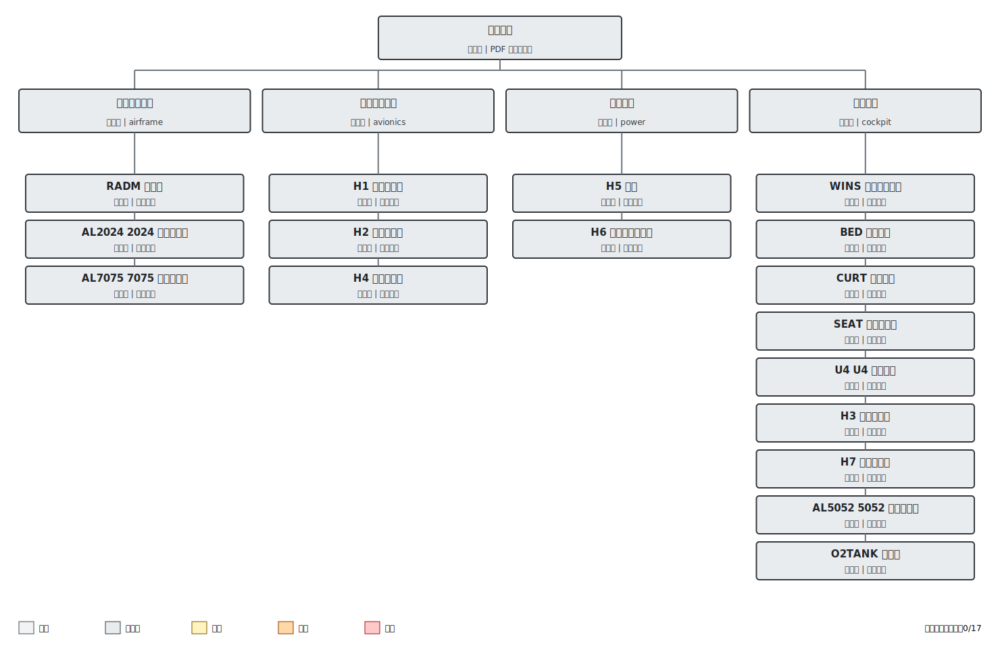

## 系统级传播结果

| 系统 | 等级 | 触发节点 | 采用的传播规则 |
|---|---:|---|---|
| 机体结构系统（`airframe`） | 未毁伤 | 无 | 所有已知节点均未达到毁伤标准 |
| 航空电子系统（`avionics`） | 未毁伤 | 无 | 所有已知节点均未达到毁伤标准 |
| 电源系统（`power`） | 未毁伤 | 无 | 所有已知节点均未达到毁伤标准 |
| 座舱系统（`cockpit`） | 未毁伤 | 无 | 所有已知节点均未达到毁伤标准 |

## 完整设备毁伤评估

| 设备组 | 设备名称 | 毁伤树角色 | 等级 | 峰值温度（C） | 轻度证据 | 中度证据 | 重度证据 | 重度毁伤结论 | 物理解释 | 正外部热流探针数 | 有效温度探针数 |
|---|---|---|---:|---:|---|---|---|---|---|---:|---:|
| RADM | 雷达罩 | 机体结构系统：主要节点 | 未毁伤 | 200.9 | 150 C; 0.0/1200 s | 250 C; 0.0/600 s | 400 C; 0.0/180 s | 未达到：峰值 200.9 C < 400 C | 监测表面接收到正外部热流，但受脉冲能量、材料热惯性和散热影响，峰值仍低于重度毁伤阈值。 | 10 | 10 |
| WINS | 有机玻璃舷窗 | 座舱系统：主要节点 | 未毁伤 | 288.1 | 120 C; 0.0/60 s | 200 C; 0.0/45 s | 250 C; 0.0/8 s | 未达到：连续高于 250 C 的时间仅为 0.0/8 s | 瞬态光辐射或火灾使温度短暂超过重度阈值，但燃烧或热反馈未维持到规定时间。 | 10 | 10 |
| BED | 尼龙床垫 | 座舱系统：主要节点 | 未毁伤 | 79.2 | 200 C; 0.0/60 s | 250 C; 0.0/90 s | 500 C; 0.0/5 s | 未达到：峰值 79.2 C < 500 C | 监测表面接收到正外部热流，但受脉冲能量、材料热惯性和散热影响，峰值仍低于重度毁伤阈值。 | 8 | 8 |
| CURT | 尼龙窗帘 | 座舱系统：主要节点 | 未毁伤 | 225.0 | 200 C; 0.0/60 s | 250 C; 0.0/90 s | 500 C; 0.0/5 s | 未达到：峰值 225.0 C < 500 C | 监测表面接收到正外部热流，但受脉冲能量、材料热惯性和散热影响，峰值仍低于重度毁伤阈值。 | 10 | 10 |
| U4 | U4 仪器设备 | 座舱系统：主要节点 | 未毁伤 | 20.0 | 120 C; 0.0/300 s | 250 C; 0.0/180 s | 400 C; 0.0/5 s | 未达到：峰值 20.0 C < 400 C | 监测表面未分配到正外部热流；几何遮挡后仅靠舱内二次火灾加热，温度低于重度毁伤阈值。 | 0 | 6 |
| SEAT | 聚氨酯座椅 | 座舱系统：主要节点 | 未毁伤 | 870.5 | 200 C; 0.0/60 s | 300 C; 0.0/90 s | 500 C; 0.0/5 s | 未达到：连续高于 500 C 的时间仅为 0.0/5 s | 瞬态光辐射或火灾使温度短暂超过重度阈值，但燃烧或热反馈未维持到规定时间。 | 4 | 10 |
| AL2024 | 2024 铝合金蒙皮 | 机体结构系统：主要节点 | 未毁伤 | 51.3 | 120 C; 0.0/1200 s | 250 C; 0.0/600 s | 400 C; 0.0/180 s | 未达到：峰值 51.3 C < 400 C | 监测表面接收到正外部热流，但受脉冲能量、材料热惯性和散热影响，峰值仍低于重度毁伤阈值。 | 5 | 10 |
| AL5052 | 5052 铝合金风管 | 座舱系统：次要节点 | 未毁伤 | 20.0 | 120 C; 0.0/1200 s | 250 C; 0.0/600 s | 400 C; 0.0/180 s | 未达到：峰值 20.0 C < 400 C | 监测表面未分配到正外部热流；几何遮挡后仅靠舱内二次火灾加热，温度低于重度毁伤阈值。 | 0 | 10 |
| AL7075 | 7075 铝合金框架 | 机体结构系统：主要节点 | 未毁伤 | 40.7 | 120 C; 0.0/1200 s | 200 C; 0.0/600 s | 400 C; 0.0/180 s | 未达到：峰值 40.7 C < 400 C | 监测表面接收到正外部热流，但受脉冲能量、材料热惯性和散热影响，峰值仍低于重度毁伤阈值。 | 3 | 10 |
| O2TANK | 氧气瓶 | 座舱系统：次要节点 | 未毁伤 | 30.5 | 120 C; 0.0/1200 s | 200 C; 0.0/600 s | 400 C; 0.0/180 s | 未达到：峰值 30.5 C < 400 C | 监测表面接收到正外部热流，但受脉冲能量、材料热惯性和散热影响，峰值仍低于重度毁伤阈值。 | 6 | 10 |
| H1 | 导航子系统 | 航空电子系统：主要节点 | 未毁伤 | 40.7 | 120 C; 0.0/300 s | 250 C; 0.0/180 s | 400 C; 0.0/5 s | 未达到：峰值 40.7 C < 400 C | 监测表面接收到正外部热流，但受脉冲能量、材料热惯性和散热影响，峰值仍低于重度毁伤阈值。 | 5 | 7 |
| H2 | 任务子系统 | 航空电子系统：主要节点 | 未毁伤 | 40.7 | 120 C; 0.0/300 s | 250 C; 0.0/180 s | 400 C; 0.0/5 s | 未达到：峰值 40.7 C < 400 C | 监测表面接收到正外部热流，但受脉冲能量、材料热惯性和散热影响，峰值仍低于重度毁伤阈值。 | 8 | 10 |
| H3 | 显示子系统 | 座舱系统：主要节点 | 未毁伤 | 20.1 | 120 C; 0.0/300 s | 250 C; 0.0/180 s | 400 C; 0.0/5 s | 未达到：峰值 20.1 C < 400 C | 监测表面未分配到正外部热流；几何遮挡后仅靠舱内二次火灾加热，温度低于重度毁伤阈值。 | 0 | 14 |
| H4 | 通信子系统 | 航空电子系统：次要节点 | 未毁伤 | 23.4 | 120 C; 0.0/300 s | 250 C; 0.0/180 s | 400 C; 0.0/5 s | 未达到：峰值 23.4 C < 400 C | 监测表面接收到正外部热流，但受脉冲能量、材料热惯性和散热影响，峰值仍低于重度毁伤阈值。 | 4 | 10 |
| H5 | 电池 | 电源系统：主要节点 | 未毁伤 | 27.4 | 100 C; 0.0/60 s | 150 C; 0.0/600 s | 200 C; 0.0/180 s | 未达到：峰值 27.4 C < 200 C | 监测表面接收到正外部热流，但受脉冲能量、材料热惯性和散热影响，峰值仍低于重度毁伤阈值。 | 3 | 6 |
| H6 | 电力传输子系统 | 电源系统：主要节点 | 未毁伤 | 20.0 | 120 C; 0.0/1200 s | 200 C; 0.0/600 s | 400 C; 0.0/180 s | 未达到：峰值 20.0 C < 400 C | 监测表面未分配到正外部热流；几何遮挡后仅靠舱内二次火灾加热，温度低于重度毁伤阈值。 | 0 | 8 |
| H7 | 操纵子系统 | 座舱系统：主要节点 | 未毁伤 | 26.2 | 120 C; 0.0/300 s | 250 C; 0.0/180 s | 400 C; 0.0/5 s | 未达到：峰值 26.2 C < 400 C | 监测表面未分配到正外部热流；几何遮挡后仅靠舱内二次火灾加热，温度低于重度毁伤阈值。 | 0 | 4 |

## 评估结论与解释

- 未达到重度或证据未知的设备组：**RADM, WINS, BED, CURT, U4, SEAT, AL2024, AL5052, AL7075, O2TANK, H1, H2, H3, H4, H5, H6, H7**。
- 重度毁伤未满足的原因统计：**15 项受峰值温度限制**，**2 项受持续时间限制**。
- 整机等级取各系统已知等级中的最高等级：**未毁伤**。
- H2（任务子系统）和 H3（显示子系统）属于当前模型的专用映射，其通用电子设备阈值并非 PDF 中的同名条目。
- H1-H4 探针当前测量铝合金外壳表面温度，并将其作为内部电子器件温度的代理。

## 按毁伤树原则对本案例的详细解释

该案例当前属于实时快照（案例仍在运行），有效模拟时间为 1.5 s。它可以反映已经形成的温度峰值和累计持续时间，但不能替代正常完成结果；所有临界设备仍需在完整结果中复核。
当前没有设备同时满足重度温度阈值与持续时间要求，因此严格重度毁伤数为 0。
峰值温度受限设备包括：RADM（峰值 200.9 C，阈值 400 C）、BED（峰值 79.2 C，阈值 500 C）、CURT（峰值 225.0 C，阈值 500 C）、U4（峰值 20.0 C，阈值 400 C）、AL2024（峰值 51.3 C，阈值 400 C）、AL5052（峰值 20.0 C，阈值 400 C）、AL7075（峰值 40.7 C，阈值 400 C）、O2TANK（峰值 30.5 C，阈值 400 C）、H1（峰值 40.7 C，阈值 400 C）、H2（峰值 40.7 C，阈值 400 C）、H3（峰值 20.1 C，阈值 400 C）、H4（峰值 23.4 C，阈值 400 C）、H5（峰值 27.4 C，阈值 200 C）、H6（峰值 20.0 C，阈值 400 C）、H7（峰值 26.2 C，阈值 400 C）。这些对象尚未进入重度判据温度区间，继续延长模拟时间并不会自动补足峰值条件；需要结合直接受照、遮挡和二次火灾强度判断其原因。
持续时间受限设备包括：WINS（0.0/8 s，高于 250 C）、SEAT（0.0/5 s，高于 500 C）。这些对象已经出现足够高的瞬态峰值，但热解、燃烧或邻近火灾反馈没有把温度维持到标准要求，因此不能仅凭最高温度判为重度毁伤。
U4, AL5052, H3, H6, H7 的有效监测面没有记录到正外部热流，它们主要依靠舱内二次火灾加热。若这些设备未达到重度，优先应检查 DDA 可见性、设备实际朝向、邻近可燃物燃烧持续性及探针是否覆盖热点，而不是直接降低材料强度或毁伤标准。
系统级传播结果为：机体结构系统为未毁伤，触发节点为无明确触发节点；航空电子系统为未毁伤，触发节点为无明确触发节点；电源系统为未毁伤，触发节点为无明确触发节点；座舱系统为未毁伤，触发节点为无明确触发节点。系统等级由主要节点和次要节点按既定规则传播，不是按系统内所有设备温度求平均。
最终 PDF 毁伤树整机等级为未毁伤，而严格全设备结果为 0/17。前者说明至少一个关键系统已达到相应任务毁伤等级；后者说明距离“所有材料和设备均重度毁伤”的研究目标仍有 17 个设备组未满足。两者必须同时保留，不能用整机重度替代 17/17。
因此，本案例是否能够作为全毁伤阈值的成功点，只取决于严格结果是否达到 17/17，并且案例是否正常完成。未达到 17/17 时，应根据上面的峰值受限、持续时间受限和遮挡分类确定下一步物理参数研究方向。

---

## 完整毁伤树评估：Q0100_W0100_az270_el15_H1H7_v4_legacy_stable

- 模拟时间：**1057.50 s**
- 来源目录：`cases_legacy_stable/Q0100_W0100_az270_el15_H1H7_v4_legacy_stable`
- 方案分类：**已停用的旧热流追溯方案**
- 评估状态：**实时快照（案例仍在运行）**
- PDF 毁伤树整机等级：**重度**
- 严格全设备重度毁伤结果：**3/17** （全部重度毁伤=否）
- 最高温度定义：几何位置有效的冗余壁面温度探针动态包络最大值。
- 注意：严格的 17/17 指标不等同于 PDF 毁伤树的整机等级判据。

## 案例配置

| 参数 | 数值 |
|---|---|
| 方案用途 | 未说明 |
| 来源案例 | 未记录 |
| 修改因素 | 未记录 |
| 光冲量 Q（J/cm2） | 100 |
| 核爆当量（kt） | 100 |
| 方位角（度） | 270 |
| 俯仰角（度） | 15 |
| 目标模拟时长（s） | 1500 |
| MPI 进程数 | 32 |
| BURN_AWAY | 否 |
| 辐射份额 | 0.4 |
| 最大 CFL | 未记录 |
| 指定时间步长（s） | 未记录 |
| 核辐射脉冲积分（s） | 未记录 |
| 入射面峰值辐照度（kW/m2） | 未记录 |
| 最大局部外部热流（kW/m2） | 未记录 |
| 最大局部积分光冲量（J/cm2） | 未记录 |
| 各材料 HRRPUA（kW/m2） | 未记录 |
| FDS 中全部 HRRPUA（kW/m2） | [75.0, 100.0, 180.0, 200.0, 250.0] |
| 审查后的材料厚度（m） | 未记录 |
| FDS 中全部材料层厚度（m） | [0.001, 0.0015, 0.002, 0.003, 0.005, 0.03, 0.075, 0.12, 0.15] |
| 几何是否修改 | 否 |
| 材料是否修改 | 否 |
| 燃烧参数是否修改 | 否 |
| 外部热流是否修改 | 否 |
| 点燃温度是否修改 | 否 |
| 毁伤阈值是否修改 | 否 |
| FDS 输入文件 | Q0100_W0100_az270_el15_H1H7_v4_legacy_stable.fds |

## 已知问题与结果有效性

- 该结果是 1057.5 s 的长时快照，缺少 FDS 正常结束标记；在达到 T_END 前，温度和毁伤等级仍可能变化。
- 这是已停用或仅用于追溯的配置，不纳入当前阈值区间。
- H1-H4 目前以铝合金外壳壁面温度代理内部电子器件温度。

## 毁伤树

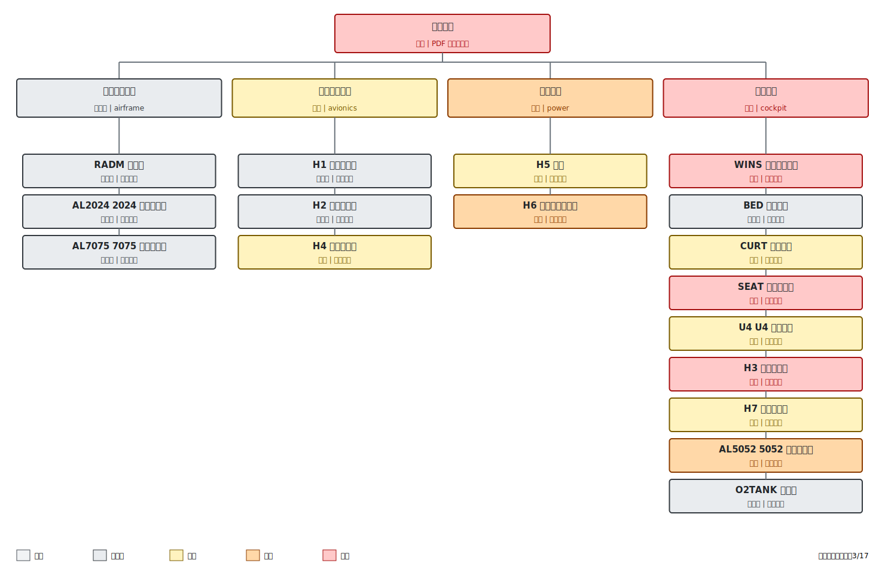

## 系统级传播结果

| 系统 | 等级 | 触发节点 | 采用的传播规则 |
|---|---:|---|---|
| 机体结构系统（`airframe`） | 未毁伤 | 无 | 所有已知节点均未达到毁伤标准 |
| 航空电子系统（`avionics`） | 轻度 | H4 | 至少一个已知节点达到轻度，且未触发更高等级 |
| 电源系统（`power`） | 中度 | H6 | 主要节点达到中度，或次要节点达到重度毁伤 |
| 座舱系统（`cockpit`） | 重度 | WINS, SEAT, H3 | 至少一个主要节点达到重度毁伤 |

## 完整设备毁伤评估

| 设备组 | 设备名称 | 毁伤树角色 | 等级 | 峰值温度（C） | 轻度证据 | 中度证据 | 重度证据 | 重度毁伤结论 | 物理解释 | 正外部热流探针数 | 有效温度探针数 |
|---|---|---|---:|---:|---|---|---|---|---|---:|---:|
| RADM | 雷达罩 | 机体结构系统：主要节点 | 未毁伤 | 193.9 | 150 C; 0.0/1200 s | 250 C; 0.0/600 s | 400 C; 0.0/180 s | 未达到：峰值 193.9 C < 400 C | 监测表面接收到正外部热流，但受脉冲能量、材料热惯性和散热影响，峰值仍低于重度毁伤阈值。 | 10 | 10 |
| WINS | 有机玻璃舷窗 | 座舱系统：主要节点 | 重度 | 803.1 | 120 C; 1056.0/60 s | 200 C; 1000.5/45 s | 250 C; 994.5/8 s | 已达到：峰值 803.1 C；连续高于 250 C 的时间为 994.5/8 s | 直接外部热流和/或火灾加热同时提供了足够的温度和持续时间。 | 10 | 10 |
| BED | 尼龙床垫 | 座舱系统：主要节点 | 未毁伤 | 103.1 | 200 C; 0.0/60 s | 250 C; 0.0/90 s | 500 C; 0.0/5 s | 未达到：峰值 103.1 C < 500 C | 监测表面接收到正外部热流，但受脉冲能量、材料热惯性和散热影响，峰值仍低于重度毁伤阈值。 | 8 | 8 |
| CURT | 尼龙窗帘 | 座舱系统：主要节点 | 轻度 | 217.4 | 200 C; 123.0/60 s | 250 C; 0.0/90 s | 500 C; 0.0/5 s | 未达到：峰值 217.4 C < 500 C | 监测表面接收到正外部热流，但受脉冲能量、材料热惯性和散热影响，峰值仍低于重度毁伤阈值。 | 10 | 10 |
| U4 | U4 仪器设备 | 座舱系统：主要节点 | 轻度 | 187.8 | 120 C; 552.0/300 s | 250 C; 0.0/180 s | 400 C; 0.0/5 s | 未达到：峰值 187.8 C < 400 C | 监测表面未分配到正外部热流；几何遮挡后仅靠舱内二次火灾加热，温度低于重度毁伤阈值。 | 0 | 6 |
| SEAT | 聚氨酯座椅 | 座舱系统：主要节点 | 重度 | 2377.5 | 200 C; 1056.0/60 s | 300 C; 1056.0/90 s | 500 C; 1056.0/5 s | 已达到：峰值 2377.5 C；连续高于 500 C 的时间为 1056.0/5 s | 直接外部热流和/或火灾加热同时提供了足够的温度和持续时间。 | 4 | 10 |
| AL2024 | 2024 铝合金蒙皮 | 机体结构系统：主要节点 | 未毁伤 | 228.2 | 120 C; 1035.0/1200 s | 250 C; 0.0/600 s | 400 C; 0.0/180 s | 未达到：峰值 228.2 C < 400 C | 监测表面接收到正外部热流，但受脉冲能量、材料热惯性和散热影响，峰值仍低于重度毁伤阈值。 | 5 | 10 |
| AL5052 | 5052 铝合金风管 | 座舱系统：次要节点 | 中度 | 287.8 | 120 C; 817.5/1200 s | 250 C; 636.0/600 s | 400 C; 0.0/180 s | 未达到：峰值 287.8 C < 400 C | 监测表面未分配到正外部热流；几何遮挡后仅靠舱内二次火灾加热，温度低于重度毁伤阈值。 | 0 | 10 |
| AL7075 | 7075 铝合金框架 | 机体结构系统：主要节点 | 未毁伤 | 250.1 | 120 C; 835.5/1200 s | 200 C; 408.0/600 s | 400 C; 0.0/180 s | 未达到：峰值 250.1 C < 400 C | 监测表面接收到正外部热流，但受脉冲能量、材料热惯性和散热影响，峰值仍低于重度毁伤阈值。 | 3 | 10 |
| O2TANK | 氧气瓶 | 座舱系统：次要节点 | 未毁伤 | 207.6 | 120 C; 525.0/1200 s | 200 C; 54.0/600 s | 400 C; 0.0/180 s | 未达到：峰值 207.6 C < 400 C | 监测表面接收到正外部热流，但受脉冲能量、材料热惯性和散热影响，峰值仍低于重度毁伤阈值。 | 6 | 10 |
| H1 | 导航子系统 | 航空电子系统：主要节点 | 未毁伤 | 66.2 | 120 C; 0.0/300 s | 250 C; 0.0/180 s | 400 C; 0.0/5 s | 未达到：峰值 66.2 C < 400 C | 监测表面接收到正外部热流，但受脉冲能量、材料热惯性和散热影响，峰值仍低于重度毁伤阈值。 | 5 | 7 |
| H2 | 任务子系统 | 航空电子系统：主要节点 | 未毁伤 | 55.2 | 120 C; 0.0/300 s | 250 C; 0.0/180 s | 400 C; 0.0/5 s | 未达到：峰值 55.2 C < 400 C | 监测表面接收到正外部热流，但受脉冲能量、材料热惯性和散热影响，峰值仍低于重度毁伤阈值。 | 8 | 10 |
| H3 | 显示子系统 | 座舱系统：主要节点 | 重度 | 507.4 | 120 C; 828.0/300 s | 250 C; 759.0/180 s | 400 C; 669.0/5 s | 已达到：峰值 507.4 C；连续高于 400 C 的时间为 669.0/5 s | 舱内二次火灾加热同时提供了足够的温度和持续时间。 | 0 | 14 |
| H4 | 通信子系统 | 航空电子系统：次要节点 | 轻度 | 146.4 | 120 C; 369.0/300 s | 250 C; 0.0/180 s | 400 C; 0.0/5 s | 未达到：峰值 146.4 C < 400 C | 监测表面接收到正外部热流，但受脉冲能量、材料热惯性和散热影响，峰值仍低于重度毁伤阈值。 | 4 | 10 |
| H5 | 电池 | 电源系统：主要节点 | 轻度 | 157.4 | 100 C; 576.0/60 s | 150 C; 109.5/600 s | 200 C; 0.0/180 s | 未达到：峰值 157.4 C < 200 C | 监测表面接收到正外部热流，但受脉冲能量、材料热惯性和散热影响，峰值仍低于重度毁伤阈值。 | 3 | 6 |
| H6 | 电力传输子系统 | 电源系统：主要节点 | 中度 | 306.2 | 120 C; 952.5/1200 s | 200 C; 697.5/600 s | 400 C; 0.0/180 s | 未达到：峰值 306.2 C < 400 C | 监测表面未分配到正外部热流；几何遮挡后仅靠舱内二次火灾加热，温度低于重度毁伤阈值。 | 0 | 8 |
| H7 | 操纵子系统 | 座舱系统：主要节点 | 轻度 | 194.4 | 120 C; 1020.0/300 s | 250 C; 0.0/180 s | 400 C; 0.0/5 s | 未达到：峰值 194.4 C < 400 C | 监测表面未分配到正外部热流；几何遮挡后仅靠舱内二次火灾加热，温度低于重度毁伤阈值。 | 0 | 4 |

## 评估结论与解释

- 未达到重度或证据未知的设备组：**RADM, BED, CURT, U4, AL2024, AL5052, AL7075, O2TANK, H1, H2, H4, H5, H6, H7**。
- 重度毁伤未满足的原因统计：**14 项受峰值温度限制**，**0 项受持续时间限制**。
- 整机等级取各系统已知等级中的最高等级：**重度**。
- H2（任务子系统）和 H3（显示子系统）属于当前模型的专用映射，其通用电子设备阈值并非 PDF 中的同名条目。
- H1-H4 探针当前测量铝合金外壳表面温度，并将其作为内部电子器件温度的代理。

## 按毁伤树原则对本案例的详细解释

该案例当前属于实时快照（案例仍在运行），有效模拟时间为 1057.5 s。它可以反映已经形成的温度峰值和累计持续时间，但不能替代正常完成结果；所有临界设备仍需在完整结果中复核。
按照设备级温度与持续时间判据，当前达到重度毁伤的设备组共有 3 个：WINS, SEAT, H3。这些设备不仅达到重度温度阈值，而且最长连续超阈时间也满足规定时长，因此其重度结论具有完整的温度和时间证据。
峰值温度受限设备包括：RADM（峰值 193.9 C，阈值 400 C）、BED（峰值 103.1 C，阈值 500 C）、CURT（峰值 217.4 C，阈值 500 C）、U4（峰值 187.8 C，阈值 400 C）、AL2024（峰值 228.2 C，阈值 400 C）、AL5052（峰值 287.8 C，阈值 400 C）、AL7075（峰值 250.1 C，阈值 400 C）、O2TANK（峰值 207.6 C，阈值 400 C）、H1（峰值 66.2 C，阈值 400 C）、H2（峰值 55.2 C，阈值 400 C）、H4（峰值 146.4 C，阈值 400 C）、H5（峰值 157.4 C，阈值 200 C）、H6（峰值 306.2 C，阈值 400 C）、H7（峰值 194.4 C，阈值 400 C）。这些对象尚未进入重度判据温度区间，继续延长模拟时间并不会自动补足峰值条件；需要结合直接受照、遮挡和二次火灾强度判断其原因。
U4, AL5052, H6, H7 的有效监测面没有记录到正外部热流，它们主要依靠舱内二次火灾加热。若这些设备未达到重度，优先应检查 DDA 可见性、设备实际朝向、邻近可燃物燃烧持续性及探针是否覆盖热点，而不是直接降低材料强度或毁伤标准。
系统级传播结果为：机体结构系统为未毁伤，触发节点为无明确触发节点；航空电子系统为轻度，触发节点为H4；电源系统为中度，触发节点为H6；座舱系统为重度，触发节点为WINS、SEAT、H3。系统等级由主要节点和次要节点按既定规则传播，不是按系统内所有设备温度求平均。
最终 PDF 毁伤树整机等级为重度，而严格全设备结果为 3/17。前者说明至少一个关键系统已达到相应任务毁伤等级；后者说明距离“所有材料和设备均重度毁伤”的研究目标仍有 14 个设备组未满足。两者必须同时保留，不能用整机重度替代 17/17。
因此，本案例是否能够作为全毁伤阈值的成功点，只取决于严格结果是否达到 17/17，并且案例是否正常完成。未达到 17/17 时，应根据上面的峰值受限、持续时间受限和遮挡分类确定下一步物理参数研究方向。

---

## 完整毁伤树评估：Q0100_W0100_az270_el15_H1H7_v5_Qnorm

- 模拟时间：**738.00 s**
- 来源目录：`cases_exploratory/Q0100_W0100_az270_el15_H1H7_v5_Qnorm`
- 方案分类：**修正入射面归一化探索基线**
- 评估状态：**实时快照（案例仍在运行）**
- PDF 毁伤树整机等级：**重度**
- 严格全设备重度毁伤结果：**4/17** （全部重度毁伤=否）
- 最高温度定义：几何位置有效的冗余壁面温度探针动态包络最大值。
- 注意：严格的 17/17 指标不等同于 PDF 毁伤树的整机等级判据。

## 案例配置

| 参数 | 数值 |
|---|---|
| 方案用途 | 修正入射面光冲量归一化 |
| 来源案例 | 未记录 |
| 修改因素 | 未记录 |
| 光冲量 Q（J/cm2） | 100 |
| 核爆当量（kt） | 100 |
| 方位角（度） | 270 |
| 俯仰角（度） | 15 |
| 目标模拟时长（s） | 1500 |
| MPI 进程数 | 20 |
| BURN_AWAY | 否 |
| 辐射份额 | 0.4 |
| 最大 CFL | 未记录 |
| 指定时间步长（s） | 未记录 |
| 核辐射脉冲积分（s） | 0.660398 |
| 入射面峰值辐照度（kW/m2） | 1514.24 |
| 最大局部外部热流（kW/m2） | 1471 |
| 最大局部积分光冲量（J/cm2） | 97.1446 |
| 各材料 HRRPUA（kW/m2） | 未记录 |
| FDS 中全部 HRRPUA（kW/m2） | [75.0, 100.0, 180.0, 200.0, 250.0] |
| 审查后的材料厚度（m） | 未记录 |
| FDS 中全部材料层厚度（m） | [0.001, 0.0015, 0.002, 0.003, 0.005, 0.03, 0.075, 0.12, 0.15] |
| 几何是否修改 | 否 |
| 材料是否修改 | 否 |
| 燃烧参数是否修改 | 否 |
| 外部热流是否修改 | 否 |
| 点燃温度是否修改 | 否 |
| 毁伤阈值是否修改 | 否 |
| FDS 输入文件 | Q0100_W0100_az270_el15_H1H7_v5_Qnorm.fds |

## 已知问题与结果有效性

- 该结果是 738.0 s 的长时快照，缺少 FDS 正常结束标记；在达到 T_END 前，温度和毁伤等级仍可能变化。
- H1-H4 目前以铝合金外壳壁面温度代理内部电子器件温度。

## 毁伤树

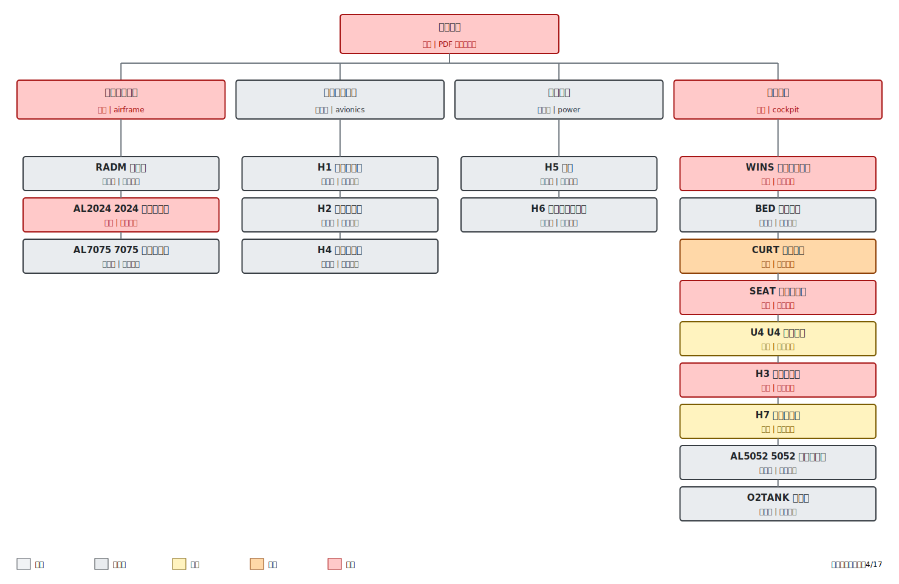

## 系统级传播结果

| 系统 | 等级 | 触发节点 | 采用的传播规则 |
|---|---:|---|---|
| 机体结构系统（`airframe`） | 重度 | AL2024 | 至少一个主要节点达到重度毁伤 |
| 航空电子系统（`avionics`） | 未毁伤 | 无 | 所有已知节点均未达到毁伤标准 |
| 电源系统（`power`） | 未毁伤 | 无 | 所有已知节点均未达到毁伤标准 |
| 座舱系统（`cockpit`） | 重度 | WINS, SEAT, H3 | 至少一个主要节点达到重度毁伤 |

## 完整设备毁伤评估

| 设备组 | 设备名称 | 毁伤树角色 | 等级 | 峰值温度（C） | 轻度证据 | 中度证据 | 重度证据 | 重度毁伤结论 | 物理解释 | 正外部热流探针数 | 有效温度探针数 |
|---|---|---|---:|---:|---|---|---|---|---|---:|---:|
| RADM | 雷达罩 | 机体结构系统：主要节点 | 未毁伤 | 574.0 | 150 C; 13.5/1200 s | 250 C; 4.5/600 s | 400 C; 1.5/180 s | 未达到：连续高于 400 C 的时间仅为 1.5/180 s | 瞬态光辐射或火灾使温度短暂超过重度阈值，但燃烧或热反馈未维持到规定时间。 | 10 | 10 |
| WINS | 有机玻璃舷窗 | 座舱系统：主要节点 | 重度 | 900.9 | 120 C; 736.5/60 s | 200 C; 736.5/45 s | 250 C; 736.5/8 s | 已达到：峰值 900.9 C；连续高于 250 C 的时间为 736.5/8 s | 直接外部热流和/或火灾加热同时提供了足够的温度和持续时间。 | 10 | 10 |
| BED | 尼龙床垫 | 座舱系统：主要节点 | 未毁伤 | 208.3 | 200 C; 0.0/60 s | 250 C; 0.0/90 s | 500 C; 0.0/5 s | 未达到：峰值 208.3 C < 500 C | 监测表面接收到正外部热流，但受脉冲能量、材料热惯性和散热影响，峰值仍低于重度毁伤阈值。 | 8 | 8 |
| CURT | 尼龙窗帘 | 座舱系统：主要节点 | 中度 | 628.8 | 200 C; 390.0/60 s | 250 C; 222.0/90 s | 500 C; 0.0/5 s | 未达到：连续高于 500 C 的时间仅为 0.0/5 s | 瞬态光辐射或火灾使温度短暂超过重度阈值，但燃烧或热反馈未维持到规定时间。 | 10 | 10 |
| U4 | U4 仪器设备 | 座舱系统：主要节点 | 轻度 | 195.7 | 120 C; 333.0/300 s | 250 C; 0.0/180 s | 400 C; 0.0/5 s | 未达到：峰值 195.7 C < 400 C | 监测表面未分配到正外部热流；几何遮挡后仅靠舱内二次火灾加热，温度低于重度毁伤阈值。 | 0 | 6 |
| SEAT | 聚氨酯座椅 | 座舱系统：主要节点 | 重度 | 2195.8 | 200 C; 736.5/60 s | 300 C; 736.5/90 s | 500 C; 736.5/5 s | 已达到：峰值 2195.8 C；连续高于 500 C 的时间为 736.5/5 s | 直接外部热流和/或火灾加热同时提供了足够的温度和持续时间。 | 4 | 10 |
| AL2024 | 2024 铝合金蒙皮 | 机体结构系统：主要节点 | 重度 | 473.1 | 120 C; 735.0/1200 s | 250 C; 726.0/600 s | 400 C; 667.5/180 s | 已达到：峰值 473.1 C；连续高于 400 C 的时间为 667.5/180 s | 直接外部热流和/或火灾加热同时提供了足够的温度和持续时间。 | 5 | 10 |
| AL5052 | 5052 铝合金风管 | 座舱系统：次要节点 | 未毁伤 | 332.1 | 120 C; 538.5/1200 s | 250 C; 361.5/600 s | 400 C; 0.0/180 s | 未达到：峰值 332.1 C < 400 C | 监测表面未分配到正外部热流；几何遮挡后仅靠舱内二次火灾加热，温度低于重度毁伤阈值。 | 0 | 10 |
| AL7075 | 7075 铝合金框架 | 机体结构系统：主要节点 | 未毁伤 | 156.8 | 120 C; 462.0/1200 s | 200 C; 0.0/600 s | 400 C; 0.0/180 s | 未达到：峰值 156.8 C < 400 C | 监测表面接收到正外部热流，但受脉冲能量、材料热惯性和散热影响，峰值仍低于重度毁伤阈值。 | 3 | 10 |
| O2TANK | 氧气瓶 | 座舱系统：次要节点 | 未毁伤 | 151.2 | 120 C; 285.0/1200 s | 200 C; 0.0/600 s | 400 C; 0.0/180 s | 未达到：峰值 151.2 C < 400 C | 监测表面接收到正外部热流，但受脉冲能量、材料热惯性和散热影响，峰值仍低于重度毁伤阈值。 | 6 | 8 |
| H1 | 导航子系统 | 航空电子系统：主要节点 | 未毁伤 | 136.9 | 120 C; 43.5/300 s | 250 C; 0.0/180 s | 400 C; 0.0/5 s | 未达到：峰值 136.9 C < 400 C | 监测表面接收到正外部热流，但受脉冲能量、材料热惯性和散热影响，峰值仍低于重度毁伤阈值。 | 5 | 6 |
| H2 | 任务子系统 | 航空电子系统：主要节点 | 未毁伤 | 137.0 | 120 C; 46.5/300 s | 250 C; 0.0/180 s | 400 C; 0.0/5 s | 未达到：峰值 137.0 C < 400 C | 监测表面接收到正外部热流，但受脉冲能量、材料热惯性和散热影响，峰值仍低于重度毁伤阈值。 | 8 | 8 |
| H3 | 显示子系统 | 座舱系统：主要节点 | 重度 | 542.5 | 120 C; 540.0/300 s | 250 C; 472.5/180 s | 400 C; 390.0/5 s | 已达到：峰值 542.5 C；连续高于 400 C 的时间为 390.0/5 s | 舱内二次火灾加热同时提供了足够的温度和持续时间。 | 0 | 14 |
| H4 | 通信子系统 | 航空电子系统：次要节点 | 未毁伤 | 135.1 | 120 C; 159.0/300 s | 250 C; 0.0/180 s | 400 C; 0.0/5 s | 未达到：峰值 135.1 C < 400 C | 监测表面接收到正外部热流，但受脉冲能量、材料热惯性和散热影响，峰值仍低于重度毁伤阈值。 | 4 | 10 |
| H5 | 电池 | 电源系统：主要节点 | 未毁伤 | 75.1 | 100 C; 0.0/60 s | 150 C; 0.0/600 s | 200 C; 0.0/180 s | 未达到：峰值 75.1 C < 200 C | 监测表面接收到正外部热流，但受脉冲能量、材料热惯性和散热影响，峰值仍低于重度毁伤阈值。 | 3 | 6 |
| H6 | 电力传输子系统 | 电源系统：主要节点 | 未毁伤 | 231.9 | 120 C; 649.5/1200 s | 200 C; 36.0/600 s | 400 C; 0.0/180 s | 未达到：峰值 231.9 C < 400 C | 监测表面未分配到正外部热流；几何遮挡后仅靠舱内二次火灾加热，温度低于重度毁伤阈值。 | 0 | 8 |
| H7 | 操纵子系统 | 座舱系统：主要节点 | 轻度 | 270.5 | 120 C; 720.0/300 s | 250 C; 10.5/180 s | 400 C; 0.0/5 s | 未达到：峰值 270.5 C < 400 C | 监测表面未分配到正外部热流；几何遮挡后仅靠舱内二次火灾加热，温度低于重度毁伤阈值。 | 0 | 3 |

## 评估结论与解释

- 未达到重度或证据未知的设备组：**RADM, BED, CURT, U4, AL5052, AL7075, O2TANK, H1, H2, H4, H5, H6, H7**。
- 重度毁伤未满足的原因统计：**11 项受峰值温度限制**，**2 项受持续时间限制**。
- 整机等级取各系统已知等级中的最高等级：**重度**。
- H2（任务子系统）和 H3（显示子系统）属于当前模型的专用映射，其通用电子设备阈值并非 PDF 中的同名条目。
- H1-H4 探针当前测量铝合金外壳表面温度，并将其作为内部电子器件温度的代理。

## 按毁伤树原则对本案例的详细解释

该案例当前属于实时快照（案例仍在运行），有效模拟时间为 738.0 s。它可以反映已经形成的温度峰值和累计持续时间，但不能替代正常完成结果；所有临界设备仍需在完整结果中复核。
该案例标称入射面光冲量为 100 J/cm2，模型表面的最大局部积分光冲量为 97.145 J/cm2，约为标称值的 97.1%。因此设备实际受照还受到入射角、表面朝向与几何遮挡影响，不能把标称 Q 直接等同于每个设备表面接收的光冲量。
按照设备级温度与持续时间判据，当前达到重度毁伤的设备组共有 4 个：WINS, SEAT, AL2024, H3。这些设备不仅达到重度温度阈值，而且最长连续超阈时间也满足规定时长，因此其重度结论具有完整的温度和时间证据。
峰值温度受限设备包括：BED（峰值 208.3 C，阈值 500 C）、U4（峰值 195.7 C，阈值 400 C）、AL5052（峰值 332.1 C，阈值 400 C）、AL7075（峰值 156.8 C，阈值 400 C）、O2TANK（峰值 151.2 C，阈值 400 C）、H1（峰值 136.9 C，阈值 400 C）、H2（峰值 137.0 C，阈值 400 C）、H4（峰值 135.1 C，阈值 400 C）、H5（峰值 75.1 C，阈值 200 C）、H6（峰值 231.9 C，阈值 400 C）、H7（峰值 270.5 C，阈值 400 C）。这些对象尚未进入重度判据温度区间，继续延长模拟时间并不会自动补足峰值条件；需要结合直接受照、遮挡和二次火灾强度判断其原因。
持续时间受限设备包括：RADM（1.5/180 s，高于 400 C）、CURT（0.0/5 s，高于 500 C）。这些对象已经出现足够高的瞬态峰值，但热解、燃烧或邻近火灾反馈没有把温度维持到标准要求，因此不能仅凭最高温度判为重度毁伤。
U4, AL5052, H6, H7 的有效监测面没有记录到正外部热流，它们主要依靠舱内二次火灾加热。若这些设备未达到重度，优先应检查 DDA 可见性、设备实际朝向、邻近可燃物燃烧持续性及探针是否覆盖热点，而不是直接降低材料强度或毁伤标准。
系统级传播结果为：机体结构系统为重度，触发节点为AL2024；航空电子系统为未毁伤，触发节点为无明确触发节点；电源系统为未毁伤，触发节点为无明确触发节点；座舱系统为重度，触发节点为WINS、SEAT、H3。系统等级由主要节点和次要节点按既定规则传播，不是按系统内所有设备温度求平均。
最终 PDF 毁伤树整机等级为重度，而严格全设备结果为 4/17。前者说明至少一个关键系统已达到相应任务毁伤等级；后者说明距离“所有材料和设备均重度毁伤”的研究目标仍有 13 个设备组未满足。两者必须同时保留，不能用整机重度替代 17/17。
因此，本案例是否能够作为全毁伤阈值的成功点，只取决于严格结果是否达到 17/17，并且案例是否正常完成。未达到 17/17 时，应根据上面的峰值受限、持续时间受限和遮挡分类确定下一步物理参数研究方向。

---

## 完整毁伤树评估：Q0100_W0100_az270_el15_H1H7_v5_Qnorm_adapt_HRRnominal_thickness_audit_v1

- 模拟时间：**1222.50 s**
- 来源目录：`cases_adaptive/Q0100_W0100_az270_el15_H1H7_v5_Qnorm_adapt_HRRnominal_thickness_audit_v1`
- 方案分类：**自适应敏感性方案（单独比较）**
- 评估状态：**实时快照（案例仍在运行）**
- PDF 毁伤树整机等级：**重度**
- 严格全设备重度毁伤结果：**5/17** （全部重度毁伤=否）
- 最高温度定义：几何位置有效的冗余壁面温度探针动态包络最大值。
- 注意：严格的 17/17 指标不等同于 PDF 毁伤树的整机等级判据。

## 案例配置

| 参数 | 数值 |
|---|---|
| 方案用途 | nominal_HRRPUA_with_audited_thickness |
| 来源案例 | Q0100_W0100_az270_el15_H1H7_v5_Qnorm_adapt_HRRupper_thickness_audit |
| 修改因素 | HRRPUA_upper_to_nominal_only |
| 光冲量 Q（J/cm2） | 100 |
| 核爆当量（kt） | 100 |
| 方位角（度） | 270 |
| 俯仰角（度） | 15 |
| 目标模拟时长（s） | 1500 |
| MPI 进程数 | 32 |
| BURN_AWAY | 否 |
| 辐射份额 | 0.4 |
| 最大 CFL | 未记录 |
| 指定时间步长（s） | 未记录 |
| 核辐射脉冲积分（s） | 0.660398 |
| 入射面峰值辐照度（kW/m2） | 1514.24 |
| 最大局部外部热流（kW/m2） | 1471 |
| 最大局部积分光冲量（J/cm2） | 97.1446 |
| 各材料 HRRPUA（kW/m2） | {"BED": 790.0, "CURT": 324.0, "H6": 259.0, "H7": 458.0, "RADM": 840.0, "SEAT": 860.0, "U4": 840.0, "WINS": 806.0} |
| FDS 中全部 HRRPUA（kW/m2） | [75.0, 100.0, 180.0, 200.0, 250.0] |
| 审查后的材料厚度（m） | {"BED": 0.00089, "CURT": 0.003, "RADM": 0.1, "U4": 0.006, "WINS": 0.025} |
| FDS 中全部材料层厚度（m） | [0.00089, 0.001, 0.0015, 0.002, 0.003, 0.005, 0.006, 0.025, 0.1, 0.15] |
| 几何是否修改 | 否 |
| 材料是否修改 | 否 |
| 燃烧参数是否修改 | 否 |
| 外部热流是否修改 | 否 |
| 点燃温度是否修改 | 否 |
| 毁伤阈值是否修改 | 否 |
| FDS 输入文件 | Q0100_W0100_az270_el15_H1H7_v5_Qnorm_adapt_HRRnominal_thickness_audit_v1.fds |

## 已知问题与结果有效性

- 该结果是 1222.5 s 的长时快照，缺少 FDS 正常结束标记；在达到 T_END 前，温度和毁伤等级仍可能变化。
- H1-H4 目前以铝合金外壳壁面温度代理内部电子器件温度。

## 毁伤树

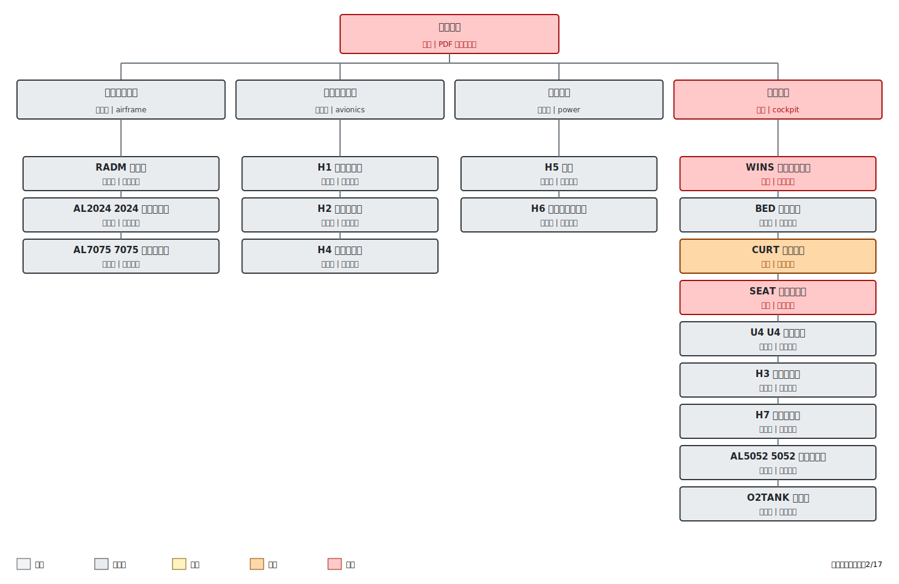

## 系统级传播结果

| 系统 | 等级 | 触发节点 | 采用的传播规则 |
|---|---:|---|---|
| 机体结构系统（`airframe`） | 重度 | AL2024 | 至少一个主要节点达到重度毁伤 |
| 航空电子系统（`avionics`） | 轻度 | H4 | 至少一个已知节点达到轻度，且未触发更高等级 |
| 电源系统（`power`） | 未毁伤 | 无 | 所有已知节点均未达到毁伤标准 |
| 座舱系统（`cockpit`） | 重度 | WINS, SEAT, H3 | 至少一个主要节点达到重度毁伤 |

## 完整设备毁伤评估

| 设备组 | 设备名称 | 毁伤树角色 | 等级 | 峰值温度（C） | 轻度证据 | 中度证据 | 重度证据 | 重度毁伤结论 | 物理解释 | 正外部热流探针数 | 有效温度探针数 |
|---|---|---|---:|---:|---|---|---|---|---|---:|---:|
| RADM | 雷达罩 | 机体结构系统：主要节点 | 未毁伤 | 567.4 | 150 C; 13.5/1200 s | 250 C; 4.5/600 s | 400 C; 1.5/180 s | 未达到：连续高于 400 C 的时间仅为 1.5/180 s | 瞬态光辐射或火灾使温度短暂超过重度阈值，但燃烧或热反馈未维持到规定时间。 | 10 | 10 |
| WINS | 有机玻璃舷窗 | 座舱系统：主要节点 | 重度 | 870.3 | 120 C; 1221.0/60 s | 200 C; 1221.0/45 s | 250 C; 1221.0/8 s | 已达到：峰值 870.3 C；连续高于 250 C 的时间为 1221.0/8 s | 直接外部热流和/或火灾加热同时提供了足够的温度和持续时间。 | 10 | 10 |
| BED | 尼龙床垫 | 座舱系统：主要节点 | 轻度 | 256.4 | 200 C; 169.5/60 s | 250 C; 6.0/90 s | 500 C; 0.0/5 s | 未达到：峰值 256.4 C < 500 C | 监测表面接收到正外部热流，但受脉冲能量、材料热惯性和散热影响，峰值仍低于重度毁伤阈值。 | 8 | 8 |
| CURT | 尼龙窗帘 | 座舱系统：主要节点 | 中度 | 626.4 | 200 C; 1221.0/60 s | 250 C; 1194.0/90 s | 500 C; 0.0/5 s | 未达到：连续高于 500 C 的时间仅为 0.0/5 s | 瞬态光辐射或火灾使温度短暂超过重度阈值，但燃烧或热反馈未维持到规定时间。 | 10 | 10 |
| U4 | U4 仪器设备 | 座舱系统：主要节点 | 中度 | 349.3 | 120 C; 912.0/300 s | 250 C; 513.0/180 s | 400 C; 0.0/5 s | 未达到：峰值 349.3 C < 400 C | 监测表面未分配到正外部热流；几何遮挡后仅靠舱内二次火灾加热，温度低于重度毁伤阈值。 | 0 | 6 |
| SEAT | 聚氨酯座椅 | 座舱系统：主要节点 | 重度 | 2628.5 | 200 C; 1221.0/60 s | 300 C; 1221.0/90 s | 500 C; 1221.0/5 s | 已达到：峰值 2628.5 C；连续高于 500 C 的时间为 1221.0/5 s | 直接外部热流和/或火灾加热同时提供了足够的温度和持续时间。 | 4 | 10 |
| AL2024 | 2024 铝合金蒙皮 | 机体结构系统：主要节点 | 重度 | 489.3 | 120 C; 1219.5/1200 s | 250 C; 1212.0/600 s | 400 C; 1143.0/180 s | 已达到：峰值 489.3 C；连续高于 400 C 的时间为 1143.0/180 s | 直接外部热流和/或火灾加热同时提供了足够的温度和持续时间。 | 5 | 10 |
| AL5052 | 5052 铝合金风管 | 座舱系统：次要节点 | 重度 | 435.0 | 120 C; 1059.0/1200 s | 250 C; 922.5/600 s | 400 C; 325.5/180 s | 已达到：峰值 435.0 C；连续高于 400 C 的时间为 325.5/180 s | 舱内二次火灾加热同时提供了足够的温度和持续时间。 | 0 | 10 |
| AL7075 | 7075 铝合金框架 | 机体结构系统：主要节点 | 未毁伤 | 231.7 | 120 C; 909.0/1200 s | 200 C; 234.0/600 s | 400 C; 0.0/180 s | 未达到：峰值 231.7 C < 400 C | 监测表面接收到正外部热流，但受脉冲能量、材料热惯性和散热影响，峰值仍低于重度毁伤阈值。 | 3 | 10 |
| O2TANK | 氧气瓶 | 座舱系统：次要节点 | 未毁伤 | 266.1 | 120 C; 859.5/1200 s | 200 C; 390.0/600 s | 400 C; 0.0/180 s | 未达到：峰值 266.1 C < 400 C | 监测表面接收到正外部热流，但受脉冲能量、材料热惯性和散热影响，峰值仍低于重度毁伤阈值。 | 6 | 8 |
| H1 | 导航子系统 | 航空电子系统：主要节点 | 未毁伤 | 136.9 | 120 C; 43.5/300 s | 250 C; 0.0/180 s | 400 C; 0.0/5 s | 未达到：峰值 136.9 C < 400 C | 监测表面接收到正外部热流，但受脉冲能量、材料热惯性和散热影响，峰值仍低于重度毁伤阈值。 | 5 | 6 |
| H2 | 任务子系统 | 航空电子系统：主要节点 | 未毁伤 | 137.1 | 120 C; 46.5/300 s | 250 C; 0.0/180 s | 400 C; 0.0/5 s | 未达到：峰值 137.1 C < 400 C | 监测表面接收到正外部热流，但受脉冲能量、材料热惯性和散热影响，峰值仍低于重度毁伤阈值。 | 8 | 8 |
| H3 | 显示子系统 | 座舱系统：主要节点 | 重度 | 629.5 | 120 C; 1054.5/300 s | 250 C; 994.5/180 s | 400 C; 925.5/5 s | 已达到：峰值 629.5 C；连续高于 400 C 的时间为 925.5/5 s | 舱内二次火灾加热同时提供了足够的温度和持续时间。 | 0 | 14 |
| H4 | 通信子系统 | 航空电子系统：次要节点 | 轻度 | 230.6 | 120 C; 925.5/300 s | 250 C; 0.0/180 s | 400 C; 0.0/5 s | 未达到：峰值 230.6 C < 400 C | 监测表面接收到正外部热流，但受脉冲能量、材料热惯性和散热影响，峰值仍低于重度毁伤阈值。 | 4 | 10 |
| H5 | 电池 | 电源系统：主要节点 | 未毁伤 | 78.6 | 100 C; 0.0/60 s | 150 C; 0.0/600 s | 200 C; 0.0/180 s | 未达到：峰值 78.6 C < 200 C | 监测表面接收到正外部热流，但受脉冲能量、材料热惯性和散热影响，峰值仍低于重度毁伤阈值。 | 3 | 6 |
| H6 | 电力传输子系统 | 电源系统：主要节点 | 未毁伤 | 237.0 | 120 C; 496.5/1200 s | 200 C; 37.5/600 s | 400 C; 0.0/180 s | 未达到：峰值 237.0 C < 400 C | 监测表面未分配到正外部热流；几何遮挡后仅靠舱内二次火灾加热，温度低于重度毁伤阈值。 | 0 | 8 |
| H7 | 操纵子系统 | 座舱系统：主要节点 | 中度 | 317.0 | 120 C; 1203.0/300 s | 250 C; 384.0/180 s | 400 C; 0.0/5 s | 未达到：峰值 317.0 C < 400 C | 监测表面未分配到正外部热流；几何遮挡后仅靠舱内二次火灾加热，温度低于重度毁伤阈值。 | 0 | 3 |

## 评估结论与解释

- 未达到重度或证据未知的设备组：**RADM, BED, CURT, U4, AL7075, O2TANK, H1, H2, H4, H5, H6, H7**。
- 重度毁伤未满足的原因统计：**10 项受峰值温度限制**，**2 项受持续时间限制**。
- 整机等级取各系统已知等级中的最高等级：**重度**。
- H2（任务子系统）和 H3（显示子系统）属于当前模型的专用映射，其通用电子设备阈值并非 PDF 中的同名条目。
- H1-H4 探针当前测量铝合金外壳表面温度，并将其作为内部电子器件温度的代理。

## 按毁伤树原则对本案例的详细解释

该案例当前属于实时快照（案例仍在运行），有效模拟时间为 1222.5 s。它可以反映已经形成的温度峰值和累计持续时间，但不能替代正常完成结果；所有临界设备仍需在完整结果中复核。
该案例标称入射面光冲量为 100 J/cm2，模型表面的最大局部积分光冲量为 97.145 J/cm2，约为标称值的 97.1%。因此设备实际受照还受到入射角、表面朝向与几何遮挡影响，不能把标称 Q 直接等同于每个设备表面接收的光冲量。
按照设备级温度与持续时间判据，当前达到重度毁伤的设备组共有 5 个：WINS, SEAT, AL2024, AL5052, H3。这些设备不仅达到重度温度阈值，而且最长连续超阈时间也满足规定时长，因此其重度结论具有完整的温度和时间证据。
峰值温度受限设备包括：BED（峰值 256.4 C，阈值 500 C）、U4（峰值 349.3 C，阈值 400 C）、AL7075（峰值 231.7 C，阈值 400 C）、O2TANK（峰值 266.1 C，阈值 400 C）、H1（峰值 136.9 C，阈值 400 C）、H2（峰值 137.1 C，阈值 400 C）、H4（峰值 230.6 C，阈值 400 C）、H5（峰值 78.6 C，阈值 200 C）、H6（峰值 237.0 C，阈值 400 C）、H7（峰值 317.0 C，阈值 400 C）。这些对象尚未进入重度判据温度区间，继续延长模拟时间并不会自动补足峰值条件；需要结合直接受照、遮挡和二次火灾强度判断其原因。
持续时间受限设备包括：RADM（1.5/180 s，高于 400 C）、CURT（0.0/5 s，高于 500 C）。这些对象已经出现足够高的瞬态峰值，但热解、燃烧或邻近火灾反馈没有把温度维持到标准要求，因此不能仅凭最高温度判为重度毁伤。
U4, H6, H7 的有效监测面没有记录到正外部热流，它们主要依靠舱内二次火灾加热。若这些设备未达到重度，优先应检查 DDA 可见性、设备实际朝向、邻近可燃物燃烧持续性及探针是否覆盖热点，而不是直接降低材料强度或毁伤标准。
系统级传播结果为：机体结构系统为重度，触发节点为AL2024；航空电子系统为轻度，触发节点为H4；电源系统为未毁伤，触发节点为无明确触发节点；座舱系统为重度，触发节点为WINS、SEAT、H3。系统等级由主要节点和次要节点按既定规则传播，不是按系统内所有设备温度求平均。
最终 PDF 毁伤树整机等级为重度，而严格全设备结果为 5/17。前者说明至少一个关键系统已达到相应任务毁伤等级；后者说明距离“所有材料和设备均重度毁伤”的研究目标仍有 12 个设备组未满足。两者必须同时保留，不能用整机重度替代 17/17。
因此，本案例是否能够作为全毁伤阈值的成功点，只取决于严格结果是否达到 17/17，并且案例是否正常完成。未达到 17/17 时，应根据上面的峰值受限、持续时间受限和遮挡分类确定下一步物理参数研究方向。

---

## 完整毁伤树评估：Q0100_W0100_az270_el15_H1H7_v5_Qnorm_adapt_thickness_audit

- 模拟时间：**69.00 s**
- 来源目录：`cases_adaptive/Q0100_W0100_az270_el15_H1H7_v5_Qnorm_adapt_thickness_audit`
- 方案分类：**自适应敏感性方案（单独比较）**
- 评估状态：**实时快照（案例仍在运行）**
- PDF 毁伤树整机等级：**重度**
- 严格全设备重度毁伤结果：**2/17** （全部重度毁伤=否）
- 最高温度定义：几何位置有效的冗余壁面温度探针动态包络最大值。
- 注意：严格的 17/17 指标不等同于 PDF 毁伤树的整机等级判据。

## 案例配置

| 参数 | 数值 |
|---|---|
| 方案用途 | surface_layer_thickness_audit_campaign |
| 来源案例 | Q0100_W0100_az270_el15_H1H7_v5_Qnorm |
| 修改因素 | surface_layer_thickness_only |
| 光冲量 Q（J/cm2） | 100 |
| 核爆当量（kt） | 100 |
| 方位角（度） | 270 |
| 俯仰角（度） | 15 |
| 目标模拟时长（s） | 1500 |
| MPI 进程数 | 20 |
| BURN_AWAY | 否 |
| 辐射份额 | 0.4 |
| 最大 CFL | 未记录 |
| 指定时间步长（s） | 未记录 |
| 核辐射脉冲积分（s） | 0.660398 |
| 入射面峰值辐照度（kW/m2） | 1514.24 |
| 最大局部外部热流（kW/m2） | 1471 |
| 最大局部积分光冲量（J/cm2） | 97.1446 |
| 各材料 HRRPUA（kW/m2） | 未记录 |
| FDS 中全部 HRRPUA（kW/m2） | [75.0, 100.0, 180.0, 200.0, 250.0] |
| 审查后的材料厚度（m） | {"BED": 0.00089, "CURT": 0.003, "RADM": 0.1, "U4": 0.006, "WINS": 0.025} |
| FDS 中全部材料层厚度（m） | [0.00089, 0.001, 0.0015, 0.002, 0.003, 0.005, 0.006, 0.025, 0.1, 0.15] |
| 几何是否修改 | 否 |
| 材料是否修改 | 否 |
| 燃烧参数是否修改 | 否 |
| 外部热流是否修改 | 否 |
| 点燃温度是否修改 | 否 |
| 毁伤阈值是否修改 | 否 |
| FDS 输入文件 | Q0100_W0100_az270_el15_H1H7_v5_Qnorm_adapt_thickness_audit.fds |

## 已知问题与结果有效性

- 该结果是 69.0 s 的长时快照，缺少 FDS 正常结束标记；在达到 T_END 前，温度和毁伤等级仍可能变化。
- H1-H4 目前以铝合金外壳壁面温度代理内部电子器件温度。

## 毁伤树

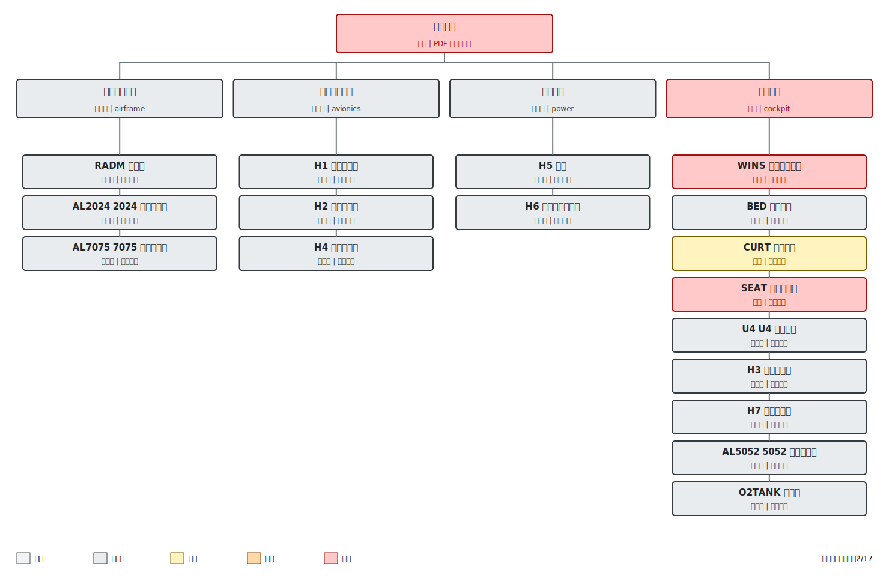

## 系统级传播结果

| 系统 | 等级 | 触发节点 | 采用的传播规则 |
|---|---:|---|---|
| 机体结构系统（`airframe`） | 未毁伤 | 无 | 所有已知节点均未达到毁伤标准 |
| 航空电子系统（`avionics`） | 未毁伤 | 无 | 所有已知节点均未达到毁伤标准 |
| 电源系统（`power`） | 未毁伤 | 无 | 所有已知节点均未达到毁伤标准 |
| 座舱系统（`cockpit`） | 重度 | WINS, SEAT | 至少一个主要节点达到重度毁伤 |

## 完整设备毁伤评估

| 设备组 | 设备名称 | 毁伤树角色 | 等级 | 峰值温度（C） | 轻度证据 | 中度证据 | 重度证据 | 重度毁伤结论 | 物理解释 | 正外部热流探针数 | 有效温度探针数 |
|---|---|---|---:|---:|---|---|---|---|---|---:|---:|
| RADM | 雷达罩 | 机体结构系统：主要节点 | 未毁伤 | 567.5 | 150 C; 13.5/1200 s | 250 C; 4.5/600 s | 400 C; 1.5/180 s | 未达到：连续高于 400 C 的时间仅为 1.5/180 s | 瞬态光辐射或火灾使温度短暂超过重度阈值，但燃烧或热反馈未维持到规定时间。 | 10 | 10 |
| WINS | 有机玻璃舷窗 | 座舱系统：主要节点 | 重度 | 799.3 | 120 C; 67.5/60 s | 200 C; 67.5/45 s | 250 C; 67.5/8 s | 已达到：峰值 799.3 C；连续高于 250 C 的时间为 67.5/8 s | 直接外部热流和/或火灾加热同时提供了足够的温度和持续时间。 | 10 | 10 |
| BED | 尼龙床垫 | 座舱系统：主要节点 | 未毁伤 | 264.3 | 200 C; 37.5/60 s | 250 C; 9.0/90 s | 500 C; 0.0/5 s | 未达到：峰值 264.3 C < 500 C | 监测表面接收到正外部热流，但受脉冲能量、材料热惯性和散热影响，峰值仍低于重度毁伤阈值。 | 8 | 8 |
| CURT | 尼龙窗帘 | 座舱系统：主要节点 | 轻度 | 626.5 | 200 C; 67.5/60 s | 250 C; 39.0/90 s | 500 C; 0.0/5 s | 未达到：连续高于 500 C 的时间仅为 0.0/5 s | 瞬态光辐射或火灾使温度短暂超过重度阈值，但燃烧或热反馈未维持到规定时间。 | 10 | 10 |
| U4 | U4 仪器设备 | 座舱系统：主要节点 | 未毁伤 | 82.5 | 120 C; 0.0/300 s | 250 C; 0.0/180 s | 400 C; 0.0/5 s | 未达到：峰值 82.5 C < 400 C | 监测表面未分配到正外部热流；几何遮挡后仅靠舱内二次火灾加热，温度低于重度毁伤阈值。 | 0 | 6 |
| SEAT | 聚氨酯座椅 | 座舱系统：主要节点 | 重度 | 1363.9 | 200 C; 67.5/60 s | 300 C; 67.5/90 s | 500 C; 67.5/5 s | 已达到：峰值 1363.9 C；连续高于 500 C 的时间为 67.5/5 s | 直接外部热流和/或火灾加热同时提供了足够的温度和持续时间。 | 4 | 10 |
| AL2024 | 2024 铝合金蒙皮 | 机体结构系统：主要节点 | 未毁伤 | 405.9 | 120 C; 66.0/1200 s | 250 C; 58.5/600 s | 400 C; 0.0/180 s | 未达到：连续高于 400 C 的时间仅为 0.0/180 s | 瞬态光辐射或火灾使温度短暂超过重度阈值，但燃烧或热反馈未维持到规定时间。 | 5 | 10 |
| AL5052 | 5052 铝合金风管 | 座舱系统：次要节点 | 未毁伤 | 42.6 | 120 C; 0.0/1200 s | 250 C; 0.0/600 s | 400 C; 0.0/180 s | 未达到：峰值 42.6 C < 400 C | 监测表面未分配到正外部热流；几何遮挡后仅靠舱内二次火灾加热，温度低于重度毁伤阈值。 | 0 | 10 |
| AL7075 | 7075 铝合金框架 | 机体结构系统：主要节点 | 未毁伤 | 125.1 | 120 C; 18.0/1200 s | 200 C; 0.0/600 s | 400 C; 0.0/180 s | 未达到：峰值 125.1 C < 400 C | 监测表面接收到正外部热流，但受脉冲能量、材料热惯性和散热影响，峰值仍低于重度毁伤阈值。 | 3 | 10 |
| O2TANK | 氧气瓶 | 座舱系统：次要节点 | 未毁伤 | 85.0 | 120 C; 0.0/1200 s | 200 C; 0.0/600 s | 400 C; 0.0/180 s | 未达到：峰值 85.0 C < 400 C | 监测表面接收到正外部热流，但受脉冲能量、材料热惯性和散热影响，峰值仍低于重度毁伤阈值。 | 6 | 8 |
| H1 | 导航子系统 | 航空电子系统：主要节点 | 未毁伤 | 136.9 | 120 C; 43.5/300 s | 250 C; 0.0/180 s | 400 C; 0.0/5 s | 未达到：峰值 136.9 C < 400 C | 监测表面接收到正外部热流，但受脉冲能量、材料热惯性和散热影响，峰值仍低于重度毁伤阈值。 | 5 | 6 |
| H2 | 任务子系统 | 航空电子系统：主要节点 | 未毁伤 | 137.0 | 120 C; 46.5/300 s | 250 C; 0.0/180 s | 400 C; 0.0/5 s | 未达到：峰值 137.0 C < 400 C | 监测表面接收到正外部热流，但受脉冲能量、材料热惯性和散热影响，峰值仍低于重度毁伤阈值。 | 8 | 8 |
| H3 | 显示子系统 | 座舱系统：主要节点 | 未毁伤 | 65.8 | 120 C; 0.0/300 s | 250 C; 0.0/180 s | 400 C; 0.0/5 s | 未达到：峰值 65.8 C < 400 C | 监测表面未分配到正外部热流；几何遮挡后仅靠舱内二次火灾加热，温度低于重度毁伤阈值。 | 0 | 14 |
| H4 | 通信子系统 | 航空电子系统：次要节点 | 未毁伤 | 108.2 | 120 C; 0.0/300 s | 250 C; 0.0/180 s | 400 C; 0.0/5 s | 未达到：峰值 108.2 C < 400 C | 监测表面接收到正外部热流，但受脉冲能量、材料热惯性和散热影响，峰值仍低于重度毁伤阈值。 | 4 | 10 |
| H5 | 电池 | 电源系统：主要节点 | 未毁伤 | 20.9 | 100 C; 0.0/60 s | 150 C; 0.0/600 s | 200 C; 0.0/180 s | 未达到：峰值 20.9 C < 200 C | 监测表面接收到正外部热流，但受脉冲能量、材料热惯性和散热影响，峰值仍低于重度毁伤阈值。 | 3 | 6 |
| H6 | 电力传输子系统 | 电源系统：主要节点 | 未毁伤 | 62.4 | 120 C; 0.0/1200 s | 200 C; 0.0/600 s | 400 C; 0.0/180 s | 未达到：峰值 62.4 C < 400 C | 监测表面未分配到正外部热流；几何遮挡后仅靠舱内二次火灾加热，温度低于重度毁伤阈值。 | 0 | 8 |
| H7 | 操纵子系统 | 座舱系统：主要节点 | 未毁伤 | 313.7 | 120 C; 51.0/300 s | 250 C; 25.5/180 s | 400 C; 0.0/5 s | 未达到：峰值 313.7 C < 400 C | 监测表面未分配到正外部热流；几何遮挡后仅靠舱内二次火灾加热，温度低于重度毁伤阈值。 | 0 | 3 |

## 评估结论与解释

- 未达到重度或证据未知的设备组：**RADM, BED, CURT, U4, AL2024, AL5052, AL7075, O2TANK, H1, H2, H3, H4, H5, H6, H7**。
- 重度毁伤未满足的原因统计：**12 项受峰值温度限制**，**3 项受持续时间限制**。
- 整机等级取各系统已知等级中的最高等级：**重度**。
- H2（任务子系统）和 H3（显示子系统）属于当前模型的专用映射，其通用电子设备阈值并非 PDF 中的同名条目。
- H1-H4 探针当前测量铝合金外壳表面温度，并将其作为内部电子器件温度的代理。

## 按毁伤树原则对本案例的详细解释

该案例当前属于实时快照（案例仍在运行），有效模拟时间为 69.0 s。它可以反映已经形成的温度峰值和累计持续时间，但不能替代正常完成结果；所有临界设备仍需在完整结果中复核。
该案例标称入射面光冲量为 100 J/cm2，模型表面的最大局部积分光冲量为 97.145 J/cm2，约为标称值的 97.1%。因此设备实际受照还受到入射角、表面朝向与几何遮挡影响，不能把标称 Q 直接等同于每个设备表面接收的光冲量。
按照设备级温度与持续时间判据，当前达到重度毁伤的设备组共有 2 个：WINS, SEAT。这些设备不仅达到重度温度阈值，而且最长连续超阈时间也满足规定时长，因此其重度结论具有完整的温度和时间证据。
峰值温度受限设备包括：BED（峰值 264.3 C，阈值 500 C）、U4（峰值 82.5 C，阈值 400 C）、AL5052（峰值 42.6 C，阈值 400 C）、AL7075（峰值 125.1 C，阈值 400 C）、O2TANK（峰值 85.0 C，阈值 400 C）、H1（峰值 136.9 C，阈值 400 C）、H2（峰值 137.0 C，阈值 400 C）、H3（峰值 65.8 C，阈值 400 C）、H4（峰值 108.2 C，阈值 400 C）、H5（峰值 20.9 C，阈值 200 C）、H6（峰值 62.4 C，阈值 400 C）、H7（峰值 313.7 C，阈值 400 C）。这些对象尚未进入重度判据温度区间，继续延长模拟时间并不会自动补足峰值条件；需要结合直接受照、遮挡和二次火灾强度判断其原因。
持续时间受限设备包括：RADM（1.5/180 s，高于 400 C）、CURT（0.0/5 s，高于 500 C）、AL2024（0.0/180 s，高于 400 C）。这些对象已经出现足够高的瞬态峰值，但热解、燃烧或邻近火灾反馈没有把温度维持到标准要求，因此不能仅凭最高温度判为重度毁伤。
U4, AL5052, H3, H6, H7 的有效监测面没有记录到正外部热流，它们主要依靠舱内二次火灾加热。若这些设备未达到重度，优先应检查 DDA 可见性、设备实际朝向、邻近可燃物燃烧持续性及探针是否覆盖热点，而不是直接降低材料强度或毁伤标准。
系统级传播结果为：机体结构系统为未毁伤，触发节点为无明确触发节点；航空电子系统为未毁伤，触发节点为无明确触发节点；电源系统为未毁伤，触发节点为无明确触发节点；座舱系统为重度，触发节点为WINS、SEAT。系统等级由主要节点和次要节点按既定规则传播，不是按系统内所有设备温度求平均。
最终 PDF 毁伤树整机等级为重度，而严格全设备结果为 2/17。前者说明至少一个关键系统已达到相应任务毁伤等级；后者说明距离“所有材料和设备均重度毁伤”的研究目标仍有 15 个设备组未满足。两者必须同时保留，不能用整机重度替代 17/17。
因此，本案例是否能够作为全毁伤阈值的成功点，只取决于严格结果是否达到 17/17，并且案例是否正常完成。未达到 17/17 时，应根据上面的峰值受限、持续时间受限和遮挡分类确定下一步物理参数研究方向。

---

## 完整毁伤树评估：Q0200_W0100_az060_el75_H1H7_v5_Qnorm_adapt_HRRupper_thickness_audit_angle

- 模拟时间：**1500.00 s**
- 来源目录：`cases_adaptive/Q0200_W0100_az060_el75_H1H7_v5_Qnorm_adapt_HRRupper_thickness_audit_angle`
- 方案分类：**自适应敏感性方案（单独比较）**
- 评估状态：**正常完成**
- PDF 毁伤树整机等级：**重度**
- 严格全设备重度毁伤结果：**14/17** （全部重度毁伤=否）
- 最高温度定义：几何位置有效的冗余壁面温度探针动态包络最大值。
- 注意：严格的 17/17 指标不等同于 PDF 毁伤树的整机等级判据。

## 案例配置

| 参数 | 数值 |
|---|---|
| 方案用途 | fixed_Q_incident_angle_sensitivity |
| 来源案例 | Q0200_W0100_az270_el15_H1H7_v5_Qnorm_adapt_HRRupper_thickness_audit |
| 修改因素 | incident_angle_only |
| 光冲量 Q（J/cm2） | 200 |
| 核爆当量（kt） | 100 |
| 方位角（度） | 60 |
| 俯仰角（度） | 75 |
| 目标模拟时长（s） | 1500 |
| MPI 进程数 | 32 |
| BURN_AWAY | 否 |
| 辐射份额 | 0.4 |
| 最大 CFL | 未记录 |
| 指定时间步长（s） | 未记录 |
| 核辐射脉冲积分（s） | 0.660398 |
| 入射面峰值辐照度（kW/m2） | 3028.48 |
| 最大局部外部热流（kW/m2） | 2941 |
| 最大局部积分光冲量（J/cm2） | 194.223 |
| 各材料 HRRPUA（kW/m2） | {"BED": 790.0, "CURT": 324.0, "H6": 259.0, "H7": 458.0, "RADM": 840.0, "SEAT": 860.0, "U4": 840.0, "WINS": 806.0} |
| FDS 中全部 HRRPUA（kW/m2） | [259.0, 324.0, 458.0, 790.0, 806.0, 840.0, 860.0] |
| 审查后的材料厚度（m） | {"BED": 0.00089, "CURT": 0.003, "RADM": 0.1, "U4": 0.006, "WINS": 0.025} |
| FDS 中全部材料层厚度（m） | [0.00089, 0.001, 0.0015, 0.002, 0.003, 0.005, 0.006, 0.025, 0.1, 0.15] |
| 几何是否修改 | 否 |
| 材料是否修改 | 否 |
| 燃烧参数是否修改 | 否 |
| 外部热流是否修改 | 否 |
| 点燃温度是否修改 | 否 |
| 毁伤阈值是否修改 | 否 |
| FDS 输入文件 | Q0200_W0100_az060_el75_H1H7_v5_Qnorm_adapt_HRRupper_thickness_audit_angle.fds |

## 已知问题与结果有效性

- H1-H4 目前以铝合金外壳壁面温度代理内部电子器件温度。

## 毁伤树

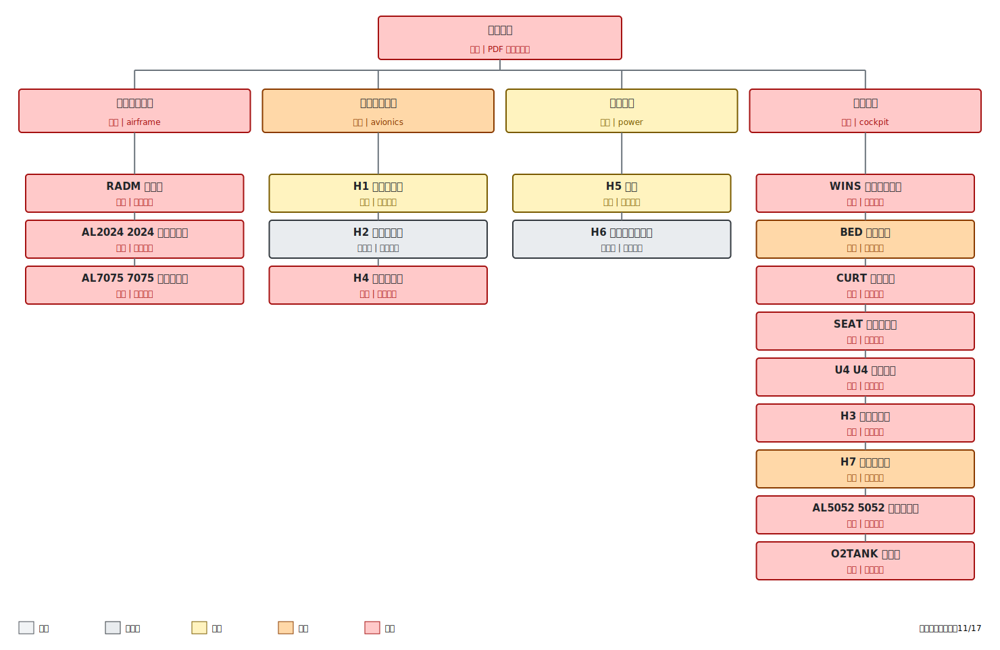

## 系统级传播结果

| 系统 | 等级 | 触发节点 | 采用的传播规则 |
|---|---:|---|---|
| 机体结构系统（`airframe`） | 重度 | RADM, AL2024, AL7075 | 至少一个主要节点达到重度毁伤 |
| 航空电子系统（`avionics`） | 中度 | H1, H4 | 主要节点达到中度，或次要节点达到重度毁伤 |
| 电源系统（`power`） | 重度 | H5, H6 | 至少一个主要节点达到重度毁伤 |
| 座舱系统（`cockpit`） | 重度 | WINS, CURT, SEAT, U4, H3, H7 | 至少一个主要节点达到重度毁伤 |

## 完整设备毁伤评估

| 设备组 | 设备名称 | 毁伤树角色 | 等级 | 峰值温度（C） | 轻度证据 | 中度证据 | 重度证据 | 重度毁伤结论 | 物理解释 | 正外部热流探针数 | 有效温度探针数 |
|---|---|---|---:|---:|---|---|---|---|---|---:|---:|
| RADM | 雷达罩 | 机体结构系统：主要节点 | 重度 | 970.6 | 150 C; 1497.0/1200 s | 250 C; 1483.5/600 s | 400 C; 1476.0/180 s | 已达到：峰值 970.6 C；连续高于 400 C 的时间为 1476.0/180 s | 直接外部热流和/或火灾加热同时提供了足够的温度和持续时间。 | 10 | 10 |
| WINS | 有机玻璃舷窗 | 座舱系统：主要节点 | 重度 | 963.6 | 120 C; 1498.5/60 s | 200 C; 1497.0/45 s | 250 C; 1497.0/8 s | 已达到：峰值 963.6 C；连续高于 250 C 的时间为 1497.0/8 s | 直接外部热流和/或火灾加热同时提供了足够的温度和持续时间。 | 10 | 10 |
| BED | 尼龙床垫 | 座舱系统：主要节点 | 中度 | 441.8 | 200 C; 1374.0/60 s | 250 C; 1323.0/90 s | 500 C; 0.0/5 s | 未达到：峰值 441.8 C < 500 C | 监测表面接收到正外部热流，但受脉冲能量、材料热惯性和散热影响，峰值仍低于重度毁伤阈值。 | 8 | 8 |
| CURT | 尼龙窗帘 | 座舱系统：主要节点 | 重度 | 585.6 | 200 C; 1483.5/60 s | 250 C; 1423.5/90 s | 500 C; 889.5/5 s | 已达到：峰值 585.6 C；连续高于 500 C 的时间为 889.5/5 s | 直接外部热流和/或火灾加热同时提供了足够的温度和持续时间。 | 10 | 10 |
| U4 | U4 仪器设备 | 座舱系统：主要节点 | 重度 | 680.1 | 120 C; 1369.5/300 s | 250 C; 1224.0/180 s | 400 C; 1105.5/5 s | 已达到：峰值 680.1 C；连续高于 400 C 的时间为 1105.5/5 s | 舱内二次火灾加热同时提供了足够的温度和持续时间。 | 0 | 6 |
| SEAT | 聚氨酯座椅 | 座舱系统：主要节点 | 重度 | 945.1 | 200 C; 1495.5/60 s | 300 C; 1441.5/90 s | 500 C; 1350.0/5 s | 已达到：峰值 945.1 C；连续高于 500 C 的时间为 1350.0/5 s | 直接外部热流和/或火灾加热同时提供了足够的温度和持续时间。 | 4 | 10 |
| AL2024 | 2024 铝合金蒙皮 | 机体结构系统：主要节点 | 重度 | 847.8 | 120 C; 1498.5/1200 s | 250 C; 1497.0/600 s | 400 C; 1477.5/180 s | 已达到：峰值 847.8 C；连续高于 400 C 的时间为 1477.5/180 s | 直接外部热流和/或火灾加热同时提供了足够的温度和持续时间。 | 5 | 10 |
| AL5052 | 5052 铝合金风管 | 座舱系统：次要节点 | 重度 | 703.4 | 120 C; 1498.5/1200 s | 250 C; 1498.5/600 s | 400 C; 1378.5/180 s | 已达到：峰值 703.4 C；连续高于 400 C 的时间为 1378.5/180 s | 舱内二次火灾加热同时提供了足够的温度和持续时间。 | 0 | 10 |
| AL7075 | 7075 铝合金框架 | 机体结构系统：主要节点 | 重度 | 718.7 | 120 C; 1464.0/1200 s | 200 C; 1417.5/600 s | 400 C; 1389.0/180 s | 已达到：峰值 718.7 C；连续高于 400 C 的时间为 1389.0/180 s | 直接外部热流和/或火灾加热同时提供了足够的温度和持续时间。 | 3 | 10 |
| O2TANK | 氧气瓶 | 座舱系统：次要节点 | 重度 | 519.3 | 120 C; 1344.0/1200 s | 200 C; 1236.0/600 s | 400 C; 997.5/180 s | 已达到：峰值 519.3 C；连续高于 400 C 的时间为 997.5/180 s | 直接外部热流和/或火灾加热同时提供了足够的温度和持续时间。 | 6 | 8 |
| H1 | 导航子系统 | 航空电子系统：主要节点 | 中度 | 269.9 | 120 C; 1498.5/300 s | 250 C; 391.5/180 s | 400 C; 0.0/5 s | 未达到：峰值 269.9 C < 400 C | 监测表面接收到正外部热流，但受脉冲能量、材料热惯性和散热影响，峰值仍低于重度毁伤阈值。 | 5 | 6 |
| H2 | 任务子系统 | 航空电子系统：主要节点 | 轻度 | 204.6 | 120 C; 976.5/300 s | 250 C; 0.0/180 s | 400 C; 0.0/5 s | 未达到：峰值 204.6 C < 400 C | 监测表面接收到正外部热流，但受脉冲能量、材料热惯性和散热影响，峰值仍低于重度毁伤阈值。 | 8 | 8 |
| H3 | 显示子系统 | 座舱系统：主要节点 | 重度 | 704.6 | 120 C; 1497.0/300 s | 250 C; 1383.0/180 s | 400 C; 1324.5/5 s | 已达到：峰值 704.6 C；连续高于 400 C 的时间为 1324.5/5 s | 舱内二次火灾加热同时提供了足够的温度和持续时间。 | 0 | 14 |
| H4 | 通信子系统 | 航空电子系统：次要节点 | 重度 | 623.1 | 120 C; 1497.0/300 s | 250 C; 1348.5/180 s | 400 C; 1248.0/5 s | 已达到：峰值 623.1 C；连续高于 400 C 的时间为 1248.0/5 s | 直接外部热流和/或火灾加热同时提供了足够的温度和持续时间。 | 4 | 10 |
| H5 | 电池 | 电源系统：主要节点 | 重度 | 289.3 | 100 C; 1201.5/60 s | 150 C; 1084.5/600 s | 200 C; 963.0/180 s | 已达到：峰值 289.3 C；连续高于 200 C 的时间为 963.0/180 s | 直接外部热流和/或火灾加热同时提供了足够的温度和持续时间。 | 3 | 6 |
| H6 | 电力传输子系统 | 电源系统：主要节点 | 重度 | 461.0 | 120 C; 1470.0/1200 s | 200 C; 1273.5/600 s | 400 C; 913.5/180 s | 已达到：峰值 461.0 C；连续高于 400 C 的时间为 913.5/180 s | 舱内二次火灾加热同时提供了足够的温度和持续时间。 | 0 | 8 |
| H7 | 操纵子系统 | 座舱系统：主要节点 | 重度 | 442.4 | 120 C; 1492.5/300 s | 250 C; 1326.0/180 s | 400 C; 645.0/5 s | 已达到：峰值 442.4 C；连续高于 400 C 的时间为 645.0/5 s | 舱内二次火灾加热同时提供了足够的温度和持续时间。 | 0 | 3 |

## 评估结论与解释

- 未达到重度或证据未知的设备组：**BED, H1, H2**。
- 重度毁伤未满足的原因统计：**3 项受峰值温度限制**，**0 项受持续时间限制**。
- 整机等级取各系统已知等级中的最高等级：**重度**。
- H2（任务子系统）和 H3（显示子系统）属于当前模型的专用映射，其通用电子设备阈值并非 PDF 中的同名条目。
- H1-H4 探针当前测量铝合金外壳表面温度，并将其作为内部电子器件温度的代理。

## 按毁伤树原则对本案例的详细解释

该案例已正常运行到目标时长，且日志中存在 FDS 正常完成标记，因此可作为正式结果参与同参数族的阈值比较。
该案例标称入射面光冲量为 200 J/cm2，模型表面的最大局部积分光冲量为 194.223 J/cm2，约为标称值的 97.1%。因此设备实际受照还受到入射角、表面朝向与几何遮挡影响，不能把标称 Q 直接等同于每个设备表面接收的光冲量。
按照设备级温度与持续时间判据，当前达到重度毁伤的设备组共有 14 个：RADM, WINS, CURT, U4, SEAT, AL2024, AL5052, AL7075, O2TANK, H3, H4, H5, H6, H7。这些设备不仅达到重度温度阈值，而且最长连续超阈时间也满足规定时长，因此其重度结论具有完整的温度和时间证据。
峰值温度受限设备包括：BED（峰值 441.8 C，阈值 500 C）、H1（峰值 269.9 C，阈值 400 C）、H2（峰值 204.6 C，阈值 400 C）。这些对象尚未进入重度判据温度区间，继续延长模拟时间并不会自动补足峰值条件；需要结合直接受照、遮挡和二次火灾强度判断其原因。
系统级传播结果为：机体结构系统为重度，触发节点为RADM、AL2024、AL7075；航空电子系统为中度，触发节点为H1、H4；电源系统为重度，触发节点为H5、H6；座舱系统为重度，触发节点为WINS、CURT、SEAT、U4、H3、H7。系统等级由主要节点和次要节点按既定规则传播，不是按系统内所有设备温度求平均。
最终 PDF 毁伤树整机等级为重度，而严格全设备结果为 14/17。前者说明至少一个关键系统已达到相应任务毁伤等级；后者说明距离“所有材料和设备均重度毁伤”的研究目标仍有 3 个设备组未满足。两者必须同时保留，不能用整机重度替代 17/17。
因此，本案例是否能够作为全毁伤阈值的成功点，只取决于严格结果是否达到 17/17，并且案例是否正常完成。未达到 17/17 时，应根据上面的峰值受限、持续时间受限和遮挡分类确定下一步物理参数研究方向。

---

## 完整毁伤树评估：Q0200_W0100_az270_el15_H1H7_v5_Qnorm

- 模拟时间：**1405.50 s**
- 来源目录：`cases_qnorm/Q0200_W0100_az270_el15_H1H7_v5_Qnorm`
- 方案分类：**修正入射面归一化基线**
- 评估状态：**实时快照（案例仍在运行）**
- PDF 毁伤树整机等级：**重度**
- 严格全设备重度毁伤结果：**4/17** （全部重度毁伤=否）
- 最高温度定义：几何位置有效的冗余壁面温度探针动态包络最大值。
- 注意：严格的 17/17 指标不等同于 PDF 毁伤树的整机等级判据。

## 案例配置

| 参数 | 数值 |
|---|---|
| 方案用途 | 修正入射面光冲量归一化 |
| 来源案例 | 未记录 |
| 修改因素 | 未记录 |
| 光冲量 Q（J/cm2） | 200 |
| 核爆当量（kt） | 100 |
| 方位角（度） | 270 |
| 俯仰角（度） | 15 |
| 目标模拟时长（s） | 1500 |
| MPI 进程数 | 32 |
| BURN_AWAY | 否 |
| 辐射份额 | 0.4 |
| 最大 CFL | 未记录 |
| 指定时间步长（s） | 未记录 |
| 核辐射脉冲积分（s） | 0.660398 |
| 入射面峰值辐照度（kW/m2） | 3028.48 |
| 最大局部外部热流（kW/m2） | 2941 |
| 最大局部积分光冲量（J/cm2） | 194.223 |
| 各材料 HRRPUA（kW/m2） | 未记录 |
| FDS 中全部 HRRPUA（kW/m2） | [75.0, 100.0, 180.0, 200.0, 250.0] |
| 审查后的材料厚度（m） | 未记录 |
| FDS 中全部材料层厚度（m） | [0.001, 0.0015, 0.002, 0.003, 0.005, 0.03, 0.075, 0.12, 0.15] |
| 几何是否修改 | 否 |
| 材料是否修改 | 否 |
| 燃烧参数是否修改 | 否 |
| 外部热流是否修改 | 否 |
| 点燃温度是否修改 | 否 |
| 毁伤阈值是否修改 | 否 |
| FDS 输入文件 | Q0200_W0100_az270_el15_H1H7_v5_Qnorm.fds |

## 已知问题与结果有效性

- 该结果是 1405.5 s 的长时快照，缺少 FDS 正常结束标记；在达到 T_END 前，温度和毁伤等级仍可能变化。
- H1-H4 目前以铝合金外壳壁面温度代理内部电子器件温度。

## 毁伤树

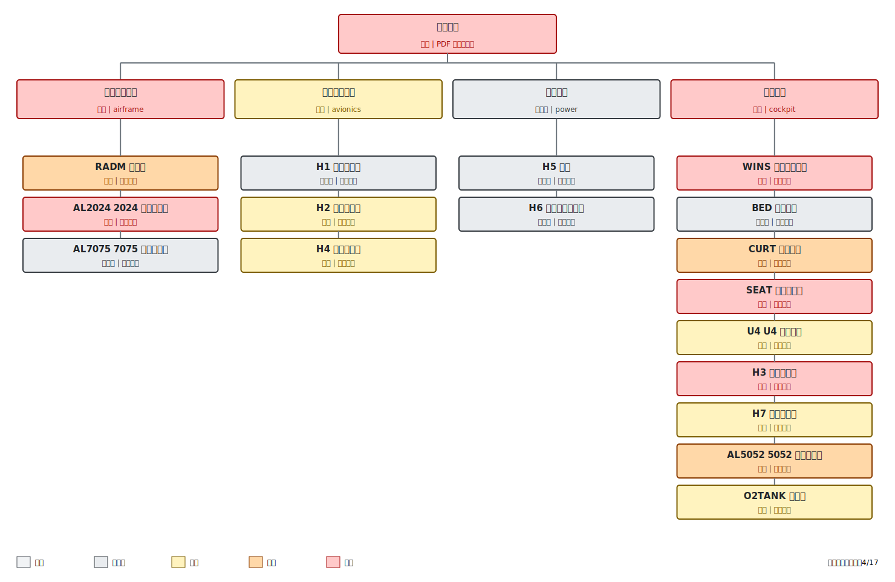

## 系统级传播结果

| 系统 | 等级 | 触发节点 | 采用的传播规则 |
|---|---:|---|---|
| 机体结构系统（`airframe`） | 重度 | AL2024 | 至少一个主要节点达到重度毁伤 |
| 航空电子系统（`avionics`） | 轻度 | H2, H4 | 至少一个已知节点达到轻度，且未触发更高等级 |
| 电源系统（`power`） | 未毁伤 | 无 | 所有已知节点均未达到毁伤标准 |
| 座舱系统（`cockpit`） | 重度 | WINS, SEAT, H3 | 至少一个主要节点达到重度毁伤 |

## 完整设备毁伤评估

| 设备组 | 设备名称 | 毁伤树角色 | 等级 | 峰值温度（C） | 轻度证据 | 中度证据 | 重度证据 | 重度毁伤结论 | 物理解释 | 正外部热流探针数 | 有效温度探针数 |
|---|---|---|---:|---:|---|---|---|---|---|---:|---:|
| RADM | 雷达罩 | 机体结构系统：主要节点 | 中度 | 996.5 | 150 C; 1404.0/1200 s | 250 C; 898.5/600 s | 400 C; 4.5/180 s | 未达到：连续高于 400 C 的时间仅为 4.5/180 s | 瞬态光辐射或火灾使温度短暂超过重度阈值，但燃烧或热反馈未维持到规定时间。 | 10 | 10 |
| WINS | 有机玻璃舷窗 | 座舱系统：主要节点 | 重度 | 1215.4 | 120 C; 1404.0/60 s | 200 C; 1404.0/45 s | 250 C; 1404.0/8 s | 已达到：峰值 1215.4 C；连续高于 250 C 的时间为 1404.0/8 s | 直接外部热流和/或火灾加热同时提供了足够的温度和持续时间。 | 10 | 10 |
| BED | 尼龙床垫 | 座舱系统：主要节点 | 未毁伤 | 385.2 | 200 C; 31.5/60 s | 250 C; 18.0/90 s | 500 C; 0.0/5 s | 未达到：峰值 385.2 C < 500 C | 监测表面接收到正外部热流，但受脉冲能量、材料热惯性和散热影响，峰值仍低于重度毁伤阈值。 | 8 | 8 |
| CURT | 尼龙窗帘 | 座舱系统：主要节点 | 中度 | 1043.9 | 200 C; 1126.5/60 s | 250 C; 810.0/90 s | 500 C; 3.0/5 s | 未达到：连续高于 500 C 的时间仅为 3.0/5 s | 瞬态光辐射或火灾使温度短暂超过重度阈值，但燃烧或热反馈未维持到规定时间。 | 10 | 10 |
| U4 | U4 仪器设备 | 座舱系统：主要节点 | 轻度 | 257.9 | 120 C; 1033.5/300 s | 250 C; 151.5/180 s | 400 C; 0.0/5 s | 未达到：峰值 257.9 C < 400 C | 监测表面未分配到正外部热流；几何遮挡后仅靠舱内二次火灾加热，温度低于重度毁伤阈值。 | 0 | 6 |
| SEAT | 聚氨酯座椅 | 座舱系统：主要节点 | 重度 | 2726.8 | 200 C; 1404.0/60 s | 300 C; 1404.0/90 s | 500 C; 1404.0/5 s | 已达到：峰值 2726.8 C；连续高于 500 C 的时间为 1404.0/5 s | 直接外部热流和/或火灾加热同时提供了足够的温度和持续时间。 | 4 | 10 |
| AL2024 | 2024 铝合金蒙皮 | 机体结构系统：主要节点 | 重度 | 501.8 | 120 C; 1404.0/1200 s | 250 C; 1402.5/600 s | 400 C; 1356.0/180 s | 已达到：峰值 501.8 C；连续高于 400 C 的时间为 1356.0/180 s | 直接外部热流和/或火灾加热同时提供了足够的温度和持续时间。 | 5 | 10 |
| AL5052 | 5052 铝合金风管 | 座舱系统：次要节点 | 中度 | 364.2 | 120 C; 1224.0/1200 s | 250 C; 1074.0/600 s | 400 C; 0.0/180 s | 未达到：峰值 364.2 C < 400 C | 监测表面未分配到正外部热流；几何遮挡后仅靠舱内二次火灾加热，温度低于重度毁伤阈值。 | 0 | 10 |
| AL7075 | 7075 铝合金框架 | 机体结构系统：主要节点 | 未毁伤 | 229.0 | 120 C; 1017.0/1200 s | 200 C; 75.0/600 s | 400 C; 0.0/180 s | 未达到：峰值 229.0 C < 400 C | 监测表面接收到正外部热流，但受脉冲能量、材料热惯性和散热影响，峰值仍低于重度毁伤阈值。 | 3 | 10 |
| O2TANK | 氧气瓶 | 座舱系统：次要节点 | 轻度 | 223.7 | 120 C; 1371.0/1200 s | 200 C; 285.0/600 s | 400 C; 0.0/180 s | 未达到：峰值 223.7 C < 400 C | 监测表面接收到正外部热流，但受脉冲能量、材料热惯性和散热影响，峰值仍低于重度毁伤阈值。 | 6 | 8 |
| H1 | 导航子系统 | 航空电子系统：主要节点 | 未毁伤 | 252.1 | 120 C; 244.5/300 s | 250 C; 1.5/180 s | 400 C; 0.0/5 s | 未达到：峰值 252.1 C < 400 C | 监测表面接收到正外部热流，但受脉冲能量、材料热惯性和散热影响，峰值仍低于重度毁伤阈值。 | 5 | 6 |
| H2 | 任务子系统 | 航空电子系统：主要节点 | 轻度 | 283.8 | 120 C; 358.5/300 s | 250 C; 75.0/180 s | 400 C; 0.0/5 s | 未达到：峰值 283.8 C < 400 C | 监测表面接收到正外部热流，但受脉冲能量、材料热惯性和散热影响，峰值仍低于重度毁伤阈值。 | 8 | 8 |
| H3 | 显示子系统 | 座舱系统：主要节点 | 重度 | 580.0 | 120 C; 1230.0/300 s | 250 C; 1167.0/180 s | 400 C; 1092.0/5 s | 已达到：峰值 580.0 C；连续高于 400 C 的时间为 1092.0/5 s | 舱内二次火灾加热同时提供了足够的温度和持续时间。 | 0 | 14 |
| H4 | 通信子系统 | 航空电子系统：次要节点 | 轻度 | 191.8 | 120 C; 963.0/300 s | 250 C; 0.0/180 s | 400 C; 0.0/5 s | 未达到：峰值 191.8 C < 400 C | 监测表面接收到正外部热流，但受脉冲能量、材料热惯性和散热影响，峰值仍低于重度毁伤阈值。 | 4 | 10 |
| H5 | 电池 | 电源系统：主要节点 | 未毁伤 | 89.2 | 100 C; 0.0/60 s | 150 C; 0.0/600 s | 200 C; 0.0/180 s | 未达到：峰值 89.2 C < 200 C | 监测表面接收到正外部热流，但受脉冲能量、材料热惯性和散热影响，峰值仍低于重度毁伤阈值。 | 3 | 6 |
| H6 | 电力传输子系统 | 电源系统：主要节点 | 未毁伤 | 240.8 | 120 C; 859.5/1200 s | 200 C; 46.5/600 s | 400 C; 0.0/180 s | 未达到：峰值 240.8 C < 400 C | 监测表面未分配到正外部热流；几何遮挡后仅靠舱内二次火灾加热，温度低于重度毁伤阈值。 | 0 | 8 |
| H7 | 操纵子系统 | 座舱系统：主要节点 | 轻度 | 303.6 | 120 C; 1390.5/300 s | 250 C; 30.0/180 s | 400 C; 0.0/5 s | 未达到：峰值 303.6 C < 400 C | 监测表面未分配到正外部热流；几何遮挡后仅靠舱内二次火灾加热，温度低于重度毁伤阈值。 | 0 | 3 |

## 评估结论与解释

- 未达到重度或证据未知的设备组：**RADM, BED, CURT, U4, AL5052, AL7075, O2TANK, H1, H2, H4, H5, H6, H7**。
- 重度毁伤未满足的原因统计：**11 项受峰值温度限制**，**2 项受持续时间限制**。
- 整机等级取各系统已知等级中的最高等级：**重度**。
- H2（任务子系统）和 H3（显示子系统）属于当前模型的专用映射，其通用电子设备阈值并非 PDF 中的同名条目。
- H1-H4 探针当前测量铝合金外壳表面温度，并将其作为内部电子器件温度的代理。

## 按毁伤树原则对本案例的详细解释

该案例当前属于实时快照（案例仍在运行），有效模拟时间为 1405.5 s。它可以反映已经形成的温度峰值和累计持续时间，但不能替代正常完成结果；所有临界设备仍需在完整结果中复核。
该案例标称入射面光冲量为 200 J/cm2，模型表面的最大局部积分光冲量为 194.223 J/cm2，约为标称值的 97.1%。因此设备实际受照还受到入射角、表面朝向与几何遮挡影响，不能把标称 Q 直接等同于每个设备表面接收的光冲量。
按照设备级温度与持续时间判据，当前达到重度毁伤的设备组共有 4 个：WINS, SEAT, AL2024, H3。这些设备不仅达到重度温度阈值，而且最长连续超阈时间也满足规定时长，因此其重度结论具有完整的温度和时间证据。
峰值温度受限设备包括：BED（峰值 385.2 C，阈值 500 C）、U4（峰值 257.9 C，阈值 400 C）、AL5052（峰值 364.2 C，阈值 400 C）、AL7075（峰值 229.0 C，阈值 400 C）、O2TANK（峰值 223.7 C，阈值 400 C）、H1（峰值 252.1 C，阈值 400 C）、H2（峰值 283.8 C，阈值 400 C）、H4（峰值 191.8 C，阈值 400 C）、H5（峰值 89.2 C，阈值 200 C）、H6（峰值 240.8 C，阈值 400 C）、H7（峰值 303.6 C，阈值 400 C）。这些对象尚未进入重度判据温度区间，继续延长模拟时间并不会自动补足峰值条件；需要结合直接受照、遮挡和二次火灾强度判断其原因。
持续时间受限设备包括：RADM（4.5/180 s，高于 400 C）、CURT（3.0/5 s，高于 500 C）。这些对象已经出现足够高的瞬态峰值，但热解、燃烧或邻近火灾反馈没有把温度维持到标准要求，因此不能仅凭最高温度判为重度毁伤。
U4, AL5052, H6, H7 的有效监测面没有记录到正外部热流，它们主要依靠舱内二次火灾加热。若这些设备未达到重度，优先应检查 DDA 可见性、设备实际朝向、邻近可燃物燃烧持续性及探针是否覆盖热点，而不是直接降低材料强度或毁伤标准。
系统级传播结果为：机体结构系统为重度，触发节点为AL2024；航空电子系统为轻度，触发节点为H2、H4；电源系统为未毁伤，触发节点为无明确触发节点；座舱系统为重度，触发节点为WINS、SEAT、H3。系统等级由主要节点和次要节点按既定规则传播，不是按系统内所有设备温度求平均。
最终 PDF 毁伤树整机等级为重度，而严格全设备结果为 4/17。前者说明至少一个关键系统已达到相应任务毁伤等级；后者说明距离“所有材料和设备均重度毁伤”的研究目标仍有 13 个设备组未满足。两者必须同时保留，不能用整机重度替代 17/17。
因此，本案例是否能够作为全毁伤阈值的成功点，只取决于严格结果是否达到 17/17，并且案例是否正常完成。未达到 17/17 时，应根据上面的峰值受限、持续时间受限和遮挡分类确定下一步物理参数研究方向。

---

## 完整毁伤树评估：Q0200_W0100_az270_el15_H1H7_v5_Qnorm_adapt_HRRnominal_thickness_audit_v1

- 模拟时间：**964.50 s**
- 来源目录：`cases_adaptive/Q0200_W0100_az270_el15_H1H7_v5_Qnorm_adapt_HRRnominal_thickness_audit_v1`
- 方案分类：**自适应敏感性方案（单独比较）**
- 评估状态：**实时快照（案例仍在运行）**
- PDF 毁伤树整机等级：**重度**
- 严格全设备重度毁伤结果：**5/17** （全部重度毁伤=否）
- 最高温度定义：几何位置有效的冗余壁面温度探针动态包络最大值。
- 注意：严格的 17/17 指标不等同于 PDF 毁伤树的整机等级判据。

## 案例配置

| 参数 | 数值 |
|---|---|
| 方案用途 | nominal_HRRPUA_with_audited_thickness |
| 来源案例 | Q0200_W0100_az270_el15_H1H7_v5_Qnorm_adapt_HRRupper_thickness_audit |
| 修改因素 | HRRPUA_upper_to_nominal_only |
| 光冲量 Q（J/cm2） | 200 |
| 核爆当量（kt） | 100 |
| 方位角（度） | 270 |
| 俯仰角（度） | 15 |
| 目标模拟时长（s） | 1500 |
| MPI 进程数 | 32 |
| BURN_AWAY | 否 |
| 辐射份额 | 0.4 |
| 最大 CFL | 未记录 |
| 指定时间步长（s） | 未记录 |
| 核辐射脉冲积分（s） | 0.660398 |
| 入射面峰值辐照度（kW/m2） | 3028.48 |
| 最大局部外部热流（kW/m2） | 2941 |
| 最大局部积分光冲量（J/cm2） | 194.223 |
| 各材料 HRRPUA（kW/m2） | {"BED": 790.0, "CURT": 324.0, "H6": 259.0, "H7": 458.0, "RADM": 840.0, "SEAT": 860.0, "U4": 840.0, "WINS": 806.0} |
| FDS 中全部 HRRPUA（kW/m2） | [75.0, 100.0, 180.0, 200.0, 250.0] |
| 审查后的材料厚度（m） | {"BED": 0.00089, "CURT": 0.003, "RADM": 0.1, "U4": 0.006, "WINS": 0.025} |
| FDS 中全部材料层厚度（m） | [0.00089, 0.001, 0.0015, 0.002, 0.003, 0.005, 0.006, 0.025, 0.1, 0.15] |
| 几何是否修改 | 否 |
| 材料是否修改 | 否 |
| 燃烧参数是否修改 | 否 |
| 外部热流是否修改 | 否 |
| 点燃温度是否修改 | 否 |
| 毁伤阈值是否修改 | 否 |
| FDS 输入文件 | Q0200_W0100_az270_el15_H1H7_v5_Qnorm_adapt_HRRnominal_thickness_audit_v1.fds |

## 已知问题与结果有效性

- 该结果是 964.5 s 的长时快照，缺少 FDS 正常结束标记；在达到 T_END 前，温度和毁伤等级仍可能变化。
- H1-H4 目前以铝合金外壳壁面温度代理内部电子器件温度。

## 毁伤树

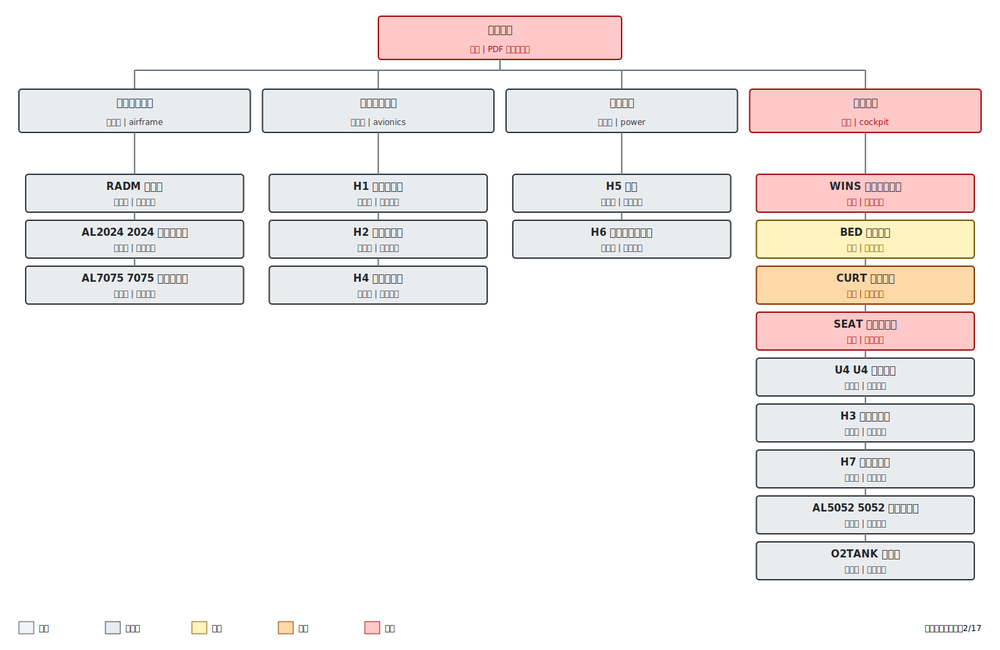

## 系统级传播结果

| 系统 | 等级 | 触发节点 | 采用的传播规则 |
|---|---:|---|---|
| 机体结构系统（`airframe`） | 重度 | AL2024 | 至少一个主要节点达到重度毁伤 |
| 航空电子系统（`avionics`） | 轻度 | H2, H4 | 至少一个已知节点达到轻度，且未触发更高等级 |
| 电源系统（`power`） | 未毁伤 | 无 | 所有已知节点均未达到毁伤标准 |
| 座舱系统（`cockpit`） | 重度 | WINS, SEAT, H3 | 至少一个主要节点达到重度毁伤 |

## 完整设备毁伤评估

| 设备组 | 设备名称 | 毁伤树角色 | 等级 | 峰值温度（C） | 轻度证据 | 中度证据 | 重度证据 | 重度毁伤结论 | 物理解释 | 正外部热流探针数 | 有效温度探针数 |
|---|---|---|---:|---:|---|---|---|---|---|---:|---:|
| RADM | 雷达罩 | 机体结构系统：主要节点 | 未毁伤 | 987.7 | 150 C; 963.0/1200 s | 250 C; 45.0/600 s | 400 C; 4.5/180 s | 未达到：连续高于 400 C 的时间仅为 4.5/180 s | 瞬态光辐射或火灾使温度短暂超过重度阈值，但燃烧或热反馈未维持到规定时间。 | 10 | 10 |
| WINS | 有机玻璃舷窗 | 座舱系统：主要节点 | 重度 | 1209.7 | 120 C; 963.0/60 s | 200 C; 963.0/45 s | 250 C; 963.0/8 s | 已达到：峰值 1209.7 C；连续高于 250 C 的时间为 963.0/8 s | 直接外部热流和/或火灾加热同时提供了足够的温度和持续时间。 | 10 | 10 |
| BED | 尼龙床垫 | 座舱系统：主要节点 | 轻度 | 454.2 | 200 C; 97.5/60 s | 250 C; 52.5/90 s | 500 C; 0.0/5 s | 未达到：峰值 454.2 C < 500 C | 监测表面接收到正外部热流，但受脉冲能量、材料热惯性和散热影响，峰值仍低于重度毁伤阈值。 | 8 | 8 |
| CURT | 尼龙窗帘 | 座舱系统：主要节点 | 中度 | 1041.1 | 200 C; 963.0/60 s | 250 C; 963.0/90 s | 500 C; 3.0/5 s | 未达到：连续高于 500 C 的时间仅为 3.0/5 s | 瞬态光辐射或火灾使温度短暂超过重度阈值，但燃烧或热反馈未维持到规定时间。 | 10 | 10 |
| U4 | U4 仪器设备 | 座舱系统：主要节点 | 中度 | 323.8 | 120 C; 678.0/300 s | 250 C; 294.0/180 s | 400 C; 0.0/5 s | 未达到：峰值 323.8 C < 400 C | 监测表面未分配到正外部热流；几何遮挡后仅靠舱内二次火灾加热，温度低于重度毁伤阈值。 | 0 | 6 |
| SEAT | 聚氨酯座椅 | 座舱系统：主要节点 | 重度 | 2533.4 | 200 C; 963.0/60 s | 300 C; 963.0/90 s | 500 C; 963.0/5 s | 已达到：峰值 2533.4 C；连续高于 500 C 的时间为 963.0/5 s | 直接外部热流和/或火灾加热同时提供了足够的温度和持续时间。 | 4 | 10 |
| AL2024 | 2024 铝合金蒙皮 | 机体结构系统：主要节点 | 重度 | 487.9 | 120 C; 963.0/1200 s | 250 C; 961.5/600 s | 400 C; 918.0/180 s | 已达到：峰值 487.9 C；连续高于 400 C 的时间为 918.0/180 s | 直接外部热流和/或火灾加热同时提供了足够的温度和持续时间。 | 5 | 10 |
| AL5052 | 5052 铝合金风管 | 座舱系统：次要节点 | 重度 | 438.3 | 120 C; 823.5/1200 s | 250 C; 724.5/600 s | 400 C; 267.0/180 s | 已达到：峰值 438.3 C；连续高于 400 C 的时间为 267.0/180 s | 舱内二次火灾加热同时提供了足够的温度和持续时间。 | 0 | 10 |
| AL7075 | 7075 铝合金框架 | 机体结构系统：主要节点 | 未毁伤 | 229.0 | 120 C; 963.0/1200 s | 200 C; 139.5/600 s | 400 C; 0.0/180 s | 未达到：峰值 229.0 C < 400 C | 监测表面接收到正外部热流，但受脉冲能量、材料热惯性和散热影响，峰值仍低于重度毁伤阈值。 | 3 | 10 |
| O2TANK | 氧气瓶 | 座舱系统：次要节点 | 未毁伤 | 249.9 | 120 C; 930.0/1200 s | 200 C; 289.5/600 s | 400 C; 0.0/180 s | 未达到：峰值 249.9 C < 400 C | 监测表面接收到正外部热流，但受脉冲能量、材料热惯性和散热影响，峰值仍低于重度毁伤阈值。 | 6 | 8 |
| H1 | 导航子系统 | 航空电子系统：主要节点 | 未毁伤 | 252.1 | 120 C; 243.0/300 s | 250 C; 1.5/180 s | 400 C; 0.0/5 s | 未达到：峰值 252.1 C < 400 C | 监测表面接收到正外部热流，但受脉冲能量、材料热惯性和散热影响，峰值仍低于重度毁伤阈值。 | 5 | 6 |
| H2 | 任务子系统 | 航空电子系统：主要节点 | 轻度 | 283.7 | 120 C; 354.0/300 s | 250 C; 75.0/180 s | 400 C; 0.0/5 s | 未达到：峰值 283.7 C < 400 C | 监测表面接收到正外部热流，但受脉冲能量、材料热惯性和散热影响，峰值仍低于重度毁伤阈值。 | 8 | 8 |
| H3 | 显示子系统 | 座舱系统：主要节点 | 重度 | 625.1 | 120 C; 817.5/300 s | 250 C; 765.0/180 s | 400 C; 700.5/5 s | 已达到：峰值 625.1 C；连续高于 400 C 的时间为 700.5/5 s | 舱内二次火灾加热同时提供了足够的温度和持续时间。 | 0 | 14 |
| H4 | 通信子系统 | 航空电子系统：次要节点 | 轻度 | 223.4 | 120 C; 849.0/300 s | 250 C; 0.0/180 s | 400 C; 0.0/5 s | 未达到：峰值 223.4 C < 400 C | 监测表面接收到正外部热流，但受脉冲能量、材料热惯性和散热影响，峰值仍低于重度毁伤阈值。 | 4 | 10 |
| H5 | 电池 | 电源系统：主要节点 | 未毁伤 | 74.6 | 100 C; 0.0/60 s | 150 C; 0.0/600 s | 200 C; 0.0/180 s | 未达到：峰值 74.6 C < 200 C | 监测表面接收到正外部热流，但受脉冲能量、材料热惯性和散热影响，峰值仍低于重度毁伤阈值。 | 3 | 6 |
| H6 | 电力传输子系统 | 电源系统：主要节点 | 未毁伤 | 217.7 | 120 C; 405.0/1200 s | 200 C; 24.0/600 s | 400 C; 0.0/180 s | 未达到：峰值 217.7 C < 400 C | 监测表面未分配到正外部热流；几何遮挡后仅靠舱内二次火灾加热，温度低于重度毁伤阈值。 | 0 | 8 |
| H7 | 操纵子系统 | 座舱系统：主要节点 | 中度 | 421.6 | 120 C; 949.5/300 s | 250 C; 240.0/180 s | 400 C; 3.0/5 s | 未达到：连续高于 400 C 的时间仅为 3.0/5 s | 瞬态光辐射或火灾使温度短暂超过重度阈值，但燃烧或热反馈未维持到规定时间。 | 0 | 3 |

## 评估结论与解释

- 未达到重度或证据未知的设备组：**RADM, BED, CURT, U4, AL7075, O2TANK, H1, H2, H4, H5, H6, H7**。
- 重度毁伤未满足的原因统计：**9 项受峰值温度限制**，**3 项受持续时间限制**。
- 整机等级取各系统已知等级中的最高等级：**重度**。
- H2（任务子系统）和 H3（显示子系统）属于当前模型的专用映射，其通用电子设备阈值并非 PDF 中的同名条目。
- H1-H4 探针当前测量铝合金外壳表面温度，并将其作为内部电子器件温度的代理。

## 按毁伤树原则对本案例的详细解释

该案例当前属于实时快照（案例仍在运行），有效模拟时间为 964.5 s。它可以反映已经形成的温度峰值和累计持续时间，但不能替代正常完成结果；所有临界设备仍需在完整结果中复核。
该案例标称入射面光冲量为 200 J/cm2，模型表面的最大局部积分光冲量为 194.223 J/cm2，约为标称值的 97.1%。因此设备实际受照还受到入射角、表面朝向与几何遮挡影响，不能把标称 Q 直接等同于每个设备表面接收的光冲量。
按照设备级温度与持续时间判据，当前达到重度毁伤的设备组共有 5 个：WINS, SEAT, AL2024, AL5052, H3。这些设备不仅达到重度温度阈值，而且最长连续超阈时间也满足规定时长，因此其重度结论具有完整的温度和时间证据。
峰值温度受限设备包括：BED（峰值 454.2 C，阈值 500 C）、U4（峰值 323.8 C，阈值 400 C）、AL7075（峰值 229.0 C，阈值 400 C）、O2TANK（峰值 249.9 C，阈值 400 C）、H1（峰值 252.1 C，阈值 400 C）、H2（峰值 283.7 C，阈值 400 C）、H4（峰值 223.4 C，阈值 400 C）、H5（峰值 74.6 C，阈值 200 C）、H6（峰值 217.7 C，阈值 400 C）。这些对象尚未进入重度判据温度区间，继续延长模拟时间并不会自动补足峰值条件；需要结合直接受照、遮挡和二次火灾强度判断其原因。
持续时间受限设备包括：RADM（4.5/180 s，高于 400 C）、CURT（3.0/5 s，高于 500 C）、H7（3.0/5 s，高于 400 C）。这些对象已经出现足够高的瞬态峰值，但热解、燃烧或邻近火灾反馈没有把温度维持到标准要求，因此不能仅凭最高温度判为重度毁伤。
U4, H6, H7 的有效监测面没有记录到正外部热流，它们主要依靠舱内二次火灾加热。若这些设备未达到重度，优先应检查 DDA 可见性、设备实际朝向、邻近可燃物燃烧持续性及探针是否覆盖热点，而不是直接降低材料强度或毁伤标准。
系统级传播结果为：机体结构系统为重度，触发节点为AL2024；航空电子系统为轻度，触发节点为H2、H4；电源系统为未毁伤，触发节点为无明确触发节点；座舱系统为重度，触发节点为WINS、SEAT、H3。系统等级由主要节点和次要节点按既定规则传播，不是按系统内所有设备温度求平均。
最终 PDF 毁伤树整机等级为重度，而严格全设备结果为 5/17。前者说明至少一个关键系统已达到相应任务毁伤等级；后者说明距离“所有材料和设备均重度毁伤”的研究目标仍有 12 个设备组未满足。两者必须同时保留，不能用整机重度替代 17/17。
因此，本案例是否能够作为全毁伤阈值的成功点，只取决于严格结果是否达到 17/17，并且案例是否正常完成。未达到 17/17 时，应根据上面的峰值受限、持续时间受限和遮挡分类确定下一步物理参数研究方向。

---

## 完整毁伤树评估：Q0200_W0100_az270_el15_H1H7_v5_Qnorm_adapt_HRRupper_thickness_audit

- 模拟时间：**1500.00 s**
- 来源目录：`cases_adaptive/Q0200_W0100_az270_el15_H1H7_v5_Qnorm_adapt_HRRupper_thickness_audit`
- 方案分类：**自适应敏感性方案（单独比较）**
- 评估状态：**正常完成**
- PDF 毁伤树整机等级：**重度**
- 严格全设备重度毁伤结果：**14/17** （全部重度毁伤=否）
- 最高温度定义：几何位置有效的冗余壁面温度探针动态包络最大值。
- 注意：严格的 17/17 指标不等同于 PDF 毁伤树的整机等级判据。

## 案例配置

| 参数 | 数值 |
|---|---|
| 方案用途 | source_backed_upper_HRRPUA_with_audited_thickness |
| 来源案例 | Q0200_W0100_az270_el15_H1H7_v5_Qnorm |
| 修改因素 | HRRPUA_and_previously_audited_surface_thickness |
| 光冲量 Q（J/cm2） | 200 |
| 核爆当量（kt） | 100 |
| 方位角（度） | 270 |
| 俯仰角（度） | 15 |
| 目标模拟时长（s） | 1500 |
| MPI 进程数 | 32 |
| BURN_AWAY | 否 |
| 辐射份额 | 0.4 |
| 最大 CFL | 未记录 |
| 指定时间步长（s） | 未记录 |
| 核辐射脉冲积分（s） | 0.660398 |
| 入射面峰值辐照度（kW/m2） | 3028.48 |
| 最大局部外部热流（kW/m2） | 2941 |
| 最大局部积分光冲量（J/cm2） | 194.223 |
| 各材料 HRRPUA（kW/m2） | {"BED": 790.0, "CURT": 324.0, "H6": 259.0, "H7": 458.0, "RADM": 840.0, "SEAT": 860.0, "U4": 840.0, "WINS": 806.0} |
| FDS 中全部 HRRPUA（kW/m2） | [259.0, 324.0, 458.0, 790.0, 806.0, 840.0, 860.0] |
| 审查后的材料厚度（m） | {"BED": 0.00089, "CURT": 0.003, "RADM": 0.1, "U4": 0.006, "WINS": 0.025} |
| FDS 中全部材料层厚度（m） | [0.00089, 0.001, 0.0015, 0.002, 0.003, 0.005, 0.006, 0.025, 0.1, 0.15] |
| 几何是否修改 | 否 |
| 材料是否修改 | 否 |
| 燃烧参数是否修改 | 否 |
| 外部热流是否修改 | 否 |
| 点燃温度是否修改 | 否 |
| 毁伤阈值是否修改 | 否 |
| FDS 输入文件 | Q0200_W0100_az270_el15_H1H7_v5_Qnorm_adapt_HRRupper_thickness_audit.fds |

## 已知问题与结果有效性

- H1-H4 目前以铝合金外壳壁面温度代理内部电子器件温度。

## 毁伤树

## 系统级传播结果

| 系统 | 等级 | 触发节点 | 采用的传播规则 |
|---|---:|---|---|
| 机体结构系统（`airframe`） | 重度 | RADM, AL2024, AL7075 | 至少一个主要节点达到重度毁伤 |
| 航空电子系统（`avionics`） | 中度 | H1, H4 | 主要节点达到中度，或次要节点达到重度毁伤 |
| 电源系统（`power`） | 重度 | H5, H6 | 至少一个主要节点达到重度毁伤 |
| 座舱系统（`cockpit`） | 重度 | WINS, CURT, SEAT, U4, H3, H7 | 至少一个主要节点达到重度毁伤 |

## 完整设备毁伤评估

| 设备组 | 设备名称 | 毁伤树角色 | 等级 | 峰值温度（C） | 轻度证据 | 中度证据 | 重度证据 | 重度毁伤结论 | 物理解释 | 正外部热流探针数 | 有效温度探针数 |
|---|---|---|---:|---:|---|---|---|---|---|---:|---:|
| RADM | 雷达罩 | 机体结构系统：主要节点 | 重度 | 1002.4 | 150 C; 1498.5/1200 s | 250 C; 1498.5/600 s | 400 C; 1498.5/180 s | 已达到：峰值 1002.4 C；连续高于 400 C 的时间为 1498.5/180 s | 直接外部热流和/或火灾加热同时提供了足够的温度和持续时间。 | 10 | 10 |
| WINS | 有机玻璃舷窗 | 座舱系统：主要节点 | 重度 | 1216.7 | 120 C; 1498.5/60 s | 200 C; 1498.5/45 s | 250 C; 1498.5/8 s | 已达到：峰值 1216.7 C；连续高于 250 C 的时间为 1498.5/8 s | 直接外部热流和/或火灾加热同时提供了足够的温度和持续时间。 | 10 | 10 |
| BED | 尼龙床垫 | 座舱系统：主要节点 | 中度 | 526.7 | 200 C; 1353.0/60 s | 250 C; 1299.0/90 s | 500 C; 4.5/5 s | 未达到：连续高于 500 C 的时间仅为 4.5/5 s | 瞬态光辐射或火灾使温度短暂超过重度阈值，但燃烧或热反馈未维持到规定时间。 | 8 | 8 |
| CURT | 尼龙窗帘 | 座舱系统：主要节点 | 重度 | 1036.2 | 200 C; 1498.5/60 s | 250 C; 1498.5/90 s | 500 C; 1014.0/5 s | 已达到：峰值 1036.2 C；连续高于 500 C 的时间为 1014.0/5 s | 直接外部热流和/或火灾加热同时提供了足够的温度和持续时间。 | 10 | 10 |
| U4 | U4 仪器设备 | 座舱系统：主要节点 | 重度 | 693.1 | 120 C; 1360.5/300 s | 250 C; 1215.0/180 s | 400 C; 1083.0/5 s | 已达到：峰值 693.1 C；连续高于 400 C 的时间为 1083.0/5 s | 舱内二次火灾加热同时提供了足够的温度和持续时间。 | 0 | 6 |
| SEAT | 聚氨酯座椅 | 座舱系统：主要节点 | 重度 | 2726.8 | 200 C; 1498.5/60 s | 300 C; 1498.5/90 s | 500 C; 1498.5/5 s | 已达到：峰值 2726.8 C；连续高于 500 C 的时间为 1498.5/5 s | 直接外部热流和/或火灾加热同时提供了足够的温度和持续时间。 | 4 | 10 |
| AL2024 | 2024 铝合金蒙皮 | 机体结构系统：主要节点 | 重度 | 857.8 | 120 C; 1498.5/1200 s | 250 C; 1497.0/600 s | 400 C; 1495.5/180 s | 已达到：峰值 857.8 C；连续高于 400 C 的时间为 1495.5/180 s | 直接外部热流和/或火灾加热同时提供了足够的温度和持续时间。 | 5 | 10 |
| AL5052 | 5052 铝合金风管 | 座舱系统：次要节点 | 重度 | 708.3 | 120 C; 1450.5/1200 s | 250 C; 1414.5/600 s | 400 C; 1375.5/180 s | 已达到：峰值 708.3 C；连续高于 400 C 的时间为 1375.5/180 s | 舱内二次火灾加热同时提供了足够的温度和持续时间。 | 0 | 10 |
| AL7075 | 7075 铝合金框架 | 机体结构系统：主要节点 | 重度 | 713.5 | 120 C; 1498.5/1200 s | 200 C; 1497.0/600 s | 400 C; 1360.5/180 s | 已达到：峰值 713.5 C；连续高于 400 C 的时间为 1360.5/180 s | 直接外部热流和/或火灾加热同时提供了足够的温度和持续时间。 | 3 | 10 |
| O2TANK | 氧气瓶 | 座舱系统：次要节点 | 重度 | 559.2 | 120 C; 1488.0/1200 s | 200 C; 1315.5/600 s | 400 C; 1069.5/180 s | 已达到：峰值 559.2 C；连续高于 400 C 的时间为 1069.5/180 s | 直接外部热流和/或火灾加热同时提供了足够的温度和持续时间。 | 6 | 8 |
| H1 | 导航子系统 | 航空电子系统：主要节点 | 中度 | 301.5 | 120 C; 1245.0/300 s | 250 C; 624.0/180 s | 400 C; 0.0/5 s | 未达到：峰值 301.5 C < 400 C | 监测表面接收到正外部热流，但受脉冲能量、材料热惯性和散热影响，峰值仍低于重度毁伤阈值。 | 5 | 6 |
| H2 | 任务子系统 | 航空电子系统：主要节点 | 轻度 | 277.2 | 120 C; 1498.5/300 s | 250 C; 27.0/180 s | 400 C; 0.0/5 s | 未达到：峰值 277.2 C < 400 C | 监测表面接收到正外部热流，但受脉冲能量、材料热惯性和散热影响，峰值仍低于重度毁伤阈值。 | 8 | 8 |
| H3 | 显示子系统 | 座舱系统：主要节点 | 重度 | 715.6 | 120 C; 1407.0/300 s | 250 C; 1363.5/180 s | 400 C; 1302.0/5 s | 已达到：峰值 715.6 C；连续高于 400 C 的时间为 1302.0/5 s | 舱内二次火灾加热同时提供了足够的温度和持续时间。 | 0 | 14 |
| H4 | 通信子系统 | 航空电子系统：次要节点 | 重度 | 646.1 | 120 C; 1438.5/300 s | 250 C; 1363.5/180 s | 400 C; 1284.0/5 s | 已达到：峰值 646.1 C；连续高于 400 C 的时间为 1284.0/5 s | 直接外部热流和/或火灾加热同时提供了足够的温度和持续时间。 | 4 | 10 |
| H5 | 电池 | 电源系统：主要节点 | 重度 | 303.2 | 100 C; 1206.0/60 s | 150 C; 1087.5/600 s | 200 C; 970.5/180 s | 已达到：峰值 303.2 C；连续高于 200 C 的时间为 970.5/180 s | 直接外部热流和/或火灾加热同时提供了足够的温度和持续时间。 | 3 | 6 |
| H6 | 电力传输子系统 | 电源系统：主要节点 | 重度 | 478.2 | 120 C; 1476.0/1200 s | 200 C; 1273.5/600 s | 400 C; 951.0/180 s | 已达到：峰值 478.2 C；连续高于 400 C 的时间为 951.0/180 s | 舱内二次火灾加热同时提供了足够的温度和持续时间。 | 0 | 8 |
| H7 | 操纵子系统 | 座舱系统：主要节点 | 重度 | 457.5 | 120 C; 1494.0/300 s | 250 C; 1281.0/180 s | 400 C; 774.0/5 s | 已达到：峰值 457.5 C；连续高于 400 C 的时间为 774.0/5 s | 舱内二次火灾加热同时提供了足够的温度和持续时间。 | 0 | 3 |

## 评估结论与解释

- 未达到重度或证据未知的设备组：**BED, H1, H2**。
- 重度毁伤未满足的原因统计：**2 项受峰值温度限制**，**1 项受持续时间限制**。
- 整机等级取各系统已知等级中的最高等级：**重度**。
- H2（任务子系统）和 H3（显示子系统）属于当前模型的专用映射，其通用电子设备阈值并非 PDF 中的同名条目。
- H1-H4 探针当前测量铝合金外壳表面温度，并将其作为内部电子器件温度的代理。

## 按毁伤树原则对本案例的详细解释

该案例已正常运行到目标时长，且日志中存在 FDS 正常完成标记，因此可作为正式结果参与同参数族的阈值比较。
该案例标称入射面光冲量为 200 J/cm2，模型表面的最大局部积分光冲量为 194.223 J/cm2，约为标称值的 97.1%。因此设备实际受照还受到入射角、表面朝向与几何遮挡影响，不能把标称 Q 直接等同于每个设备表面接收的光冲量。
按照设备级温度与持续时间判据，当前达到重度毁伤的设备组共有 14 个：RADM, WINS, CURT, U4, SEAT, AL2024, AL5052, AL7075, O2TANK, H3, H4, H5, H6, H7。这些设备不仅达到重度温度阈值，而且最长连续超阈时间也满足规定时长，因此其重度结论具有完整的温度和时间证据。
峰值温度受限设备包括：H1（峰值 301.5 C，阈值 400 C）、H2（峰值 277.2 C，阈值 400 C）。这些对象尚未进入重度判据温度区间，继续延长模拟时间并不会自动补足峰值条件；需要结合直接受照、遮挡和二次火灾强度判断其原因。
持续时间受限设备包括：BED（4.5/5 s，高于 500 C）。这些对象已经出现足够高的瞬态峰值，但热解、燃烧或邻近火灾反馈没有把温度维持到标准要求，因此不能仅凭最高温度判为重度毁伤。
系统级传播结果为：机体结构系统为重度，触发节点为RADM、AL2024、AL7075；航空电子系统为中度，触发节点为H1、H4；电源系统为重度，触发节点为H5、H6；座舱系统为重度，触发节点为WINS、CURT、SEAT、U4、H3、H7。系统等级由主要节点和次要节点按既定规则传播，不是按系统内所有设备温度求平均。
最终 PDF 毁伤树整机等级为重度，而严格全设备结果为 14/17。前者说明至少一个关键系统已达到相应任务毁伤等级；后者说明距离“所有材料和设备均重度毁伤”的研究目标仍有 3 个设备组未满足。两者必须同时保留，不能用整机重度替代 17/17。
因此，本案例是否能够作为全毁伤阈值的成功点，只取决于严格结果是否达到 17/17，并且案例是否正常完成。未达到 17/17 时，应根据上面的峰值受限、持续时间受限和遮挡分类确定下一步物理参数研究方向。

---

## 完整毁伤树评估：Q0200_W0100_az270_el15_H1H7_v5_Qnorm_adapt_thickness_audit

- 模拟时间：**279.00 s**
- 来源目录：`cases_adaptive/Q0200_W0100_az270_el15_H1H7_v5_Qnorm_adapt_thickness_audit`
- 方案分类：**自适应敏感性方案（单独比较）**
- 评估状态：**实时快照（案例仍在运行）**
- PDF 毁伤树整机等级：**重度**
- 严格全设备重度毁伤结果：**4/17** （全部重度毁伤=否）
- 最高温度定义：几何位置有效的冗余壁面温度探针动态包络最大值。
- 注意：严格的 17/17 指标不等同于 PDF 毁伤树的整机等级判据。

## 案例配置

| 参数 | 数值 |
|---|---|
| 方案用途 | surface_layer_thickness_audit_campaign |
| 来源案例 | Q0200_W0100_az270_el15_H1H7_v5_Qnorm |
| 修改因素 | surface_layer_thickness_only |
| 光冲量 Q（J/cm2） | 200 |
| 核爆当量（kt） | 100 |
| 方位角（度） | 270 |
| 俯仰角（度） | 15 |
| 目标模拟时长（s） | 1500 |
| MPI 进程数 | 32 |
| BURN_AWAY | 否 |
| 辐射份额 | 0.4 |
| 最大 CFL | 未记录 |
| 指定时间步长（s） | 未记录 |
| 核辐射脉冲积分（s） | 0.660398 |
| 入射面峰值辐照度（kW/m2） | 3028.48 |
| 最大局部外部热流（kW/m2） | 2941 |
| 最大局部积分光冲量（J/cm2） | 194.223 |
| 各材料 HRRPUA（kW/m2） | 未记录 |
| FDS 中全部 HRRPUA（kW/m2） | [75.0, 100.0, 180.0, 200.0, 250.0] |
| 审查后的材料厚度（m） | {"BED": 0.00089, "CURT": 0.003, "RADM": 0.1, "U4": 0.006, "WINS": 0.025} |
| FDS 中全部材料层厚度（m） | [0.00089, 0.001, 0.0015, 0.002, 0.003, 0.005, 0.006, 0.025, 0.1, 0.15] |
| 几何是否修改 | 否 |
| 材料是否修改 | 否 |
| 燃烧参数是否修改 | 否 |
| 外部热流是否修改 | 否 |
| 点燃温度是否修改 | 否 |
| 毁伤阈值是否修改 | 否 |
| FDS 输入文件 | Q0200_W0100_az270_el15_H1H7_v5_Qnorm_adapt_thickness_audit.fds |

## 已知问题与结果有效性

- 该结果是 279.0 s 的长时快照，缺少 FDS 正常结束标记；在达到 T_END 前，温度和毁伤等级仍可能变化。
- H1-H4 目前以铝合金外壳壁面温度代理内部电子器件温度。

## 毁伤树

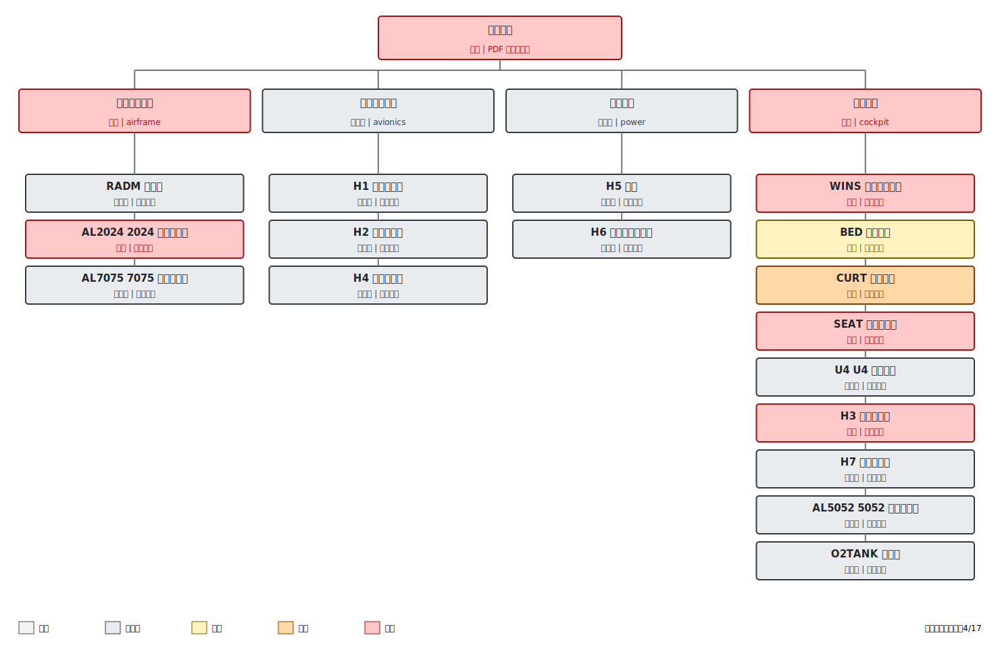

## 系统级传播结果

| 系统 | 等级 | 触发节点 | 采用的传播规则 |
|---|---:|---|---|
| 机体结构系统（`airframe`） | 重度 | AL2024 | 至少一个主要节点达到重度毁伤 |
| 航空电子系统（`avionics`） | 未毁伤 | 无 | 所有已知节点均未达到毁伤标准 |
| 电源系统（`power`） | 未毁伤 | 无 | 所有已知节点均未达到毁伤标准 |
| 座舱系统（`cockpit`） | 重度 | WINS, SEAT, H3 | 至少一个主要节点达到重度毁伤 |

## 完整设备毁伤评估

| 设备组 | 设备名称 | 毁伤树角色 | 等级 | 峰值温度（C） | 轻度证据 | 中度证据 | 重度证据 | 重度毁伤结论 | 物理解释 | 正外部热流探针数 | 有效温度探针数 |
|---|---|---|---:|---:|---|---|---|---|---|---:|---:|
| RADM | 雷达罩 | 机体结构系统：主要节点 | 未毁伤 | 987.7 | 150 C; 277.5/1200 s | 250 C; 13.5/600 s | 400 C; 4.5/180 s | 未达到：连续高于 400 C 的时间仅为 4.5/180 s | 瞬态光辐射或火灾使温度短暂超过重度阈值，但燃烧或热反馈未维持到规定时间。 | 10 | 10 |
| WINS | 有机玻璃舷窗 | 座舱系统：主要节点 | 重度 | 1209.7 | 120 C; 277.5/60 s | 200 C; 277.5/45 s | 250 C; 277.5/8 s | 已达到：峰值 1209.7 C；连续高于 250 C 的时间为 277.5/8 s | 直接外部热流和/或火灾加热同时提供了足够的温度和持续时间。 | 10 | 10 |
| BED | 尼龙床垫 | 座舱系统：主要节点 | 轻度 | 454.2 | 200 C; 76.5/60 s | 250 C; 52.5/90 s | 500 C; 0.0/5 s | 未达到：峰值 454.2 C < 500 C | 监测表面接收到正外部热流，但受脉冲能量、材料热惯性和散热影响，峰值仍低于重度毁伤阈值。 | 8 | 8 |
| CURT | 尼龙窗帘 | 座舱系统：主要节点 | 中度 | 1041.1 | 200 C; 277.5/60 s | 250 C; 277.5/90 s | 500 C; 3.0/5 s | 未达到：连续高于 500 C 的时间仅为 3.0/5 s | 瞬态光辐射或火灾使温度短暂超过重度阈值，但燃烧或热反馈未维持到规定时间。 | 10 | 10 |
| U4 | U4 仪器设备 | 座舱系统：主要节点 | 未毁伤 | 117.7 | 120 C; 0.0/300 s | 250 C; 0.0/180 s | 400 C; 0.0/5 s | 未达到：峰值 117.7 C < 400 C | 监测表面未分配到正外部热流；几何遮挡后仅靠舱内二次火灾加热，温度低于重度毁伤阈值。 | 0 | 6 |
| SEAT | 聚氨酯座椅 | 座舱系统：主要节点 | 重度 | 1729.6 | 200 C; 277.5/60 s | 300 C; 277.5/90 s | 500 C; 277.5/5 s | 已达到：峰值 1729.6 C；连续高于 500 C 的时间为 277.5/5 s | 直接外部热流和/或火灾加热同时提供了足够的温度和持续时间。 | 4 | 10 |
| AL2024 | 2024 铝合金蒙皮 | 机体结构系统：主要节点 | 重度 | 475.6 | 120 C; 277.5/1200 s | 250 C; 276.0/600 s | 400 C; 232.5/180 s | 已达到：峰值 475.6 C；连续高于 400 C 的时间为 232.5/180 s | 直接外部热流和/或火灾加热同时提供了足够的温度和持续时间。 | 5 | 10 |
| AL5052 | 5052 铝合金风管 | 座舱系统：次要节点 | 未毁伤 | 289.2 | 120 C; 138.0/1200 s | 250 C; 39.0/600 s | 400 C; 0.0/180 s | 未达到：峰值 289.2 C < 400 C | 监测表面未分配到正外部热流；几何遮挡后仅靠舱内二次火灾加热，温度低于重度毁伤阈值。 | 0 | 10 |
| AL7075 | 7075 铝合金框架 | 机体结构系统：主要节点 | 未毁伤 | 229.0 | 120 C; 277.5/1200 s | 200 C; 75.0/600 s | 400 C; 0.0/180 s | 未达到：峰值 229.0 C < 400 C | 监测表面接收到正外部热流，但受脉冲能量、材料热惯性和散热影响，峰值仍低于重度毁伤阈值。 | 3 | 10 |
| O2TANK | 氧气瓶 | 座舱系统：次要节点 | 未毁伤 | 135.4 | 120 C; 244.5/1200 s | 200 C; 0.0/600 s | 400 C; 0.0/180 s | 未达到：峰值 135.4 C < 400 C | 监测表面接收到正外部热流，但受脉冲能量、材料热惯性和散热影响，峰值仍低于重度毁伤阈值。 | 6 | 8 |
| H1 | 导航子系统 | 航空电子系统：主要节点 | 未毁伤 | 252.1 | 120 C; 243.0/300 s | 250 C; 1.5/180 s | 400 C; 0.0/5 s | 未达到：峰值 252.1 C < 400 C | 监测表面接收到正外部热流，但受脉冲能量、材料热惯性和散热影响，峰值仍低于重度毁伤阈值。 | 5 | 6 |
| H2 | 任务子系统 | 航空电子系统：主要节点 | 未毁伤 | 283.7 | 120 C; 277.5/300 s | 250 C; 75.0/180 s | 400 C; 0.0/5 s | 未达到：峰值 283.7 C < 400 C | 监测表面接收到正外部热流，但受脉冲能量、材料热惯性和散热影响，峰值仍低于重度毁伤阈值。 | 8 | 8 |
| H3 | 显示子系统 | 座舱系统：主要节点 | 重度 | 426.9 | 120 C; 132.0/300 s | 250 C; 79.5/180 s | 400 C; 15.0/5 s | 已达到：峰值 426.9 C；连续高于 400 C 的时间为 15.0/5 s | 舱内二次火灾加热同时提供了足够的温度和持续时间。 | 0 | 14 |
| H4 | 通信子系统 | 航空电子系统：次要节点 | 未毁伤 | 131.6 | 120 C; 163.5/300 s | 250 C; 0.0/180 s | 400 C; 0.0/5 s | 未达到：峰值 131.6 C < 400 C | 监测表面接收到正外部热流，但受脉冲能量、材料热惯性和散热影响，峰值仍低于重度毁伤阈值。 | 4 | 10 |
| H5 | 电池 | 电源系统：主要节点 | 未毁伤 | 52.2 | 100 C; 0.0/60 s | 150 C; 0.0/600 s | 200 C; 0.0/180 s | 未达到：峰值 52.2 C < 200 C | 监测表面接收到正外部热流，但受脉冲能量、材料热惯性和散热影响，峰值仍低于重度毁伤阈值。 | 3 | 6 |
| H6 | 电力传输子系统 | 电源系统：主要节点 | 未毁伤 | 217.7 | 120 C; 130.5/1200 s | 200 C; 24.0/600 s | 400 C; 0.0/180 s | 未达到：峰值 217.7 C < 400 C | 监测表面未分配到正外部热流；几何遮挡后仅靠舱内二次火灾加热，温度低于重度毁伤阈值。 | 0 | 8 |
| H7 | 操纵子系统 | 座舱系统：主要节点 | 未毁伤 | 421.6 | 120 C; 264.0/300 s | 250 C; 57.0/180 s | 400 C; 3.0/5 s | 未达到：连续高于 400 C 的时间仅为 3.0/5 s | 瞬态光辐射或火灾使温度短暂超过重度阈值，但燃烧或热反馈未维持到规定时间。 | 0 | 3 |

## 评估结论与解释

- 未达到重度或证据未知的设备组：**RADM, BED, CURT, U4, AL5052, AL7075, O2TANK, H1, H2, H4, H5, H6, H7**。
- 重度毁伤未满足的原因统计：**10 项受峰值温度限制**，**3 项受持续时间限制**。
- 整机等级取各系统已知等级中的最高等级：**重度**。
- H2（任务子系统）和 H3（显示子系统）属于当前模型的专用映射，其通用电子设备阈值并非 PDF 中的同名条目。
- H1-H4 探针当前测量铝合金外壳表面温度，并将其作为内部电子器件温度的代理。

## 按毁伤树原则对本案例的详细解释

该案例当前属于实时快照（案例仍在运行），有效模拟时间为 279.0 s。它可以反映已经形成的温度峰值和累计持续时间，但不能替代正常完成结果；所有临界设备仍需在完整结果中复核。
该案例标称入射面光冲量为 200 J/cm2，模型表面的最大局部积分光冲量为 194.223 J/cm2，约为标称值的 97.1%。因此设备实际受照还受到入射角、表面朝向与几何遮挡影响，不能把标称 Q 直接等同于每个设备表面接收的光冲量。
按照设备级温度与持续时间判据，当前达到重度毁伤的设备组共有 4 个：WINS, SEAT, AL2024, H3。这些设备不仅达到重度温度阈值，而且最长连续超阈时间也满足规定时长，因此其重度结论具有完整的温度和时间证据。
峰值温度受限设备包括：BED（峰值 454.2 C，阈值 500 C）、U4（峰值 117.7 C，阈值 400 C）、AL5052（峰值 289.2 C，阈值 400 C）、AL7075（峰值 229.0 C，阈值 400 C）、O2TANK（峰值 135.4 C，阈值 400 C）、H1（峰值 252.1 C，阈值 400 C）、H2（峰值 283.7 C，阈值 400 C）、H4（峰值 131.6 C，阈值 400 C）、H5（峰值 52.2 C，阈值 200 C）、H6（峰值 217.7 C，阈值 400 C）。这些对象尚未进入重度判据温度区间，继续延长模拟时间并不会自动补足峰值条件；需要结合直接受照、遮挡和二次火灾强度判断其原因。
持续时间受限设备包括：RADM（4.5/180 s，高于 400 C）、CURT（3.0/5 s，高于 500 C）、H7（3.0/5 s，高于 400 C）。这些对象已经出现足够高的瞬态峰值，但热解、燃烧或邻近火灾反馈没有把温度维持到标准要求，因此不能仅凭最高温度判为重度毁伤。
U4, AL5052, H6, H7 的有效监测面没有记录到正外部热流，它们主要依靠舱内二次火灾加热。若这些设备未达到重度，优先应检查 DDA 可见性、设备实际朝向、邻近可燃物燃烧持续性及探针是否覆盖热点，而不是直接降低材料强度或毁伤标准。
系统级传播结果为：机体结构系统为重度，触发节点为AL2024；航空电子系统为未毁伤，触发节点为无明确触发节点；电源系统为未毁伤，触发节点为无明确触发节点；座舱系统为重度，触发节点为WINS、SEAT、H3。系统等级由主要节点和次要节点按既定规则传播，不是按系统内所有设备温度求平均。
最终 PDF 毁伤树整机等级为重度，而严格全设备结果为 4/17。前者说明至少一个关键系统已达到相应任务毁伤等级；后者说明距离“所有材料和设备均重度毁伤”的研究目标仍有 13 个设备组未满足。两者必须同时保留，不能用整机重度替代 17/17。
因此，本案例是否能够作为全毁伤阈值的成功点，只取决于严格结果是否达到 17/17，并且案例是否正常完成。未达到 17/17 时，应根据上面的峰值受限、持续时间受限和遮挡分类确定下一步物理参数研究方向。

---

## 完整毁伤树评估：Q0300_W0100_az270_el15_H1H7_v5_Qnorm

- 模拟时间：**1500.00 s**
- 来源目录：`cases_qnorm/Q0300_W0100_az270_el15_H1H7_v5_Qnorm`
- 方案分类：**修正入射面归一化基线**
- 评估状态：**正常完成**
- PDF 毁伤树整机等级：**重度**
- 严格全设备重度毁伤结果：**4/17** （全部重度毁伤=否）
- 最高温度定义：几何位置有效的冗余壁面温度探针动态包络最大值。
- 注意：严格的 17/17 指标不等同于 PDF 毁伤树的整机等级判据。

## 案例配置

| 参数 | 数值 |
|---|---|
| 方案用途 | 修正入射面光冲量归一化 |
| 来源案例 | 未记录 |
| 修改因素 | 未记录 |
| 光冲量 Q（J/cm2） | 300 |
| 核爆当量（kt） | 100 |
| 方位角（度） | 270 |
| 俯仰角（度） | 15 |
| 目标模拟时长（s） | 1500 |
| MPI 进程数 | 32 |
| BURN_AWAY | 否 |
| 辐射份额 | 0.4 |
| 最大 CFL | 未记录 |
| 指定时间步长（s） | 未记录 |
| 核辐射脉冲积分（s） | 0.660398 |
| 入射面峰值辐照度（kW/m2） | 4542.71 |
| 最大局部外部热流（kW/m2） | 4412 |
| 最大局部积分光冲量（J/cm2） | 291.368 |
| 各材料 HRRPUA（kW/m2） | 未记录 |
| FDS 中全部 HRRPUA（kW/m2） | [75.0, 100.0, 180.0, 200.0, 250.0] |
| 审查后的材料厚度（m） | 未记录 |
| FDS 中全部材料层厚度（m） | [0.001, 0.0015, 0.002, 0.003, 0.005, 0.03, 0.075, 0.12, 0.15] |
| 几何是否修改 | 否 |
| 材料是否修改 | 否 |
| 燃烧参数是否修改 | 否 |
| 外部热流是否修改 | 否 |
| 点燃温度是否修改 | 否 |
| 毁伤阈值是否修改 | 否 |
| FDS 输入文件 | Q0300_W0100_az270_el15_H1H7_v5_Qnorm.fds |

## 已知问题与结果有效性

- H1-H4 目前以铝合金外壳壁面温度代理内部电子器件温度。

## 毁伤树

## 系统级传播结果

| 系统 | 等级 | 触发节点 | 采用的传播规则 |
|---|---:|---|---|
| 机体结构系统（`airframe`） | 重度 | AL2024 | 至少一个主要节点达到重度毁伤 |
| 航空电子系统（`avionics`） | 轻度 | H2, H4 | 至少一个已知节点达到轻度，且未触发更高等级 |
| 电源系统（`power`） | 未毁伤 | 无 | 所有已知节点均未达到毁伤标准 |
| 座舱系统（`cockpit`） | 重度 | WINS, SEAT, H3 | 至少一个主要节点达到重度毁伤 |

## 完整设备毁伤评估

| 设备组 | 设备名称 | 毁伤树角色 | 等级 | 峰值温度（C） | 轻度证据 | 中度证据 | 重度证据 | 重度毁伤结论 | 物理解释 | 正外部热流探针数 | 有效温度探针数 |
|---|---|---|---:|---:|---|---|---|---|---|---:|---:|
| RADM | 雷达罩 | 机体结构系统：主要节点 | 中度 | 1300.8 | 150 C; 1498.5/1200 s | 250 C; 894.0/600 s | 400 C; 7.5/180 s | 未达到：连续高于 400 C 的时间仅为 7.5/180 s | 瞬态光辐射或火灾使温度短暂超过重度阈值，但燃烧或热反馈未维持到规定时间。 | 10 | 10 |
| WINS | 有机玻璃舷窗 | 座舱系统：主要节点 | 重度 | 1504.1 | 120 C; 1498.5/60 s | 200 C; 1498.5/45 s | 250 C; 1498.5/8 s | 已达到：峰值 1504.1 C；连续高于 250 C 的时间为 1498.5/8 s | 直接外部热流和/或火灾加热同时提供了足够的温度和持续时间。 | 10 | 10 |
| BED | 尼龙床垫 | 座舱系统：主要节点 | 未毁伤 | 547.6 | 200 C; 45.0/60 s | 250 C; 19.5/90 s | 500 C; 0.0/5 s | 未达到：连续高于 500 C 的时间仅为 0.0/5 s | 瞬态光辐射或火灾使温度短暂超过重度阈值，但燃烧或热反馈未维持到规定时间。 | 8 | 8 |
| CURT | 尼龙窗帘 | 座舱系统：主要节点 | 中度 | 1330.1 | 200 C; 1237.5/60 s | 250 C; 1011.0/90 s | 500 C; 4.5/5 s | 未达到：连续高于 500 C 的时间仅为 4.5/5 s | 瞬态光辐射或火灾使温度短暂超过重度阈值，但燃烧或热反馈未维持到规定时间。 | 10 | 10 |
| U4 | U4 仪器设备 | 座舱系统：主要节点 | 中度 | 267.4 | 120 C; 1140.0/300 s | 250 C; 330.0/180 s | 400 C; 0.0/5 s | 未达到：峰值 267.4 C < 400 C | 监测表面未分配到正外部热流；几何遮挡后仅靠舱内二次火灾加热，温度低于重度毁伤阈值。 | 0 | 6 |
| SEAT | 聚氨酯座椅 | 座舱系统：主要节点 | 重度 | 2726.8 | 200 C; 1498.5/60 s | 300 C; 1498.5/90 s | 500 C; 1498.5/5 s | 已达到：峰值 2726.8 C；连续高于 500 C 的时间为 1498.5/5 s | 直接外部热流和/或火灾加热同时提供了足够的温度和持续时间。 | 4 | 10 |
| AL2024 | 2024 铝合金蒙皮 | 机体结构系统：主要节点 | 重度 | 550.9 | 120 C; 1498.5/1200 s | 250 C; 1498.5/600 s | 400 C; 1497.0/180 s | 已达到：峰值 550.9 C；连续高于 400 C 的时间为 1497.0/180 s | 直接外部热流和/或火灾加热同时提供了足够的温度和持续时间。 | 5 | 10 |
| AL5052 | 5052 铝合金风管 | 座舱系统：次要节点 | 中度 | 371.1 | 120 C; 1324.5/1200 s | 250 C; 1185.0/600 s | 400 C; 0.0/180 s | 未达到：峰值 371.1 C < 400 C | 监测表面未分配到正外部热流；几何遮挡后仅靠舱内二次火灾加热，温度低于重度毁伤阈值。 | 0 | 10 |
| AL7075 | 7075 铝合金框架 | 机体结构系统：主要节点 | 轻度 | 330.0 | 120 C; 1498.5/1200 s | 200 C; 160.5/600 s | 400 C; 0.0/180 s | 未达到：峰值 330.0 C < 400 C | 监测表面接收到正外部热流，但受脉冲能量、材料热惯性和散热影响，峰值仍低于重度毁伤阈值。 | 3 | 10 |
| O2TANK | 氧气瓶 | 座舱系统：次要节点 | 轻度 | 235.9 | 120 C; 1497.0/1200 s | 200 C; 489.0/600 s | 400 C; 0.0/180 s | 未达到：峰值 235.9 C < 400 C | 监测表面接收到正外部热流，但受脉冲能量、材料热惯性和散热影响，峰值仍低于重度毁伤阈值。 | 6 | 8 |
| H1 | 导航子系统 | 航空电子系统：主要节点 | 未毁伤 | 363.5 | 120 C; 295.5/300 s | 250 C; 79.5/180 s | 400 C; 0.0/5 s | 未达到：峰值 363.5 C < 400 C | 监测表面接收到正外部热流，但受脉冲能量、材料热惯性和散热影响，峰值仍低于重度毁伤阈值。 | 5 | 6 |
| H2 | 任务子系统 | 航空电子系统：主要节点 | 轻度 | 368.1 | 120 C; 408.0/300 s | 250 C; 121.5/180 s | 400 C; 0.0/5 s | 未达到：峰值 368.1 C < 400 C | 监测表面接收到正外部热流，但受脉冲能量、材料热惯性和散热影响，峰值仍低于重度毁伤阈值。 | 8 | 8 |
| H3 | 显示子系统 | 座舱系统：主要节点 | 重度 | 589.6 | 120 C; 1327.5/300 s | 250 C; 1267.5/180 s | 400 C; 1195.5/5 s | 已达到：峰值 589.6 C；连续高于 400 C 的时间为 1195.5/5 s | 舱内二次火灾加热同时提供了足够的温度和持续时间。 | 0 | 14 |
| H4 | 通信子系统 | 航空电子系统：次要节点 | 轻度 | 197.8 | 120 C; 1471.5/300 s | 250 C; 0.0/180 s | 400 C; 0.0/5 s | 未达到：峰值 197.8 C < 400 C | 监测表面接收到正外部热流，但受脉冲能量、材料热惯性和散热影响，峰值仍低于重度毁伤阈值。 | 4 | 10 |
| H5 | 电池 | 电源系统：主要节点 | 未毁伤 | 90.4 | 100 C; 0.0/60 s | 150 C; 0.0/600 s | 200 C; 0.0/180 s | 未达到：峰值 90.4 C < 200 C | 监测表面接收到正外部热流，但受脉冲能量、材料热惯性和散热影响，峰值仍低于重度毁伤阈值。 | 3 | 6 |
| H6 | 电力传输子系统 | 电源系统：主要节点 | 未毁伤 | 258.8 | 120 C; 936.0/1200 s | 200 C; 46.5/600 s | 400 C; 0.0/180 s | 未达到：峰值 258.8 C < 400 C | 监测表面未分配到正外部热流；几何遮挡后仅靠舱内二次火灾加热，温度低于重度毁伤阈值。 | 0 | 8 |
| H7 | 操纵子系统 | 座舱系统：主要节点 | 轻度 | 335.8 | 120 C; 1486.5/300 s | 250 C; 43.5/180 s | 400 C; 0.0/5 s | 未达到：峰值 335.8 C < 400 C | 监测表面未分配到正外部热流；几何遮挡后仅靠舱内二次火灾加热，温度低于重度毁伤阈值。 | 0 | 3 |

## 评估结论与解释

- 未达到重度或证据未知的设备组：**RADM, BED, CURT, U4, AL5052, AL7075, O2TANK, H1, H2, H4, H5, H6, H7**。
- 重度毁伤未满足的原因统计：**10 项受峰值温度限制**，**3 项受持续时间限制**。
- 整机等级取各系统已知等级中的最高等级：**重度**。
- H2（任务子系统）和 H3（显示子系统）属于当前模型的专用映射，其通用电子设备阈值并非 PDF 中的同名条目。
- H1-H4 探针当前测量铝合金外壳表面温度，并将其作为内部电子器件温度的代理。

## 按毁伤树原则对本案例的详细解释

该案例已正常运行到目标时长，且日志中存在 FDS 正常完成标记，因此可作为正式结果参与同参数族的阈值比较。
该案例标称入射面光冲量为 300 J/cm2，模型表面的最大局部积分光冲量为 291.368 J/cm2，约为标称值的 97.1%。因此设备实际受照还受到入射角、表面朝向与几何遮挡影响，不能把标称 Q 直接等同于每个设备表面接收的光冲量。
按照设备级温度与持续时间判据，当前达到重度毁伤的设备组共有 4 个：WINS, SEAT, AL2024, H3。这些设备不仅达到重度温度阈值，而且最长连续超阈时间也满足规定时长，因此其重度结论具有完整的温度和时间证据。
峰值温度受限设备包括：U4（峰值 267.4 C，阈值 400 C）、AL5052（峰值 371.1 C，阈值 400 C）、AL7075（峰值 330.0 C，阈值 400 C）、O2TANK（峰值 235.9 C，阈值 400 C）、H1（峰值 363.5 C，阈值 400 C）、H2（峰值 368.1 C，阈值 400 C）、H4（峰值 197.8 C，阈值 400 C）、H5（峰值 90.4 C，阈值 200 C）、H6（峰值 258.8 C，阈值 400 C）、H7（峰值 335.8 C，阈值 400 C）。这些对象尚未进入重度判据温度区间，继续延长模拟时间并不会自动补足峰值条件；需要结合直接受照、遮挡和二次火灾强度判断其原因。
持续时间受限设备包括：RADM（7.5/180 s，高于 400 C）、BED（0.0/5 s，高于 500 C）、CURT（4.5/5 s，高于 500 C）。这些对象已经出现足够高的瞬态峰值，但热解、燃烧或邻近火灾反馈没有把温度维持到标准要求，因此不能仅凭最高温度判为重度毁伤。
U4, AL5052, H6, H7 的有效监测面没有记录到正外部热流，它们主要依靠舱内二次火灾加热。若这些设备未达到重度，优先应检查 DDA 可见性、设备实际朝向、邻近可燃物燃烧持续性及探针是否覆盖热点，而不是直接降低材料强度或毁伤标准。
系统级传播结果为：机体结构系统为重度，触发节点为AL2024；航空电子系统为轻度，触发节点为H2、H4；电源系统为未毁伤，触发节点为无明确触发节点；座舱系统为重度，触发节点为WINS、SEAT、H3。系统等级由主要节点和次要节点按既定规则传播，不是按系统内所有设备温度求平均。
最终 PDF 毁伤树整机等级为重度，而严格全设备结果为 4/17。前者说明至少一个关键系统已达到相应任务毁伤等级；后者说明距离“所有材料和设备均重度毁伤”的研究目标仍有 13 个设备组未满足。两者必须同时保留，不能用整机重度替代 17/17。
因此，本案例是否能够作为全毁伤阈值的成功点，只取决于严格结果是否达到 17/17，并且案例是否正常完成。未达到 17/17 时，应根据上面的峰值受限、持续时间受限和遮挡分类确定下一步物理参数研究方向。

---

## 完整毁伤树评估：Q0400_W0100_az060_el75_H1H7_v5_Qnorm_adapt_HRRtable_seatSTLfill_thin4mm_v1

- 模拟时间：**1500.00 s**
- 来源目录：`cases_adaptive/Q0400_W0100_az060_el75_H1H7_v5_Qnorm_adapt_HRRtable_seatSTLfill_thin4mm_v1`
- 方案分类：**自适应敏感性方案（单独比较）**
- 评估状态：**正常完成**
- PDF 毁伤树整机等级：**重度**
- 严格全设备重度毁伤结果：**10/17** （全部重度毁伤=否）
- 最高温度定义：几何位置有效的冗余壁面温度探针动态包络最大值。
- 注意：严格的 17/17 指标不等同于 PDF 毁伤树的整机等级判据。

## 案例配置

| 参数 | 数值 |
|---|---|
| 方案用途 | Q400_angle60_75_table_HRRPUA_STL_filled_seats_audited_4mm_shells |
| 来源案例 | 未记录 |
| 修改因素 | 未记录 |
| 光冲量 Q（J/cm2） | 400 |
| 核爆当量（kt） | 100 |
| 方位角（度） | 60 |
| 俯仰角（度） | 75 |
| 目标模拟时长（s） | 1500 |
| MPI 进程数 | 32 |
| BURN_AWAY | 否 |
| 辐射份额 | 0.35 |
| 最大 CFL | 未记录 |
| 指定时间步长（s） | 未记录 |
| 核辐射脉冲积分（s） | 0.660398 |
| 入射面峰值辐照度（kW/m2） | 6056.95 |
| 最大局部外部热流（kW/m2） | 5883 |
| 最大局部积分光冲量（J/cm2） | 388.512 |
| 各材料 HRRPUA（kW/m2） | 未记录 |
| FDS 中全部 HRRPUA（kW/m2） | [75.0, 180.0, 200.0, 250.0, 350.0, 400.0, 450.0] |
| 审查后的材料厚度（m） | 未记录 |
| FDS 中全部材料层厚度（m） | [0.001, 0.0015, 0.002, 0.003, 0.004, 0.005, 0.03, 0.075, 0.12, 0.15] |
| 几何是否修改 | 否 |
| 材料是否修改 | 否 |
| 燃烧参数是否修改 | 否 |
| 外部热流是否修改 | 否 |
| 点燃温度是否修改 | 否 |
| 毁伤阈值是否修改 | 否 |
| FDS 输入文件 | Q0400_W0100_az060_el75_H1H7_v5_Qnorm_adapt_HRRtable_seatSTLfill_thin4mm_v1.fds |

## 已知问题与结果有效性

- H1-H4 目前以铝合金外壳壁面温度代理内部电子器件温度。

## 毁伤树

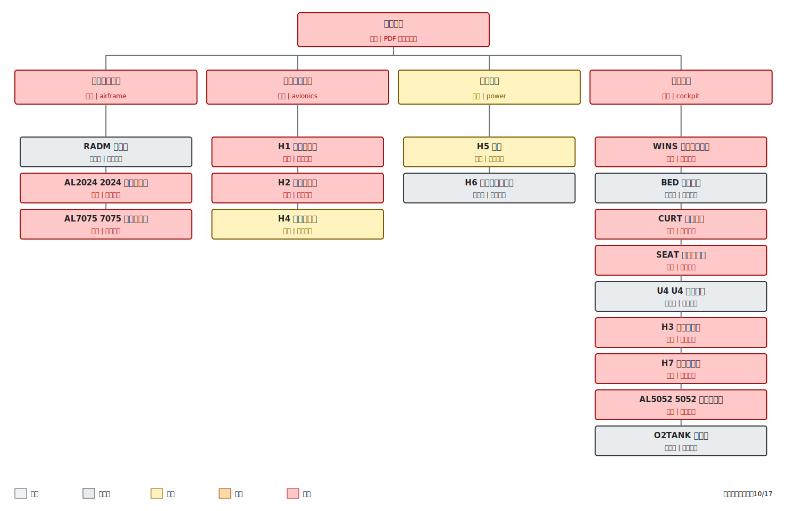

## 系统级传播结果

| 系统 | 等级 | 触发节点 | 采用的传播规则 |
|---|---:|---|---|
| 机体结构系统（`airframe`） | 重度 | AL2024, AL7075 | 至少一个主要节点达到重度毁伤 |
| 航空电子系统（`avionics`） | 重度 | H1, H2 | 至少一个主要节点达到重度毁伤 |
| 电源系统（`power`） | 轻度 | H5 | 至少一个已知节点达到轻度，且未触发更高等级 |
| 座舱系统（`cockpit`） | 重度 | WINS, CURT, SEAT, H3, H7 | 至少一个主要节点达到重度毁伤 |

## 完整设备毁伤评估

| 设备组 | 设备名称 | 毁伤树角色 | 等级 | 峰值温度（C） | 轻度证据 | 中度证据 | 重度证据 | 重度毁伤结论 | 物理解释 | 正外部热流探针数 | 有效温度探针数 |
|---|---|---|---:|---:|---|---|---|---|---|---:|---:|
| RADM | 雷达罩 | 机体结构系统：主要节点 | 轻度 | 1529.8 | 150 C; 1498.5/1200 s | 250 C; 180.0/600 s | 400 C; 9.0/180 s | 未达到：连续高于 400 C 的时间仅为 9.0/180 s | 瞬态光辐射或火灾使温度短暂超过重度阈值，但燃烧或热反馈未维持到规定时间。 | 9 | 10 |
| WINS | 有机玻璃舷窗 | 座舱系统：主要节点 | 重度 | 1752.8 | 120 C; 1498.5/60 s | 200 C; 1498.5/45 s | 250 C; 1498.5/8 s | 已达到：峰值 1752.8 C；连续高于 250 C 的时间为 1498.5/8 s | 直接外部热流和/或火灾加热同时提供了足够的温度和持续时间。 | 10 | 10 |
| BED | 尼龙床垫 | 座舱系统：主要节点 | 未毁伤 | 151.8 | 200 C; 0.0/60 s | 250 C; 0.0/90 s | 500 C; 0.0/5 s | 未达到：峰值 151.8 C < 500 C | 监测表面未分配到正外部热流；几何遮挡后仅靠舱内二次火灾加热，温度低于重度毁伤阈值。 | 0 | 2 |
| CURT | 尼龙窗帘 | 座舱系统：主要节点 | 重度 | 1554.5 | 200 C; 1498.5/60 s | 250 C; 1498.5/90 s | 500 C; 40.5/5 s | 已达到：峰值 1554.5 C；连续高于 500 C 的时间为 40.5/5 s | 直接外部热流和/或火灾加热同时提供了足够的温度和持续时间。 | 8 | 10 |
| U4 | U4 仪器设备 | 座舱系统：主要节点 | 中度 | 317.7 | 120 C; 1144.5/300 s | 250 C; 658.5/180 s | 400 C; 0.0/5 s | 未达到：峰值 317.7 C < 400 C | 监测表面未分配到正外部热流；几何遮挡后仅靠舱内二次火灾加热，温度低于重度毁伤阈值。 | 0 | 10 |
| SEAT | 聚氨酯座椅 | 座舱系统：主要节点 | 重度 | 1604.3 | 200 C; 1498.5/60 s | 300 C; 1276.5/90 s | 500 C; 25.5/5 s | 已达到：峰值 1604.3 C；连续高于 500 C 的时间为 25.5/5 s | 直接外部热流和/或火灾加热同时提供了足够的温度和持续时间。 | 1 | 10 |
| AL2024 | 2024 铝合金蒙皮 | 机体结构系统：主要节点 | 重度 | 487.2 | 120 C; 1498.5/1200 s | 250 C; 1498.5/600 s | 400 C; 1092.0/180 s | 已达到：峰值 487.2 C；连续高于 400 C 的时间为 1092.0/180 s | 直接外部热流和/或火灾加热同时提供了足够的温度和持续时间。 | 6 | 10 |
| AL5052 | 5052 铝合金风管 | 座舱系统：次要节点 | 重度 | 832.9 | 120 C; 1498.5/1200 s | 250 C; 1384.5/600 s | 400 C; 1303.5/180 s | 已达到：峰值 832.9 C；连续高于 400 C 的时间为 1303.5/180 s | 直接外部热流和/或火灾加热同时提供了足够的温度和持续时间。 | 3 | 10 |
| AL7075 | 7075 铝合金框架 | 机体结构系统：主要节点 | 重度 | 549.7 | 120 C; 1498.5/1200 s | 200 C; 1498.5/600 s | 400 C; 1201.5/180 s | 已达到：峰值 549.7 C；连续高于 400 C 的时间为 1201.5/180 s | 直接外部热流和/或火灾加热同时提供了足够的温度和持续时间。 | 3 | 10 |
| O2TANK | 氧气瓶 | 座舱系统：次要节点 | 轻度 | 277.4 | 120 C; 1498.5/1200 s | 200 C; 459.0/600 s | 400 C; 0.0/180 s | 未达到：峰值 277.4 C < 400 C | 监测表面接收到正外部热流，但受脉冲能量、材料热惯性和散热影响，峰值仍低于重度毁伤阈值。 | 3 | 8 |
| H1 | 导航子系统 | 航空电子系统：主要节点 | 重度 | 488.0 | 120 C; 1498.5/300 s | 250 C; 364.5/180 s | 400 C; 46.5/5 s | 已达到：峰值 488.0 C；连续高于 400 C 的时间为 46.5/5 s | 直接外部热流和/或火灾加热同时提供了足够的温度和持续时间。 | 5 | 6 |
| H2 | 任务子系统 | 航空电子系统：主要节点 | 重度 | 491.6 | 120 C; 1498.5/300 s | 250 C; 148.5/180 s | 400 C; 39.0/5 s | 已达到：峰值 491.6 C；连续高于 400 C 的时间为 39.0/5 s | 直接外部热流和/或火灾加热同时提供了足够的温度和持续时间。 | 6 | 8 |
| H3 | 显示子系统 | 座舱系统：主要节点 | 重度 | 584.2 | 120 C; 1498.5/300 s | 250 C; 1311.0/180 s | 400 C; 1227.0/5 s | 已达到：峰值 584.2 C；连续高于 400 C 的时间为 1227.0/5 s | 直接外部热流和/或火灾加热同时提供了足够的温度和持续时间。 | 6 | 14 |
| H4 | 通信子系统 | 航空电子系统：次要节点 | 轻度 | 382.3 | 120 C; 1498.5/300 s | 250 C; 81.0/180 s | 400 C; 0.0/5 s | 未达到：峰值 382.3 C < 400 C | 监测表面接收到正外部热流，但受脉冲能量、材料热惯性和散热影响，峰值仍低于重度毁伤阈值。 | 8 | 10 |
| H5 | 电池 | 电源系统：主要节点 | 轻度 | 173.6 | 100 C; 936.0/60 s | 150 C; 547.5/600 s | 200 C; 0.0/180 s | 未达到：峰值 173.6 C < 200 C | 监测表面未分配到正外部热流；几何遮挡后仅靠舱内二次火灾加热，温度低于重度毁伤阈值。 | 0 | 6 |
| H6 | 电力传输子系统 | 电源系统：主要节点 | 未毁伤 | 545.8 | 120 C; 1095.0/1200 s | 200 C; 466.5/600 s | 400 C; 15.0/180 s | 未达到：连续高于 400 C 的时间仅为 15.0/180 s | 瞬态光辐射或火灾使温度短暂超过重度阈值，但燃烧或热反馈未维持到规定时间。 | 0 | 10 |
| H7 | 操纵子系统 | 座舱系统：主要节点 | 重度 | 1624.0 | 120 C; 1498.5/300 s | 250 C; 69.0/180 s | 400 C; 27.0/5 s | 已达到：峰值 1624.0 C；连续高于 400 C 的时间为 27.0/5 s | 直接外部热流和/或火灾加热同时提供了足够的温度和持续时间。 | 7 | 9 |

## 评估结论与解释

- 未达到重度或证据未知的设备组：**RADM, BED, U4, O2TANK, H4, H5, H6**。
- 重度毁伤未满足的原因统计：**5 项受峰值温度限制**，**2 项受持续时间限制**。
- 整机等级取各系统已知等级中的最高等级：**重度**。
- H2（任务子系统）和 H3（显示子系统）属于当前模型的专用映射，其通用电子设备阈值并非 PDF 中的同名条目。
- H1-H4 探针当前测量铝合金外壳表面温度，并将其作为内部电子器件温度的代理。

## 按毁伤树原则对本案例的详细解释

该案例已正常运行到目标时长，且日志中存在 FDS 正常完成标记，因此可作为正式结果参与同参数族的阈值比较。
该案例标称入射面光冲量为 400 J/cm2，模型表面的最大局部积分光冲量为 388.512 J/cm2，约为标称值的 97.1%。因此设备实际受照还受到入射角、表面朝向与几何遮挡影响，不能把标称 Q 直接等同于每个设备表面接收的光冲量。
按照设备级温度与持续时间判据，当前达到重度毁伤的设备组共有 10 个：WINS, CURT, SEAT, AL2024, AL5052, AL7075, H1, H2, H3, H7。这些设备不仅达到重度温度阈值，而且最长连续超阈时间也满足规定时长，因此其重度结论具有完整的温度和时间证据。
峰值温度受限设备包括：BED（峰值 151.8 C，阈值 500 C）、U4（峰值 317.7 C，阈值 400 C）、O2TANK（峰值 277.4 C，阈值 400 C）、H4（峰值 382.3 C，阈值 400 C）、H5（峰值 173.6 C，阈值 200 C）。这些对象尚未进入重度判据温度区间，继续延长模拟时间并不会自动补足峰值条件；需要结合直接受照、遮挡和二次火灾强度判断其原因。
持续时间受限设备包括：RADM（9.0/180 s，高于 400 C）、H6（15.0/180 s，高于 400 C）。这些对象已经出现足够高的瞬态峰值，但热解、燃烧或邻近火灾反馈没有把温度维持到标准要求，因此不能仅凭最高温度判为重度毁伤。
BED, U4, H5, H6 的有效监测面没有记录到正外部热流，它们主要依靠舱内二次火灾加热。若这些设备未达到重度，优先应检查 DDA 可见性、设备实际朝向、邻近可燃物燃烧持续性及探针是否覆盖热点，而不是直接降低材料强度或毁伤标准。
系统级传播结果为：机体结构系统为重度，触发节点为AL2024、AL7075；航空电子系统为重度，触发节点为H1、H2；电源系统为轻度，触发节点为H5；座舱系统为重度，触发节点为WINS、CURT、SEAT、H3、H7。系统等级由主要节点和次要节点按既定规则传播，不是按系统内所有设备温度求平均。
最终 PDF 毁伤树整机等级为重度，而严格全设备结果为 10/17。前者说明至少一个关键系统已达到相应任务毁伤等级；后者说明距离“所有材料和设备均重度毁伤”的研究目标仍有 7 个设备组未满足。两者必须同时保留，不能用整机重度替代 17/17。
因此，本案例是否能够作为全毁伤阈值的成功点，只取决于严格结果是否达到 17/17，并且案例是否正常完成。未达到 17/17 时，应根据上面的峰值受限、持续时间受限和遮挡分类确定下一步物理参数研究方向。

---

## 完整毁伤树评估：Q0400_W0100_az270_el15_H1H7_v5_Qnorm_adapt_HRRmid_thickness_audit_BAtrue_v1

- 模拟时间：**48.00 s**
- 来源目录：`cases_adaptive/Q0400_W0100_az270_el15_H1H7_v5_Qnorm_adapt_HRRmid_thickness_audit_BAtrue_v1`
- 方案分类：**自适应敏感性方案（单独比较）**
- 评估状态：**实时快照（案例仍在运行）**
- PDF 毁伤树整机等级：**重度**
- 严格全设备重度毁伤结果：**6/17** （全部重度毁伤=否）
- 最高温度定义：几何位置有效的冗余壁面温度探针动态包络最大值。
- 注意：严格的 17/17 指标不等同于 PDF 毁伤树的整机等级判据。

## 案例配置

| 参数 | 数值 |
|---|---|
| 方案用途 | mid_high_HRRPUA_shell_seat_BURN_AWAY_sensitivity |
| 来源案例 | Q0400_W0100_az270_el15_H1H7_v5_Qnorm_adapt_HRRtable_thickness_audit_BAtrue_v2_volumetric |
| 修改因素 | HRRPUA only |
| 光冲量 Q（J/cm2） | 400 |
| 核爆当量（kt） | 100 |
| 方位角（度） | 270 |
| 俯仰角（度） | 15 |
| 目标模拟时长（s） | 1500 |
| MPI 进程数 | 32 |
| BURN_AWAY | 是 |
| 辐射份额 | 0.4 |
| 最大 CFL | 未记录 |
| 指定时间步长（s） | 未记录 |
| 核辐射脉冲积分（s） | 未记录 |
| 入射面峰值辐照度（kW/m2） | 未记录 |
| 最大局部外部热流（kW/m2） | 未记录 |
| 最大局部积分光冲量（J/cm2） | 未记录 |
| 各材料 HRRPUA（kW/m2） | {"BED": 600.0, "CURT": 400.0, "H6": 230.0, "H7": 320.0, "RADM": 400.0, "SEAT": 650.0, "U4": 600.0, "WINS": 500.0} |
| FDS 中全部 HRRPUA（kW/m2） | [230.0, 250.0, 320.0, 400.0, 450.0, 500.0, 600.0, 650.0] |
| 审查后的材料厚度（m） | 未记录 |
| FDS 中全部材料层厚度（m） | [0.00089, 0.001, 0.0015, 0.002, 0.003, 0.005, 0.006, 0.025, 0.1, 0.15] |
| 几何是否修改 | 否 |
| 材料是否修改 | 否 |
| 燃烧参数是否修改 | 否 |
| 外部热流是否修改 | 否 |
| 点燃温度是否修改 | 否 |
| 毁伤阈值是否修改 | 否 |
| FDS 输入文件 | Q0400_W0100_az270_el15_H1H7_v5_Qnorm_adapt_HRRmid_thickness_audit_BAtrue_v1.fds |

## 已知问题与结果有效性

- 该结果是 48.0 s 的长时快照，缺少 FDS 正常结束标记；在达到 T_END 前，温度和毁伤等级仍可能变化。
- H1-H4 目前以铝合金外壳壁面温度代理内部电子器件温度。

## 毁伤树

## 系统级传播结果

| 系统 | 等级 | 触发节点 | 采用的传播规则 |
|---|---:|---|---|
| 机体结构系统（`airframe`） | 未毁伤 | 无 | 所有已知节点均未达到毁伤标准 |
| 航空电子系统（`avionics`） | 重度 | H1, H2 | 至少一个主要节点达到重度毁伤 |
| 电源系统（`power`） | 未毁伤 | 无 | 所有已知节点均未达到毁伤标准 |
| 座舱系统（`cockpit`） | 重度 | WINS, BED, CURT, SEAT | 至少一个主要节点达到重度毁伤 |

## 完整设备毁伤评估

| 设备组 | 设备名称 | 毁伤树角色 | 等级 | 峰值温度（C） | 轻度证据 | 中度证据 | 重度证据 | 重度毁伤结论 | 物理解释 | 正外部热流探针数 | 有效温度探针数 |
|---|---|---|---:|---:|---|---|---|---|---|---:|---:|
| RADM | 雷达罩 | 机体结构系统：主要节点 | 未毁伤 | 1526.5 | 150 C; 46.5/1200 s | 250 C; 46.5/600 s | 400 C; 46.5/180 s | 未达到：连续高于 400 C 的时间仅为 46.5/180 s | 瞬态光辐射或火灾使温度短暂超过重度阈值，但燃烧或热反馈未维持到规定时间。 | 10 | 10 |
| WINS | 有机玻璃舷窗 | 座舱系统：主要节点 | 重度 | 1714.6 | 120 C; 46.5/60 s | 200 C; 46.5/45 s | 250 C; 46.5/8 s | 已达到：峰值 1714.6 C；连续高于 250 C 的时间为 46.5/8 s | 直接外部热流和/或火灾加热同时提供了足够的温度和持续时间。 | 10 | 10 |
| BED | 尼龙床垫 | 座舱系统：主要节点 | 重度 | 674.9 | 200 C; 46.5/60 s | 250 C; 46.5/90 s | 500 C; 16.5/5 s | 已达到：峰值 674.9 C；连续高于 500 C 的时间为 16.5/5 s | 直接外部热流和/或火灾加热同时提供了足够的温度和持续时间。 | 8 | 8 |
| CURT | 尼龙窗帘 | 座舱系统：主要节点 | 重度 | 1537.8 | 200 C; 46.5/60 s | 250 C; 46.5/90 s | 500 C; 13.5/5 s | 已达到：峰值 1537.8 C；连续高于 500 C 的时间为 13.5/5 s | 直接外部热流和/或火灾加热同时提供了足够的温度和持续时间。 | 10 | 10 |
| U4 | U4 仪器设备 | 座舱系统：主要节点 | 未毁伤 | 92.7 | 120 C; 0.0/300 s | 250 C; 0.0/180 s | 400 C; 0.0/5 s | 未达到：峰值 92.7 C < 400 C | 监测表面未分配到正外部热流；几何遮挡后仅靠舱内二次火灾加热，温度低于重度毁伤阈值。 | 0 | 6 |
| SEAT | 聚氨酯座椅 | 座舱系统：主要节点 | 重度 | 2495.0 | 200 C; 46.5/60 s | 300 C; 46.5/90 s | 500 C; 46.5/5 s | 已达到：峰值 2495.0 C；连续高于 500 C 的时间为 46.5/5 s | 直接外部热流和/或火灾加热同时提供了足够的温度和持续时间。 | 4 | 10 |
| AL2024 | 2024 铝合金蒙皮 | 机体结构系统：主要节点 | 未毁伤 | 707.5 | 120 C; 46.5/1200 s | 250 C; 46.5/600 s | 400 C; 46.5/180 s | 未达到：连续高于 400 C 的时间仅为 46.5/180 s | 瞬态光辐射或火灾使温度短暂超过重度阈值，但燃烧或热反馈未维持到规定时间。 | 5 | 10 |
| AL5052 | 5052 铝合金风管 | 座舱系统：次要节点 | 未毁伤 | 76.4 | 120 C; 0.0/1200 s | 250 C; 0.0/600 s | 400 C; 0.0/180 s | 未达到：峰值 76.4 C < 400 C | 监测表面未分配到正外部热流；几何遮挡后仅靠舱内二次火灾加热，温度低于重度毁伤阈值。 | 0 | 10 |
| AL7075 | 7075 铝合金框架 | 机体结构系统：主要节点 | 未毁伤 | 436.9 | 120 C; 46.5/1200 s | 200 C; 46.5/600 s | 400 C; 25.5/180 s | 未达到：连续高于 400 C 的时间仅为 25.5/180 s | 瞬态光辐射或火灾使温度短暂超过重度阈值，但燃烧或热反馈未维持到规定时间。 | 3 | 10 |
| O2TANK | 氧气瓶 | 座舱系统：次要节点 | 未毁伤 | 215.7 | 120 C; 46.5/1200 s | 200 C; 42.0/600 s | 400 C; 0.0/180 s | 未达到：峰值 215.7 C < 400 C | 监测表面接收到正外部热流，但受脉冲能量、材料热惯性和散热影响，峰值仍低于重度毁伤阈值。 | 6 | 8 |
| H1 | 导航子系统 | 航空电子系统：主要节点 | 重度 | 470.4 | 120 C; 46.5/300 s | 250 C; 46.5/180 s | 400 C; 22.5/5 s | 已达到：峰值 470.4 C；连续高于 400 C 的时间为 22.5/5 s | 直接外部热流和/或火灾加热同时提供了足够的温度和持续时间。 | 5 | 6 |
| H2 | 任务子系统 | 航空电子系统：主要节点 | 重度 | 488.1 | 120 C; 46.5/300 s | 250 C; 46.5/180 s | 400 C; 33.0/5 s | 已达到：峰值 488.1 C；连续高于 400 C 的时间为 33.0/5 s | 直接外部热流和/或火灾加热同时提供了足够的温度和持续时间。 | 8 | 8 |
| H3 | 显示子系统 | 座舱系统：主要节点 | 未毁伤 | 66.1 | 120 C; 0.0/300 s | 250 C; 0.0/180 s | 400 C; 0.0/5 s | 未达到：峰值 66.1 C < 400 C | 监测表面未分配到正外部热流；几何遮挡后仅靠舱内二次火灾加热，温度低于重度毁伤阈值。 | 0 | 14 |
| H4 | 通信子系统 | 航空电子系统：次要节点 | 未毁伤 | 161.8 | 120 C; 42.0/300 s | 250 C; 0.0/180 s | 400 C; 0.0/5 s | 未达到：峰值 161.8 C < 400 C | 监测表面接收到正外部热流，但受脉冲能量、材料热惯性和散热影响，峰值仍低于重度毁伤阈值。 | 4 | 10 |
| H5 | 电池 | 电源系统：主要节点 | 未毁伤 | 41.0 | 100 C; 0.0/60 s | 150 C; 0.0/600 s | 200 C; 0.0/180 s | 未达到：峰值 41.0 C < 200 C | 监测表面接收到正外部热流，但受脉冲能量、材料热惯性和散热影响，峰值仍低于重度毁伤阈值。 | 3 | 6 |
| H6 | 电力传输子系统 | 电源系统：主要节点 | 未毁伤 | 293.8 | 120 C; 13.5/1200 s | 200 C; 4.5/600 s | 400 C; 0.0/180 s | 未达到：峰值 293.8 C < 400 C | 监测表面未分配到正外部热流；几何遮挡后仅靠舱内二次火灾加热，温度低于重度毁伤阈值。 | 0 | 8 |
| H7 | 操纵子系统 | 座舱系统：主要节点 | 未毁伤 | 299.5 | 120 C; 42.0/300 s | 250 C; 24.0/180 s | 400 C; 0.0/5 s | 未达到：峰值 299.5 C < 400 C | 监测表面未分配到正外部热流；几何遮挡后仅靠舱内二次火灾加热，温度低于重度毁伤阈值。 | 0 | 3 |

## 评估结论与解释

- 未达到重度或证据未知的设备组：**RADM, U4, AL2024, AL5052, AL7075, O2TANK, H3, H4, H5, H6, H7**。
- 重度毁伤未满足的原因统计：**8 项受峰值温度限制**，**3 项受持续时间限制**。
- 整机等级取各系统已知等级中的最高等级：**重度**。
- H2（任务子系统）和 H3（显示子系统）属于当前模型的专用映射，其通用电子设备阈值并非 PDF 中的同名条目。
- H1-H4 探针当前测量铝合金外壳表面温度，并将其作为内部电子器件温度的代理。

## 按毁伤树原则对本案例的详细解释

该案例当前属于实时快照（案例仍在运行），有效模拟时间为 48.0 s。它可以反映已经形成的温度峰值和累计持续时间，但不能替代正常完成结果；所有临界设备仍需在完整结果中复核。
按照设备级温度与持续时间判据，当前达到重度毁伤的设备组共有 6 个：WINS, BED, CURT, SEAT, H1, H2。这些设备不仅达到重度温度阈值，而且最长连续超阈时间也满足规定时长，因此其重度结论具有完整的温度和时间证据。
峰值温度受限设备包括：U4（峰值 92.7 C，阈值 400 C）、AL5052（峰值 76.4 C，阈值 400 C）、O2TANK（峰值 215.7 C，阈值 400 C）、H3（峰值 66.1 C，阈值 400 C）、H4（峰值 161.8 C，阈值 400 C）、H5（峰值 41.0 C，阈值 200 C）、H6（峰值 293.8 C，阈值 400 C）、H7（峰值 299.5 C，阈值 400 C）。这些对象尚未进入重度判据温度区间，继续延长模拟时间并不会自动补足峰值条件；需要结合直接受照、遮挡和二次火灾强度判断其原因。
持续时间受限设备包括：RADM（46.5/180 s，高于 400 C）、AL2024（46.5/180 s，高于 400 C）、AL7075（25.5/180 s，高于 400 C）。这些对象已经出现足够高的瞬态峰值，但热解、燃烧或邻近火灾反馈没有把温度维持到标准要求，因此不能仅凭最高温度判为重度毁伤。
U4, AL5052, H3, H6, H7 的有效监测面没有记录到正外部热流，它们主要依靠舱内二次火灾加热。若这些设备未达到重度，优先应检查 DDA 可见性、设备实际朝向、邻近可燃物燃烧持续性及探针是否覆盖热点，而不是直接降低材料强度或毁伤标准。
系统级传播结果为：机体结构系统为未毁伤，触发节点为无明确触发节点；航空电子系统为重度，触发节点为H1、H2；电源系统为未毁伤，触发节点为无明确触发节点；座舱系统为重度，触发节点为WINS、BED、CURT、SEAT。系统等级由主要节点和次要节点按既定规则传播，不是按系统内所有设备温度求平均。
最终 PDF 毁伤树整机等级为重度，而严格全设备结果为 6/17。前者说明至少一个关键系统已达到相应任务毁伤等级；后者说明距离“所有材料和设备均重度毁伤”的研究目标仍有 11 个设备组未满足。两者必须同时保留，不能用整机重度替代 17/17。
因此，本案例是否能够作为全毁伤阈值的成功点，只取决于严格结果是否达到 17/17，并且案例是否正常完成。未达到 17/17 时，应根据上面的峰值受限、持续时间受限和遮挡分类确定下一步物理参数研究方向。

---

## 完整毁伤树评估：Q0400_W0100_az270_el15_H1H7_v5_Qnorm_adapt_HRRtable_seatSTLfill_BAtrue_v1

- 模拟时间：**1500.00 s**
- 来源目录：`cases_adaptive/Q0400_W0100_az270_el15_H1H7_v5_Qnorm_adapt_HRRtable_seatSTLfill_BAtrue_v1`
- 方案分类：**自适应敏感性方案（单独比较）**
- 评估状态：**正常完成**
- PDF 毁伤树整机等级：**重度**
- 严格全设备重度毁伤结果：**4/17** （全部重度毁伤=否）
- 最高温度定义：几何位置有效的冗余壁面温度探针动态包络最大值。
- 注意：严格的 17/17 指标不等同于 PDF 毁伤树的整机等级判据。

## 案例配置

| 参数 | 数值 |
|---|---|
| 方案用途 | Q400_material_table_HRRPUA_BURN_AWAY_finite_volume_sensitivity |
| 来源案例 | Q0400_W0100_az270_el15_H1H7_v5_Qnorm_adapt_HRRtable_seatSTLfill_v1 |
| 修改因素 | BURN_AWAY_true_on_finite_volume_combustible_OBST_only |
| 光冲量 Q（J/cm2） | 400 |
| 核爆当量（kt） | 100 |
| 方位角（度） | 270 |
| 俯仰角（度） | 15 |
| 目标模拟时长（s） | 1500 |
| MPI 进程数 | 32 |
| BURN_AWAY | 是 |
| 辐射份额 | 0.35 |
| 最大 CFL | 未记录 |
| 指定时间步长（s） | 未记录 |
| 核辐射脉冲积分（s） | 未记录 |
| 入射面峰值辐照度（kW/m2） | 未记录 |
| 最大局部外部热流（kW/m2） | 未记录 |
| 最大局部积分光冲量（J/cm2） | 未记录 |
| 各材料 HRRPUA（kW/m2） | 未记录 |
| FDS 中全部 HRRPUA（kW/m2） | [75.0, 180.0, 200.0, 250.0, 350.0, 400.0, 450.0] |
| 审查后的材料厚度（m） | 未记录 |
| FDS 中全部材料层厚度（m） | [0.001, 0.0015, 0.002, 0.003, 0.005, 0.03, 0.075, 0.12, 0.15] |
| 几何是否修改 | 否 |
| 材料是否修改 | 否 |
| 燃烧参数是否修改 | 否 |
| 外部热流是否修改 | 否 |
| 点燃温度是否修改 | 否 |
| 毁伤阈值是否修改 | 否 |
| FDS 输入文件 | Q0400_W0100_az270_el15_H1H7_v5_Qnorm_adapt_HRRtable_seatSTLfill_BAtrue_v1.fds |

## 已知问题与结果有效性

- H1-H4 目前以铝合金外壳壁面温度代理内部电子器件温度。

## 毁伤树

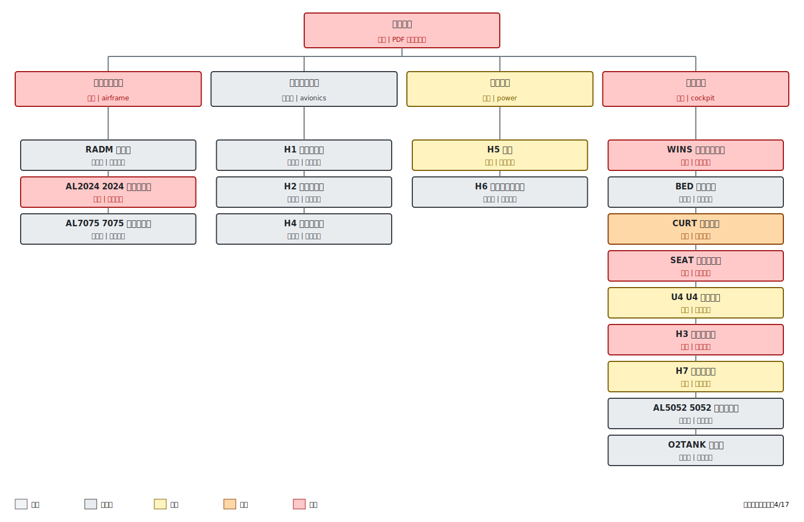

## 系统级传播结果

| 系统 | 等级 | 触发节点 | 采用的传播规则 |
|---|---:|---|---|
| 机体结构系统（`airframe`） | 重度 | AL2024 | 至少一个主要节点达到重度毁伤 |
| 航空电子系统（`avionics`） | 轻度 | H4 | 至少一个已知节点达到轻度，且未触发更高等级 |
| 电源系统（`power`） | 中度 | H6 | 主要节点达到中度，或次要节点达到重度毁伤 |
| 座舱系统（`cockpit`） | 重度 | WINS, SEAT, H3 | 至少一个主要节点达到重度毁伤 |

## 完整设备毁伤评估

| 设备组 | 设备名称 | 毁伤树角色 | 等级 | 峰值温度（C） | 轻度证据 | 中度证据 | 重度证据 | 重度毁伤结论 | 物理解释 | 正外部热流探针数 | 有效温度探针数 |
|---|---|---|---:|---:|---|---|---|---|---|---:|---:|
| RADM | 雷达罩 | 机体结构系统：主要节点 | 未毁伤 | 667.3 | 150 C; 16.5/1200 s | 250 C; 4.5/600 s | 400 C; 1.5/180 s | 未达到：连续高于 400 C 的时间仅为 1.5/180 s | 瞬态光辐射或火灾使温度短暂超过重度阈值，但燃烧或热反馈未维持到规定时间。 | 10 | 10 |
| WINS | 有机玻璃舷窗 | 座舱系统：主要节点 | 重度 | 886.5 | 120 C; 1498.5/60 s | 200 C; 1498.5/45 s | 250 C; 1498.5/8 s | 已达到：峰值 886.5 C；连续高于 250 C 的时间为 1498.5/8 s | 直接外部热流和/或火灾加热同时提供了足够的温度和持续时间。 | 10 | 10 |
| BED | 尼龙床垫 | 座舱系统：主要节点 | 未毁伤 | 484.5 | 200 C; 22.5/60 s | 250 C; 13.5/90 s | 500 C; 0.0/5 s | 未达到：峰值 484.5 C < 500 C | 监测表面接收到正外部热流，但受脉冲能量、材料热惯性和散热影响，峰值仍低于重度毁伤阈值。 | 8 | 8 |
| CURT | 尼龙窗帘 | 座舱系统：主要节点 | 中度 | 728.3 | 200 C; 1101.0/60 s | 250 C; 771.0/90 s | 500 C; 1.5/5 s | 未达到：连续高于 500 C 的时间仅为 1.5/5 s | 瞬态光辐射或火灾使温度短暂超过重度阈值，但燃烧或热反馈未维持到规定时间。 | 10 | 10 |
| U4 | U4 仪器设备 | 座舱系统：主要节点 | 轻度 | 244.4 | 120 C; 1113.0/300 s | 250 C; 0.0/180 s | 400 C; 0.0/5 s | 未达到：峰值 244.4 C < 400 C | 监测表面未分配到正外部热流；几何遮挡后仅靠舱内二次火灾加热，温度低于重度毁伤阈值。 | 0 | 6 |
| SEAT | 聚氨酯座椅 | 座舱系统：主要节点 | 重度 | 1358.7 | 200 C; 73.5/60 s | 300 C; 36.0/90 s | 500 C; 28.5/5 s | 已达到：峰值 1358.7 C；连续高于 500 C 的时间为 28.5/5 s | 直接外部热流和/或火灾加热同时提供了足够的温度和持续时间。 | 3 | 10 |
| AL2024 | 2024 铝合金蒙皮 | 机体结构系统：主要节点 | 重度 | 446.7 | 120 C; 1498.5/1200 s | 250 C; 1494.0/600 s | 400 C; 903.0/180 s | 已达到：峰值 446.7 C；连续高于 400 C 的时间为 903.0/180 s | 直接外部热流和/或火灾加热同时提供了足够的温度和持续时间。 | 5 | 10 |
| AL5052 | 5052 铝合金风管 | 座舱系统：次要节点 | 中度 | 288.2 | 120 C; 1353.0/1200 s | 250 C; 882.0/600 s | 400 C; 0.0/180 s | 未达到：峰值 288.2 C < 400 C | 监测表面未分配到正外部热流；几何遮挡后仅靠舱内二次火灾加热，温度低于重度毁伤阈值。 | 0 | 10 |
| AL7075 | 7075 铝合金框架 | 机体结构系统：主要节点 | 中度 | 222.1 | 120 C; 1377.0/1200 s | 200 C; 747.0/600 s | 400 C; 0.0/180 s | 未达到：峰值 222.1 C < 400 C | 监测表面接收到正外部热流，但受脉冲能量、材料热惯性和散热影响，峰值仍低于重度毁伤阈值。 | 3 | 10 |
| O2TANK | 氧气瓶 | 座舱系统：次要节点 | 未毁伤 | 201.2 | 120 C; 1144.5/1200 s | 200 C; 31.5/600 s | 400 C; 0.0/180 s | 未达到：峰值 201.2 C < 400 C | 监测表面接收到正外部热流，但受脉冲能量、材料热惯性和散热影响，峰值仍低于重度毁伤阈值。 | 6 | 8 |
| H1 | 导航子系统 | 航空电子系统：主要节点 | 未毁伤 | 159.1 | 120 C; 87.0/300 s | 250 C; 0.0/180 s | 400 C; 0.0/5 s | 未达到：峰值 159.1 C < 400 C | 监测表面接收到正外部热流，但受脉冲能量、材料热惯性和散热影响，峰值仍低于重度毁伤阈值。 | 3 | 6 |
| H2 | 任务子系统 | 航空电子系统：主要节点 | 未毁伤 | 159.3 | 120 C; 93.0/300 s | 250 C; 0.0/180 s | 400 C; 0.0/5 s | 未达到：峰值 159.3 C < 400 C | 监测表面接收到正外部热流，但受脉冲能量、材料热惯性和散热影响，峰值仍低于重度毁伤阈值。 | 8 | 8 |
| H3 | 显示子系统 | 座舱系统：主要节点 | 重度 | 537.2 | 120 C; 1335.0/300 s | 250 C; 1264.5/180 s | 400 C; 1164.0/5 s | 已达到：峰值 537.2 C；连续高于 400 C 的时间为 1164.0/5 s | 舱内二次火灾加热同时提供了足够的温度和持续时间。 | 0 | 14 |
| H4 | 通信子系统 | 航空电子系统：次要节点 | 轻度 | 160.3 | 120 C; 874.5/300 s | 250 C; 0.0/180 s | 400 C; 0.0/5 s | 未达到：峰值 160.3 C < 400 C | 监测表面接收到正外部热流，但受脉冲能量、材料热惯性和散热影响，峰值仍低于重度毁伤阈值。 | 4 | 10 |
| H5 | 电池 | 电源系统：主要节点 | 轻度 | 140.9 | 100 C; 1123.5/60 s | 150 C; 0.0/600 s | 200 C; 0.0/180 s | 未达到：峰值 140.9 C < 200 C | 监测表面接收到正外部热流，但受脉冲能量、材料热惯性和散热影响，峰值仍低于重度毁伤阈值。 | 1 | 6 |
| H6 | 电力传输子系统 | 电源系统：主要节点 | 中度 | 326.8 | 120 C; 1420.5/1200 s | 200 C; 921.0/600 s | 400 C; 0.0/180 s | 未达到：峰值 326.8 C < 400 C | 监测表面未分配到正外部热流；几何遮挡后仅靠舱内二次火灾加热，温度低于重度毁伤阈值。 | 0 | 8 |
| H7 | 操纵子系统 | 座舱系统：主要节点 | 轻度 | 412.1 | 120 C; 1488.0/300 s | 250 C; 46.5/180 s | 400 C; 0.0/5 s | 未达到：连续高于 400 C 的时间仅为 0.0/5 s | 瞬态光辐射或火灾使温度短暂超过重度阈值，但燃烧或热反馈未维持到规定时间。 | 0 | 3 |

## 评估结论与解释

- 未达到重度或证据未知的设备组：**RADM, BED, CURT, U4, AL5052, AL7075, O2TANK, H1, H2, H4, H5, H6, H7**。
- 重度毁伤未满足的原因统计：**10 项受峰值温度限制**，**3 项受持续时间限制**。
- 整机等级取各系统已知等级中的最高等级：**重度**。
- H2（任务子系统）和 H3（显示子系统）属于当前模型的专用映射，其通用电子设备阈值并非 PDF 中的同名条目。
- H1-H4 探针当前测量铝合金外壳表面温度，并将其作为内部电子器件温度的代理。

## 按毁伤树原则对本案例的详细解释

该案例已正常运行到目标时长，且日志中存在 FDS 正常完成标记，因此可作为正式结果参与同参数族的阈值比较。
按照设备级温度与持续时间判据，当前达到重度毁伤的设备组共有 4 个：WINS, SEAT, AL2024, H3。这些设备不仅达到重度温度阈值，而且最长连续超阈时间也满足规定时长，因此其重度结论具有完整的温度和时间证据。
峰值温度受限设备包括：BED（峰值 484.5 C，阈值 500 C）、U4（峰值 244.4 C，阈值 400 C）、AL5052（峰值 288.2 C，阈值 400 C）、AL7075（峰值 222.1 C，阈值 400 C）、O2TANK（峰值 201.2 C，阈值 400 C）、H1（峰值 159.1 C，阈值 400 C）、H2（峰值 159.3 C，阈值 400 C）、H4（峰值 160.3 C，阈值 400 C）、H5（峰值 140.9 C，阈值 200 C）、H6（峰值 326.8 C，阈值 400 C）。这些对象尚未进入重度判据温度区间，继续延长模拟时间并不会自动补足峰值条件；需要结合直接受照、遮挡和二次火灾强度判断其原因。
持续时间受限设备包括：RADM（1.5/180 s，高于 400 C）、CURT（1.5/5 s，高于 500 C）、H7（0.0/5 s，高于 400 C）。这些对象已经出现足够高的瞬态峰值，但热解、燃烧或邻近火灾反馈没有把温度维持到标准要求，因此不能仅凭最高温度判为重度毁伤。
U4, AL5052, H6, H7 的有效监测面没有记录到正外部热流，它们主要依靠舱内二次火灾加热。若这些设备未达到重度，优先应检查 DDA 可见性、设备实际朝向、邻近可燃物燃烧持续性及探针是否覆盖热点，而不是直接降低材料强度或毁伤标准。
系统级传播结果为：机体结构系统为重度，触发节点为AL2024；航空电子系统为轻度，触发节点为H4；电源系统为中度，触发节点为H6；座舱系统为重度，触发节点为WINS、SEAT、H3。系统等级由主要节点和次要节点按既定规则传播，不是按系统内所有设备温度求平均。
最终 PDF 毁伤树整机等级为重度，而严格全设备结果为 4/17。前者说明至少一个关键系统已达到相应任务毁伤等级；后者说明距离“所有材料和设备均重度毁伤”的研究目标仍有 13 个设备组未满足。两者必须同时保留，不能用整机重度替代 17/17。
因此，本案例是否能够作为全毁伤阈值的成功点，只取决于严格结果是否达到 17/17，并且案例是否正常完成。未达到 17/17 时，应根据上面的峰值受限、持续时间受限和遮挡分类确定下一步物理参数研究方向。

---

## 完整毁伤树评估：Q0400_W0100_az270_el15_H1H7_v5_Qnorm_adapt_HRRtable_seatSTLfill_v1

- 模拟时间：**1500.00 s**
- 来源目录：`cases_adaptive/Q0400_W0100_az270_el15_H1H7_v5_Qnorm_adapt_HRRtable_seatSTLfill_v1`
- 方案分类：**自适应敏感性方案（单独比较）**
- 评估状态：**正常完成**
- PDF 毁伤树整机等级：**重度**
- 严格全设备重度毁伤结果：**5/17** （全部重度毁伤=否）
- 最高温度定义：几何位置有效的冗余壁面温度探针动态包络最大值。
- 注意：严格的 17/17 指标不等同于 PDF 毁伤树的整机等级判据。

## 案例配置

| 参数 | 数值 |
|---|---|
| 方案用途 | Q400_material_table_HRRPUA_with_STL_filled_U06_seats |
| 来源案例 | 未记录 |
| 修改因素 | U06_shell_to_STL_interior_voxel_fill |
| 光冲量 Q（J/cm2） | 400 |
| 核爆当量（kt） | 100 |
| 方位角（度） | 270 |
| 俯仰角（度） | 15 |
| 目标模拟时长（s） | 1500 |
| MPI 进程数 | 32 |
| BURN_AWAY | 否 |
| 辐射份额 | 0.35 |
| 最大 CFL | 未记录 |
| 指定时间步长（s） | 未记录 |
| 核辐射脉冲积分（s） | 未记录 |
| 入射面峰值辐照度（kW/m2） | 未记录 |
| 最大局部外部热流（kW/m2） | 未记录 |
| 最大局部积分光冲量（J/cm2） | 未记录 |
| 各材料 HRRPUA（kW/m2） | 未记录 |
| FDS 中全部 HRRPUA（kW/m2） | [75.0, 180.0, 200.0, 250.0, 350.0, 400.0, 450.0] |
| 审查后的材料厚度（m） | 未记录 |
| FDS 中全部材料层厚度（m） | [0.001, 0.0015, 0.002, 0.003, 0.005, 0.03, 0.075, 0.12, 0.15] |
| 几何是否修改 | 是 |
| 材料是否修改 | 否 |
| 燃烧参数是否修改 | 否 |
| 外部热流是否修改 | 否 |
| 点燃温度是否修改 | 否 |
| 毁伤阈值是否修改 | 否 |
| FDS 输入文件 | Q0400_W0100_az270_el15_H1H7_v5_Qnorm_adapt_HRRtable_seatSTLfill_v1.fds |

## 已知问题与结果有效性

- H1-H4 目前以铝合金外壳壁面温度代理内部电子器件温度。

## 毁伤树

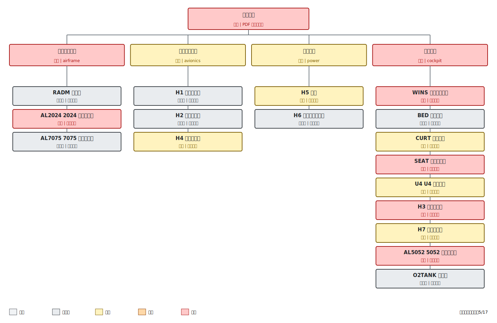

## 系统级传播结果

| 系统 | 等级 | 触发节点 | 采用的传播规则 |
|---|---:|---|---|
| 机体结构系统（`airframe`） | 重度 | AL2024 | 至少一个主要节点达到重度毁伤 |
| 航空电子系统（`avionics`） | 轻度 | H4 | 至少一个已知节点达到轻度，且未触发更高等级 |
| 电源系统（`power`） | 轻度 | H5 | 至少一个已知节点达到轻度，且未触发更高等级 |
| 座舱系统（`cockpit`） | 重度 | WINS, SEAT, H3 | 至少一个主要节点达到重度毁伤 |

## 完整设备毁伤评估

| 设备组 | 设备名称 | 毁伤树角色 | 等级 | 峰值温度（C） | 轻度证据 | 中度证据 | 重度证据 | 重度毁伤结论 | 物理解释 | 正外部热流探针数 | 有效温度探针数 |
|---|---|---|---:|---:|---|---|---|---|---|---:|---:|
| RADM | 雷达罩 | 机体结构系统：主要节点 | 未毁伤 | 667.3 | 150 C; 16.5/1200 s | 250 C; 4.5/600 s | 400 C; 1.5/180 s | 未达到：连续高于 400 C 的时间仅为 1.5/180 s | 瞬态光辐射或火灾使温度短暂超过重度阈值，但燃烧或热反馈未维持到规定时间。 | 10 | 10 |
| WINS | 有机玻璃舷窗 | 座舱系统：主要节点 | 重度 | 886.5 | 120 C; 1498.5/60 s | 200 C; 1498.5/45 s | 250 C; 1498.5/8 s | 已达到：峰值 886.5 C；连续高于 250 C 的时间为 1498.5/8 s | 直接外部热流和/或火灾加热同时提供了足够的温度和持续时间。 | 10 | 10 |
| BED | 尼龙床垫 | 座舱系统：主要节点 | 未毁伤 | 484.5 | 200 C; 22.5/60 s | 250 C; 13.5/90 s | 500 C; 0.0/5 s | 未达到：峰值 484.5 C < 500 C | 监测表面接收到正外部热流，但受脉冲能量、材料热惯性和散热影响，峰值仍低于重度毁伤阈值。 | 8 | 8 |
| CURT | 尼龙窗帘 | 座舱系统：主要节点 | 中度 | 728.3 | 200 C; 984.0/60 s | 250 C; 213.0/90 s | 500 C; 1.5/5 s | 未达到：连续高于 500 C 的时间仅为 1.5/5 s | 瞬态光辐射或火灾使温度短暂超过重度阈值，但燃烧或热反馈未维持到规定时间。 | 10 | 10 |
| U4 | U4 仪器设备 | 座舱系统：主要节点 | 中度 | 291.7 | 120 C; 1138.5/300 s | 250 C; 507.0/180 s | 400 C; 0.0/5 s | 未达到：峰值 291.7 C < 400 C | 监测表面未分配到正外部热流；几何遮挡后仅靠舱内二次火灾加热，温度低于重度毁伤阈值。 | 0 | 6 |
| SEAT | 聚氨酯座椅 | 座舱系统：主要节点 | 重度 | 1358.7 | 200 C; 1366.5/60 s | 300 C; 1192.5/90 s | 500 C; 27.0/5 s | 已达到：峰值 1358.7 C；连续高于 500 C 的时间为 27.0/5 s | 直接外部热流和/或火灾加热同时提供了足够的温度和持续时间。 | 3 | 10 |
| AL2024 | 2024 铝合金蒙皮 | 机体结构系统：主要节点 | 重度 | 449.1 | 120 C; 1498.5/1200 s | 250 C; 1494.0/600 s | 400 C; 1054.5/180 s | 已达到：峰值 449.1 C；连续高于 400 C 的时间为 1054.5/180 s | 直接外部热流和/或火灾加热同时提供了足够的温度和持续时间。 | 5 | 10 |
| AL5052 | 5052 铝合金风管 | 座舱系统：次要节点 | 重度 | 432.4 | 120 C; 1375.5/1200 s | 250 C; 1300.5/600 s | 400 C; 991.5/180 s | 已达到：峰值 432.4 C；连续高于 400 C 的时间为 991.5/180 s | 舱内二次火灾加热同时提供了足够的温度和持续时间。 | 0 | 10 |
| AL7075 | 7075 铝合金框架 | 机体结构系统：主要节点 | 中度 | 323.6 | 120 C; 1497.0/1200 s | 200 C; 948.0/600 s | 400 C; 0.0/180 s | 未达到：峰值 323.6 C < 400 C | 监测表面接收到正外部热流，但受脉冲能量、材料热惯性和散热影响，峰值仍低于重度毁伤阈值。 | 3 | 10 |
| O2TANK | 氧气瓶 | 座舱系统：次要节点 | 未毁伤 | 240.2 | 120 C; 1162.5/1200 s | 200 C; 598.5/600 s | 400 C; 0.0/180 s | 未达到：峰值 240.2 C < 400 C | 监测表面接收到正外部热流，但受脉冲能量、材料热惯性和散热影响，峰值仍低于重度毁伤阈值。 | 6 | 8 |
| H1 | 导航子系统 | 航空电子系统：主要节点 | 未毁伤 | 159.1 | 120 C; 87.0/300 s | 250 C; 0.0/180 s | 400 C; 0.0/5 s | 未达到：峰值 159.1 C < 400 C | 监测表面接收到正外部热流，但受脉冲能量、材料热惯性和散热影响，峰值仍低于重度毁伤阈值。 | 3 | 6 |
| H2 | 任务子系统 | 航空电子系统：主要节点 | 未毁伤 | 159.3 | 120 C; 93.0/300 s | 250 C; 0.0/180 s | 400 C; 0.0/5 s | 未达到：峰值 159.3 C < 400 C | 监测表面接收到正外部热流，但受脉冲能量、材料热惯性和散热影响，峰值仍低于重度毁伤阈值。 | 8 | 8 |
| H3 | 显示子系统 | 座舱系统：主要节点 | 重度 | 564.5 | 120 C; 1350.0/300 s | 250 C; 1294.5/180 s | 400 C; 1218.0/5 s | 已达到：峰值 564.5 C；连续高于 400 C 的时间为 1218.0/5 s | 舱内二次火灾加热同时提供了足够的温度和持续时间。 | 0 | 14 |
| H4 | 通信子系统 | 航空电子系统：次要节点 | 轻度 | 189.1 | 120 C; 1057.5/300 s | 250 C; 0.0/180 s | 400 C; 0.0/5 s | 未达到：峰值 189.1 C < 400 C | 监测表面接收到正外部热流，但受脉冲能量、材料热惯性和散热影响，峰值仍低于重度毁伤阈值。 | 4 | 10 |
| H5 | 电池 | 电源系统：主要节点 | 轻度 | 123.6 | 100 C; 570.0/60 s | 150 C; 0.0/600 s | 200 C; 0.0/180 s | 未达到：峰值 123.6 C < 200 C | 监测表面接收到正外部热流，但受脉冲能量、材料热惯性和散热影响，峰值仍低于重度毁伤阈值。 | 1 | 6 |
| H6 | 电力传输子系统 | 电源系统：主要节点 | 未毁伤 | 454.1 | 120 C; 1084.5/1200 s | 200 C; 60.0/600 s | 400 C; 10.5/180 s | 未达到：连续高于 400 C 的时间仅为 10.5/180 s | 瞬态光辐射或火灾使温度短暂超过重度阈值，但燃烧或热反馈未维持到规定时间。 | 0 | 8 |
| H7 | 操纵子系统 | 座舱系统：主要节点 | 轻度 | 445.2 | 120 C; 1488.0/300 s | 250 C; 51.0/180 s | 400 C; 1.5/5 s | 未达到：连续高于 400 C 的时间仅为 1.5/5 s | 瞬态光辐射或火灾使温度短暂超过重度阈值，但燃烧或热反馈未维持到规定时间。 | 0 | 3 |

## 评估结论与解释

- 未达到重度或证据未知的设备组：**RADM, BED, CURT, U4, AL7075, O2TANK, H1, H2, H4, H5, H6, H7**。
- 重度毁伤未满足的原因统计：**8 项受峰值温度限制**，**4 项受持续时间限制**。
- 整机等级取各系统已知等级中的最高等级：**重度**。
- H2（任务子系统）和 H3（显示子系统）属于当前模型的专用映射，其通用电子设备阈值并非 PDF 中的同名条目。
- H1-H4 探针当前测量铝合金外壳表面温度，并将其作为内部电子器件温度的代理。

## 按毁伤树原则对本案例的详细解释

该案例已正常运行到目标时长，且日志中存在 FDS 正常完成标记，因此可作为正式结果参与同参数族的阈值比较。
按照设备级温度与持续时间判据，当前达到重度毁伤的设备组共有 5 个：WINS, SEAT, AL2024, AL5052, H3。这些设备不仅达到重度温度阈值，而且最长连续超阈时间也满足规定时长，因此其重度结论具有完整的温度和时间证据。
峰值温度受限设备包括：BED（峰值 484.5 C，阈值 500 C）、U4（峰值 291.7 C，阈值 400 C）、AL7075（峰值 323.6 C，阈值 400 C）、O2TANK（峰值 240.2 C，阈值 400 C）、H1（峰值 159.1 C，阈值 400 C）、H2（峰值 159.3 C，阈值 400 C）、H4（峰值 189.1 C，阈值 400 C）、H5（峰值 123.6 C，阈值 200 C）。这些对象尚未进入重度判据温度区间，继续延长模拟时间并不会自动补足峰值条件；需要结合直接受照、遮挡和二次火灾强度判断其原因。
持续时间受限设备包括：RADM（1.5/180 s，高于 400 C）、CURT（1.5/5 s，高于 500 C）、H6（10.5/180 s，高于 400 C）、H7（1.5/5 s，高于 400 C）。这些对象已经出现足够高的瞬态峰值，但热解、燃烧或邻近火灾反馈没有把温度维持到标准要求，因此不能仅凭最高温度判为重度毁伤。
U4, H6, H7 的有效监测面没有记录到正外部热流，它们主要依靠舱内二次火灾加热。若这些设备未达到重度，优先应检查 DDA 可见性、设备实际朝向、邻近可燃物燃烧持续性及探针是否覆盖热点，而不是直接降低材料强度或毁伤标准。
系统级传播结果为：机体结构系统为重度，触发节点为AL2024；航空电子系统为轻度，触发节点为H4；电源系统为轻度，触发节点为H5；座舱系统为重度，触发节点为WINS、SEAT、H3。系统等级由主要节点和次要节点按既定规则传播，不是按系统内所有设备温度求平均。
最终 PDF 毁伤树整机等级为重度，而严格全设备结果为 5/17。前者说明至少一个关键系统已达到相应任务毁伤等级；后者说明距离“所有材料和设备均重度毁伤”的研究目标仍有 12 个设备组未满足。两者必须同时保留，不能用整机重度替代 17/17。
因此，本案例是否能够作为全毁伤阈值的成功点，只取决于严格结果是否达到 17/17，并且案例是否正常完成。未达到 17/17 时，应根据上面的峰值受限、持续时间受限和遮挡分类确定下一步物理参数研究方向。

---

## 完整毁伤树评估：Q0400_W0100_az270_el15_H1H7_v5_Qnorm_adapt_HRRtable_thickness_audit_BAtrue_v2_volumetric

- 模拟时间：**1500.00 s**
- 来源目录：`cases_adaptive/Q0400_W0100_az270_el15_H1H7_v5_Qnorm_adapt_HRRtable_thickness_audit_BAtrue_v2_volumetric`
- 方案分类：**自适应敏感性方案（单独比较）**
- 评估状态：**正常完成**
- PDF 毁伤树整机等级：**重度**
- 严格全设备重度毁伤结果：**13/17** （全部重度毁伤=否）
- 最高温度定义：几何位置有效的冗余壁面温度探针动态包络最大值。
- 注意：严格的 17/17 指标不等同于 PDF 毁伤树的整机等级判据。

## 案例配置

| 参数 | 数值 |
|---|---|
| 方案用途 | Q400_material_table_HRRPUA_BURN_AWAY_finite_volume_sensitivity |
| 来源案例 | Q0400_W0100_az270_el15_H1H7_v5_Qnorm_adapt_HRRtable_thickness_audit_v1 |
| 修改因素 | BURN_AWAY_true_on_finite_volume_combustible_OBST_only |
| 光冲量 Q（J/cm2） | 400 |
| 核爆当量（kt） | 100 |
| 方位角（度） | 270 |
| 俯仰角（度） | 15 |
| 目标模拟时长（s） | 1500 |
| MPI 进程数 | 32 |
| BURN_AWAY | 是 |
| 辐射份额 | 0.4 |
| 最大 CFL | 未记录 |
| 指定时间步长（s） | 未记录 |
| 核辐射脉冲积分（s） | 0.660398 |
| 入射面峰值辐照度（kW/m2） | 6056.95 |
| 最大局部外部热流（kW/m2） | 5883 |
| 最大局部积分光冲量（J/cm2） | 388.512 |
| 各材料 HRRPUA（kW/m2） | {"BED": 790.0, "CURT": 324.0, "H6": 259.0, "H7": 458.0, "RADM": 840.0, "SEAT": 860.0, "U4": 840.0, "WINS": 806.0} |
| FDS 中全部 HRRPUA（kW/m2） | [75.0, 180.0, 200.0, 250.0, 350.0, 400.0, 450.0] |
| 审查后的材料厚度（m） | {"BED": 0.00089, "CURT": 0.003, "RADM": 0.1, "U4": 0.006, "WINS": 0.025} |
| FDS 中全部材料层厚度（m） | [0.00089, 0.001, 0.0015, 0.002, 0.003, 0.005, 0.006, 0.025, 0.1, 0.15] |
| 几何是否修改 | 否 |
| 材料是否修改 | 否 |
| 燃烧参数是否修改 | 否 |
| 外部热流是否修改 | 否 |
| 点燃温度是否修改 | 否 |
| 毁伤阈值是否修改 | 否 |
| FDS 输入文件 | Q0400_W0100_az270_el15_H1H7_v5_Qnorm_adapt_HRRtable_thickness_audit_BAtrue_v2_volumetric.fds |

## 已知问题与结果有效性

- H1-H4 目前以铝合金外壳壁面温度代理内部电子器件温度。

## 毁伤树

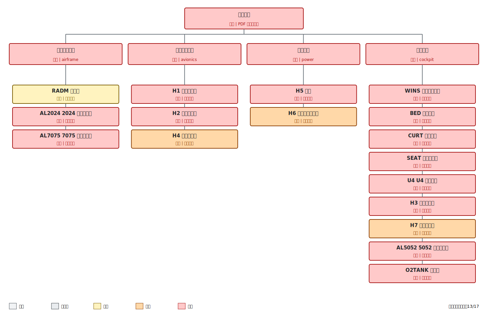

## 系统级传播结果

| 系统 | 等级 | 触发节点 | 采用的传播规则 |
|---|---:|---|---|
| 机体结构系统（`airframe`） | 重度 | AL2024, AL7075 | 至少一个主要节点达到重度毁伤 |
| 航空电子系统（`avionics`） | 重度 | H1, H2 | 至少一个主要节点达到重度毁伤 |
| 电源系统（`power`） | 重度 | H5 | 至少一个主要节点达到重度毁伤 |
| 座舱系统（`cockpit`） | 重度 | WINS, BED, CURT, SEAT, U4, H3 | 至少一个主要节点达到重度毁伤 |

## 完整设备毁伤评估

| 设备组 | 设备名称 | 毁伤树角色 | 等级 | 峰值温度（C） | 轻度证据 | 中度证据 | 重度证据 | 重度毁伤结论 | 物理解释 | 正外部热流探针数 | 有效温度探针数 |
|---|---|---|---:|---:|---|---|---|---|---|---:|---:|
| RADM | 雷达罩 | 机体结构系统：主要节点 | 轻度 | 1514.9 | 150 C; 1498.5/1200 s | 250 C; 40.5/600 s | 400 C; 9.0/180 s | 未达到：连续高于 400 C 的时间仅为 9.0/180 s | 瞬态光辐射或火灾使温度短暂超过重度阈值，但燃烧或热反馈未维持到规定时间。 | 10 | 10 |
| WINS | 有机玻璃舷窗 | 座舱系统：主要节点 | 重度 | 1705.8 | 120 C; 1498.5/60 s | 200 C; 1498.5/45 s | 250 C; 1498.5/8 s | 已达到：峰值 1705.8 C；连续高于 250 C 的时间为 1498.5/8 s | 直接外部热流和/或火灾加热同时提供了足够的温度和持续时间。 | 10 | 10 |
| BED | 尼龙床垫 | 座舱系统：主要节点 | 重度 | 676.3 | 200 C; 1258.5/60 s | 250 C; 1102.5/90 s | 500 C; 9.0/5 s | 已达到：峰值 676.3 C；连续高于 500 C 的时间为 9.0/5 s | 直接外部热流和/或火灾加热同时提供了足够的温度和持续时间。 | 8 | 8 |
| CURT | 尼龙窗帘 | 座舱系统：主要节点 | 重度 | 1542.0 | 200 C; 1498.5/60 s | 250 C; 1498.5/90 s | 500 C; 16.5/5 s | 已达到：峰值 1542.0 C；连续高于 500 C 的时间为 16.5/5 s | 直接外部热流和/或火灾加热同时提供了足够的温度和持续时间。 | 10 | 10 |
| U4 | U4 仪器设备 | 座舱系统：主要节点 | 重度 | 554.0 | 120 C; 1321.5/300 s | 250 C; 1137.0/180 s | 400 C; 883.5/5 s | 已达到：峰值 554.0 C；连续高于 400 C 的时间为 883.5/5 s | 舱内二次火灾加热同时提供了足够的温度和持续时间。 | 0 | 6 |
| SEAT | 聚氨酯座椅 | 座舱系统：主要节点 | 重度 | 2726.8 | 200 C; 1498.5/60 s | 300 C; 1498.5/90 s | 500 C; 1498.5/5 s | 已达到：峰值 2726.8 C；连续高于 500 C 的时间为 1498.5/5 s | 直接外部热流和/或火灾加热同时提供了足够的温度和持续时间。 | 4 | 10 |
| AL2024 | 2024 铝合金蒙皮 | 机体结构系统：主要节点 | 重度 | 727.8 | 120 C; 1498.5/1200 s | 250 C; 1498.5/600 s | 400 C; 1498.5/180 s | 已达到：峰值 727.8 C；连续高于 400 C 的时间为 1498.5/180 s | 直接外部热流和/或火灾加热同时提供了足够的温度和持续时间。 | 5 | 10 |
| AL5052 | 5052 铝合金风管 | 座舱系统：次要节点 | 重度 | 675.6 | 120 C; 1432.5/1200 s | 250 C; 1398.0/600 s | 400 C; 1336.5/180 s | 已达到：峰值 675.6 C；连续高于 400 C 的时间为 1336.5/180 s | 舱内二次火灾加热同时提供了足够的温度和持续时间。 | 0 | 10 |
| AL7075 | 7075 铝合金框架 | 机体结构系统：主要节点 | 重度 | 699.8 | 120 C; 1498.5/1200 s | 200 C; 1498.5/600 s | 400 C; 1156.5/180 s | 已达到：峰值 699.8 C；连续高于 400 C 的时间为 1156.5/180 s | 直接外部热流和/或火灾加热同时提供了足够的温度和持续时间。 | 3 | 10 |
| O2TANK | 氧气瓶 | 座舱系统：次要节点 | 重度 | 425.7 | 120 C; 1498.5/1200 s | 200 C; 1494.0/600 s | 400 C; 411.0/180 s | 已达到：峰值 425.7 C；连续高于 400 C 的时间为 411.0/180 s | 直接外部热流和/或火灾加热同时提供了足够的温度和持续时间。 | 6 | 8 |
| H1 | 导航子系统 | 航空电子系统：主要节点 | 重度 | 469.6 | 120 C; 357.0/300 s | 250 C; 106.5/180 s | 400 C; 22.5/5 s | 已达到：峰值 469.6 C；连续高于 400 C 的时间为 22.5/5 s | 直接外部热流和/或火灾加热同时提供了足够的温度和持续时间。 | 5 | 6 |
| H2 | 任务子系统 | 航空电子系统：主要节点 | 重度 | 474.8 | 120 C; 433.5/300 s | 250 C; 145.5/180 s | 400 C; 51.0/5 s | 已达到：峰值 474.8 C；连续高于 400 C 的时间为 51.0/5 s | 直接外部热流和/或火灾加热同时提供了足够的温度和持续时间。 | 8 | 8 |
| H3 | 显示子系统 | 座舱系统：主要节点 | 重度 | 676.4 | 120 C; 1407.0/300 s | 250 C; 1366.5/180 s | 400 C; 1318.5/5 s | 已达到：峰值 676.4 C；连续高于 400 C 的时间为 1318.5/5 s | 舱内二次火灾加热同时提供了足够的温度和持续时间。 | 0 | 14 |
| H4 | 通信子系统 | 航空电子系统：次要节点 | 中度 | 304.6 | 120 C; 1492.5/300 s | 250 C; 744.0/180 s | 400 C; 0.0/5 s | 未达到：峰值 304.6 C < 400 C | 监测表面接收到正外部热流，但受脉冲能量、材料热惯性和散热影响，峰值仍低于重度毁伤阈值。 | 4 | 10 |
| H5 | 电池 | 电源系统：主要节点 | 重度 | 219.0 | 100 C; 1066.5/60 s | 150 C; 777.0/600 s | 200 C; 340.5/180 s | 已达到：峰值 219.0 C；连续高于 200 C 的时间为 340.5/180 s | 直接外部热流和/或火灾加热同时提供了足够的温度和持续时间。 | 3 | 6 |
| H6 | 电力传输子系统 | 电源系统：主要节点 | 中度 | 377.9 | 120 C; 1458.0/1200 s | 200 C; 1140.0/600 s | 400 C; 0.0/180 s | 未达到：峰值 377.9 C < 400 C | 监测表面未分配到正外部热流；几何遮挡后仅靠舱内二次火灾加热，温度低于重度毁伤阈值。 | 0 | 8 |
| H7 | 操纵子系统 | 座舱系统：主要节点 | 中度 | 386.5 | 120 C; 1494.0/300 s | 250 C; 1104.0/180 s | 400 C; 0.0/5 s | 未达到：峰值 386.5 C < 400 C | 监测表面未分配到正外部热流；几何遮挡后仅靠舱内二次火灾加热，温度低于重度毁伤阈值。 | 0 | 3 |

## 评估结论与解释

- 未达到重度或证据未知的设备组：**RADM, H4, H6, H7**。
- 重度毁伤未满足的原因统计：**3 项受峰值温度限制**，**1 项受持续时间限制**。
- 整机等级取各系统已知等级中的最高等级：**重度**。
- H2（任务子系统）和 H3（显示子系统）属于当前模型的专用映射，其通用电子设备阈值并非 PDF 中的同名条目。
- H1-H4 探针当前测量铝合金外壳表面温度，并将其作为内部电子器件温度的代理。

## 按毁伤树原则对本案例的详细解释

该案例已正常运行到目标时长，且日志中存在 FDS 正常完成标记，因此可作为正式结果参与同参数族的阈值比较。
该案例标称入射面光冲量为 400 J/cm2，模型表面的最大局部积分光冲量为 388.512 J/cm2，约为标称值的 97.1%。因此设备实际受照还受到入射角、表面朝向与几何遮挡影响，不能把标称 Q 直接等同于每个设备表面接收的光冲量。
按照设备级温度与持续时间判据，当前达到重度毁伤的设备组共有 13 个：WINS, BED, CURT, U4, SEAT, AL2024, AL5052, AL7075, O2TANK, H1, H2, H3, H5。这些设备不仅达到重度温度阈值，而且最长连续超阈时间也满足规定时长，因此其重度结论具有完整的温度和时间证据。
峰值温度受限设备包括：H4（峰值 304.6 C，阈值 400 C）、H6（峰值 377.9 C，阈值 400 C）、H7（峰值 386.5 C，阈值 400 C）。这些对象尚未进入重度判据温度区间，继续延长模拟时间并不会自动补足峰值条件；需要结合直接受照、遮挡和二次火灾强度判断其原因。
持续时间受限设备包括：RADM（9.0/180 s，高于 400 C）。这些对象已经出现足够高的瞬态峰值，但热解、燃烧或邻近火灾反馈没有把温度维持到标准要求，因此不能仅凭最高温度判为重度毁伤。
H6, H7 的有效监测面没有记录到正外部热流，它们主要依靠舱内二次火灾加热。若这些设备未达到重度，优先应检查 DDA 可见性、设备实际朝向、邻近可燃物燃烧持续性及探针是否覆盖热点，而不是直接降低材料强度或毁伤标准。
系统级传播结果为：机体结构系统为重度，触发节点为AL2024、AL7075；航空电子系统为重度，触发节点为H1、H2；电源系统为重度，触发节点为H5；座舱系统为重度，触发节点为WINS、BED、CURT、SEAT、U4、H3。系统等级由主要节点和次要节点按既定规则传播，不是按系统内所有设备温度求平均。
最终 PDF 毁伤树整机等级为重度，而严格全设备结果为 13/17。前者说明至少一个关键系统已达到相应任务毁伤等级；后者说明距离“所有材料和设备均重度毁伤”的研究目标仍有 4 个设备组未满足。两者必须同时保留，不能用整机重度替代 17/17。
因此，本案例是否能够作为全毁伤阈值的成功点，只取决于严格结果是否达到 17/17，并且案例是否正常完成。未达到 17/17 时，应根据上面的峰值受限、持续时间受限和遮挡分类确定下一步物理参数研究方向。

---

## 完整毁伤树评估：Q0400_W0100_az270_el15_H1H7_v5_Qnorm_adapt_HRRtable_thickness_audit_v1

- 模拟时间：**1500.00 s**
- 来源目录：`cases_adaptive/Q0400_W0100_az270_el15_H1H7_v5_Qnorm_adapt_HRRtable_thickness_audit_v1`
- 方案分类：**自适应敏感性方案（单独比较）**
- 评估状态：**正常完成**
- PDF 毁伤树整机等级：**重度**
- 严格全设备重度毁伤结果：**13/17** （全部重度毁伤=否）
- 最高温度定义：几何位置有效的冗余壁面温度探针动态包络最大值。
- 注意：严格的 17/17 指标不等同于 PDF 毁伤树的整机等级判据。

## 案例配置

| 参数 | 数值 |
|---|---|
| 方案用途 | Q400_material_table_HRRPUA_sensitivity |
| 来源案例 | Q0400_W0100_az270_el15_H1H7_v5_Qnorm_adapt_HRRnominal_thickness_audit_v1 |
| 修改因素 | HRRPUA_nominal_to_material_table_only |
| 光冲量 Q（J/cm2） | 400 |
| 核爆当量（kt） | 100 |
| 方位角（度） | 270 |
| 俯仰角（度） | 15 |
| 目标模拟时长（s） | 1500 |
| MPI 进程数 | 32 |
| BURN_AWAY | 否 |
| 辐射份额 | 0.4 |
| 最大 CFL | 未记录 |
| 指定时间步长（s） | 未记录 |
| 核辐射脉冲积分（s） | 0.660398 |
| 入射面峰值辐照度（kW/m2） | 6056.95 |
| 最大局部外部热流（kW/m2） | 5883 |
| 最大局部积分光冲量（J/cm2） | 388.512 |
| 各材料 HRRPUA（kW/m2） | {"BED": 790.0, "CURT": 324.0, "H6": 259.0, "H7": 458.0, "RADM": 840.0, "SEAT": 860.0, "U4": 840.0, "WINS": 806.0} |
| FDS 中全部 HRRPUA（kW/m2） | [75.0, 180.0, 200.0, 250.0, 350.0, 400.0, 450.0] |
| 审查后的材料厚度（m） | {"BED": 0.00089, "CURT": 0.003, "RADM": 0.1, "U4": 0.006, "WINS": 0.025} |
| FDS 中全部材料层厚度（m） | [0.00089, 0.001, 0.0015, 0.002, 0.003, 0.005, 0.006, 0.025, 0.1, 0.15] |
| 几何是否修改 | 否 |
| 材料是否修改 | 否 |
| 燃烧参数是否修改 | 否 |
| 外部热流是否修改 | 否 |
| 点燃温度是否修改 | 否 |
| 毁伤阈值是否修改 | 否 |
| FDS 输入文件 | Q0400_W0100_az270_el15_H1H7_v5_Qnorm_adapt_HRRtable_thickness_audit_v1.fds |

## 已知问题与结果有效性

- H1-H4 目前以铝合金外壳壁面温度代理内部电子器件温度。

## 毁伤树

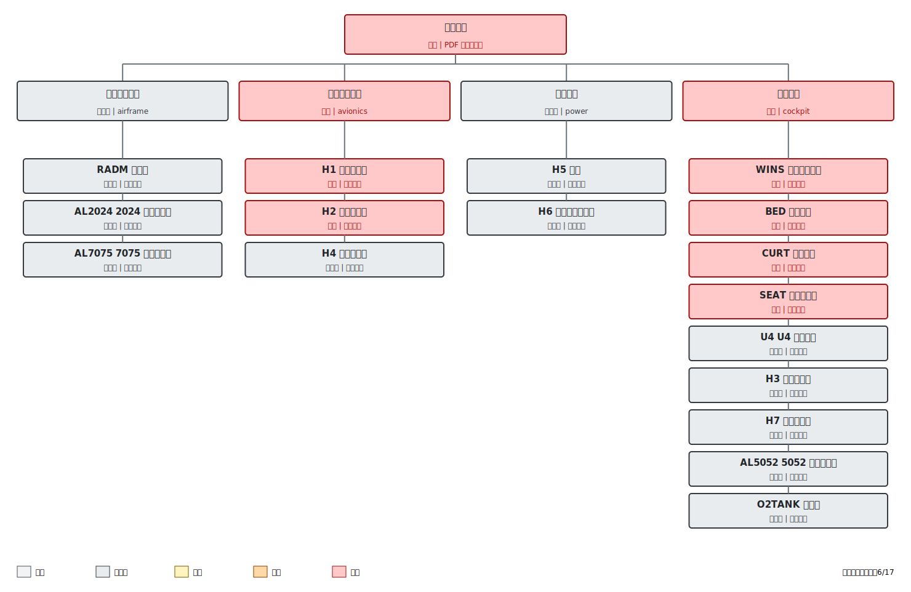

## 系统级传播结果

| 系统 | 等级 | 触发节点 | 采用的传播规则 |
|---|---:|---|---|
| 机体结构系统（`airframe`） | 重度 | AL2024, AL7075 | 至少一个主要节点达到重度毁伤 |
| 航空电子系统（`avionics`） | 重度 | H1, H2 | 至少一个主要节点达到重度毁伤 |
| 电源系统（`power`） | 重度 | H5 | 至少一个主要节点达到重度毁伤 |
| 座舱系统（`cockpit`） | 重度 | WINS, BED, CURT, SEAT, U4, H3 | 至少一个主要节点达到重度毁伤 |

## 完整设备毁伤评估

| 设备组 | 设备名称 | 毁伤树角色 | 等级 | 峰值温度（C） | 轻度证据 | 中度证据 | 重度证据 | 重度毁伤结论 | 物理解释 | 正外部热流探针数 | 有效温度探针数 |
|---|---|---|---:|---:|---|---|---|---|---|---:|---:|
| RADM | 雷达罩 | 机体结构系统：主要节点 | 轻度 | 1514.9 | 150 C; 1498.5/1200 s | 250 C; 42.0/600 s | 400 C; 9.0/180 s | 未达到：连续高于 400 C 的时间仅为 9.0/180 s | 瞬态光辐射或火灾使温度短暂超过重度阈值，但燃烧或热反馈未维持到规定时间。 | 10 | 10 |
| WINS | 有机玻璃舷窗 | 座舱系统：主要节点 | 重度 | 1705.8 | 120 C; 1498.5/60 s | 200 C; 1498.5/45 s | 250 C; 1498.5/8 s | 已达到：峰值 1705.8 C；连续高于 250 C 的时间为 1498.5/8 s | 直接外部热流和/或火灾加热同时提供了足够的温度和持续时间。 | 10 | 10 |
| BED | 尼龙床垫 | 座舱系统：主要节点 | 重度 | 676.3 | 200 C; 1297.5/60 s | 250 C; 1125.0/90 s | 500 C; 9.0/5 s | 已达到：峰值 676.3 C；连续高于 500 C 的时间为 9.0/5 s | 直接外部热流和/或火灾加热同时提供了足够的温度和持续时间。 | 8 | 8 |
| CURT | 尼龙窗帘 | 座舱系统：主要节点 | 重度 | 1542.0 | 200 C; 1498.5/60 s | 250 C; 1498.5/90 s | 500 C; 16.5/5 s | 已达到：峰值 1542.0 C；连续高于 500 C 的时间为 16.5/5 s | 直接外部热流和/或火灾加热同时提供了足够的温度和持续时间。 | 10 | 10 |
| U4 | U4 仪器设备 | 座舱系统：主要节点 | 重度 | 551.7 | 120 C; 1327.5/300 s | 250 C; 1152.0/180 s | 400 C; 897.0/5 s | 已达到：峰值 551.7 C；连续高于 400 C 的时间为 897.0/5 s | 舱内二次火灾加热同时提供了足够的温度和持续时间。 | 0 | 6 |
| SEAT | 聚氨酯座椅 | 座舱系统：主要节点 | 重度 | 2726.8 | 200 C; 1498.5/60 s | 300 C; 1498.5/90 s | 500 C; 1498.5/5 s | 已达到：峰值 2726.8 C；连续高于 500 C 的时间为 1498.5/5 s | 直接外部热流和/或火灾加热同时提供了足够的温度和持续时间。 | 4 | 10 |
| AL2024 | 2024 铝合金蒙皮 | 机体结构系统：主要节点 | 重度 | 713.2 | 120 C; 1498.5/1200 s | 250 C; 1498.5/600 s | 400 C; 1498.5/180 s | 已达到：峰值 713.2 C；连续高于 400 C 的时间为 1498.5/180 s | 直接外部热流和/或火灾加热同时提供了足够的温度和持续时间。 | 5 | 10 |
| AL5052 | 5052 铝合金风管 | 座舱系统：次要节点 | 重度 | 658.8 | 120 C; 1431.0/1200 s | 250 C; 1396.5/600 s | 400 C; 1330.5/180 s | 已达到：峰值 658.8 C；连续高于 400 C 的时间为 1330.5/180 s | 舱内二次火灾加热同时提供了足够的温度和持续时间。 | 0 | 10 |
| AL7075 | 7075 铝合金框架 | 机体结构系统：主要节点 | 重度 | 712.1 | 120 C; 1498.5/1200 s | 200 C; 1498.5/600 s | 400 C; 1138.5/180 s | 已达到：峰值 712.1 C；连续高于 400 C 的时间为 1138.5/180 s | 直接外部热流和/或火灾加热同时提供了足够的温度和持续时间。 | 3 | 10 |
| O2TANK | 氧气瓶 | 座舱系统：次要节点 | 重度 | 423.7 | 120 C; 1498.5/1200 s | 200 C; 1494.0/600 s | 400 C; 420.0/180 s | 已达到：峰值 423.7 C；连续高于 400 C 的时间为 420.0/180 s | 直接外部热流和/或火灾加热同时提供了足够的温度和持续时间。 | 6 | 8 |
| H1 | 导航子系统 | 航空电子系统：主要节点 | 重度 | 469.6 | 120 C; 357.0/300 s | 250 C; 106.5/180 s | 400 C; 22.5/5 s | 已达到：峰值 469.6 C；连续高于 400 C 的时间为 22.5/5 s | 直接外部热流和/或火灾加热同时提供了足够的温度和持续时间。 | 5 | 6 |
| H2 | 任务子系统 | 航空电子系统：主要节点 | 重度 | 474.8 | 120 C; 435.0/300 s | 250 C; 145.5/180 s | 400 C; 51.0/5 s | 已达到：峰值 474.8 C；连续高于 400 C 的时间为 51.0/5 s | 直接外部热流和/或火灾加热同时提供了足够的温度和持续时间。 | 8 | 8 |
| H3 | 显示子系统 | 座舱系统：主要节点 | 重度 | 671.8 | 120 C; 1405.5/300 s | 250 C; 1366.5/180 s | 400 C; 1315.5/5 s | 已达到：峰值 671.8 C；连续高于 400 C 的时间为 1315.5/5 s | 舱内二次火灾加热同时提供了足够的温度和持续时间。 | 0 | 14 |
| H4 | 通信子系统 | 航空电子系统：次要节点 | 中度 | 305.3 | 120 C; 1492.5/300 s | 250 C; 751.5/180 s | 400 C; 0.0/5 s | 未达到：峰值 305.3 C < 400 C | 监测表面接收到正外部热流，但受脉冲能量、材料热惯性和散热影响，峰值仍低于重度毁伤阈值。 | 4 | 10 |
| H5 | 电池 | 电源系统：主要节点 | 重度 | 220.5 | 100 C; 1095.0/60 s | 150 C; 852.0/600 s | 200 C; 345.0/180 s | 已达到：峰值 220.5 C；连续高于 200 C 的时间为 345.0/180 s | 直接外部热流和/或火灾加热同时提供了足够的温度和持续时间。 | 3 | 6 |
| H6 | 电力传输子系统 | 电源系统：主要节点 | 中度 | 417.0 | 120 C; 1464.0/1200 s | 200 C; 1152.0/600 s | 400 C; 3.0/180 s | 未达到：连续高于 400 C 的时间仅为 3.0/180 s | 瞬态光辐射或火灾使温度短暂超过重度阈值，但燃烧或热反馈未维持到规定时间。 | 0 | 8 |
| H7 | 操纵子系统 | 座舱系统：主要节点 | 中度 | 401.3 | 120 C; 1494.0/300 s | 250 C; 1114.5/180 s | 400 C; 0.0/5 s | 未达到：连续高于 400 C 的时间仅为 0.0/5 s | 瞬态光辐射或火灾使温度短暂超过重度阈值，但燃烧或热反馈未维持到规定时间。 | 0 | 3 |

## 评估结论与解释

- 未达到重度或证据未知的设备组：**RADM, H4, H6, H7**。
- 重度毁伤未满足的原因统计：**1 项受峰值温度限制**，**3 项受持续时间限制**。
- 整机等级取各系统已知等级中的最高等级：**重度**。
- H2（任务子系统）和 H3（显示子系统）属于当前模型的专用映射，其通用电子设备阈值并非 PDF 中的同名条目。
- H1-H4 探针当前测量铝合金外壳表面温度，并将其作为内部电子器件温度的代理。

## 按毁伤树原则对本案例的详细解释

该案例已正常运行到目标时长，且日志中存在 FDS 正常完成标记，因此可作为正式结果参与同参数族的阈值比较。
该案例标称入射面光冲量为 400 J/cm2，模型表面的最大局部积分光冲量为 388.512 J/cm2，约为标称值的 97.1%。因此设备实际受照还受到入射角、表面朝向与几何遮挡影响，不能把标称 Q 直接等同于每个设备表面接收的光冲量。
按照设备级温度与持续时间判据，当前达到重度毁伤的设备组共有 13 个：WINS, BED, CURT, U4, SEAT, AL2024, AL5052, AL7075, O2TANK, H1, H2, H3, H5。这些设备不仅达到重度温度阈值，而且最长连续超阈时间也满足规定时长，因此其重度结论具有完整的温度和时间证据。
峰值温度受限设备包括：H4（峰值 305.3 C，阈值 400 C）。这些对象尚未进入重度判据温度区间，继续延长模拟时间并不会自动补足峰值条件；需要结合直接受照、遮挡和二次火灾强度判断其原因。
持续时间受限设备包括：RADM（9.0/180 s，高于 400 C）、H6（3.0/180 s，高于 400 C）、H7（0.0/5 s，高于 400 C）。这些对象已经出现足够高的瞬态峰值，但热解、燃烧或邻近火灾反馈没有把温度维持到标准要求，因此不能仅凭最高温度判为重度毁伤。
H6, H7 的有效监测面没有记录到正外部热流，它们主要依靠舱内二次火灾加热。若这些设备未达到重度，优先应检查 DDA 可见性、设备实际朝向、邻近可燃物燃烧持续性及探针是否覆盖热点，而不是直接降低材料强度或毁伤标准。
系统级传播结果为：机体结构系统为重度，触发节点为AL2024、AL7075；航空电子系统为重度，触发节点为H1、H2；电源系统为重度，触发节点为H5；座舱系统为重度，触发节点为WINS、BED、CURT、SEAT、U4、H3。系统等级由主要节点和次要节点按既定规则传播，不是按系统内所有设备温度求平均。
最终 PDF 毁伤树整机等级为重度，而严格全设备结果为 13/17。前者说明至少一个关键系统已达到相应任务毁伤等级；后者说明距离“所有材料和设备均重度毁伤”的研究目标仍有 4 个设备组未满足。两者必须同时保留，不能用整机重度替代 17/17。
因此，本案例是否能够作为全毁伤阈值的成功点，只取决于严格结果是否达到 17/17，并且案例是否正常完成。未达到 17/17 时，应根据上面的峰值受限、持续时间受限和遮挡分类确定下一步物理参数研究方向。

---

## 完整毁伤树评估：Q0400_W0100_az270_el15_H1H7_v5_Qnorm_adapt_HRRupper_thickness_audit

- 模拟时间：**1500.00 s**
- 来源目录：`cases_adaptive/Q0400_W0100_az270_el15_H1H7_v5_Qnorm_adapt_HRRupper_thickness_audit`
- 方案分类：**自适应敏感性方案（单独比较）**
- 评估状态：**正常完成**
- PDF 毁伤树整机等级：**重度**
- 严格全设备重度毁伤结果：**17/17** （全部重度毁伤=是）
- 最高温度定义：几何位置有效的冗余壁面温度探针动态包络最大值。
- 注意：严格的 17/17 指标不等同于 PDF 毁伤树的整机等级判据。

## 案例配置

| 参数 | 数值 |
|---|---|
| 方案用途 | source_backed_upper_HRRPUA_with_audited_thickness |
| 来源案例 | Q0400_W0100_az270_el15_H1H7_v5_Qnorm |
| 修改因素 | HRRPUA_and_previously_audited_surface_thickness |
| 光冲量 Q（J/cm2） | 400 |
| 核爆当量（kt） | 100 |
| 方位角（度） | 270 |
| 俯仰角（度） | 15 |
| 目标模拟时长（s） | 1500 |
| MPI 进程数 | 32 |
| BURN_AWAY | 否 |
| 辐射份额 | 0.4 |
| 最大 CFL | 未记录 |
| 指定时间步长（s） | 未记录 |
| 核辐射脉冲积分（s） | 0.660398 |
| 入射面峰值辐照度（kW/m2） | 6056.95 |
| 最大局部外部热流（kW/m2） | 5883 |
| 最大局部积分光冲量（J/cm2） | 388.512 |
| 各材料 HRRPUA（kW/m2） | {"BED": 790.0, "CURT": 324.0, "H6": 259.0, "H7": 458.0, "RADM": 840.0, "SEAT": 860.0, "U4": 840.0, "WINS": 806.0} |
| FDS 中全部 HRRPUA（kW/m2） | [259.0, 324.0, 458.0, 790.0, 806.0, 840.0, 860.0] |
| 审查后的材料厚度（m） | {"BED": 0.00089, "CURT": 0.003, "RADM": 0.1, "U4": 0.006, "WINS": 0.025} |
| FDS 中全部材料层厚度（m） | [0.00089, 0.001, 0.0015, 0.002, 0.003, 0.005, 0.006, 0.025, 0.1, 0.15] |
| 几何是否修改 | 否 |
| 材料是否修改 | 否 |
| 燃烧参数是否修改 | 否 |
| 外部热流是否修改 | 否 |
| 点燃温度是否修改 | 否 |
| 毁伤阈值是否修改 | 否 |
| FDS 输入文件 | Q0400_W0100_az270_el15_H1H7_v5_Qnorm_adapt_HRRupper_thickness_audit.fds |

## 已知问题与结果有效性

- H1-H4 目前以铝合金外壳壁面温度代理内部电子器件温度。

## 毁伤树

## 系统级传播结果

| 系统 | 等级 | 触发节点 | 采用的传播规则 |
|---|---:|---|---|
| 机体结构系统（`airframe`） | 重度 | RADM, AL2024, AL7075 | 至少一个主要节点达到重度毁伤 |
| 航空电子系统（`avionics`） | 重度 | H1, H2 | 至少一个主要节点达到重度毁伤 |
| 电源系统（`power`） | 重度 | H5, H6 | 至少一个主要节点达到重度毁伤 |
| 座舱系统（`cockpit`） | 重度 | WINS, BED, CURT, SEAT, U4, H3, H7 | 至少一个主要节点达到重度毁伤 |

## 完整设备毁伤评估

| 设备组 | 设备名称 | 毁伤树角色 | 等级 | 峰值温度（C） | 轻度证据 | 中度证据 | 重度证据 | 重度毁伤结论 | 物理解释 | 正外部热流探针数 | 有效温度探针数 |
|---|---|---|---:|---:|---|---|---|---|---|---:|---:|
| RADM | 雷达罩 | 机体结构系统：主要节点 | 重度 | 1532.6 | 150 C; 1498.5/1200 s | 250 C; 1498.5/600 s | 400 C; 1498.5/180 s | 已达到：峰值 1532.6 C；连续高于 400 C 的时间为 1498.5/180 s | 直接外部热流和/或火灾加热同时提供了足够的温度和持续时间。 | 10 | 10 |
| WINS | 有机玻璃舷窗 | 座舱系统：主要节点 | 重度 | 1706.5 | 120 C; 1498.5/60 s | 200 C; 1498.5/45 s | 250 C; 1498.5/8 s | 已达到：峰值 1706.5 C；连续高于 250 C 的时间为 1498.5/8 s | 直接外部热流和/或火灾加热同时提供了足够的温度和持续时间。 | 10 | 10 |
| BED | 尼龙床垫 | 座舱系统：主要节点 | 重度 | 672.6 | 200 C; 1371.0/60 s | 250 C; 1321.5/90 s | 500 C; 16.5/5 s | 已达到：峰值 672.6 C；连续高于 500 C 的时间为 16.5/5 s | 直接外部热流和/或火灾加热同时提供了足够的温度和持续时间。 | 8 | 8 |
| CURT | 尼龙窗帘 | 座舱系统：主要节点 | 重度 | 1530.1 | 200 C; 1498.5/60 s | 250 C; 1498.5/90 s | 500 C; 999.0/5 s | 已达到：峰值 1530.1 C；连续高于 500 C 的时间为 999.0/5 s | 直接外部热流和/或火灾加热同时提供了足够的温度和持续时间。 | 10 | 10 |
| U4 | U4 仪器设备 | 座舱系统：主要节点 | 重度 | 693.4 | 120 C; 1369.5/300 s | 250 C; 1227.0/180 s | 400 C; 1098.0/5 s | 已达到：峰值 693.4 C；连续高于 400 C 的时间为 1098.0/5 s | 舱内二次火灾加热同时提供了足够的温度和持续时间。 | 0 | 6 |
| SEAT | 聚氨酯座椅 | 座舱系统：主要节点 | 重度 | 2726.8 | 200 C; 1498.5/60 s | 300 C; 1498.5/90 s | 500 C; 1498.5/5 s | 已达到：峰值 2726.8 C；连续高于 500 C 的时间为 1498.5/5 s | 直接外部热流和/或火灾加热同时提供了足够的温度和持续时间。 | 4 | 10 |
| AL2024 | 2024 铝合金蒙皮 | 机体结构系统：主要节点 | 重度 | 862.2 | 120 C; 1498.5/1200 s | 250 C; 1498.5/600 s | 400 C; 1498.5/180 s | 已达到：峰值 862.2 C；连续高于 400 C 的时间为 1498.5/180 s | 直接外部热流和/或火灾加热同时提供了足够的温度和持续时间。 | 5 | 10 |
| AL5052 | 5052 铝合金风管 | 座舱系统：次要节点 | 重度 | 695.9 | 120 C; 1452.0/1200 s | 250 C; 1414.5/600 s | 400 C; 1384.5/180 s | 已达到：峰值 695.9 C；连续高于 400 C 的时间为 1384.5/180 s | 舱内二次火灾加热同时提供了足够的温度和持续时间。 | 0 | 10 |
| AL7075 | 7075 铝合金框架 | 机体结构系统：主要节点 | 重度 | 717.1 | 120 C; 1498.5/1200 s | 200 C; 1498.5/600 s | 400 C; 1365.0/180 s | 已达到：峰值 717.1 C；连续高于 400 C 的时间为 1365.0/180 s | 直接外部热流和/或火灾加热同时提供了足够的温度和持续时间。 | 3 | 10 |
| O2TANK | 氧气瓶 | 座舱系统：次要节点 | 重度 | 557.4 | 120 C; 1498.5/1200 s | 200 C; 1494.0/600 s | 400 C; 1101.0/180 s | 已达到：峰值 557.4 C；连续高于 400 C 的时间为 1101.0/180 s | 直接外部热流和/或火灾加热同时提供了足够的温度和持续时间。 | 6 | 8 |
| H1 | 导航子系统 | 航空电子系统：主要节点 | 重度 | 468.0 | 120 C; 1498.5/300 s | 250 C; 649.5/180 s | 400 C; 19.5/5 s | 已达到：峰值 468.0 C；连续高于 400 C 的时间为 19.5/5 s | 直接外部热流和/或火灾加热同时提供了足够的温度和持续时间。 | 5 | 6 |
| H2 | 任务子系统 | 航空电子系统：主要节点 | 重度 | 489.7 | 120 C; 1498.5/300 s | 250 C; 112.5/180 s | 400 C; 27.0/5 s | 已达到：峰值 489.7 C；连续高于 400 C 的时间为 27.0/5 s | 直接外部热流和/或火灾加热同时提供了足够的温度和持续时间。 | 8 | 8 |
| H3 | 显示子系统 | 座舱系统：主要节点 | 重度 | 716.6 | 120 C; 1408.5/300 s | 250 C; 1366.5/180 s | 400 C; 1305.0/5 s | 已达到：峰值 716.6 C；连续高于 400 C 的时间为 1305.0/5 s | 舱内二次火灾加热同时提供了足够的温度和持续时间。 | 0 | 14 |
| H4 | 通信子系统 | 航空电子系统：次要节点 | 重度 | 646.9 | 120 C; 1492.5/300 s | 250 C; 1390.5/180 s | 400 C; 1296.0/5 s | 已达到：峰值 646.9 C；连续高于 400 C 的时间为 1296.0/5 s | 直接外部热流和/或火灾加热同时提供了足够的温度和持续时间。 | 4 | 10 |
| H5 | 电池 | 电源系统：主要节点 | 重度 | 301.8 | 100 C; 1221.0/60 s | 150 C; 1104.0/600 s | 200 C; 997.5/180 s | 已达到：峰值 301.8 C；连续高于 200 C 的时间为 997.5/180 s | 直接外部热流和/或火灾加热同时提供了足够的温度和持续时间。 | 3 | 6 |
| H6 | 电力传输子系统 | 电源系统：主要节点 | 重度 | 476.3 | 120 C; 1477.5/1200 s | 200 C; 1290.0/600 s | 400 C; 1041.0/180 s | 已达到：峰值 476.3 C；连续高于 400 C 的时间为 1041.0/180 s | 舱内二次火灾加热同时提供了足够的温度和持续时间。 | 0 | 8 |
| H7 | 操纵子系统 | 座舱系统：主要节点 | 重度 | 457.4 | 120 C; 1495.5/300 s | 250 C; 1302.0/180 s | 400 C; 802.5/5 s | 已达到：峰值 457.4 C；连续高于 400 C 的时间为 802.5/5 s | 舱内二次火灾加热同时提供了足够的温度和持续时间。 | 0 | 3 |

## 评估结论与解释

- 未达到重度或证据未知的设备组：**无**。
- 重度毁伤未满足的原因统计：**0 项受峰值温度限制**，**0 项受持续时间限制**。
- 整机等级取各系统已知等级中的最高等级：**重度**。
- H2（任务子系统）和 H3（显示子系统）属于当前模型的专用映射，其通用电子设备阈值并非 PDF 中的同名条目。
- H1-H4 探针当前测量铝合金外壳表面温度，并将其作为内部电子器件温度的代理。

## 按毁伤树原则对本案例的详细解释

该案例已正常运行到目标时长，且日志中存在 FDS 正常完成标记，因此可作为正式结果参与同参数族的阈值比较。
该案例标称入射面光冲量为 400 J/cm2，模型表面的最大局部积分光冲量为 388.512 J/cm2，约为标称值的 97.1%。因此设备实际受照还受到入射角、表面朝向与几何遮挡影响，不能把标称 Q 直接等同于每个设备表面接收的光冲量。
按照设备级温度与持续时间判据，当前达到重度毁伤的设备组共有 17 个：RADM, WINS, BED, CURT, U4, SEAT, AL2024, AL5052, AL7075, O2TANK, H1, H2, H3, H4, H5, H6, H7。这些设备不仅达到重度温度阈值，而且最长连续超阈时间也满足规定时长，因此其重度结论具有完整的温度和时间证据。
系统级传播结果为：机体结构系统为重度，触发节点为RADM、AL2024、AL7075；航空电子系统为重度，触发节点为H1、H2；电源系统为重度，触发节点为H5、H6；座舱系统为重度，触发节点为WINS、BED、CURT、SEAT、U4、H3、H7。系统等级由主要节点和次要节点按既定规则传播，不是按系统内所有设备温度求平均。
最终 PDF 毁伤树整机等级为重度，而严格全设备结果为 17/17。前者说明至少一个关键系统已达到相应任务毁伤等级；后者说明距离“所有材料和设备均重度毁伤”的研究目标仍有 0 个设备组未满足。两者必须同时保留，不能用整机重度替代 17/17。
因此，本案例是否能够作为全毁伤阈值的成功点，只取决于严格结果是否达到 17/17，并且案例是否正常完成。未达到 17/17 时，应根据上面的峰值受限、持续时间受限和遮挡分类确定下一步物理参数研究方向。

---

## 完整毁伤树评估：Q0400_W0100_az270_el15_H1H7_v5_Qnorm_adapt_combined_SEAT650_BED600_RF040_BAfalse_thin4mm_v1

- 模拟时间：**477.00 s**
- 来源目录：`cases_adaptive/Q0400_W0100_az270_el15_H1H7_v5_Qnorm_adapt_combined_SEAT650_BED600_RF040_BAfalse_thin4mm_v1`
- 方案分类：**自适应敏感性方案（单独比较）**
- 评估状态：**实时快照（案例仍在运行）**
- PDF 毁伤树整机等级：**重度**
- 严格全设备重度毁伤结果：**4/17** （全部重度毁伤=否）
- 最高温度定义：几何位置有效的冗余壁面温度探针动态包络最大值。
- 注意：严格的 17/17 指标不等同于 PDF 毁伤树的整机等级判据。

## 案例配置

| 参数 | 数值 |
|---|---|
| 方案用途 | 未说明 |
| 来源案例 | Q0400_W0100_az270_el15_H1H7_v5_Qnorm_adapt_HRRtable_seatSTLfill_v1 |
| 修改因素 | 未记录 |
| 光冲量 Q（J/cm2） | 400 |
| 核爆当量（kt） | 100 |
| 方位角（度） | 270 |
| 俯仰角（度） | 15 |
| 目标模拟时长（s） | 1500 |
| MPI 进程数 | 未记录 |
| BURN_AWAY | 否 |
| 辐射份额 | 0.4 |
| 最大 CFL | 未记录 |
| 指定时间步长（s） | 未记录 |
| 核辐射脉冲积分（s） | 未记录 |
| 入射面峰值辐照度（kW/m2） | 未记录 |
| 最大局部外部热流（kW/m2） | 未记录 |
| 最大局部积分光冲量（J/cm2） | 未记录 |
| 各材料 HRRPUA（kW/m2） | 未记录 |
| FDS 中全部 HRRPUA（kW/m2） | [75.0, 180.0, 200.0, 250.0, 350.0, 400.0, 450.0, 600.0, 650.0] |
| 审查后的材料厚度（m） | 未记录 |
| FDS 中全部材料层厚度（m） | [0.001, 0.0015, 0.002, 0.003, 0.004, 0.005, 0.03, 0.075, 0.12, 0.15] |
| 几何是否修改 | 否 |
| 材料是否修改 | 否 |
| 燃烧参数是否修改 | 否 |
| 外部热流是否修改 | 否 |
| 点燃温度是否修改 | 否 |
| 毁伤阈值是否修改 | 否 |
| FDS 输入文件 | Q0400_W0100_az270_el15_H1H7_v5_Qnorm_adapt_combined_SEAT650_BED600_RF040_BAfalse_thin4mm_v1.fds |

## 已知问题与结果有效性

- 该结果是 477.0 s 的长时快照，缺少 FDS 正常结束标记；在达到 T_END 前，温度和毁伤等级仍可能变化。
- H1-H4 目前以铝合金外壳壁面温度代理内部电子器件温度。

## 毁伤树

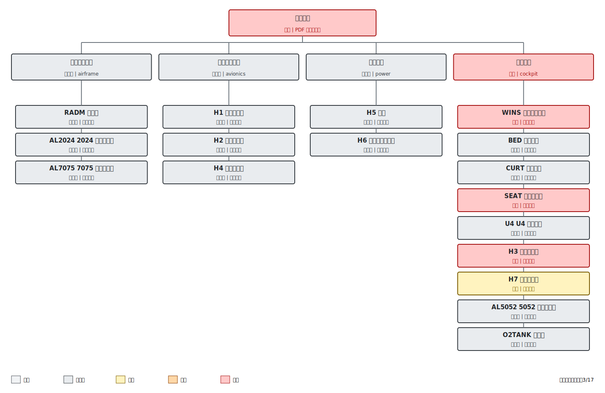

## 系统级传播结果

| 系统 | 等级 | 触发节点 | 采用的传播规则 |
|---|---:|---|---|
| 机体结构系统（`airframe`） | 重度 | AL2024 | 至少一个主要节点达到重度毁伤 |
| 航空电子系统（`avionics`） | 未毁伤 | 无 | 所有已知节点均未达到毁伤标准 |
| 电源系统（`power`） | 未毁伤 | 无 | 所有已知节点均未达到毁伤标准 |
| 座舱系统（`cockpit`） | 重度 | WINS, SEAT, H3 | 至少一个主要节点达到重度毁伤 |

## 完整设备毁伤评估

| 设备组 | 设备名称 | 毁伤树角色 | 等级 | 峰值温度（C） | 轻度证据 | 中度证据 | 重度证据 | 重度毁伤结论 | 物理解释 | 正外部热流探针数 | 有效温度探针数 |
|---|---|---|---:|---:|---|---|---|---|---|---:|---:|
| RADM | 雷达罩 | 机体结构系统：主要节点 | 未毁伤 | 663.8 | 150 C; 15.0/1200 s | 250 C; 4.5/600 s | 400 C; 1.5/180 s | 未达到：连续高于 400 C 的时间仅为 1.5/180 s | 瞬态光辐射或火灾使温度短暂超过重度阈值，但燃烧或热反馈未维持到规定时间。 | 10 | 10 |
| WINS | 有机玻璃舷窗 | 座舱系统：主要节点 | 重度 | 886.1 | 120 C; 475.5/60 s | 200 C; 475.5/45 s | 250 C; 475.5/8 s | 已达到：峰值 886.1 C；连续高于 250 C 的时间为 475.5/8 s | 直接外部热流和/或火灾加热同时提供了足够的温度和持续时间。 | 10 | 10 |
| BED | 尼龙床垫 | 座舱系统：主要节点 | 未毁伤 | 485.1 | 200 C; 34.5/60 s | 250 C; 27.0/90 s | 500 C; 0.0/5 s | 未达到：峰值 485.1 C < 500 C | 监测表面接收到正外部热流，但受脉冲能量、材料热惯性和散热影响，峰值仍低于重度毁伤阈值。 | 8 | 8 |
| CURT | 尼龙窗帘 | 座舱系统：主要节点 | 轻度 | 728.8 | 200 C; 120.0/60 s | 250 C; 39.0/90 s | 500 C; 1.5/5 s | 未达到：连续高于 500 C 的时间仅为 1.5/5 s | 瞬态光辐射或火灾使温度短暂超过重度阈值，但燃烧或热反馈未维持到规定时间。 | 10 | 10 |
| U4 | U4 仪器设备 | 座舱系统：主要节点 | 未毁伤 | 174.9 | 120 C; 163.5/300 s | 250 C; 0.0/180 s | 400 C; 0.0/5 s | 未达到：峰值 174.9 C < 400 C | 监测表面未分配到正外部热流；几何遮挡后仅靠舱内二次火灾加热，温度低于重度毁伤阈值。 | 0 | 6 |
| SEAT | 聚氨酯座椅 | 座舱系统：主要节点 | 重度 | 1361.0 | 200 C; 354.0/60 s | 300 C; 237.0/90 s | 500 C; 25.5/5 s | 已达到：峰值 1361.0 C；连续高于 500 C 的时间为 25.5/5 s | 直接外部热流和/或火灾加热同时提供了足够的温度和持续时间。 | 3 | 10 |
| AL2024 | 2024 铝合金蒙皮 | 机体结构系统：主要节点 | 重度 | 429.5 | 120 C; 472.5/1200 s | 250 C; 423.0/600 s | 400 C; 228.0/180 s | 已达到：峰值 429.5 C；连续高于 400 C 的时间为 228.0/180 s | 直接外部热流和/或火灾加热同时提供了足够的温度和持续时间。 | 5 | 10 |
| AL5052 | 5052 铝合金风管 | 座舱系统：次要节点 | 未毁伤 | 428.6 | 120 C; 357.0/1200 s | 250 C; 295.5/600 s | 400 C; 127.5/180 s | 未达到：连续高于 400 C 的时间仅为 127.5/180 s | 瞬态光辐射或火灾使温度短暂超过重度阈值，但燃烧或热反馈未维持到规定时间。 | 0 | 10 |
| AL7075 | 7075 铝合金框架 | 机体结构系统：主要节点 | 未毁伤 | 201.7 | 120 C; 379.5/1200 s | 200 C; 1.5/600 s | 400 C; 0.0/180 s | 未达到：峰值 201.7 C < 400 C | 监测表面接收到正外部热流，但受脉冲能量、材料热惯性和散热影响，峰值仍低于重度毁伤阈值。 | 3 | 10 |
| O2TANK | 氧气瓶 | 座舱系统：次要节点 | 未毁伤 | 153.0 | 120 C; 172.5/1200 s | 200 C; 0.0/600 s | 400 C; 0.0/180 s | 未达到：峰值 153.0 C < 400 C | 监测表面接收到正外部热流，但受脉冲能量、材料热惯性和散热影响，峰值仍低于重度毁伤阈值。 | 6 | 8 |
| H1 | 导航子系统 | 航空电子系统：主要节点 | 未毁伤 | 159.2 | 120 C; 85.5/300 s | 250 C; 0.0/180 s | 400 C; 0.0/5 s | 未达到：峰值 159.2 C < 400 C | 监测表面接收到正外部热流，但受脉冲能量、材料热惯性和散热影响，峰值仍低于重度毁伤阈值。 | 3 | 6 |
| H2 | 任务子系统 | 航空电子系统：主要节点 | 未毁伤 | 159.4 | 120 C; 93.0/300 s | 250 C; 0.0/180 s | 400 C; 0.0/5 s | 未达到：峰值 159.4 C < 400 C | 监测表面接收到正外部热流，但受脉冲能量、材料热惯性和散热影响，峰值仍低于重度毁伤阈值。 | 8 | 8 |
| H3 | 显示子系统 | 座舱系统：主要节点 | 重度 | 536.9 | 120 C; 334.5/300 s | 250 C; 286.5/180 s | 400 C; 226.5/5 s | 已达到：峰值 536.9 C；连续高于 400 C 的时间为 226.5/5 s | 舱内二次火灾加热同时提供了足够的温度和持续时间。 | 0 | 14 |
| H4 | 通信子系统 | 航空电子系统：次要节点 | 未毁伤 | 133.4 | 120 C; 84.0/300 s | 250 C; 0.0/180 s | 400 C; 0.0/5 s | 未达到：峰值 133.4 C < 400 C | 监测表面接收到正外部热流，但受脉冲能量、材料热惯性和散热影响，峰值仍低于重度毁伤阈值。 | 4 | 10 |
| H5 | 电池 | 电源系统：主要节点 | 未毁伤 | 100.7 | 100 C; 21.0/60 s | 150 C; 0.0/600 s | 200 C; 0.0/180 s | 未达到：峰值 100.7 C < 200 C | 监测表面接收到正外部热流，但受脉冲能量、材料热惯性和散热影响，峰值仍低于重度毁伤阈值。 | 1 | 6 |
| H6 | 电力传输子系统 | 电源系统：主要节点 | 未毁伤 | 413.5 | 120 C; 157.5/1200 s | 200 C; 54.0/600 s | 400 C; 4.5/180 s | 未达到：连续高于 400 C 的时间仅为 4.5/180 s | 瞬态光辐射或火灾使温度短暂超过重度阈值，但燃烧或热反馈未维持到规定时间。 | 0 | 8 |
| H7 | 操纵子系统 | 座舱系统：主要节点 | 轻度 | 452.8 | 120 C; 466.5/300 s | 250 C; 52.5/180 s | 400 C; 3.0/5 s | 未达到：连续高于 400 C 的时间仅为 3.0/5 s | 瞬态光辐射或火灾使温度短暂超过重度阈值，但燃烧或热反馈未维持到规定时间。 | 0 | 3 |

## 评估结论与解释

- 未达到重度或证据未知的设备组：**RADM, BED, CURT, U4, AL5052, AL7075, O2TANK, H1, H2, H4, H5, H6, H7**。
- 重度毁伤未满足的原因统计：**8 项受峰值温度限制**，**5 项受持续时间限制**。
- 整机等级取各系统已知等级中的最高等级：**重度**。
- H2（任务子系统）和 H3（显示子系统）属于当前模型的专用映射，其通用电子设备阈值并非 PDF 中的同名条目。
- H1-H4 探针当前测量铝合金外壳表面温度，并将其作为内部电子器件温度的代理。

## 按毁伤树原则对本案例的详细解释

该案例当前属于实时快照（案例仍在运行），有效模拟时间为 477.0 s。它可以反映已经形成的温度峰值和累计持续时间，但不能替代正常完成结果；所有临界设备仍需在完整结果中复核。
按照设备级温度与持续时间判据，当前达到重度毁伤的设备组共有 4 个：WINS, SEAT, AL2024, H3。这些设备不仅达到重度温度阈值，而且最长连续超阈时间也满足规定时长，因此其重度结论具有完整的温度和时间证据。
峰值温度受限设备包括：BED（峰值 485.1 C，阈值 500 C）、U4（峰值 174.9 C，阈值 400 C）、AL7075（峰值 201.7 C，阈值 400 C）、O2TANK（峰值 153.0 C，阈值 400 C）、H1（峰值 159.2 C，阈值 400 C）、H2（峰值 159.4 C，阈值 400 C）、H4（峰值 133.4 C，阈值 400 C）、H5（峰值 100.7 C，阈值 200 C）。这些对象尚未进入重度判据温度区间，继续延长模拟时间并不会自动补足峰值条件；需要结合直接受照、遮挡和二次火灾强度判断其原因。
持续时间受限设备包括：RADM（1.5/180 s，高于 400 C）、CURT（1.5/5 s，高于 500 C）、AL5052（127.5/180 s，高于 400 C）、H6（4.5/180 s，高于 400 C）、H7（3.0/5 s，高于 400 C）。这些对象已经出现足够高的瞬态峰值，但热解、燃烧或邻近火灾反馈没有把温度维持到标准要求，因此不能仅凭最高温度判为重度毁伤。
U4, AL5052, H6, H7 的有效监测面没有记录到正外部热流，它们主要依靠舱内二次火灾加热。若这些设备未达到重度，优先应检查 DDA 可见性、设备实际朝向、邻近可燃物燃烧持续性及探针是否覆盖热点，而不是直接降低材料强度或毁伤标准。
系统级传播结果为：机体结构系统为重度，触发节点为AL2024；航空电子系统为未毁伤，触发节点为无明确触发节点；电源系统为未毁伤，触发节点为无明确触发节点；座舱系统为重度，触发节点为WINS、SEAT、H3。系统等级由主要节点和次要节点按既定规则传播，不是按系统内所有设备温度求平均。
最终 PDF 毁伤树整机等级为重度，而严格全设备结果为 4/17。前者说明至少一个关键系统已达到相应任务毁伤等级；后者说明距离“所有材料和设备均重度毁伤”的研究目标仍有 13 个设备组未满足。两者必须同时保留，不能用整机重度替代 17/17。
因此，本案例是否能够作为全毁伤阈值的成功点，只取决于严格结果是否达到 17/17，并且案例是否正常完成。未达到 17/17 时，应根据上面的峰值受限、持续时间受限和遮挡分类确定下一步物理参数研究方向。

---

## 完整毁伤树评估：Q0400_W0100_az270_el15_H1H7_v5_Qnorm_threshold

- 模拟时间：**1452.00 s**
- 来源目录：`cases_threshold/Q0400_W0100_az270_el15_H1H7_v5_Qnorm_threshold`
- 方案分类：**阈值搜索方案**
- 评估状态：**实时快照（案例仍在运行）**
- PDF 毁伤树整机等级：**重度**
- 严格全设备重度毁伤结果：**7/17** （全部重度毁伤=否）
- 最高温度定义：几何位置有效的冗余壁面温度探针动态包络最大值。
- 注意：严格的 17/17 指标不等同于 PDF 毁伤树的整机等级判据。

## 案例配置

| 参数 | 数值 |
|---|---|
| 方案用途 | automatic_fluence_threshold_search |
| 来源案例 | Q0400_W0100_az270_el15_H1H7_v5_Qnorm |
| 修改因素 | 未记录 |
| 光冲量 Q（J/cm2） | 400 |
| 核爆当量（kt） | 100 |
| 方位角（度） | 270 |
| 俯仰角（度） | 15 |
| 目标模拟时长（s） | 1500 |
| MPI 进程数 | 32 |
| BURN_AWAY | 否 |
| 辐射份额 | 0.4 |
| 最大 CFL | 未记录 |
| 指定时间步长（s） | 未记录 |
| 核辐射脉冲积分（s） | 0.660398 |
| 入射面峰值辐照度（kW/m2） | 6056.95 |
| 最大局部外部热流（kW/m2） | 5883 |
| 最大局部积分光冲量（J/cm2） | 388.512 |
| 各材料 HRRPUA（kW/m2） | 未记录 |
| FDS 中全部 HRRPUA（kW/m2） | [75.0, 100.0, 180.0, 200.0, 250.0] |
| 审查后的材料厚度（m） | 未记录 |
| FDS 中全部材料层厚度（m） | [0.001, 0.0015, 0.002, 0.003, 0.005, 0.03, 0.075, 0.12, 0.15] |
| 几何是否修改 | 否 |
| 材料是否修改 | 否 |
| 燃烧参数是否修改 | 否 |
| 外部热流是否修改 | 否 |
| 点燃温度是否修改 | 否 |
| 毁伤阈值是否修改 | 否 |
| FDS 输入文件 | Q0400_W0100_az270_el15_H1H7_v5_Qnorm_threshold.fds |

## 已知问题与结果有效性

- 该结果是 1452.0 s 的长时快照，缺少 FDS 正常结束标记；在达到 T_END 前，温度和毁伤等级仍可能变化。
- H1-H4 目前以铝合金外壳壁面温度代理内部电子器件温度。

## 毁伤树

## 系统级传播结果

| 系统 | 等级 | 触发节点 | 采用的传播规则 |
|---|---:|---|---|
| 机体结构系统（`airframe`） | 重度 | AL2024 | 至少一个主要节点达到重度毁伤 |
| 航空电子系统（`avionics`） | 重度 | H1, H2 | 至少一个主要节点达到重度毁伤 |
| 电源系统（`power`） | 未毁伤 | 无 | 所有已知节点均未达到毁伤标准 |
| 座舱系统（`cockpit`） | 重度 | WINS, CURT, SEAT, H3 | 至少一个主要节点达到重度毁伤 |

## 完整设备毁伤评估

| 设备组 | 设备名称 | 毁伤树角色 | 等级 | 峰值温度（C） | 轻度证据 | 中度证据 | 重度证据 | 重度毁伤结论 | 物理解释 | 正外部热流探针数 | 有效温度探针数 |
|---|---|---|---:|---:|---|---|---|---|---|---:|---:|
| RADM | 雷达罩 | 机体结构系统：主要节点 | 中度 | 1530.2 | 150 C; 1450.5/1200 s | 250 C; 904.5/600 s | 400 C; 9.0/180 s | 未达到：连续高于 400 C 的时间仅为 9.0/180 s | 瞬态光辐射或火灾使温度短暂超过重度阈值，但燃烧或热反馈未维持到规定时间。 | 10 | 10 |
| WINS | 有机玻璃舷窗 | 座舱系统：主要节点 | 重度 | 1712.9 | 120 C; 1450.5/60 s | 200 C; 1450.5/45 s | 250 C; 1450.5/8 s | 已达到：峰值 1712.9 C；连续高于 250 C 的时间为 1450.5/8 s | 直接外部热流和/或火灾加热同时提供了足够的温度和持续时间。 | 10 | 10 |
| BED | 尼龙床垫 | 座舱系统：主要节点 | 未毁伤 | 691.4 | 200 C; 43.5/60 s | 250 C; 33.0/90 s | 500 C; 0.0/5 s | 未达到：连续高于 500 C 的时间仅为 0.0/5 s | 瞬态光辐射或火灾使温度短暂超过重度阈值，但燃烧或热反馈未维持到规定时间。 | 8 | 8 |
| CURT | 尼龙窗帘 | 座舱系统：主要节点 | 重度 | 1544.1 | 200 C; 1213.5/60 s | 250 C; 1027.5/90 s | 500 C; 6.0/5 s | 已达到：峰值 1544.1 C；连续高于 500 C 的时间为 6.0/5 s | 直接外部热流和/或火灾加热同时提供了足够的温度和持续时间。 | 10 | 10 |
| U4 | U4 仪器设备 | 座舱系统：主要节点 | 中度 | 272.3 | 120 C; 1113.0/300 s | 250 C; 417.0/180 s | 400 C; 0.0/5 s | 未达到：峰值 272.3 C < 400 C | 监测表面未分配到正外部热流；几何遮挡后仅靠舱内二次火灾加热，温度低于重度毁伤阈值。 | 0 | 6 |
| SEAT | 聚氨酯座椅 | 座舱系统：主要节点 | 重度 | 2726.8 | 200 C; 1450.5/60 s | 300 C; 1450.5/90 s | 500 C; 1450.5/5 s | 已达到：峰值 2726.8 C；连续高于 500 C 的时间为 1450.5/5 s | 直接外部热流和/或火灾加热同时提供了足够的温度和持续时间。 | 4 | 10 |
| AL2024 | 2024 铝合金蒙皮 | 机体结构系统：主要节点 | 重度 | 694.6 | 120 C; 1450.5/1200 s | 250 C; 1450.5/600 s | 400 C; 1450.5/180 s | 已达到：峰值 694.6 C；连续高于 400 C 的时间为 1450.5/180 s | 直接外部热流和/或火灾加热同时提供了足够的温度和持续时间。 | 5 | 10 |
| AL5052 | 5052 铝合金风管 | 座舱系统：次要节点 | 中度 | 390.2 | 120 C; 1290.0/1200 s | 250 C; 1186.5/600 s | 400 C; 0.0/180 s | 未达到：峰值 390.2 C < 400 C | 监测表面未分配到正外部热流；几何遮挡后仅靠舱内二次火灾加热，温度低于重度毁伤阈值。 | 0 | 10 |
| AL7075 | 7075 铝合金框架 | 机体结构系统：主要节点 | 轻度 | 428.8 | 120 C; 1450.5/1200 s | 200 C; 198.0/600 s | 400 C; 13.5/180 s | 未达到：连续高于 400 C 的时间仅为 13.5/180 s | 瞬态光辐射或火灾使温度短暂超过重度阈值，但燃烧或热反馈未维持到规定时间。 | 3 | 10 |
| O2TANK | 氧气瓶 | 座舱系统：次要节点 | 中度 | 244.3 | 120 C; 1450.5/1200 s | 200 C; 601.5/600 s | 400 C; 0.0/180 s | 未达到：峰值 244.3 C < 400 C | 监测表面接收到正外部热流，但受脉冲能量、材料热惯性和散热影响，峰值仍低于重度毁伤阈值。 | 6 | 8 |
| H1 | 导航子系统 | 航空电子系统：主要节点 | 重度 | 471.5 | 120 C; 361.5/300 s | 250 C; 106.5/180 s | 400 C; 24.0/5 s | 已达到：峰值 471.5 C；连续高于 400 C 的时间为 24.0/5 s | 直接外部热流和/或火灾加热同时提供了足够的温度和持续时间。 | 5 | 6 |
| H2 | 任务子系统 | 航空电子系统：主要节点 | 重度 | 477.2 | 120 C; 442.5/300 s | 250 C; 147.0/180 s | 400 C; 46.5/5 s | 已达到：峰值 477.2 C；连续高于 400 C 的时间为 46.5/5 s | 直接外部热流和/或火灾加热同时提供了足够的温度和持续时间。 | 8 | 8 |
| H3 | 显示子系统 | 座舱系统：主要节点 | 重度 | 591.3 | 120 C; 1290.0/300 s | 250 C; 1228.5/180 s | 400 C; 1158.0/5 s | 已达到：峰值 591.3 C；连续高于 400 C 的时间为 1158.0/5 s | 舱内二次火灾加热同时提供了足够的温度和持续时间。 | 0 | 14 |
| H4 | 通信子系统 | 航空电子系统：次要节点 | 轻度 | 202.2 | 120 C; 1441.5/300 s | 250 C; 0.0/180 s | 400 C; 0.0/5 s | 未达到：峰值 202.2 C < 400 C | 监测表面接收到正外部热流，但受脉冲能量、材料热惯性和散热影响，峰值仍低于重度毁伤阈值。 | 4 | 10 |
| H5 | 电池 | 电源系统：主要节点 | 未毁伤 | 86.4 | 100 C; 0.0/60 s | 150 C; 0.0/600 s | 200 C; 0.0/180 s | 未达到：峰值 86.4 C < 200 C | 监测表面接收到正外部热流，但受脉冲能量、材料热惯性和散热影响，峰值仍低于重度毁伤阈值。 | 3 | 6 |
| H6 | 电力传输子系统 | 电源系统：主要节点 | 未毁伤 | 263.2 | 120 C; 823.5/1200 s | 200 C; 52.5/600 s | 400 C; 0.0/180 s | 未达到：峰值 263.2 C < 400 C | 监测表面未分配到正外部热流；几何遮挡后仅靠舱内二次火灾加热，温度低于重度毁伤阈值。 | 0 | 8 |
| H7 | 操纵子系统 | 座舱系统：主要节点 | 轻度 | 383.6 | 120 C; 1441.5/300 s | 250 C; 54.0/180 s | 400 C; 0.0/5 s | 未达到：峰值 383.6 C < 400 C | 监测表面未分配到正外部热流；几何遮挡后仅靠舱内二次火灾加热，温度低于重度毁伤阈值。 | 0 | 3 |

## 评估结论与解释

- 未达到重度或证据未知的设备组：**RADM, BED, U4, AL5052, AL7075, O2TANK, H4, H5, H6, H7**。
- 重度毁伤未满足的原因统计：**7 项受峰值温度限制**，**3 项受持续时间限制**。
- 整机等级取各系统已知等级中的最高等级：**重度**。
- H2（任务子系统）和 H3（显示子系统）属于当前模型的专用映射，其通用电子设备阈值并非 PDF 中的同名条目。
- H1-H4 探针当前测量铝合金外壳表面温度，并将其作为内部电子器件温度的代理。

## 按毁伤树原则对本案例的详细解释

该案例当前属于实时快照（案例仍在运行），有效模拟时间为 1452.0 s。它可以反映已经形成的温度峰值和累计持续时间，但不能替代正常完成结果；所有临界设备仍需在完整结果中复核。
该案例标称入射面光冲量为 400 J/cm2，模型表面的最大局部积分光冲量为 388.512 J/cm2，约为标称值的 97.1%。因此设备实际受照还受到入射角、表面朝向与几何遮挡影响，不能把标称 Q 直接等同于每个设备表面接收的光冲量。
按照设备级温度与持续时间判据，当前达到重度毁伤的设备组共有 7 个：WINS, CURT, SEAT, AL2024, H1, H2, H3。这些设备不仅达到重度温度阈值，而且最长连续超阈时间也满足规定时长，因此其重度结论具有完整的温度和时间证据。
峰值温度受限设备包括：U4（峰值 272.3 C，阈值 400 C）、AL5052（峰值 390.2 C，阈值 400 C）、O2TANK（峰值 244.3 C，阈值 400 C）、H4（峰值 202.2 C，阈值 400 C）、H5（峰值 86.4 C，阈值 200 C）、H6（峰值 263.2 C，阈值 400 C）、H7（峰值 383.6 C，阈值 400 C）。这些对象尚未进入重度判据温度区间，继续延长模拟时间并不会自动补足峰值条件；需要结合直接受照、遮挡和二次火灾强度判断其原因。
持续时间受限设备包括：RADM（9.0/180 s，高于 400 C）、BED（0.0/5 s，高于 500 C）、AL7075（13.5/180 s，高于 400 C）。这些对象已经出现足够高的瞬态峰值，但热解、燃烧或邻近火灾反馈没有把温度维持到标准要求，因此不能仅凭最高温度判为重度毁伤。
U4, AL5052, H6, H7 的有效监测面没有记录到正外部热流，它们主要依靠舱内二次火灾加热。若这些设备未达到重度，优先应检查 DDA 可见性、设备实际朝向、邻近可燃物燃烧持续性及探针是否覆盖热点，而不是直接降低材料强度或毁伤标准。
系统级传播结果为：机体结构系统为重度，触发节点为AL2024；航空电子系统为重度，触发节点为H1、H2；电源系统为未毁伤，触发节点为无明确触发节点；座舱系统为重度，触发节点为WINS、CURT、SEAT、H3。系统等级由主要节点和次要节点按既定规则传播，不是按系统内所有设备温度求平均。
最终 PDF 毁伤树整机等级为重度，而严格全设备结果为 7/17。前者说明至少一个关键系统已达到相应任务毁伤等级；后者说明距离“所有材料和设备均重度毁伤”的研究目标仍有 10 个设备组未满足。两者必须同时保留，不能用整机重度替代 17/17。
因此，本案例是否能够作为全毁伤阈值的成功点，只取决于严格结果是否达到 17/17，并且案例是否正常完成。未达到 17/17 时，应根据上面的峰值受限、持续时间受限和遮挡分类确定下一步物理参数研究方向。
