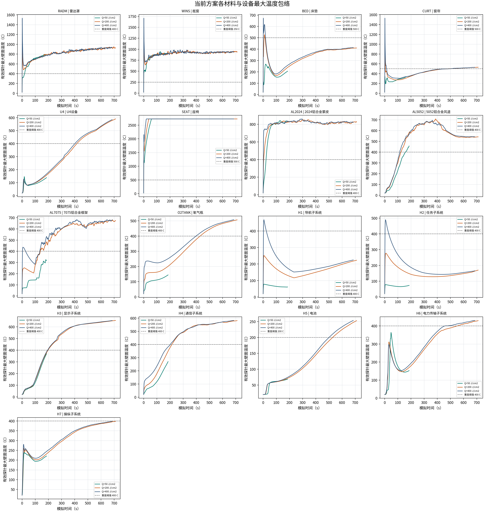
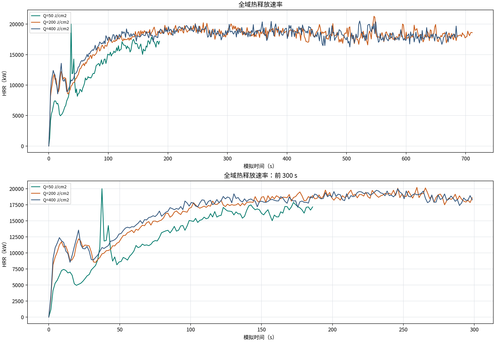
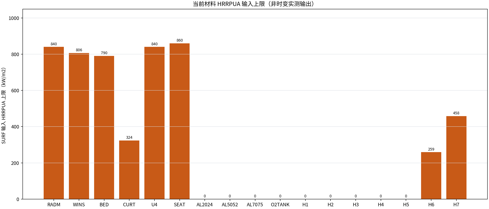
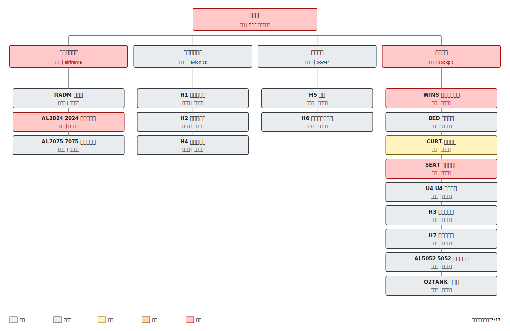
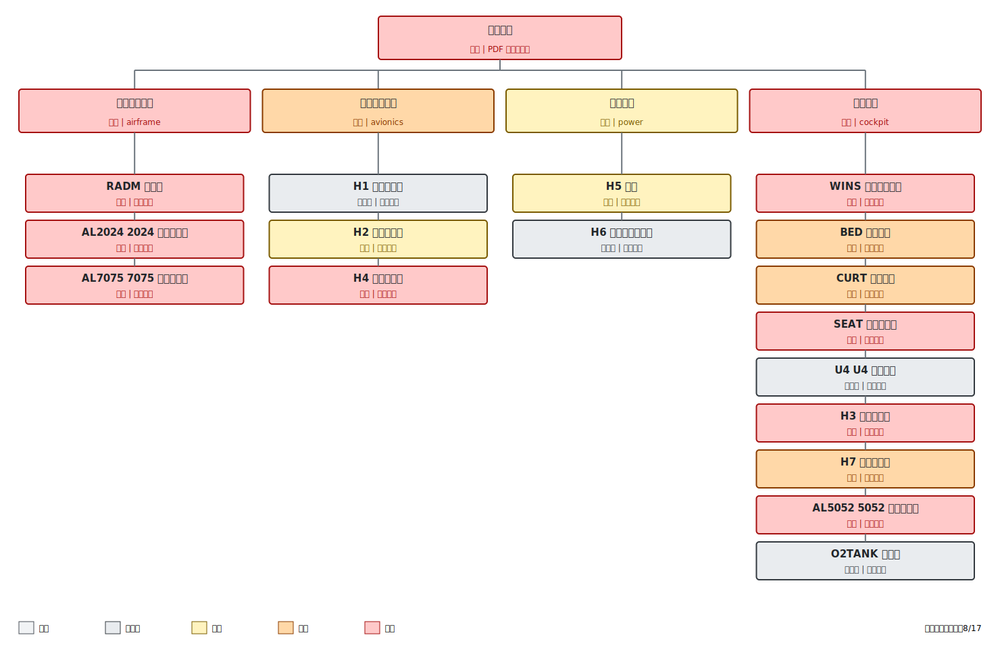

# H1-H7 高 HRRPUA 与审查厚度方案实时毁伤监测

- 本次检查时间：**2026-07-22T21:32:59+08:00**
- 固定参数：W=100 kt，az=270 deg，el=15 deg，T_END=1500 s，入射面光冲量归一化。
- 本页只汇总 `_adapt_HRRupper_thickness_audit` 参数族，不与旧热流、旧厚度或其它敏感性方案混用。
- 运行中结果属于实时快照，后续温度和持续时间仍会变化；只有 FDS 正常运行到 1500 s 才是最终结果。

## 节点与总体状态

| 节点 | 当前/队列案例 | 状态 | 数据时间（s） | 严格重度毁伤 | PDF整机等级 |
|---|---|---|---:|---:|---|
| node01 | Q50 | 实时快照（运行中） | 186.0 / 1500 | 3/17 | 重度 |
| node04 | Q400 -> Q300 | 实时快照（运行中） | 685.5 / 1500 | 16/17 | 重度 |
| node05 | Q200 -> Q100 | 实时快照（运行中） | 711.0 / 1500 | 12/17 | 重度 |

## 最新曲线

温度曲线取同一对象全部几何有效探针在每个时刻的最大值，形成动态包络。它是监测点集合中的最大值，不等同于连续表面场的绝对最大值。

HRR 曲线是 FDS 全域时变输出；当前模型没有逐材料时变 HRRPUA 输出，因此第三幅图列示各 SURF 的 HRRPUA 输入上限，不能将其解释为材料在每个时刻实际释放的热量。

## 逐案例毁伤状态

### Q=50 J/cm2

状态：**实时快照（运行中）**；数据截止 **186.0 s**；严格重度毁伤 **3/17**；PDF毁伤树整机等级 **重度**。

| 材料/设备 | 毁伤等级 | 最高温度（C） | 重度阈值连续时间（s） | 重度要求（s） | 判定 |
|---|---|---:|---:|---:|---|
| RADM | 中度 | 793.6 | 166.5 | 180.0 | 峰值或持续时间不足 |
| WINS | 重度 | 950.3 | 184.5 | 8.0 | 达到重度 |
| BED | 未毁伤 | 267.1 | 0.0 | 5.0 | 峰值或持续时间不足 |
| CURT | 中度 | 347.2 | 0.0 | 5.0 | 峰值或持续时间不足 |
| U4 | 未毁伤 | 146.6 | 0.0 | 5.0 | 峰值或持续时间不足 |
| SEAT | 重度 | 2726.8 | 184.5 | 5.0 | 达到重度 |
| AL2024 | 重度 | 842.5 | 163.5 | 60.0 | 达到重度 |
| AL5052 | 未毁伤 | 456.9 | 27.0 | 60.0 | 峰值或持续时间不足 |
| AL7075 | 未毁伤 | 325.1 | 0.0 | 60.0 | 峰值或持续时间不足 |
| O2TANK | 未毁伤 | 144.2 | 0.0 | 60.0 | 峰值或持续时间不足 |
| H1 | 未毁伤 | 78.3 | 0.0 | 5.0 | 峰值或持续时间不足 |
| H2 | 未毁伤 | 78.4 | 0.0 | 5.0 | 峰值或持续时间不足 |
| H3 | 未毁伤 | 369.5 | 0.0 | 5.0 | 峰值或持续时间不足 |
| H4 | 未毁伤 | 270.3 | 0.0 | 5.0 | 峰值或持续时间不足 |
| H5 | 未毁伤 | 68.4 | 0.0 | 180.0 | 峰值或持续时间不足 |
| H6 | 未毁伤 | 364.1 | 0.0 | 180.0 | 峰值或持续时间不足 |
| H7 | 未毁伤 | 240.0 | 0.0 | 5.0 | 峰值或持续时间不足 |

系统毁伤：airframe=重度；avionics=未毁伤；power=未毁伤；cockpit=重度。

#### 未达到重度毁伤对象的逐项机理分析

下列计算均为当前实时快照。对于峰值不足和持续时间不足分别给出原因，不把二者混用。

##### RADM：E玻璃纤维复合材料

当前峰值为 **793.6 C**，重度判据为 **400 C 持续 180 s**，实际最长连续时间为 **166.5 s**。

单位面积热容量为 `rho*cp*d = 2540*1000*0.1 = 254000 J/(m2*K)`；从 20 C 升至重度阈值所需的理想显热约为 `9652.0 J/cm2`。该值忽略反射、角度投影、向实体内部导热、对流、辐射散热和热解，只用于解释热惯性，不能直接当作光冲量阈值。

有效温度探针中有 **10/10** 个对应正外部热流面，登记峰值为 **735 kW/m2**。标称 Q=50 J/cm2 是入射平面光冲量，不等于该对象实际吸收的光冲量。

峰值已经超过重度温度阈值，但还缺少 **13.5 s** 连续保持时间。这属于持续时间不足，而不是峰值温度不足；后续若温度重新升高并连续越过阈值，等级仍可能改变。

该表面设置 `IGNITION_TEMPERATURE=400 C`、`HRRPUA=840 kW/m2`，峰值已越过点燃温度。若仍未满足重度判据，重点应检查点燃后的有效燃烧面积、持续热释放、邻近表面的热反馈以及探针是否覆盖持续热点。

##### BED：尼龙床垫表层

当前峰值为 **267.1 C**，重度判据为 **500 C 持续 5 s**，实际最长连续时间为 **0.0 s**。

单位面积热容量为 `rho*cp*d = 1140*1700*0.00089 = 1725 J/(m2*K)`；从 20 C 升至重度阈值所需的理想显热约为 `82.8 J/cm2`。该值忽略反射、角度投影、向实体内部导热、对流、辐射散热和热解，只用于解释热惯性，不能直接当作光冲量阈值。

有效温度探针中有 **8/8** 个对应正外部热流面，登记峰值为 **441 kW/m2**。标称 Q=50 J/cm2 是入射平面光冲量，不等于该对象实际吸收的光冲量。

峰值仍低于重度阈值 **232.9 C**。虽然监测面直接受照，但实际吸收能量受投影、表面换热和材料热惯性限制，且后续二次火灾没有提供足够持续加热。

该表面设置 `IGNITION_TEMPERATURE=250 C`、`HRRPUA=790 kW/m2`，峰值已越过点燃温度。若仍未满足重度判据，重点应检查点燃后的有效燃烧面积、持续热释放、邻近表面的热反馈以及探针是否覆盖持续热点。

##### CURT：尼龙窗帘

当前峰值为 **347.2 C**，重度判据为 **500 C 持续 5 s**，实际最长连续时间为 **0.0 s**。

单位面积热容量为 `rho*cp*d = 1140*1700*0.003 = 5814 J/(m2*K)`；从 20 C 升至重度阈值所需的理想显热约为 `279.1 J/cm2`。该值忽略反射、角度投影、向实体内部导热、对流、辐射散热和热解，只用于解释热惯性，不能直接当作光冲量阈值。

有效温度探针中有 **10/10** 个对应正外部热流面，登记峰值为 **618 kW/m2**。标称 Q=50 J/cm2 是入射平面光冲量，不等于该对象实际吸收的光冲量。

峰值仍低于重度阈值 **152.8 C**。虽然监测面直接受照，但实际吸收能量受投影、表面换热和材料热惯性限制，且后续二次火灾没有提供足够持续加热。

该表面设置 `IGNITION_TEMPERATURE=250 C`、`HRRPUA=324 kW/m2`，峰值已越过点燃温度。若仍未满足重度判据，重点应检查点燃后的有效燃烧面积、持续热释放、邻近表面的热反馈以及探针是否覆盖持续热点。

##### U4：环氧玻璃纤维

当前峰值为 **146.6 C**，重度判据为 **400 C 持续 5 s**，实际最长连续时间为 **0.0 s**。

单位面积热容量为 `rho*cp*d = 2540*1000*0.006 = 15240 J/(m2*K)`；从 20 C 升至重度阈值所需的理想显热约为 `579.1 J/cm2`。该值忽略反射、角度投影、向实体内部导热、对流、辐射散热和热解，只用于解释热惯性，不能直接当作光冲量阈值。

有效温度探针中有 **0/6** 个对应正外部热流面，登记峰值为 **0 kW/m2**。标称 Q=50 J/cm2 是入射平面光冲量，不等于该对象实际吸收的光冲量。

峰值仍低于重度阈值 **253.4 C**，且有效探针没有直接受照面。其升温主要来自邻近火焰、热烟气和舱内辐射，因此结果受二次火灾位置与持续性控制。

该表面设置 `IGNITION_TEMPERATURE=350 C`、`HRRPUA=840 kW/m2`。当前峰值低于点燃温度 **203.4 C**，因此尚不能依靠自身燃烧维持升温；提高HRRPUA本身在未点燃前不会生效。

##### AL5052：铝合金5052

当前峰值为 **456.9 C**，重度判据为 **400 C 持续 60 s**，实际最长连续时间为 **27.0 s**。

单位面积热容量为 `rho*cp*d = 2680*880*0.0015 = 3538 J/(m2*K)`；从 20 C 升至重度阈值所需的理想显热约为 `134.4 J/cm2`。该值忽略反射、角度投影、向实体内部导热、对流、辐射散热和热解，只用于解释热惯性，不能直接当作光冲量阈值。

有效温度探针中有 **0/10** 个对应正外部热流面，登记峰值为 **0 kW/m2**。标称 Q=50 J/cm2 是入射平面光冲量，不等于该对象实际吸收的光冲量。

峰值已经超过重度温度阈值，但还缺少 **33.0 s** 连续保持时间。这属于持续时间不足，而不是峰值温度不足；后续若温度重新升高并连续越过阈值，等级仍可能改变。

##### AL7075：铝合金7075

当前峰值为 **325.1 C**，重度判据为 **400 C 持续 60 s**，实际最长连续时间为 **0.0 s**。

单位面积热容量为 `rho*cp*d = 2810*960*0.003 = 8093 J/(m2*K)`；从 20 C 升至重度阈值所需的理想显热约为 `307.5 J/cm2`。该值忽略反射、角度投影、向实体内部导热、对流、辐射散热和热解，只用于解释热惯性，不能直接当作光冲量阈值。

有效温度探针中有 **3/10** 个对应正外部热流面，登记峰值为 **735 kW/m2**。标称 Q=50 J/cm2 是入射平面光冲量，不等于该对象实际吸收的光冲量。

峰值仍低于重度阈值 **74.9 C**。对象只有部分监测面直接受照，未受照部分及内部导热共同削弱局部脉冲升温，脉冲后散热又使温度回落。

##### O2TANK：铝合金7075氧气瓶壁

当前峰值为 **144.2 C**，重度判据为 **400 C 持续 60 s**，实际最长连续时间为 **0.0 s**。

单位面积热容量为 `rho*cp*d = 2810*960*0.005 = 13488 J/(m2*K)`；从 20 C 升至重度阈值所需的理想显热约为 `512.5 J/cm2`。该值忽略反射、角度投影、向实体内部导热、对流、辐射散热和热解，只用于解释热惯性，不能直接当作光冲量阈值。

有效温度探针中有 **6/8** 个对应正外部热流面，登记峰值为 **529 kW/m2**。标称 Q=50 J/cm2 是入射平面光冲量，不等于该对象实际吸收的光冲量。

峰值仍低于重度阈值 **255.8 C**。对象只有部分监测面直接受照，未受照部分及内部导热共同削弱局部脉冲升温，脉冲后散热又使温度回落。

##### H1：铝合金6061外壳

当前峰值为 **78.3 C**，重度判据为 **400 C 持续 5 s**，实际最长连续时间为 **0.0 s**。

单位面积热容量为 `rho*cp*d = 2700*896*0.003 = 7258 J/(m2*K)`；从 20 C 升至重度阈值所需的理想显热约为 `275.8 J/cm2`。该值忽略反射、角度投影、向实体内部导热、对流、辐射散热和热解，只用于解释热惯性，不能直接当作光冲量阈值。

有效温度探针中有 **5/6** 个对应正外部热流面，登记峰值为 **735 kW/m2**。标称 Q=50 J/cm2 是入射平面光冲量，不等于该对象实际吸收的光冲量。

峰值仍低于重度阈值 **321.7 C**。对象只有部分监测面直接受照，未受照部分及内部导热共同削弱局部脉冲升温，脉冲后散热又使温度回落。

该对象当前只建模为不可燃的3 mm铝合金6061外壳，没有内部电路板、线缆或聚合物部件，也没有自身HRRPUA。因此外部脉冲结束后只能依靠邻近火灾继续加热。当前判定反映的是铝壳表面热毁伤代理，不等同于真实内部电子器件一定未发生功能失效。

##### H2：铝合金6061外壳

当前峰值为 **78.4 C**，重度判据为 **400 C 持续 5 s**，实际最长连续时间为 **0.0 s**。

单位面积热容量为 `rho*cp*d = 2700*896*0.003 = 7258 J/(m2*K)`；从 20 C 升至重度阈值所需的理想显热约为 `275.8 J/cm2`。该值忽略反射、角度投影、向实体内部导热、对流、辐射散热和热解，只用于解释热惯性，不能直接当作光冲量阈值。

有效温度探针中有 **6/8** 个对应正外部热流面，登记峰值为 **735 kW/m2**。标称 Q=50 J/cm2 是入射平面光冲量，不等于该对象实际吸收的光冲量。

峰值仍低于重度阈值 **321.6 C**。对象只有部分监测面直接受照，未受照部分及内部导热共同削弱局部脉冲升温，脉冲后散热又使温度回落。

该对象当前只建模为不可燃的3 mm铝合金6061外壳，没有内部电路板、线缆或聚合物部件，也没有自身HRRPUA。因此外部脉冲结束后只能依靠邻近火灾继续加热。当前判定反映的是铝壳表面热毁伤代理，不等同于真实内部电子器件一定未发生功能失效。

##### H3：铝合金6061外壳

当前峰值为 **369.5 C**，重度判据为 **400 C 持续 5 s**，实际最长连续时间为 **0.0 s**。

单位面积热容量为 `rho*cp*d = 2700*896*0.003 = 7258 J/(m2*K)`；从 20 C 升至重度阈值所需的理想显热约为 `275.8 J/cm2`。该值忽略反射、角度投影、向实体内部导热、对流、辐射散热和热解，只用于解释热惯性，不能直接当作光冲量阈值。

有效温度探针中有 **0/14** 个对应正外部热流面，登记峰值为 **0 kW/m2**。标称 Q=50 J/cm2 是入射平面光冲量，不等于该对象实际吸收的光冲量。

峰值仍低于重度阈值 **30.5 C**，且有效探针没有直接受照面。其升温主要来自邻近火焰、热烟气和舱内辐射，因此结果受二次火灾位置与持续性控制。

该对象当前只建模为不可燃的3 mm铝合金6061外壳，没有内部电路板、线缆或聚合物部件，也没有自身HRRPUA。因此外部脉冲结束后只能依靠邻近火灾继续加热。当前判定反映的是铝壳表面热毁伤代理，不等同于真实内部电子器件一定未发生功能失效。

##### H4：铝合金6061外壳

当前峰值为 **270.3 C**，重度判据为 **400 C 持续 5 s**，实际最长连续时间为 **0.0 s**。

单位面积热容量为 `rho*cp*d = 2700*896*0.003 = 7258 J/(m2*K)`；从 20 C 升至重度阈值所需的理想显热约为 `275.8 J/cm2`。该值忽略反射、角度投影、向实体内部导热、对流、辐射散热和热解，只用于解释热惯性，不能直接当作光冲量阈值。

有效温度探针中有 **4/10** 个对应正外部热流面，登记峰值为 **118 kW/m2**。标称 Q=50 J/cm2 是入射平面光冲量，不等于该对象实际吸收的光冲量。

峰值仍低于重度阈值 **129.7 C**。对象只有部分监测面直接受照，未受照部分及内部导热共同削弱局部脉冲升温，脉冲后散热又使温度回落。

该对象当前只建模为不可燃的3 mm铝合金6061外壳，没有内部电路板、线缆或聚合物部件，也没有自身HRRPUA。因此外部脉冲结束后只能依靠邻近火灾继续加热。当前判定反映的是铝壳表面热毁伤代理，不等同于真实内部电子器件一定未发生功能失效。

##### H5：铝合金6061外壳

当前峰值为 **68.4 C**，重度判据为 **200 C 持续 180 s**，实际最长连续时间为 **0.0 s**。

单位面积热容量为 `rho*cp*d = 2700*896*0.003 = 7258 J/(m2*K)`；从 20 C 升至重度阈值所需的理想显热约为 `130.6 J/cm2`。该值忽略反射、角度投影、向实体内部导热、对流、辐射散热和热解，只用于解释热惯性，不能直接当作光冲量阈值。

有效温度探针中有 **3/6** 个对应正外部热流面，登记峰值为 **618 kW/m2**。标称 Q=50 J/cm2 是入射平面光冲量，不等于该对象实际吸收的光冲量。

峰值仍低于重度阈值 **131.6 C**。对象只有部分监测面直接受照，未受照部分及内部导热共同削弱局部脉冲升温，脉冲后散热又使温度回落。

该对象当前只建模为不可燃的3 mm铝合金6061外壳，没有内部电路板、线缆或聚合物部件，也没有自身HRRPUA。因此外部脉冲结束后只能依靠邻近火灾继续加热。当前判定反映的是铝壳表面热毁伤代理，不等同于真实内部电子器件一定未发生功能失效。

##### H6：PVC塑料

当前峰值为 **364.1 C**，重度判据为 **400 C 持续 180 s**，实际最长连续时间为 **0.0 s**。

单位面积热容量为 `rho*cp*d = 1449*840*0.001 = 1217 J/(m2*K)`；从 20 C 升至重度阈值所需的理想显热约为 `46.3 J/cm2`。该值忽略反射、角度投影、向实体内部导热、对流、辐射散热和热解，只用于解释热惯性，不能直接当作光冲量阈值。

有效温度探针中有 **0/8** 个对应正外部热流面，登记峰值为 **0 kW/m2**。标称 Q=50 J/cm2 是入射平面光冲量，不等于该对象实际吸收的光冲量。

峰值仍低于重度阈值 **35.9 C**，且有效探针没有直接受照面。其升温主要来自邻近火焰、热烟气和舱内辐射，因此结果受二次火灾位置与持续性控制。

该表面设置 `IGNITION_TEMPERATURE=468.6 C`、`HRRPUA=259 kW/m2`。当前峰值低于点燃温度 **104.5 C**，因此尚不能依靠自身燃烧维持升温；提高HRRPUA本身在未点燃前不会生效。

##### H7：CR橡胶

当前峰值为 **240.0 C**，重度判据为 **400 C 持续 5 s**，实际最长连续时间为 **0.0 s**。

单位面积热容量为 `rho*cp*d = 1500*1120*0.002 = 3360 J/(m2*K)`；从 20 C 升至重度阈值所需的理想显热约为 `127.7 J/cm2`。该值忽略反射、角度投影、向实体内部导热、对流、辐射散热和热解，只用于解释热惯性，不能直接当作光冲量阈值。

有效温度探针中有 **0/3** 个对应正外部热流面，登记峰值为 **0 kW/m2**。标称 Q=50 J/cm2 是入射平面光冲量，不等于该对象实际吸收的光冲量。

峰值仍低于重度阈值 **160.0 C**，且有效探针没有直接受照面。其升温主要来自邻近火焰、热烟气和舱内辐射，因此结果受二次火灾位置与持续性控制。

该表面设置 `IGNITION_TEMPERATURE=410 C`、`HRRPUA=458 kW/m2`。当前峰值低于点燃温度 **170.0 C**，因此尚不能依靠自身燃烧维持升温；提高HRRPUA本身在未点燃前不会生效。

### Q=200 J/cm2

状态：**实时快照（运行中）**；数据截止 **711.0 s**；严格重度毁伤 **12/17**；PDF毁伤树整机等级 **重度**。

| 材料/设备 | 毁伤等级 | 最高温度（C） | 重度阈值连续时间（s） | 重度要求（s） | 判定 |
|---|---|---:|---:|---:|---|
| RADM | 重度 | 1002.4 | 709.5 | 180.0 | 达到重度 |
| WINS | 重度 | 1216.7 | 709.5 | 8.0 | 达到重度 |
| BED | 中度 | 526.7 | 4.5 | 5.0 | 峰值或持续时间不足 |
| CURT | 重度 | 1036.2 | 225.0 | 5.0 | 达到重度 |
| U4 | 重度 | 589.8 | 294.0 | 5.0 | 达到重度 |
| SEAT | 重度 | 2726.8 | 709.5 | 5.0 | 达到重度 |
| AL2024 | 重度 | 851.0 | 706.5 | 60.0 | 达到重度 |
| AL5052 | 重度 | 708.3 | 586.5 | 60.0 | 达到重度 |
| AL7075 | 重度 | 679.9 | 571.5 | 60.0 | 达到重度 |
| O2TANK | 重度 | 506.8 | 280.5 | 60.0 | 达到重度 |
| H1 | 轻度 | 251.7 | 0.0 | 5.0 | 峰值或持续时间不足 |
| H2 | 轻度 | 277.2 | 0.0 | 5.0 | 峰值或持续时间不足 |
| H3 | 重度 | 655.1 | 513.0 | 5.0 | 达到重度 |
| H4 | 重度 | 581.9 | 495.0 | 5.0 | 达到重度 |
| H5 | 重度 | 252.8 | 181.5 | 180.0 | 达到重度 |
| H6 | 未毁伤 | 429.8 | 162.0 | 180.0 | 峰值或持续时间不足 |
| H7 | 中度 | 398.3 | 0.0 | 5.0 | 峰值或持续时间不足 |

系统毁伤：airframe=重度；avionics=中度；power=重度；cockpit=重度。

#### 未达到重度毁伤对象的逐项机理分析

下列计算均为当前实时快照。对于峰值不足和持续时间不足分别给出原因，不把二者混用。

##### BED：尼龙床垫表层

当前峰值为 **526.7 C**，重度判据为 **500 C 持续 5 s**，实际最长连续时间为 **4.5 s**。

单位面积热容量为 `rho*cp*d = 1140*1700*0.00089 = 1725 J/(m2*K)`；从 20 C 升至重度阈值所需的理想显热约为 `82.8 J/cm2`。该值忽略反射、角度投影、向实体内部导热、对流、辐射散热和热解，只用于解释热惯性，不能直接当作光冲量阈值。

有效温度探针中有 **8/8** 个对应正外部热流面，登记峰值为 **1765 kW/m2**。标称 Q=200 J/cm2 是入射平面光冲量，不等于该对象实际吸收的光冲量。

峰值已经超过重度温度阈值，但还缺少 **0.5 s** 连续保持时间。这属于持续时间不足，而不是峰值温度不足；后续若温度重新升高并连续越过阈值，等级仍可能改变。

该表面设置 `IGNITION_TEMPERATURE=250 C`、`HRRPUA=790 kW/m2`，峰值已越过点燃温度。若仍未满足重度判据，重点应检查点燃后的有效燃烧面积、持续热释放、邻近表面的热反馈以及探针是否覆盖持续热点。

##### H1：铝合金6061外壳

当前峰值为 **251.7 C**，重度判据为 **400 C 持续 5 s**，实际最长连续时间为 **0.0 s**。

单位面积热容量为 `rho*cp*d = 2700*896*0.003 = 7258 J/(m2*K)`；从 20 C 升至重度阈值所需的理想显热约为 `275.8 J/cm2`。该值忽略反射、角度投影、向实体内部导热、对流、辐射散热和热解，只用于解释热惯性，不能直接当作光冲量阈值。

有效温度探针中有 **5/6** 个对应正外部热流面，登记峰值为 **2941 kW/m2**。标称 Q=200 J/cm2 是入射平面光冲量，不等于该对象实际吸收的光冲量。

峰值仍低于重度阈值 **148.3 C**。对象只有部分监测面直接受照，未受照部分及内部导热共同削弱局部脉冲升温，脉冲后散热又使温度回落。

该对象当前只建模为不可燃的3 mm铝合金6061外壳，没有内部电路板、线缆或聚合物部件，也没有自身HRRPUA。因此外部脉冲结束后只能依靠邻近火灾继续加热。当前判定反映的是铝壳表面热毁伤代理，不等同于真实内部电子器件一定未发生功能失效。

##### H2：铝合金6061外壳

当前峰值为 **277.2 C**，重度判据为 **400 C 持续 5 s**，实际最长连续时间为 **0.0 s**。

单位面积热容量为 `rho*cp*d = 2700*896*0.003 = 7258 J/(m2*K)`；从 20 C 升至重度阈值所需的理想显热约为 `275.8 J/cm2`。该值忽略反射、角度投影、向实体内部导热、对流、辐射散热和热解，只用于解释热惯性，不能直接当作光冲量阈值。

有效温度探针中有 **6/8** 个对应正外部热流面，登记峰值为 **2941 kW/m2**。标称 Q=200 J/cm2 是入射平面光冲量，不等于该对象实际吸收的光冲量。

峰值仍低于重度阈值 **122.8 C**。对象只有部分监测面直接受照，未受照部分及内部导热共同削弱局部脉冲升温，脉冲后散热又使温度回落。

该对象当前只建模为不可燃的3 mm铝合金6061外壳，没有内部电路板、线缆或聚合物部件，也没有自身HRRPUA。因此外部脉冲结束后只能依靠邻近火灾继续加热。当前判定反映的是铝壳表面热毁伤代理，不等同于真实内部电子器件一定未发生功能失效。

##### H6：PVC塑料

当前峰值为 **429.8 C**，重度判据为 **400 C 持续 180 s**，实际最长连续时间为 **162.0 s**。

单位面积热容量为 `rho*cp*d = 1449*840*0.001 = 1217 J/(m2*K)`；从 20 C 升至重度阈值所需的理想显热约为 `46.3 J/cm2`。该值忽略反射、角度投影、向实体内部导热、对流、辐射散热和热解，只用于解释热惯性，不能直接当作光冲量阈值。

有效温度探针中有 **0/8** 个对应正外部热流面，登记峰值为 **0 kW/m2**。标称 Q=200 J/cm2 是入射平面光冲量，不等于该对象实际吸收的光冲量。

峰值已经超过重度温度阈值，但还缺少 **18.0 s** 连续保持时间。这属于持续时间不足，而不是峰值温度不足；后续若温度重新升高并连续越过阈值，等级仍可能改变。

该表面设置 `IGNITION_TEMPERATURE=468.6 C`、`HRRPUA=259 kW/m2`。当前峰值低于点燃温度 **38.8 C**，因此尚不能依靠自身燃烧维持升温；提高HRRPUA本身在未点燃前不会生效。

##### H7：CR橡胶

当前峰值为 **398.3 C**，重度判据为 **400 C 持续 5 s**，实际最长连续时间为 **0.0 s**。

单位面积热容量为 `rho*cp*d = 1500*1120*0.002 = 3360 J/(m2*K)`；从 20 C 升至重度阈值所需的理想显热约为 `127.7 J/cm2`。该值忽略反射、角度投影、向实体内部导热、对流、辐射散热和热解，只用于解释热惯性，不能直接当作光冲量阈值。

有效温度探针中有 **0/3** 个对应正外部热流面，登记峰值为 **0 kW/m2**。标称 Q=200 J/cm2 是入射平面光冲量，不等于该对象实际吸收的光冲量。

峰值仍低于重度阈值 **1.7 C**，且有效探针没有直接受照面。其升温主要来自邻近火焰、热烟气和舱内辐射，因此结果受二次火灾位置与持续性控制。

该表面设置 `IGNITION_TEMPERATURE=410 C`、`HRRPUA=458 kW/m2`。当前峰值低于点燃温度 **11.7 C**，因此尚不能依靠自身燃烧维持升温；提高HRRPUA本身在未点燃前不会生效。

### Q=400 J/cm2

状态：**实时快照（运行中）**；数据截止 **685.5 s**；严格重度毁伤 **16/17**；PDF毁伤树整机等级 **重度**。

| 材料/设备 | 毁伤等级 | 最高温度（C） | 重度阈值连续时间（s） | 重度要求（s） | 判定 |
|---|---|---:|---:|---:|---|
| RADM | 重度 | 1532.6 | 684.0 | 180.0 | 达到重度 |
| WINS | 重度 | 1706.5 | 684.0 | 8.0 | 达到重度 |
| BED | 重度 | 672.6 | 16.5 | 5.0 | 达到重度 |
| CURT | 重度 | 1530.1 | 184.5 | 5.0 | 达到重度 |
| U4 | 重度 | 584.7 | 283.5 | 5.0 | 达到重度 |
| SEAT | 重度 | 2726.8 | 684.0 | 5.0 | 达到重度 |
| AL2024 | 重度 | 860.3 | 684.0 | 60.0 | 达到重度 |
| AL5052 | 重度 | 695.9 | 570.0 | 60.0 | 达到重度 |
| AL7075 | 重度 | 682.4 | 550.5 | 60.0 | 达到重度 |
| O2TANK | 重度 | 507.7 | 286.5 | 60.0 | 达到重度 |
| H1 | 重度 | 468.0 | 19.5 | 5.0 | 达到重度 |
| H2 | 重度 | 489.7 | 27.0 | 5.0 | 达到重度 |
| H3 | 重度 | 654.2 | 490.5 | 5.0 | 达到重度 |
| H4 | 重度 | 582.9 | 481.5 | 5.0 | 达到重度 |
| H5 | 重度 | 253.4 | 183.0 | 180.0 | 达到重度 |
| H6 | 重度 | 430.6 | 226.5 | 180.0 | 达到重度 |
| H7 | 中度 | 399.1 | 0.0 | 5.0 | 峰值或持续时间不足 |

系统毁伤：airframe=重度；avionics=重度；power=重度；cockpit=重度。

#### 未达到重度毁伤对象的逐项机理分析

下列计算均为当前实时快照。对于峰值不足和持续时间不足分别给出原因，不把二者混用。

##### H7：CR橡胶

当前峰值为 **399.1 C**，重度判据为 **400 C 持续 5 s**，实际最长连续时间为 **0.0 s**。

单位面积热容量为 `rho*cp*d = 1500*1120*0.002 = 3360 J/(m2*K)`；从 20 C 升至重度阈值所需的理想显热约为 `127.7 J/cm2`。该值忽略反射、角度投影、向实体内部导热、对流、辐射散热和热解，只用于解释热惯性，不能直接当作光冲量阈值。

有效温度探针中有 **0/3** 个对应正外部热流面，登记峰值为 **0 kW/m2**。标称 Q=400 J/cm2 是入射平面光冲量，不等于该对象实际吸收的光冲量。

峰值仍低于重度阈值 **0.9 C**，且有效探针没有直接受照面。其升温主要来自邻近火焰、热烟气和舱内辐射，因此结果受二次火灾位置与持续性控制。

该表面设置 `IGNITION_TEMPERATURE=410 C`、`HRRPUA=458 kW/m2`。当前峰值低于点燃温度 **10.9 C**，因此尚不能依靠自身燃烧维持升温；提高HRRPUA本身在未点燃前不会生效。

## 当前判断

PDF整机等级按关键系统毁伤向上传播，因此可能在少数关键节点达到重度后即判为整机重度；严格阈值搜索则要求17个材料/设备组全部重度。两项指标必须并列报告，不能相互替代。
RADM代表雷达罩物理结构。其热毁伤可通过透波性能或结构变形影响雷达功能，但不能直接视为雷达电子子系统温度证据。
